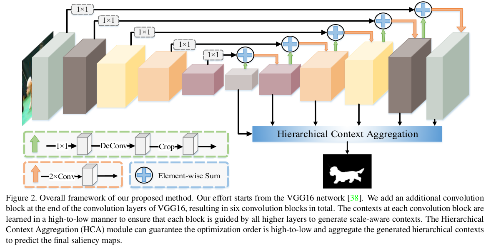
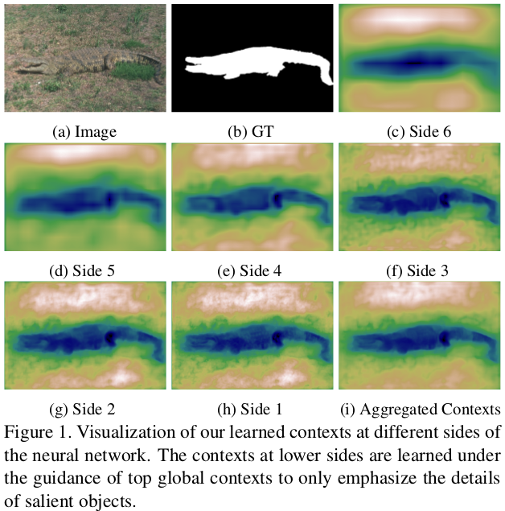

# DailyReadPaper
## Reading Notes
1. Salient Object Detection via High-to-Low Hierarchical Context Aggregation
    1. arXiv:1812.10956 (Submitted on 28 Dec 2018)
    2. Yun Liu, Yu Qiu, Le Zhang, JiaWang Bian, Guang-Yu Nie, **Ming-Ming Cheng**
    3. https://github.com/yun-liu/HCA

From the perspective of author, **fusion strategies** should not be more and 
more **complex** for accurate salient object detection.
Thus, they design an Mirror-linked Hourglass Network with intermediate supervision to learn
 contextual features in a **high-to-low** manner. The architecture of HCA is illuminated as follows,

The contexts of a natural image can be well expressed by a **high-to-low self-learning of side-output
convolutional features** as follows,

Through a Hierarchical Context Aggregation (HCA) module, the learned hierarchical contexts are aggregated to generate the hybrid 
contextual expression for an input image.

Their **simple** method achieves state-of-the-art 
performance under various evaluation metrics.

>@misc{1812.10956,
Author = {Yun Liu and Yu Qiu and Le Zhang and JiaWang Bian and Guang-Yu Nie and Ming-Ming Cheng},
Title = {Salient Object Detection via High-to-Low Hierarchical Context Aggregation},
Year = {2018},
Eprint = {arXiv:1812.10956},
}

