# DailyReadPaper

## Salient Object Detection via High-to-Low Hierarchical Context Aggregation
1. arXiv:1812.10956 (Submitted on 28 Dec 2018)
2. Yun Liu, Yu Qiu, Le Zhang, JiaWang Bian, Guang-Yu Nie, **Ming-Ming Cheng**
3. https://github.com/yun-liu/HCA

- From the perspective of author, **fusion strategies** should not be more and 
more **complex** for accurate salient object detection.
Thus, they design an Mirror-linked Hourglass Network with intermediate supervision to learn
 contextual features in a **high-to-low** manner. 
    

- The contexts of a natural image can be well expressed by a **high-to-low self-learning of side-output
convolutional features** as follows, 
    

- Through a Hierarchical Context Aggregation (HCA) module, the learned hierarchical contexts are aggregated to generate the hybrid 
contextual expression for an input image. 
    

- Their **simple** method achieves state-of-the-art 
performance under various evaluation metrics.

>@misc{1812.10956,
Author = {Yun Liu and Yu Qiu and Le Zhang and JiaWang Bian and Guang-Yu Nie and Ming-Ming Cheng},
Title = {Salient Object Detection via High-to-Low Hierarchical Context Aggregation},
Year = {2018},
Eprint = {arXiv:1812.10956}}

- [x] Attachments are the reference \[16], \[55] and \[44] in Salient Object Detection via High-to-Low Hierarchical Context Aggregation
## Deeply Supervised Salient Object Detection with Short Connections
1. CVPR 2017
2. Hou, Qibin and **Cheng, Ming-Ming** and Hu, Xiaowei and Borji, Ali and Tu, Zhuowen and Torr, Philip HS
3. https://mmcheng.net/zh/code-data/

- From the perspective of author, there is still a large room for improvement over the **generic** FCN models 
that do not explicitly deal with the scale-space problem. Holistically-Nested Edge Detector (HED) provides a 
skip-layer structure with deep supervision for edge and boundary detection, but the performance gain of HED
on saliency detection is not obvious. 
    

- They propose a new salient object detection method 
by introducing short connections to the skip-layer structures within the HED
architecture. 
    

>@inproceedings{hou2017deeply,
  title={Deeply supervised salient object detection with short connections},
  author={Hou, Qibin and Cheng, Ming-Ming and Hu, Xiaowei and Borji, Ali and Tu, Zhuowen and Torr, Philip HS},
  booktitle={Proceedings of the IEEE Conference on Computer Vision and Pattern Recognition},
  pages={3203--3212},
  year={2017}}

## Detect globally, refine locally: A novel approach to saliency detection
1. CVPR 2018
2. Wang, Tiantian and Zhang, Lihe and Wang, Shuo and Lu, Huchuan and Yang, Gang and Ruan, Xiang and Borji, Ali
3. https://github.com/TiantianWang/CVPR18_detect_globally_refine_locally

- Effective integration of contextual information is crucial for salient object detection. To achieve this, most existing methods based on ’skip’ architecture mainly focus on how to integrate hierarchical features of Convolutional Neural Networks (CNNs). They simply apply concatenation or element-wise operation to incorporate high-level
semantic cues and low-level detailed information. However, this can degrade the quality of predictions because cluttered and noisy information can also be passed through.
    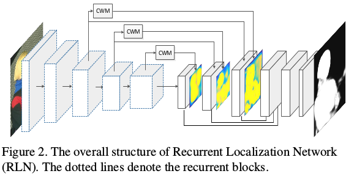

- To address this problem, we proposes a global Recurrent Localization Network (RLN) which exploits contextual information by the weighted response map in order to localize salient objects more accurately. 
    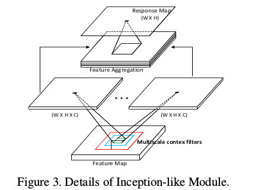

- Particularly, a recurrent module is employed to progressively refine the inner structure of the CNN over multiple time steps. 
    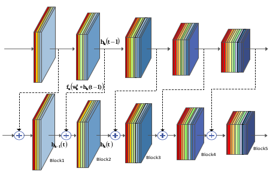
 
- Moreover, to effectively recover object boundaries, we propose a local Boundary Refinement Network (BRN) to adaptively learn
the local contextual information for each spatial position.
    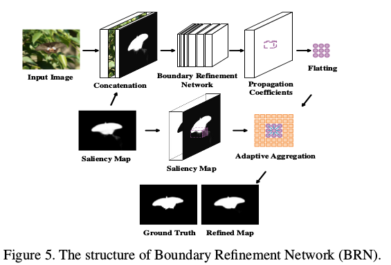

- The learned propagation coefficients can be used to optimally capture relations between each pixel and its neighbors. Experiments on five challenging datasets show that our approach performs favorably against all existing methods in terms of the popular evaluation metrics.

>@inproceedings{wang2018detect,
  title={Detect globally, refine locally: A novel approach to saliency detection},
  author={Wang, Tiantian and Zhang, Lihe and Wang, Shuo and Lu, Huchuan and Yang, Gang and Ruan, Xiang and Borji, Ali},
  booktitle={Proceedings of the IEEE Conference on Computer Vision and Pattern Recognition},
  pages={3127--3135},
  year={2018}}

## Amulet: Aggregating multi-level convolutional features for salient object detection
1. ICCV 2017
2. Wang, Tiantian and Zhang, Lihe and Wang, Shuo and Lu, Huchuan and Yang, Gang and Ruan, Xiang and Borji, Ali
3. https://github.com/Pchank/caffe-sal

- Fully convolutional neural networks (FCNs) have shown
outstanding performance in many dense labeling problems.
One key pillar of these successes is mining relevant information from features in convolutional layers. However, how
to better aggregate multi-level convolutional feature maps
for salient object detection is underexplored. In this work,
we present Amulet, a generic aggregating multi-level con-
volutional feature framework for salient object detection.
Our framework first integrates multi-level feature maps in-
to multiple resolutions, which simultaneously incorporate
coarse semantics and fine details. Then it adaptively learns
to combine these feature maps at each resolution and predict saliency maps with the combined features. Finally, the
predicted results are efficiently fused to generate the final
saliency map. 
    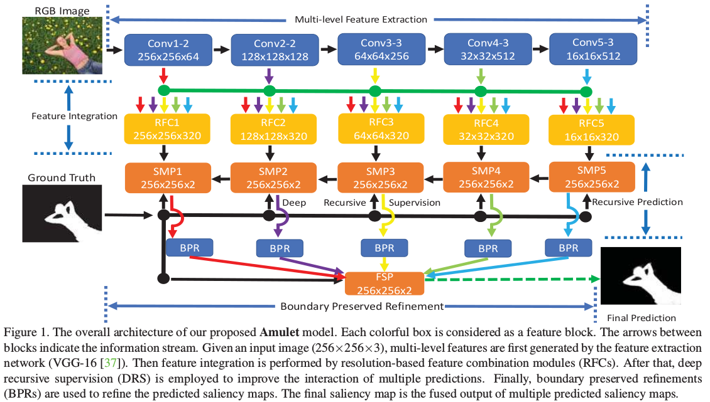

- In addition, to achieve accurate boundary
inference and semantic enhancement, edge-aware feature
maps in low-level layers and the predicted results of low
resolution features are recursively embedded into the learn-
ing framework. 
    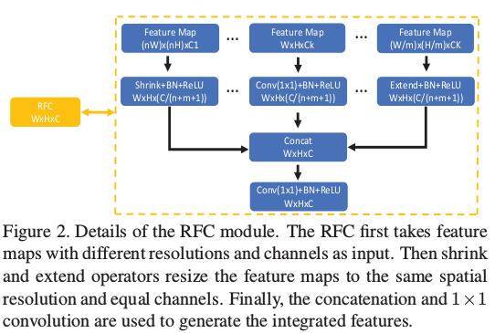

- By aggregating multi-level convolutional
features in this efficient and flexible manner, the proposed
saliency model provides accurate salient object labeling.
Comprehensive experiments demonstrate that our method
performs favorably against state-of-the-art approaches in
terms of near all compared evaluation metrics.
>@inproceedings{zhang2017amulet,
  title={Amulet: Aggregating multi-level convolutional features for salient object detection},
  author={Zhang, Pingping and Wang, Dong and Lu, Huchuan and Wang, Hongyu and Ruan, Xiang},
  booktitle={Proceedings of the IEEE International Conference on Computer Vision},
  pages={202--211},
  year={2017}}
  
  
## Context Encoding for Semantic Segmentation
1. CVPR 2018
2. Zhang, Hang and Dana, Kristin and Shi, Jianping and Zhang, Zhongyue and Wang, Xiaogang and Tyagi, Ambrish and Agrawal, Amit
3. https://github.com/zhanghang1989/PyTorch-Encoding

- Recent work has made significant progress in improving
spatial resolution for pixelwise labeling with Fully Convolutional
Network (FCN) framework by employing Dilated/Atrous
convolution, utilizing multi-scale features and
refining boundaries. In this paper, we explore the impact
of global contextual information in semantic segmentation
by introducing the Context Encoding Module, which captures
the semantic context of scenes and selectively highlights
class-dependent feature maps.  
    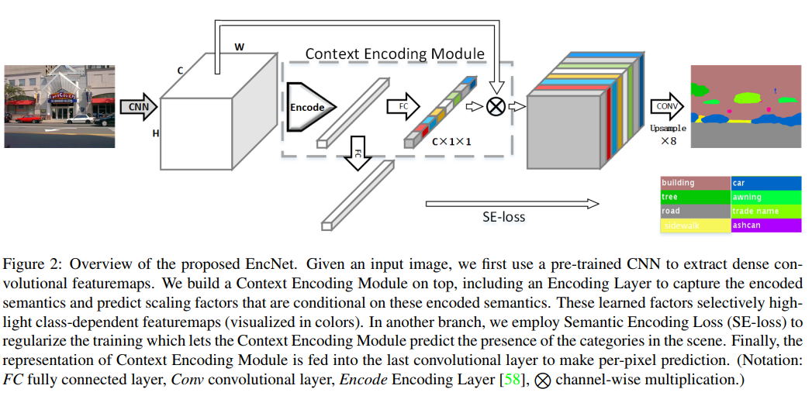

- The proposed Context Encoding Module significantly improves semantic segmentation
results with only marginal extra computation cost over FCN. Our approach has achieved new state-of-theart
results 51.7% mIoU on PASCAL-Context, 85.9% mIoU
on PASCAL VOC 2012. Our single model achieves a final
score of 0.5567 on ADE20K test set, which surpasses
the winning entry of COCO-Place Challenge 2017. In addition,
we also explore how the Context Encoding Module
can improve the feature representation of relatively shallow
networks for the image classification on CIFAR-10 dataset.
Our 14 layer network has achieved an error rate of 3.45%,
which is comparable with state-of-the-art approaches with
over 10× more layers. 
   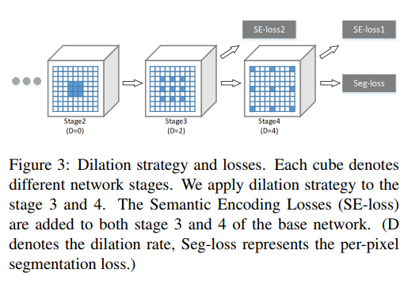

>@InProceedings{Zhang_2018_CVPR,
author = {Zhang, Hang and Dana, Kristin and Shi, Jianping and Zhang, Zhongyue and Wang, Xiaogang and Tyagi, Ambrish and Agrawal, Amit},
title = {Context Encoding for Semantic Segmentation},
booktitle = {The IEEE Conference on Computer Vision and Pattern Recognition (CVPR)},
month = {June},
year = {2018}
}

## Pyramid scene parsing network
1. CVPR 2017
2. Zhao, Hengshuang and Shi, Jianping and Qi, Xiaojuan and Wang, Xiaogang and Jia, Jiaya
3. https://github.com/hszhao/PSPNet

- Scene parsing is challenging for unrestricted open vo-
cabulary and diverse scenes. In this paper, we exploit the
capability of global context information by different-region-
based context aggregation through our pyramid pooling
module together with the proposed pyramid scene parsing
network (PSPNet).
    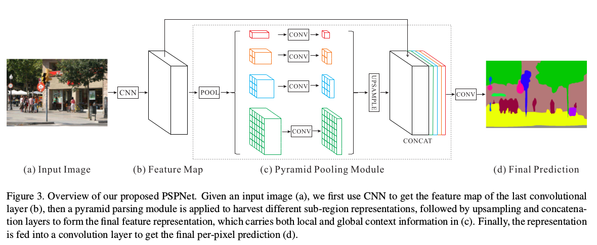

-  Our global prior representation is ef-
fective to produce good quality results on the scene parsing
task, while PSPNet provides a superior framework for pixel-
level prediction. The proposed approach achieves state-of-
the-art performance on various datasets. It came first in Im-
ageNet scene parsing challenge 2016, PASCAL VOC 2012
benchmark and Cityscapes benchmark. A single PSPNet
yields the new record of mIoU accuracy 85.4% on PASCAL
VOC 2012 and accuracy 80.2% on Cityscapes.
   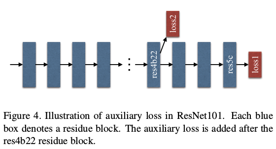

>@inproceedings{zhao2017pyramid,
  title={Pyramid scene parsing network},
  author={Zhao, Hengshuang and Shi, Jianping and Qi, Xiaojuan and Wang, Xiaogang and Jia, Jiaya},
  booktitle={IEEE Conf. on Computer Vision and Pattern Recognition (CVPR)},
  pages={2881--2890},
  year={2017}
}

## Progressive Attention Guided Recurrent Network for Salient Object Detection
1. CVPR 2018
2. Zhang, Xiaoning and Wang, Tiantian and Qi, Jinqing and Lu, Huchuan and Wang, Gang
3. https://github.com/zhangxiaoning666/PAGR

- Effective convolutional features play an important role
in saliency estimation but how to learn powerful features
for saliency is still a challenging task. FCN-based methods
directly apply multi-level convolutional features without
distinction, which leads to sub-optimal results due to
the distraction from redundant details. 
    
- In this paper, we propose a novel attention guided network which selectively
integrates multi-level contextual information in a progressive
manner. 
    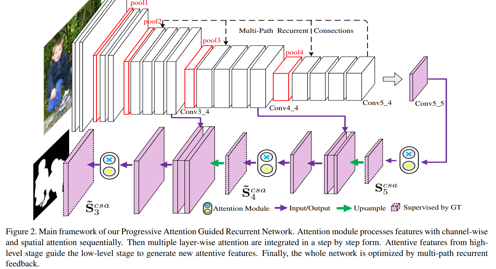

- Attentive features generated by our network can alleviate distraction of background thus achieve better
performance. On the other hand, it is observed that most
of existing algorithms conduct salient object detection by
exploiting side-output features of the backbone feature extraction
network. However, shallower layers of backbone
network lack the ability to obtain global semantic information,
which limits the effective feature learning. 
    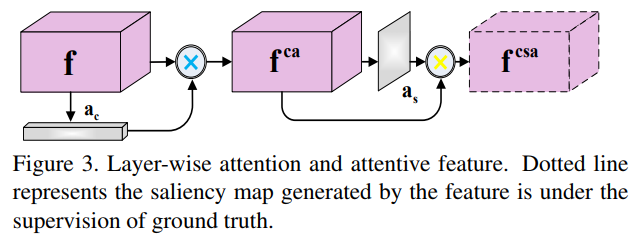

- To address the problem, we introduce multi-path recurrent feedback to
enhance our proposed progressive attention driven framework.
Through multi-path recurrent connections, global
semantic information from the top convolutional layer is
transferred to shallower layers, which intrinsically refines
the entire network. Experimental results on six benchmark
datasets demonstrate that our algorithm performs favorably
against the state-of-the-art approaches.
    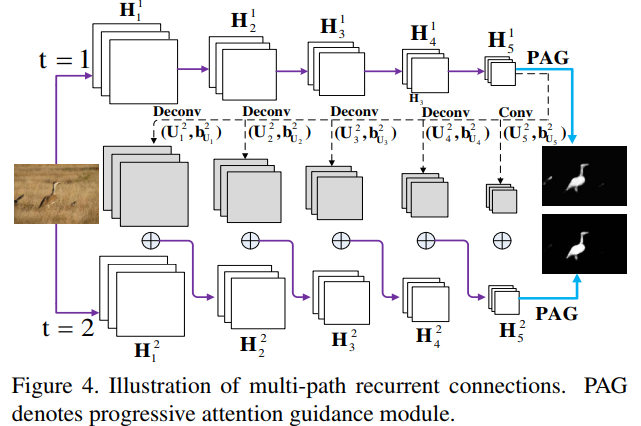

>@inproceedings{zhang2018progressive,
  title={Progressive attention guided recurrent network for salient object detection},
  author={Zhang, Xiaoning and Wang, Tiantian and Qi, Jinqing and Lu, Huchuan and Wang, Gang},
  booktitle={Proceedings of the IEEE Conference on Computer Vision and Pattern Recognition},
  pages={714--722},
  year={2018}}

## Learning to Promote Saliency Detectors
1. CVPR 2018
2. Zeng, Yu and Lu, Huchuan and Zhang, Lihe and Feng, Mengyang and Borji, Ali
3. https://github.com/zengxianyu/lps

- The categories and appearance of salient objects vary
from image to image, therefore, saliency detection is an
image-specific task. Due to lack of large-scale saliency
training data, using deep neural networks (DNNs) with pretraining
is difficult to precisely capture the image-specific
saliency cues. 
    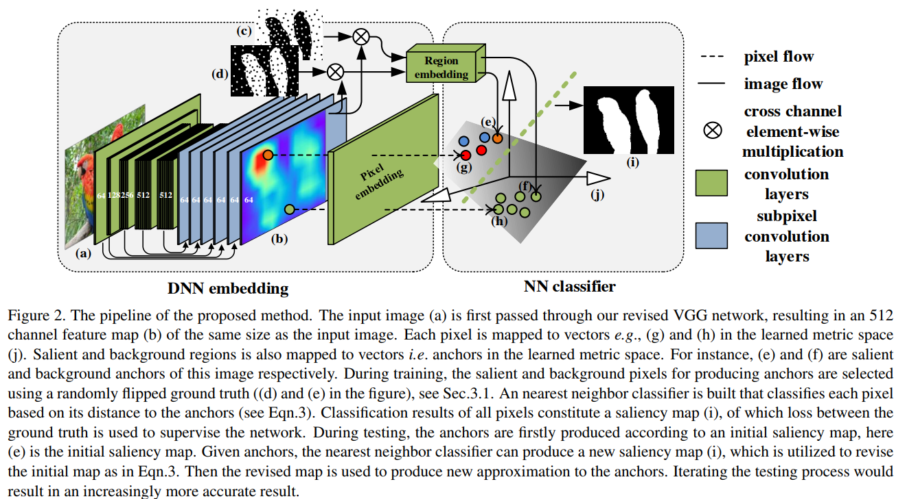

To solve this issue, we formulate a zero-shot
learning problem to promote existing saliency detectors.
Concretely, a DNN is trained as an embedding function
to map pixels and the attributes of the salient/background
regions of an image into the same metric space, in which
an image-specific classifier is learned to classify the pixels.
    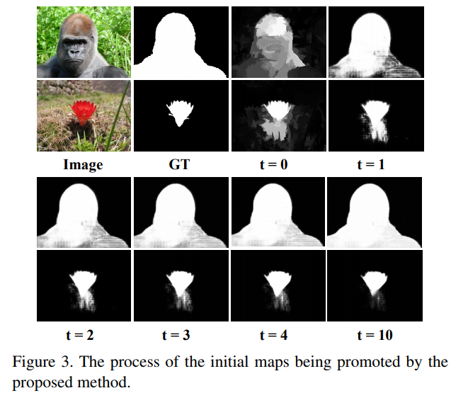
    
Since the image-specific task is performed by the classifier,
the DNN embedding effectively plays the role of a
general feature extractor.
    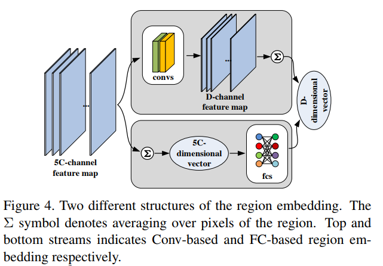

Compared with transferring the learning to a new recognition task using limited data, this
formulation makes the DNN learn more effectively from
small data. Extensive experiments on five data sets show
that our method significantly improves accuracy of existing
methods and compares favorably against state-of-theart
approaches.

>@InProceedings{Zeng_2018_CVPR,
author = {Zeng, Yu and Lu, Huchuan and Zhang, Lihe and Feng, Mengyang and Borji, Ali},
title = {Learning to Promote Saliency Detectors},
booktitle = {The IEEE Conference on Computer Vision and Pattern Recognition (CVPR)},
month = {June},
year = {2018}}

## Reverse Attention for Salient Object Detection
1. ECCV 2018
2. Chen, Shuhan and Tan, Xiuli and Wang, Ben and Hu, Xuelong
3. https://github.com/ShuhanChen/RAS_ECCV18

- Benefit from the quick development of deep learning techniques,
salient object detection has achieved remarkable progresses recently.
    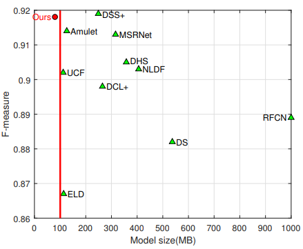

- However, there still exists following two major challenges that hinder
its application in embedded devices, low resolution output and heavy
model weight. To this end, this paper presents an accurate yet compact
deep network for efficient salient object detection. 
    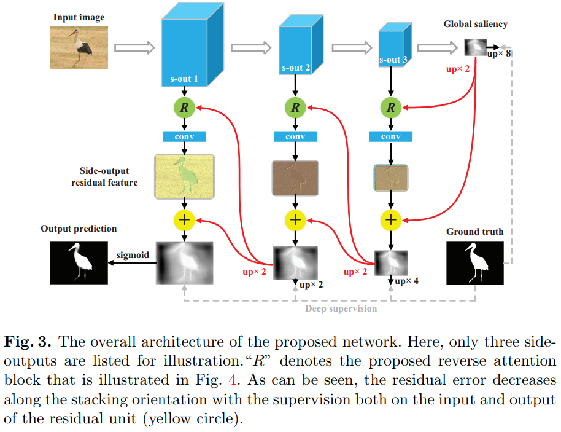

- More specifically, given a coarse saliency prediction in the deepest layer, we first employ residual
learning to learn side-output residual features for saliency refinement,
which can be achieved with very limited convolutional parameters while
keep accuracy. Secondly, we further propose reverse attention to guide
such side-output residual learning in a top-down manner. 
    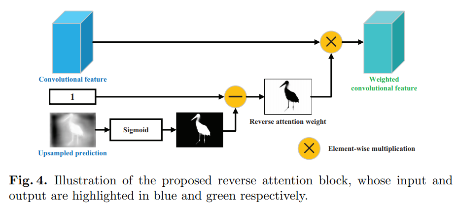
    
- By erasing the current predicted salient regions from side-output features, the network
can eventually explore the missing object parts and details which
results in high resolution and accuracy. 
    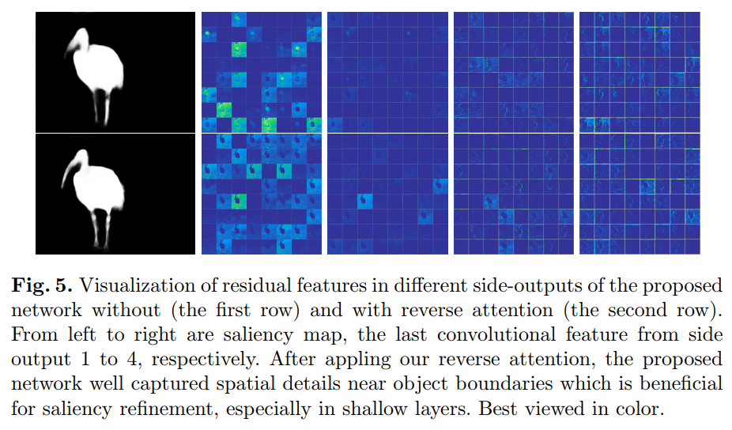

- Experiments on six benchmark datasets demonstrate that the proposed approach compares favorably
against state-of-the-art methods, and with advantages in terms of simplicity,
efficiency (45 FPS) and model size (81 MB).

>@inproceedings{chen2018reverse,
  title={Reverse attention for salient object detection},
  author={Chen, Shuhan and Tan, Xiuli and Wang, Ben and Hu, Xuelong},
  booktitle={European Conference on Computer Vision},
  pages={236--252},
  year={2018},
  organization={Springer}
}