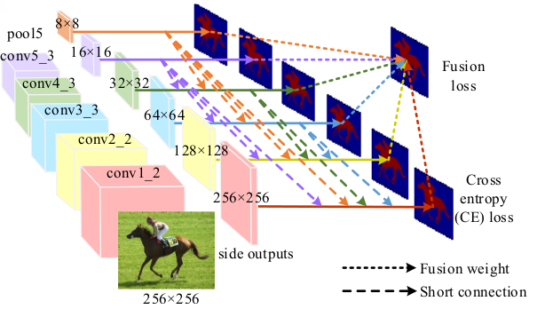
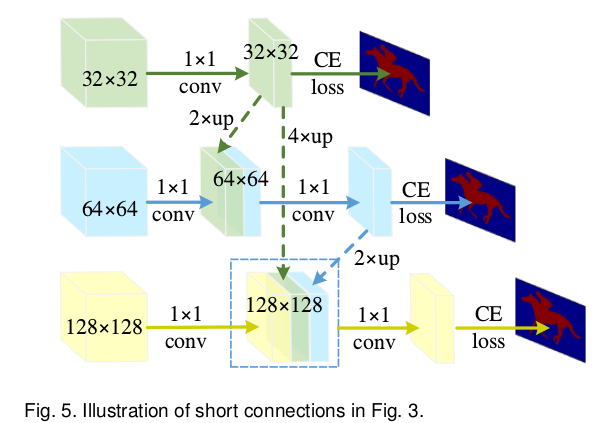

# DailyReadPaper

## Salient Object Detection via High-to-Low Hierarchical Context Aggregation
1. arXiv:1812.10956 (Submitted on 28 Dec 2018)
2. Yun Liu, Yu Qiu, Le Zhang, JiaWang Bian, Guang-Yu Nie, **Ming-Ming Cheng**
3. https://github.com/yun-liu/HCA

- From the perspective of author, **fusion strategies** should not be more and 
more **complex** for accurate salient object detection.
Thus, they design an Mirror-linked Hourglass Network with intermediate supervision to learn
 contextual features in a **high-to-low** manner. The architecture of HCA is illuminated as follows,
The backbone of CNN usually consists of several blocks of stacked convolutional and pool-
ing layers, in which the **blocks near to network inputs are
called bottom (low) sides and otherwise top (high) sides**.
It is well accepted that the top sides of CNN contain semantic meaning-
ful information while the bottom sides contain **complementary** spatial details

- The contexts of a natural image can be well expressed by a **high-to-low self-learning of side-output
convolutional features** as follows,

- Through a Hierarchical Context Aggregation (HCA) module, the learned hierarchical contexts are aggregated to generate the hybrid 
contextual expression for an input image.

- Their **simple** method achieves state-of-the-art 
performance under various evaluation metrics.

>@misc{1812.10956,
Author = {Yun Liu and Yu Qiu and Le Zhang and JiaWang Bian and Guang-Yu Nie and Ming-Ming Cheng},
Title = {Salient Object Detection via High-to-Low Hierarchical Context Aggregation},
Year = {2018},
Eprint = {arXiv:1812.10956}}

## Deeply Supervised Salient Object Detection with Short Connections
1. CVPR 2017
2. Hou, Qibin and **Cheng, Ming-Ming** and Hu, Xiaowei and Borji, Ali and Tu, Zhuowen and Torr, Philip HS
3. https://mmcheng.net/zh/code-data/

- From the perspective of author, there is still a large room for improvement over the **generic** FCN models 
that do not explicitly deal with the scale-space problem. Holistically-Nested Edge Detector (HED) provides a 
skip-layer structure with deep supervision for edge and boundary detection, but the performance gain of HED
on saliency detection is not obvious. 

- They propose a new salient object detection method 
by introducing short connections to the skip-layer structures within the HED
architecture. 

>@inproceedings{hou2017deeply,
  title={Deeply supervised salient object detection with short connections},
  author={Hou, Qibin and Cheng, Ming-Ming and Hu, Xiaowei and Borji, Ali and Tu, Zhuowen and Torr, Philip HS},
  booktitle={Proceedings of the IEEE Conference on Computer Vision and Pattern Recognition},
  pages={3203--3212},
  year={2017}}

## Detect globally, refine locally: A novel approach to saliency detection
1. CVPR 2018
2. Wang, Tiantian and Zhang, Lihe and Wang, Shuo and Lu, Huchuan and Yang, Gang and Ruan, Xiang and Borji, Ali
3. https://github.com/TiantianWang/CVPR18_detect_globally_refine_locally

- Effective integration of contextual information is cru-
cial for salient object detection. To achieve this, most ex-
isting methods based on ’skip’ architecture mainly focus
on how to integrate hierarchical features of Convolution-
al Neural Networks (CNNs). They simply apply concate-
nation or element-wise operation to incorporate high-level
semantic cues and low-level detailed information. Howev-
er, this can degrade the quality of predictions because clut-
tered and noisy information can also be passed through.
To address this problem, we proposes a global Recurrent
Localization Network (RLN) which exploits contextual in-
formation by the weighted response map in order to local-
ize salient objects more accurately. Particularly, a recur-
rent module is employed to progressively refine the inner
structure of the CNN over multiple time steps. Moreover,
to effectively recover object boundaries, we propose a local
Boundary Refinement Network (BRN) to adaptively learn
the local contextual information for each spatial position.
The learned propagation coefficients can be used to opti-
mally capture relations between each pixel and its neigh-
bors. Experiments on five challenging datasets show that
our approach performs favorably against all existing meth-
ods in terms of the popular evaluation metrics.

>@inproceedings{wang2018detect,
  title={Detect globally, refine locally: A novel approach to saliency detection},
  author={Wang, Tiantian and Zhang, Lihe and Wang, Shuo and Lu, Huchuan and Yang, Gang and Ruan, Xiang and Borji, Ali},
  booktitle={Proceedings of the IEEE Conference on Computer Vision and Pattern Recognition},
  pages={3127--3135},
  year={2018}}

