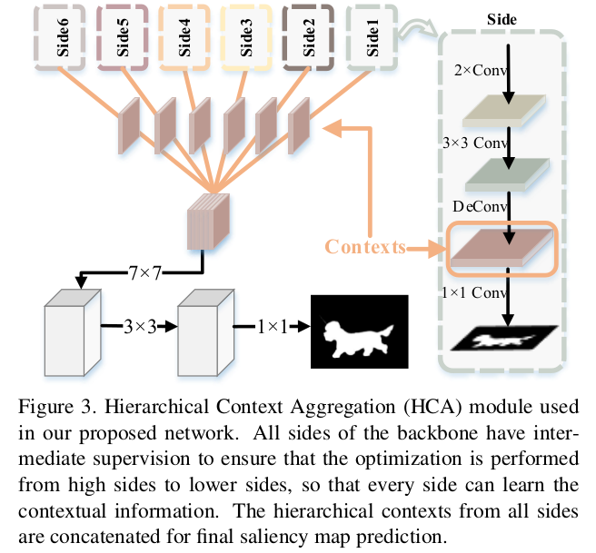

# DailyReadPaper
 
1. Salient Object Detection via High-to-Low Hierarchical Context Aggregation
    1. arXiv:1812.10956 (Submitted on 28 Dec 2018)
    2. Yun Liu, Yu Qiu, Le Zhang, JiaWang Bian, Guang-Yu Nie, **Ming-Ming Cheng**
    3. https://github.com/yun-liu/HCA

Recent progress on salient object detection mainly aims at exploiting how to effectively integrate convolutional sideoutput
features in convolutional neural networks (CNN). Based on this, most of the existing state-of-the-art saliency
detectors design complex network structures to fuse the side-output features of the backbone feature extraction networks.
However, should the fusion strategies be more and more complex for accurate salient object detection? In this
paper, we observe that the contexts of a natural image can be well expressed by a high-to-low self-learning of sideoutput
convolutional features. As we know, the contexts of an image usually refer to the global structures, and the top
layers of CNN usually learn to convey global information.
On the other hand, it is difficult for the intermediate sideoutput features to express contextual information. Here,
we design an hourglass network with intermediate supervision to learn contextual features in a high-to-low manner.
The learned hierarchical contexts are aggregated to generate the hybrid contextual expression for an input image. At
last, the hybrid contextual features can be used for accurate saliency estimation. We extensively evaluate our method on
six challenging saliency datasets, and our simple method achieves state-of-the-art performance under various evaluation
metrics. Code will be released upon paper acceptance.
