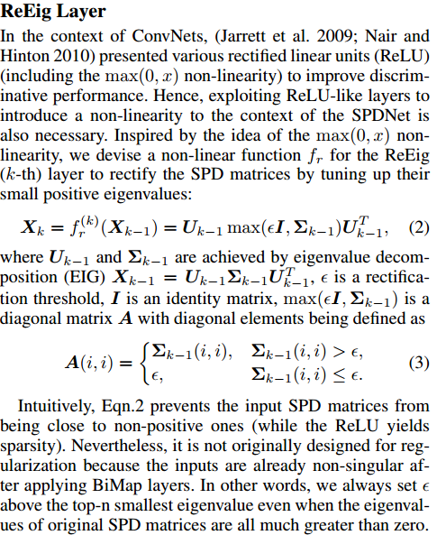

# DailyReadPaper
This reading mainly refers to the latest AAAI 2019 papers, which 
mainly come from School of Information Science and Engineering, Xiamen University.
Riemannian and Hypergraph Combined Deep Neural Network are two principal topics.
The mathematical proof of Riemannian matrix backprop is very worth to study.
## Towards Optimal Fine Grained Retrieval via Decorrelated Centralized Loss with Normalize-Scale layer
1. AAAI 2019
2. Xiawu Zheng, Rongrong Ji*, Xiaoshuai Sun, Baochang Zhang, Yongjian Wu, Feiyue Huang
3. http://mac.xmu.edu.cn/rrji/paper.html

- From the perspective of author, the existing loss functions are defected in two aspects: 
    + The feature relationship is encoded inside the training batch.
Such a local scope leads to low accuracy. 
    + The error is established by the mean square, which needs pairwise distance computation in training set and results in low efficiency.

- In this paper, author propose a novel metric learning scheme,
termed Normalize-Scale Layer and Decorrelated Global Centralized Ranking Loss, which achieves extremely efficient
and discriminative learning, i.e., 5× speedup over triplet loss
and 12% recall boost on CARS196. Our method originates
from the classic softmax loss, which has a global structure
but does not directly optimize the distance metric as well as
the inter/intra class distance. They tackle this issue through a
hypersphere layer and a global centralized ranking loss with a
pairwise decorrelated learning. 
    
    
- In particular, they first propose a Normalize-Scale Layer to eliminate the gap between metric
distance (for measuring distance in retrieval) and dot product (for dimension reduction in classification). Second, the
relationship between features is encoded under a global centralized ranking loss, which targets at optimizing metric distance globally and accelerating learning procedure. Finally,
the centers are further decorrelated by Gram-Schmidt process, leading to extreme efficiency (with 20 epochs in training procedure) and discriminability in feature learning. 
    
    
>@inproceedings{AAAI: 19, Author={Xiawu Zheng, Rongrong Ji*, Xiaoshuai Sun, Baochang Zhang, Yongjian Wu, Feiyue Huang},
Title={Towards Optimal Fine Grained Retrieval via Decorrelated Centralized Loss with Normalize-Scale layer},
Booktitle={Thirty-Third AAAI Conference on Artificial Intelligence},
Year={2019}, Accept}

## Hypergraph Neural Networks
1. AAAI 2019
2. Yifan Feng, Haoxuan You, Zizhao Zhang, Rongrong Ji, Yue Gao
3. http://mac.xmu.edu.cn/rrji/paper.html

- In this paper, author present a hypergraph neural networks (HGNN) framework for data representation learning, which
can encode high-order data correlation in a hypergraph structure. Confronting the challenges of learning representation
for complex data in real practice, they propose to **incorporate such data structure in a hypergraph**, which is more **flexible** on data modeling, especially when dealing with complex
data. 
    
    
- In this method, a **hyperedge convolution operation** is designed to handle the data correlation during representation
learning. 
    
    
- In this way, traditional hypergraph learning procedure can be conducted using 
hyperedge convolution operations efficiently. 
HGNN is able to learn the hidden layer representation considering the high-order data structure, which
is a general framework considering the complex data correlations.
    
    
- They have conducted experiments on citation network classification and visual 
object recognition tasks and compared HGNN with graph convolutional networks and other
traditional methods. 
    
    
>@inproceedings{AAAI: 19,
 Author={Yifan Feng, Haoxuan You, Zizhao Zhang, Rongrong Ji, Yue Gao},
Title={Hypergraph Neural Networks},
Booktitle={Thirty-Third AAAI Conference on Artificial Intelligence},
Year={2019}, Accept}

## Learning Neural Bag-of-Matrix-Summarization with Riemannian Network
1. AAAI 2019
2. Hong Liu, Jie Li, Yongjian Wu, Rongrong Ji*
3. http://mac.xmu.edu.cn/rrji/paper.html

- Symmetric positive defined (SPD) matrix has attracted increasing research focus in image/video analysis, which merits in capturing the Riemannian geometry in its structured 2D
feature representation. However, computation in the vector
space on SPD matrices cannot capture the **geometric properties**, which corrupts the classification performance. 
    
- To this end, Riemannian based deep network has become a promising solution for SPD matrix classification, 
because of its **excellence in performing non-linear learning over SPD matrix**.
Besides, Riemannian metric learning **typically adopts a
kNN classifier** that cannot be extended to large-scale datasets,
which limits its application in many time-efficient scenarios.
- In this paper, we propose a Bag-of-Matrix-Summarization (BoMS) method to be combined with Riemannian network,
which handles the above issues towards highly efficient and
scalable SPD feature representation. 
    

- They key innovation lies in the idea of summarizing data 
in **a Riemannian geometric space instead of the vector space**.
First, the whole training set is compressed with a small number of matrix features
to ensure high scalability. Second, given such a compressed
set, a constant-length vector representation is extracted by
efficiently measuring the distribution variations between the
summarized data and the latent feature of the Riemannian
network. 
    
    
- Finally, the proposed BoMS descriptor is integrated
into the Riemannian network, **upon which the whole framework is end-to-end trained via matrix back-propagation**.

>@inproceedings{AAAI: 19,
 Author={Hong Liu, Jie Li, Yongjian Wu, Rongrong Ji*},
Title={Learning Neural Bag-of-Matrix-Summarization with Riemannian Network},
Booktitle={Thirty-Third AAAI Conference on Artificial Intelligence},
Year={2019}, Accept}

## A Riemannian Network for SPD Matrix Learning
1. AAAI 2019
2. Zhiwu Huang, Luc Van Gool
3. https://github.com/zzhiwu/SPDNet

- Symmetric Positive Definite (SPD) matrix learning methods
have become popular in many image and video processing
tasks, thanks to their ability to learn appropriate statistical
representations while respecting Riemannian geometry of underlying SPD manifolds. 
    
    
- In this paper, author build a Riemannian network architecture to open up a new direction of SPD matrix non-linear learning in a deep model.
    
    
- In particular, they devise bilinear mapping layers to transform input SPD matrices
to more desirable SPD matrices, exploit eigenvalue rectification layers to apply a non-linear activation function to the
new SPD matrices.
    

- And design an eigenvalue logarithm layer
to perform Riemannian computing on the resulting SPD matrices for regular output layers.
    
    
- For training the proposed deep network, they exploit a new 
**backpropagation with a variant of stochastic gradient descent on Stiefel manifolds** to update the
structured connection weights and the involved SPD matrix data. 
    

- By mainly employing Eqn.7–Eqn.9 and Eqn.15–Eqn.20, 
the Riemannian matrix backprop for training the SPDNet
can be realized. The convergence analysis of the used SGD
algorithm on Riemannian manifolds follows the developments in (Bottou 2010; Bonnabel 2013).   
    
    
>@inproceedings{huang2017riemannian,
  title={A Riemannian Network for SPD Matrix Learning.},
  author={Huang, Zhiwu and Van Gool, Luc J},
  booktitle={AAAI},
  volume={1},
  number={2},
  pages={3},
  year={2017}
}

