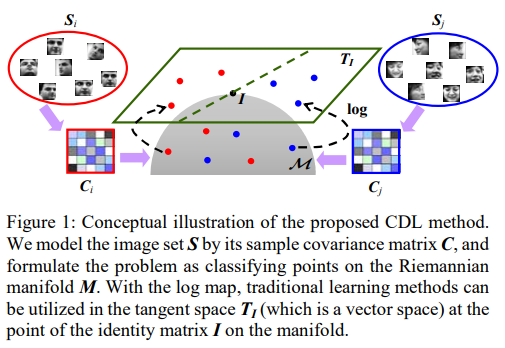
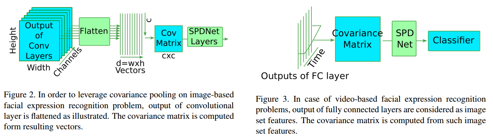

# DailyReadPaper
- Zero-shot learning is a promising aspect for solving the open problems (real scenario).
Today I will read some paper about ZSL and deliver them to this website.
Meanwhile, for the purposes of strengthening memory and deepening understanding paper I've read, some 
of these papers were elaborated as follows:

## Dissimilarity Representation Learning for Generalized Zero-Shot Recognition
1. ACM MM 2018
2. Yang, Gang and Liu, Jinlu and Xu, Jieping and Li, Xirong

- Generalized zero-shot learning (GZSL) aims to recognize any test
instance coming either from a known class or from a novel class
that has no training instance.

    
    
- To synthesize training instances for
novel classes and thus resolving GZSL as a common classifcation problem, we propose a Dissimilarity Representation Learning
(DSS) method. 

    
    
- Dissimilarity representation is to represent a specifc instance in terms of its (dis)similarity to other instances in a
visual or attribute based feature space. 

    
     
    
- In the dissimilarity space, instances of the novel classes are synthesized by an end-to-end
optimized neural network. 

     
    
        
- The neural network realizes two-level feature mappings and domain adaptions in the dissimilarity space
and the attribute based feature space. Experimental results on fve
benchmark datasets, i.e., AWA, AWA2, SUN, CUB, and aPY, show
that the proposed method improves the state-of-the-art with a large
margin, approximately 10% gain in terms of the harmonic mean
of the top-1 accuracy. Consequently, this paper establishes a new
baseline for GZSL.

>@inproceedings{yang2018dissimilarity,
  title={Dissimilarity Representation Learning for Generalized Zero-Shot Recognition},
  author={Yang, Gang and Liu, Jinlu and Xu, Jieping and Li, Xirong},
  booktitle={2018 ACM Multimedia Conference on Multimedia Conference},
  pages={2032--2039},
  year={2018},
  organization={ACM}
}

# A rethink about A Riemannian Network for SPD Matrix Learning
- The significant contributions in this paper include several point as follows,
    1. They propose a new way of updating the weights for the BiMap layers by
    exploiting an SGD setting **on Stiefel manifolds.** As
    merely computing their Euclidean gradients in the procedure of 
    backprop cannot valid orthogonal weights, they have to force the 
    weights to be on Stiefel manifolds. Subsequently, in order to obtain the Riemannian gradient, **the normal component of the Euclidean gradient is subtracted
    to generate the tangential component to the Stiefel manifold.** 
    2. Because computing those with EIG decomposition in the layers of ReEig and LogEig has not been
    well-solved by the traditional backprop. They exploit the matrix generalization of backprop studied in (Ionescu, Vantzos, and Sminchisescu 2015) to compute the gradients of the involved
    SPD matrices in the ReEig and LogEig layers. In particular, **let F be a function describing the variations of the upper
    layer variables with respect to the lower layer variables**. With the function F, a new version of
    the chain rule Eqn.6 for the matrix backprop.

# The reference in A Riemannian Network for SPD Matrix Learning
## Covariance Discriminative Learning: A Natural and Efficient Approach to Image Set Classification
1. CVPR 2012
2. **Wang, Ruiping** and Guo, Huimin and Davis, Larry S and Dai, Qionghai
3. https://github.com/adavoudi/spdnet

- We propose a novel discriminative learning approach to
image set classification by **modeling the image set with its
natural second-order statistic**, i.e. covariance matrix. Since
nonsingular covariance matrices, a.k.a. symmetric positive
definite (SPD) matrices, **lie on a Riemannian manifold**,
classical learning algorithms cannot be directly utilized to
classify points on the manifold. By exploring an **efficient
metric for the SPD matrices**, i.e., Log-Euclidean Distance
(LED), we **derive a kernel function** that explicitly **maps** the
**covariance matrix** from the **Riemannian manifold** to a
**Euclidean space**. 

    
    
- With this explicit mapping, any learning
method devoted to vector space can be exploited in either
its linear or kernel formulation. Linear Discriminant
Analysis (LDA) and Partial Least Squares (PLS) are
considered in this paper for their feasibility for our specific
problem.
- We further investigate the conventional linear
subspace based set modeling technique and cast it in a
unified framework with our covariance matrix based
modeling. The proposed method is evaluated on two tasks:
face recognition and object categorization. 

>@inproceedings{wang2012covariance,
  title={Covariance discriminative learning: A natural and efficient approach to image set classification},
  author={Wang, Ruiping and Guo, Huimin and Davis, Larry S and Dai, Qionghai},
  booktitle={Computer Vision and Pattern Recognition (CVPR), 2012 IEEE Conference on},
  pages={2496--2503},
  year={2012},
  organization={IEEE}
  
  
## Second-order Convolutional Neural Networks
1. Clinical Immunology & Immunopathology
2. Yu, Kaicheng and Salzmann, Mathieu
3. https://github.com/adavoudi/spdnet

- Convolutional Neural Networks (CNNs) have been successfully applied to many computer vision tasks, such as
image classification. By performing linear combinations
and element-wise nonlinear operations, these networks can
be thought of as extracting solely first-order information
from an input image. 

    
    
- In the past, however, second-order
statistics computed from handcrafted features, e.g., covariances, have proven highly effective in diverse recognition
tasks. 

    
      
- In this paper, we introduce a novel class of CNNs
that exploit second-order statistics. To this end, we design a series of new layers that (i) extract a covariance
matrix from convolutional activations, (ii) compute a parametric, second-order transformation of a matrix, and (iii)
perform a parametric vectorization of a matrix. These operations can be assembled to form a Covariance Descriptor Unit (CDU), which replaces the fully-connected layers
of standard CNNs. 

    
    
>@article{Yu2017Second,
  title={Second-order Convolutional Neural Networks},
  author={Yu, Kaicheng and Salzmann, Mathieu},
  journal={Clinical Immunology & Immunopathology},
  volume={66},
  number={3},
  pages={230-8},
  year={2017},
}

# The follows are related works from Dr.Huang about manifold-combined CNN learning method

## Covariance Pooling for Facial Expression Recognition
1. arXiv preprint arXiv:1805.04855
2. Acharya, Dinesh and Huang, Zhiwu and Paudel, Danda Pani and Van Gool, Luc
3. https://github.com/d-acharya/CovPoolFER
- Classifying facial expressions into different categories
requires capturing regional distortions of facial landmarks.
We believe that second-order statistics such as covariance is
better able to capture such distortions in regional facial features.

    
    
- In this work, we explore the benefits of using a manifold network structure for covariance pooling to improve
facial expression recognition. In particular, we first employ
such kind of manifold networks in conjunction with traditional convolutional networks for spatial pooling within individual image feature maps in an end-to-end deep learning
manner. By doing so, we are able to achieve a recognition
accuracy of 58:14% on the validation set of Static Facial
Expressions in the Wild (SFEW 2.0) and 87:0% on the validation set of Real-World Affective Faces (RAF) Database1.
Both of these results are the best results we are aware of.

    
    
- Besides, we leverage covariance pooling to capture the temporal evolution of per-frame features for video-based facial
expression recognition. Our reported results demonstrate
the advantage of pooling image-set features temporally by
stacking the designed manifold network of covariance pooling on top of convolutional network layers.

>@article{acharya2018covariance,
  title={Covariance Pooling for Facial Expression Recognition},
  author={Acharya, Dinesh and Huang, Zhiwu and Paudel, Danda Pani and Van Gool, Luc},
  journal={arXiv preprint arXiv:1805.04855},
  year={2018}
}

## Building Deep Networks on Grassmann Manifolds
1. AAAI 2018
2. Huang, Zhiwu and Wu, Jiqing and Van Gool, Luc
3. https://github.com/zzhiwu/GrNet

- Learning representations on Grassmann manifolds is popular
in quite a few visual recognition tasks. 

    
    
- In order to enable deep learning on Grassmann manifolds, this paper proposes a deep
network architecture by generalizing the Euclidean network
paradigm to Grassmann manifolds.

    
    
- In particular, we design
full rank mapping layers 

    
    
- to transform input Grassmannian
data to more desirable ones, exploit re-orthonormalization
layers

    
    
- to normalize the resulting matrices, study projection
pooling layers 

    
    
- to reduce the model complexity in the Grassmannian context, and devise projection mapping layers
 
    
    
- to respect Grassmannian geometry and meanwhile achieve Euclidean forms for regular output layers. 

    
    
- To train the Grassmann networks, we exploit a stochastic gradient descent setting on manifolds
 of the connection weights, and study a matrix generalization of backpropagation 
 to update the structured data. 
 
    
    
- The evaluations on three visual recognition tasks
show that our Grassmann networks have clear advantages
over existing Grassmann learning methods, and achieve results comparable with state-of-the-art approaches.

>@inproceedings{huang2018building,
  title={Building deep networks on Grassmann manifolds},
  author={Huang, Zhiwu and Wu, Jiqing and Van Gool, Luc},
  booktitle={Thirty-Second AAAI Conference on Artificial Intelligence},
  year={2018}
}

## Deep Learning on Lie Groups for Skeleton-based Action Recognition
1. CVPR 2017 spotlight
2. Huang, Zhiwu and Wan, Chengde and Probst, Thomas and Van Gool, Luc
3. https://github.com/zzhiwu/LieNet

- In recent years, skeleton-based action recognition has
become a popular 3D classification problem. State-of-theart methods typically first represent each motion sequence
as a high-dimensional trajectory on a Lie group with an
additional dynamic time warping, and then shallowly learn
favorable Lie group features. 
 
    
   
- In this paper we incorporate
the Lie group structure into a deep network architecture to
learn more appropriate Lie group features for 3D action
recognition. Within the network structure, we design rotation mapping layers to transform the input Lie group features into desirable ones, which are aligned better in the
temporal domain. To reduce the high feature dimensionality, the architecture is equipped with rotation pooling layers
for the elements on the Lie group. 
 
    
   
- Furthermore, we propose
a logarithm mapping layer to map the resulting manifold
data into a tangent space that facilitates the application of
regular output layers for the final classification. Evaluations of the proposed network for standard 3D human action recognition datasets clearly demonstrate its superiority
over existing shallow Lie group feature learning methods as
well as most conventional deep learning methods

>@inproceedings{huang2017deep,
  title={Deep learning on lie groups for skeleton-based action recognition},
  author={Huang, Zhiwu and Wan, Chengde and Probst, Thomas and Van Gool, Luc},
  booktitle={Proceedings of the 2017 IEEE Conference on Computer Vision and Pattern Recognition (CVPR)},
  pages={1243--1252},
  year={2017},
  organization={IEEE computer Society}
}