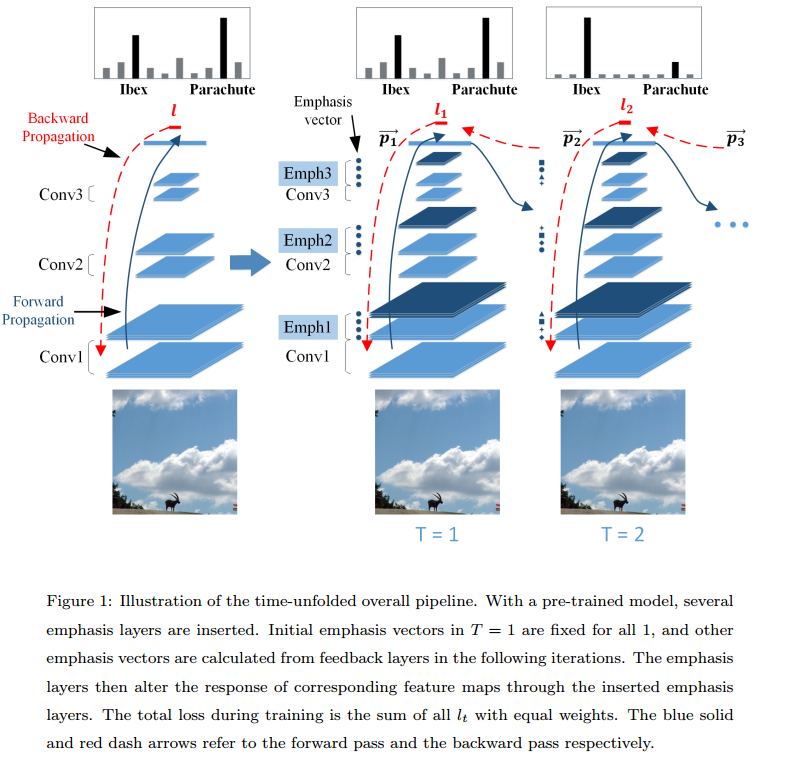

# DailyReadPaper
- Today I will summarize some attention-based DCNN Architectures from ECCV2018.

## CBAM: Convolutional Block Attention Module
1. ECCV 2018
2. Yang, Gang and Liu, Jinlu and Xu, Jieping and Li, Xirong
3. https://github.com/Jongchan/attention-module

- We propose Convolutional Block Attention Module (CBAM),
a simple yet effective attention module for feed-forward convolutional
neural networks. 

    

- Given an intermediate feature map, our module sequentially infers attention maps along two separate dimensions, channel
and spatial, then the attention maps are multiplied to the input feature
map for adaptive feature refinement. 

    

- Because CBAM is a lightweight and
general module, it can be integrated into any CNN architectures seamlessly with negligible overheads and is end-to-end trainable along with
base CNNs. 

    

- We validate our CBAM through extensive experiments on
ImageNet-1K, MS COCO detection, and VOC 2007 detection datasets.

    

- **The contributions not only contain the novel attention architecture but also the extensive experiments to
comfirm that each modification is of use.**

>@inproceedings{woo2018cbam,
  title={Cbam: Convolutional block attention module},
  author={Woo, Sanghyun and Park, Jongchan and Lee, Joon-Young and So Kweon, In},
  booktitle={Proceedings of the European Conference on Computer Vision (ECCV)},
  pages={3--19},
  year={2018}
}

## Learning with rethinking: Recurrently improving convolutional neural networks through feedback
1. PR 2018
2. Li, Xin and Jie, Zequn and Feng, Jiashi and Liu, Changsong and Yan, Shuicheng
  
- Recent years have witnessed the great success of convolutional neural network
(CNN) based models in the field of computer vision. CNN is able to learn
hierarchically abstracted features from images in an end-to-end training manner. However, most of the existing CNN models only learn features through
a feedforward structure and no feedback information from top to bottom layers is exploited to enable the networks to refine themselves. In this paper, we
propose a \Learning with Rethinking" algorithm. 

    
    
- By adding a feedback layer
and producing the emphasis vector, the model is able to recurrently boost the
performance based on previous prediction. Particularly, it can be employed to
boost any pre-trained models. This algorithm is tested on four object classification benchmark datasets: CIFAR-100, CIFAR-10, MNIST-background-image
and ILSVRC-2012 dataset. 

>@article{li2018learning,
  title={Learning with rethinking: Recurrently improving convolutional neural networks through feedback},
  author={Li, Xin and Jie, Zequn and Feng, Jiashi and Liu, Changsong and Yan, Shuicheng},
  journal={Pattern Recognition},
  volume={79},
  pages={183--194},
  year={2018},
  publisher={Elsevier}
}

## Look closer to see better: Recurrent attention convolutional neural network for fine-grained image recognition
1. CVPR 2017
2. Fu, Jianlong and Zheng, Heliang and Mei, Tao
- **Recognizing fine-grained categories** (e.g., bird species)
is difficult due to the challenges of discriminative region
localization and fine-grained feature learning. Existing
approaches predominantly solve these challenges independently, while neglecting the fact that region detection and
fine-grained feature learning are mutually correlated and
thus can reinforce each other. 
- In this paper, we propose
a novel recurrent attention convolutional neural network
(RA-CNN) which recursively learns discriminative region
attention and region-based feature representation at multiple scales in a mutually reinforced way. The learning at
each scale consists of a classification sub-network and an
attention proposal sub-network (APN). 

    
    
- The APN starts from
full images, and iteratively generates region attention from
coarse to fine by taking previous predictions as a reference,
while a finer scale network takes as input an amplified attended region from previous scales in a recurrent way. The
proposed RA-CNN is optimized by an intra-scale classification loss and an inter-scale ranking loss, to mutually learn
accurate region attention and fine-grained representation.
RA-CNN does not need bounding box/part annotations and
can be trained end-to-end. We conduct comprehensive experiments and show that RA-CNN achieves the best performance in three fine-grained tasks, with relative accuracy
gains of 3.3%, 3.7%, 3.8%, on CUB Birds, Stanford Dogs
and Stanford Cars, respectively.
>@inproceedings{fu2017look,
  title={Look closer to see better: Recurrent attention convolutional neural network for fine-grained image recognition},
  author={Fu, Jianlong and Zheng, Heliang and Mei, Tao},
  booktitle={2017 IEEE Conference on Computer Vision and Pattern Recognition (CVPR)},
  pages={4476--4484},
  year={2017},
  organization={IEEE}
}