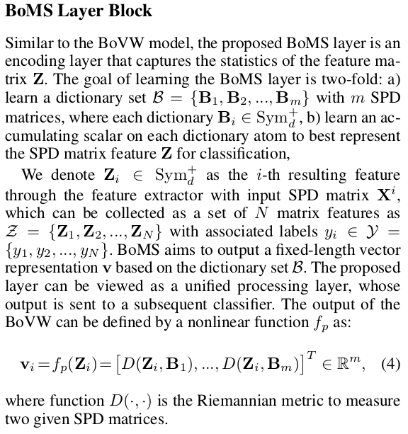
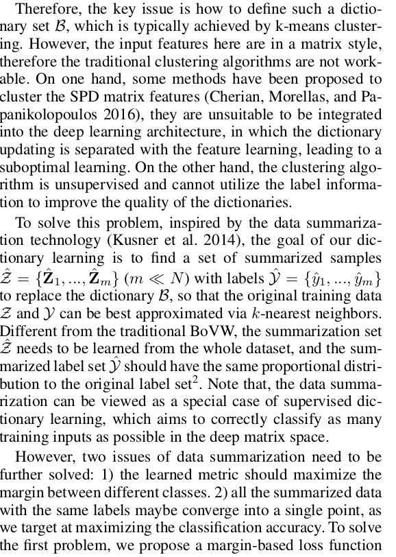
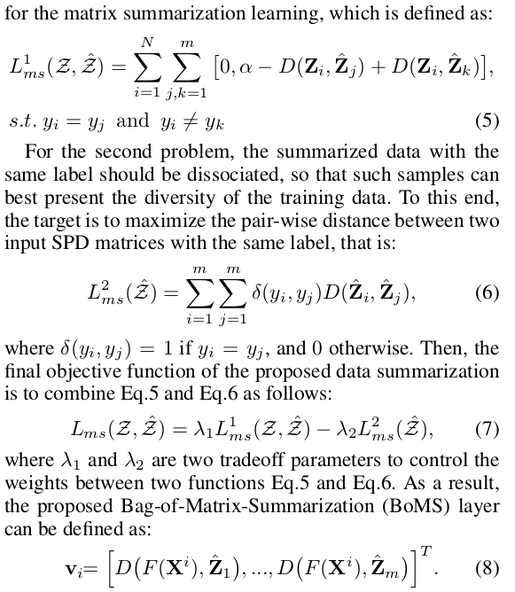
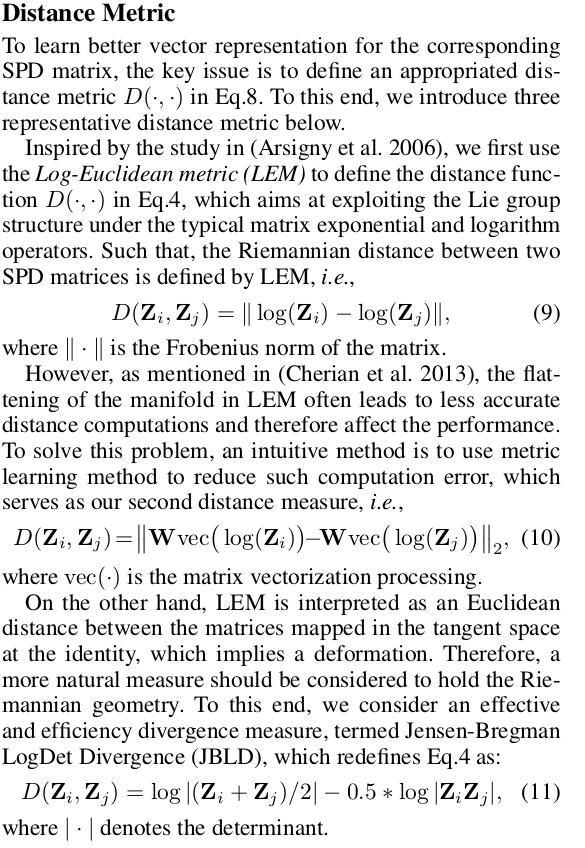
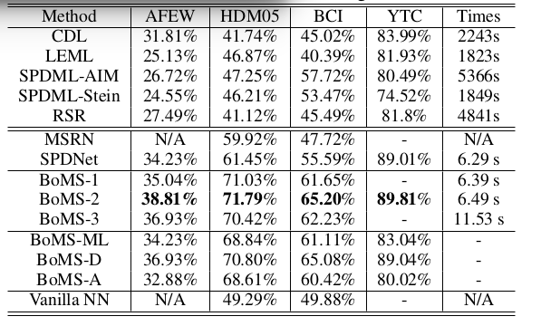

# DailyReadPaper
- Today in order to strengthen memory and deepening understanding paper I've read, some 
of these papers were elaborated as follows:

## A rethink for Learning Neural Bag-of-Matrix-Summarization with Riemannian Network
        
- 
- 
- 
- 
- 
    
       
### Stochastic neighbor compression
1. ICML 2014
- **data summarization technology**  
     
    

>@inproceedings{kusner2014stochastic,
  title={Stochastic neighbor compression},
  author={Kusner, Matt and Tyree, Stephen and Weinberger, Kilian and Agrawal, Kunal},
  booktitle={International Conference on Machine Learning},
  pages={622--630},
  year={2014}
}