# DailyReadPaper
- There are some papers about the different design of loss functions.
- And the performances of different loss functions are compared as follow,

## Towards Optimal Fine Grained Retrieval via Decorrelated Centralized Loss with Normalize-Scale layer
1. AAAI 2019
2. Zheng, Xiawu and Ji, Rongrong and Sun, Xiaoshuai and Zhang, Baochang and Wu, Yongjian and Huang, Feiyue

- Recent advances on fine-grained image retrieval prefer learning convolutional neural network (CNN) with specific fullyconnect layer designed loss function for discriminative feature representation. 
       
    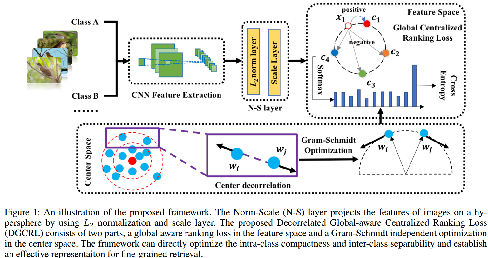

- Essentially, such loss should establish a
robust metric to efficiently distinguish high-dimensional features within and outside fine-grained categories. To this end,
the existing loss functions are defected in two aspects: 
- (a) The feature relationship is encoded inside the training batch.
Such a local scope leads to low accuracy. 
- (b) The error is
established by the mean square, which needs pairwise distance computation in training set and results in low efficiency.
- In this paper, we propose a novel metric learning scheme,
termed Normalize-Scale Layer and Decorrelated Global Centralized Ranking Loss, which achieves extremely efficient
and discriminative learning, i.e., 5× speedup over triplet loss
and 12% recall boost on CARS196. 

    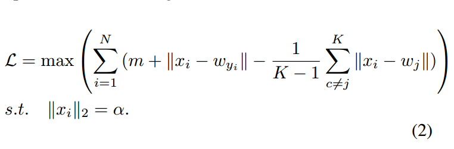

- Our method originates
from the classic softmax loss, which has a global structure
but does not directly optimize the distance metric as well as
the inter/intra class distance. 

    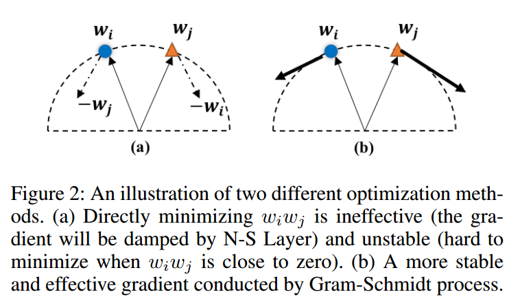

- We tackle this issue through a
hypersphere layer and a global centralized ranking loss with a
pairwise decorrelated learning. 

    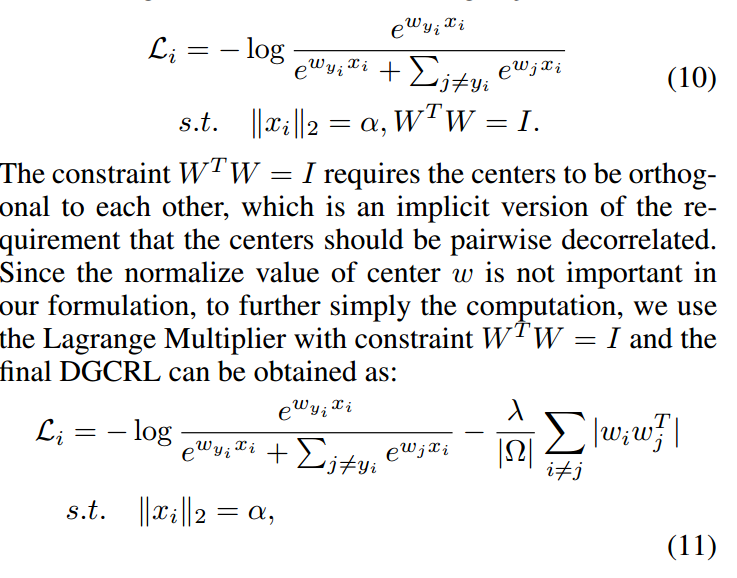

- In particular, we first propose
a Normalize-Scale Layer to eliminate the gap between metric
distance (for measuring distance in retrieval) and dot 
product (for dimension reduction in classification). 

    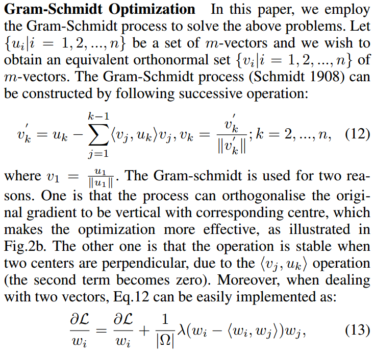

- Second, the relationship between features is encoded under
 a global centralized ranking loss, which targets at optimizing metric 
 distance globally and accelerating learning procedure. 
- **In order to solve the problem in follow figure, they minimize the wi*wj by Gram-Schmidt process**

    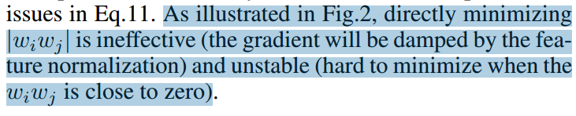

 - Finally,
the centers are further decorrelated by Gram-Schmidt process, leading 
to extreme efficiency (with 20 epochs in training procedure) and 
discriminability in feature learning.

    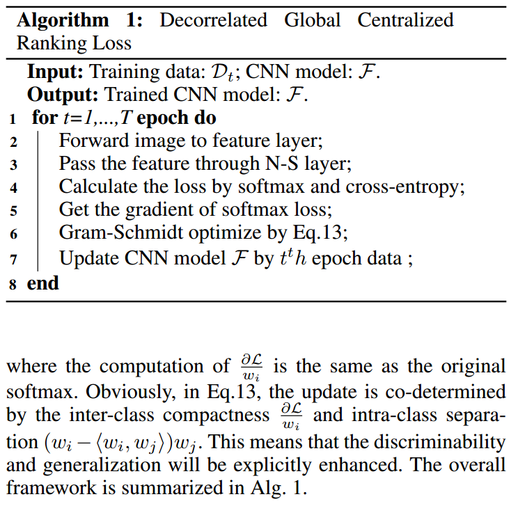

>@article{zheng2019towards,
  title={Towards Optimal Fine Grained Retrieval via Decorrelated Centralized Loss with Normalize-Scale layer},
  author={Zheng, Xiawu and Ji, Rongrong and Sun, Xiaoshuai and Zhang, Baochang and Wu, Yongjian and Huang, Feiyue},
  year={2019}
}

## Person re-identification by deep joint learning of multi-loss classification
1. IJCAI 2017
2. **Li, Wei** and Zhu, Xiatian and Gong, Shaogang (HACNN is also generated by them)

- Existing person re-identification (re-id) methods
rely mostly on either localised or global feature representation alone. This ignores their joint benefit
and mutual complementary effects. 

    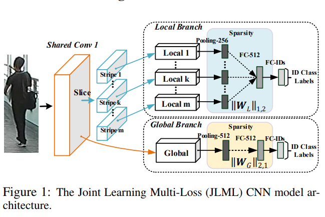

- In this work,
we show the advantages of jointly learning local
and global features in a Convolutional Neural Network (CNN) by aiming to discover correlated local
and global features in different context. Specifically, we formulate a method for joint learning of
local and global feature selection losses designed
to optimise person re-id when using only generic
matching metrics such as the L2 distance. 

    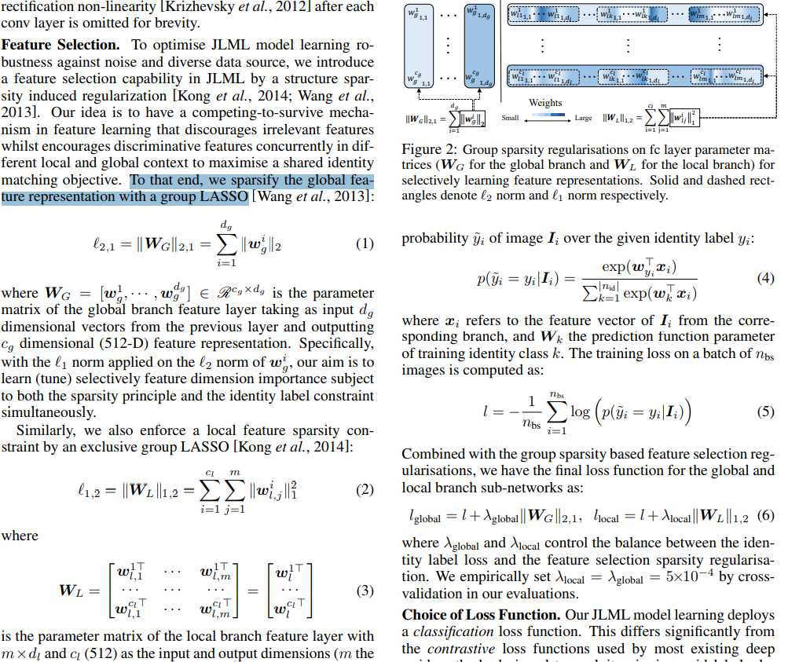

- We design a novel CNN architecture for Jointly Learning
Multi-Loss (JLML) of local and global discriminative feature optimisation subject concurrently to the
same re-id labelled information. 

>@article{li2017person,
  title={Person re-identification by deep joint learning of multi-loss classification},
  author={Li, Wei and Zhu, Xiatian and Gong, Shaogang},
  journal={arXiv preprint arXiv:1705.04724},
  year={2017}
}

## Support Vector Guided Softmax Loss for Face Recognition
1. arXiv preprint arXiv:1812.11317
2. Wang, Xiaobo and Wang, Shuo and Zhang, Shifeng and Fu, Tianyu and Shi, Hailin and Mei, Tao

- Face recognition has witnessed significant progresses
due to the advances of deep convolutional neural networks
(CNNs), the central challenge of which, is feature discrimination. To address it, one group tries to exploit miningbased strategies (e.g., hard example mining and focal loss)
to focus on the informative examples. 

    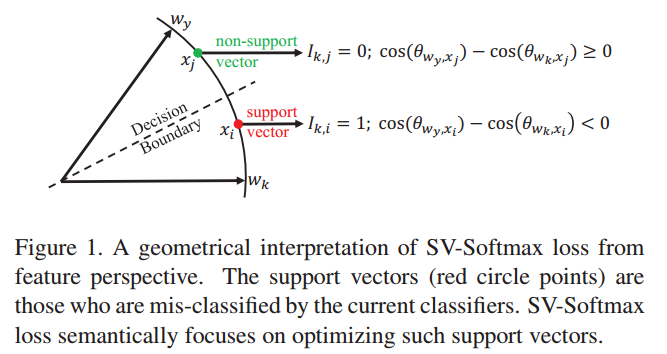

- The other group devotes to designing margin-based loss functions (e.g., angular, additive and additive angular margins) to increase the
feature margin from the perspective of ground truth class.
Both of them have been well-verified to learn discriminative features. However, they suffer from either the ambiguity of hard examples or the lack of discriminative power of
other classes. 

    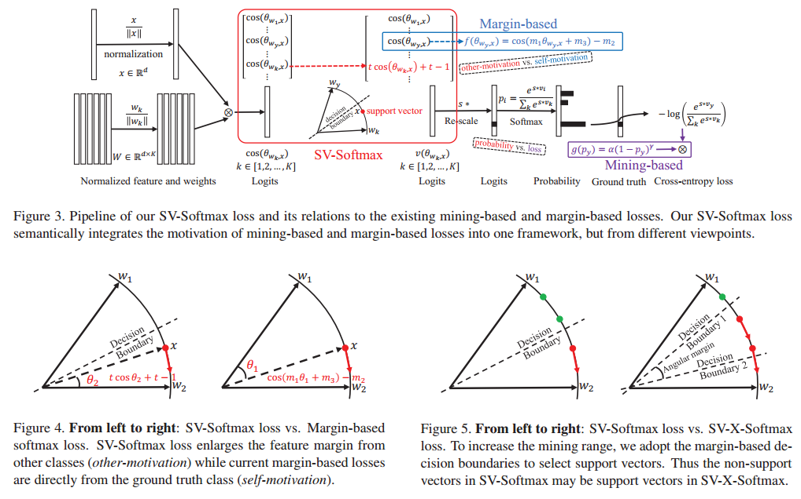

- In this paper, we design a novel loss function,
namely support vector guided softmax loss (SV-Softmax),
which adaptively emphasizes the mis-classified points (support vectors) to guide the discriminative features learning.
So the developed SV-Softmax loss is able to eliminate the
ambiguity of hard examples as well as absorb the discriminative power of other classes, and thus results in more discrimiantive features. To the best of our knowledge, this is
the first attempt to inherit the advantages of mining-based
and margin-based losses into one framework. Experimental
results on several benchmarks have demonstrated the effectiveness of our approach over state-of-the-arts

>@article{wang2018support,
  title={Support Vector Guided Softmax Loss for Face Recognition},
  author={Wang, Xiaobo and Wang, Shuo and Zhang, Shifeng and Fu, Tianyu and Shi, Hailin and Mei, Tao},
  journal={arXiv preprint arXiv:1812.11317},
  year={2018}
}

**This is a great work and we can refer it to rethink what should we do!**, which is really worth to understand deeply.
## Deep Face Recognition: A Survey
1. CVPR 2019
2. Mei Wang, **Weihong Deng**

- Abstract—Deep learning applies multiple processing layers to
learn representations of data with multiple levels of feature
extraction. This emerging technique has reshaped the research
landscape of face recognition since 2014, launched by the breakthroughs of Deepface and DeepID methods. Since then, deep
face recognition (FR) technique, which leverages the hierarchical
architecture to learn discriminative face representation, has dramatically improved the state-of-the-art performance and fostered
numerous successful real-world applications. 

    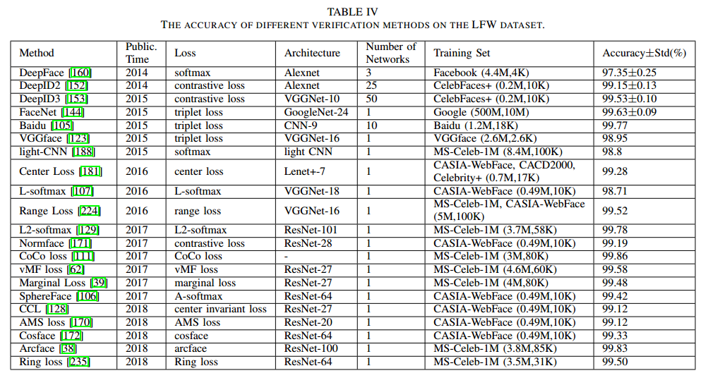

- In this paper, we
provide a comprehensive survey of the recent developments
on deep FR, covering the broad topics on algorithms, data,
and scenes. First, we summarize different network architectures
and loss functions proposed in the rapid evolution of the deep
FR methods. Second, the related face processing methods are
categorized into two classes: “one-to-many augmentation” and
“many-to-one normalization”. 
- Then, we summarize and compare
the commonly used databases for both model training and
evaluation. Third, we review miscellaneous scenes in deep FR,
such as cross-factor, heterogenous, multiple-media and industry
scenes. Finally, potential deficiencies of the current methods and
several future directions are highlighted.

>@article{2019faceSurvey,
  title={Deep Face Recognition: A Survey},
  author={Mei Wang, **Weihong Deng**},
  journal={arXiv preprint arXiv:1804.06655},
  year={2018}
}