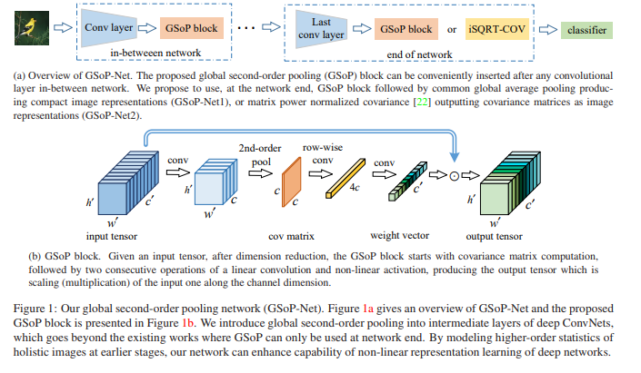
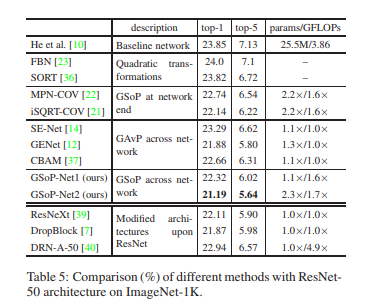
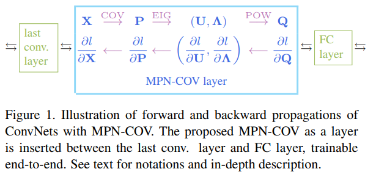
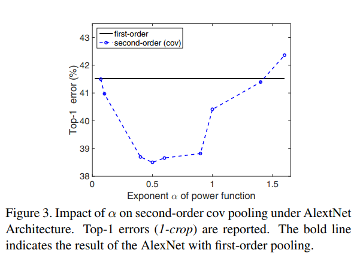
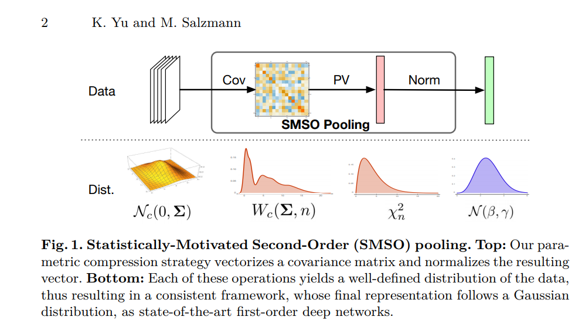
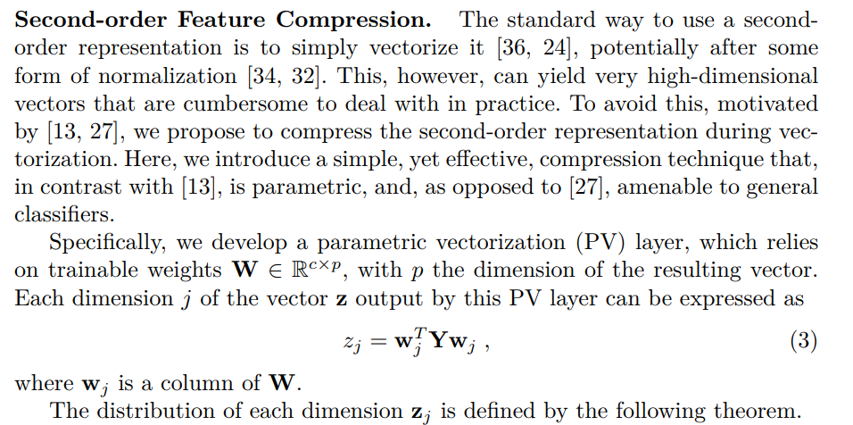
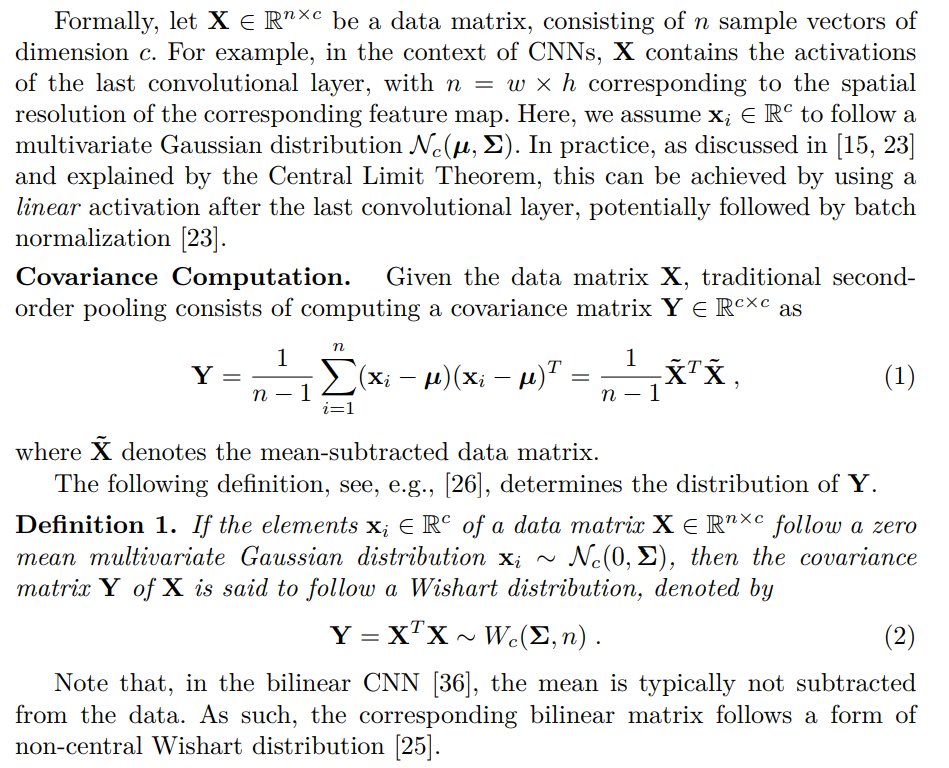

# DailyReadPaper
There are some newest papers in Arxiv with meaningful ideas, which is mainly related to **Second-order Information Learning** in DCNN.
## Global Second-order Pooling Convolutional Networks
1. Arxiv 2018
2. Zilin Gao, Jiangtao Xie, Qilong Wang, Peihua Li

- Deep Convolutional Networks (ConvNets) are fundamental
to, besides large-scale visual recognition, a lot of
vision tasks. As the primary goal of the ConvNets is to
characterize complex boundaries of thousands of classes
in a high-dimensional space, it is critical to learn higherorder
representations for enhancing non-linear modeling
capability. 
 
    

- Recently, Global Second-order Pooling (GSoP),
plugged at the end of networks, has attracted increasing attentions,
achieving much better performance than classical,
first-order networks in a variety of vision tasks. However,
how to effectively introduce higher-order representation in
earlier layers for improving non-linear capability of ConvNets
is still an open problem. In this paper, we propose a
novel network model introducing GSoP across from lower
to higher layers for exploiting holistic image information
throughout a network. Given an input 3D tensor outputted
by some previous convolutional layer, we perform GSoP to
obtain a covariance matrix which, after nonlinear transformation,
is used for tensor scaling along channel dimension.
 
    

- Similarly, we can perform GSoP along spatial dimension
for tensor scaling as well. In this way, we can make full use
of the second-order statistics of the holistic image throughout
a network. The proposed networks are thoroughly evaluated
on large-scale ImageNet-1K, and experiments have
shown that they outperformed non-trivially the counterparts
while achieving state-of-the-art results.
it needs to choose hard negative samples manually that is
very time-consuming. To address this problem, we adopt
lifted structured loss for deep neural networks that makes
the network learn better feature embedding by minimizing
intra-class variation and maximizing inter-class variation.

>@article{SOP2018,
  title={Global Second-order Pooling Convolutional Networks},
  author={Acharya, Dinesh and Huang, Zhiwu and Paudel, Danda Pani and Van Gool, Luc},
  journal={arXiv preprint arXiv:1811.12006},
  year={2018}
}

## Is second-order information helpful for large-scale visual recognition},
1. ICCV 2017
2. http://www.peihuali.org/MPN-COV.
3. https://github.com/jiangtaoxie/MPN-COV

- By stacking layers of convolution and nonlinearity, convolutional
networks (ConvNets) effectively learn from lowlevel
to high-level features and discriminative representations.
Since the end goal of large-scale recognition is to
delineate complex boundaries of thousands of classes, adequate
exploration of feature distributions is important for
realizing full potentials of ConvNets. 
 
    

- However, state-of-theart
works concentrate only on deeper or wider architecture
design, while rarely exploring feature statistics higher than
first-order. We take a step towards addressing this problem.
Our method consists in covariance pooling, instead
of the most commonly used first-order pooling, of highlevel
convolutional features. The main challenges involved
are robust covariance estimation given a small sample of
large-dimensional features and usage of the manifold structure
of covariance matrices. To address these challenges,
we present a Matrix Power Normalized Covariance (MPNCOV)
method. 

    

- We develop forward and backward propagation
formulas regarding the nonlinear matrix functions
such that MPN-COV can be trained end-to-end. In addition,
we analyze both qualitatively and quantitatively its advantage
over the well-known Log-Euclidean metric.

- On the
ImageNet 2012 validation set, by combining MPN-COV we
achieve over 4%, 3% and 2.5% gains for AlexNet, VGG-M
and VGG-16, respectively; integration of MPN-COV into
50-layer ResNet outperforms ResNet-101 and is comparable
to ResNet-152. 

>@inproceedings{li2017second,
  title={Is second-order information helpful for large-scale visual recognition},
  author={Li, Peihua and Xie, Jiangtao and Wang, Qilong and Zuo, Wangmeng},
  booktitle={IEEE international conference on computer vision (ICCV). IEEE},
  pages={2070--2078},
  year={2017}
}

## Statistically Motivated Second Order Pooling
1. ECCV 2018
2. https://github.com/kcyu2014/smsop
  
- Abstract. Second-order pooling, a.k.a. bilinear pooling, has proven effective
for deep learning based visual recognition. 

    

- However, the resulting
second-order networks yield a inal representation that is orders of
magnitude larger than that of standard, irst-order ones, making them
memory-intensive and cumbersome to deploy. 

    

- Here, we introduce a general,
parametric compression strategy that can produce more compact
representations than existing compression techniques, yet outperform
both compressed and uncompressed second-order models. Our approach
is motivated by a statistical analysis of the network’s activations, relying
on operations that lead to a Gaussian-distributed inal representation,
as inherently used by irst-order deep networks. 

    

- As evidenced by our
experiments, this lets us outperform the state-of-the-art irst-order and
second-order models on several benchmark recognition datasets.

>@article{yu2018statistically,
  title={Statistically Motivated Second Order Pooling},
  author={Yu, Kaicheng and Salzmann, Mathieu},
  journal={arXiv preprint arXiv:1801.07492},
  year={2018}
}