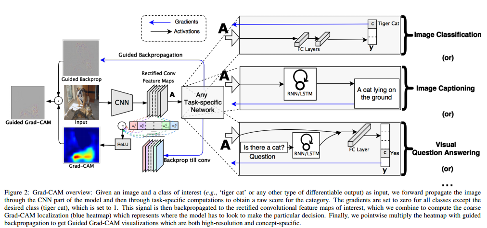
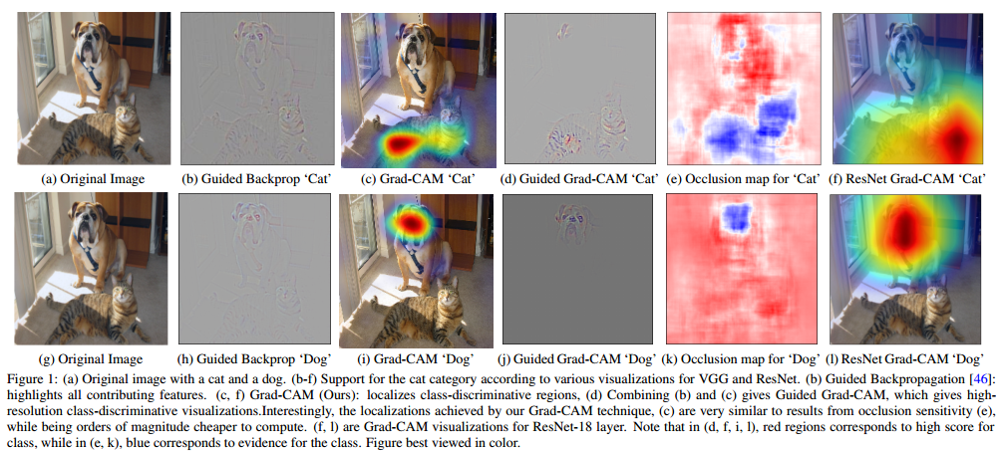
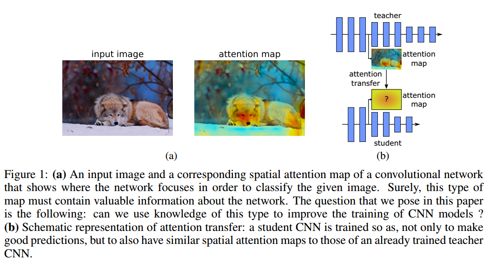
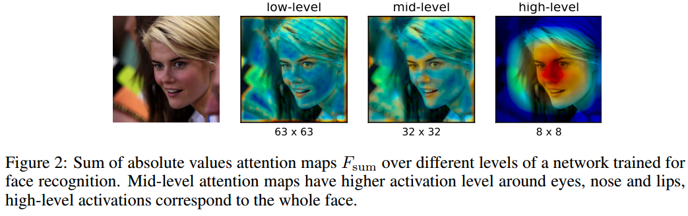

# DailyReadPaper
A visual tool is developed to interpretation of DCNN.
## Grad-cam: Visual explanations from deep networks via gradient-based localization
1. ICCV 2017
2. Selvaraju, Ramprasaath R and Cogswell, Michael and Das, Abhishek and Vedantam, Ramakrishna and Parikh, Devi and Batra, Dhruv
- We propose a technique for producing ‘visual explanations’ for decisions from a large class of Convolutional Neural Network (CNN)-based models, making them more transparent. Our approach – Gradient-weighted Class Activation
Mapping (Grad-CAM), uses the gradients of any target concept (say logits for ‘dog’ or even a caption), flowing into the
final convolutional layer to produce a coarse localization
map highlighting the important regions in the image for predicting the concept. 

    

- Unlike previous approaches, Grad-CAM
is applicable to a wide variety of CNN model-families: (1)
CNNs with fully-connected layers (e.g. VGG), (2) CNNs used
for structured outputs (e.g. captioning), (3) CNNs used in
tasks with multi-modal inputs (e.g. VQA) or reinforcement
learning, without architectural changes or re-training. We
combine Grad-CAM with existing fine-grained visualizations
to create a high-resolution class-discriminative visualization and apply it to image classification, image captioning,
and visual question answering (VQA) models, including
ResNet-based architectures. In the context of image classification models, our visualizations (a) lend insights into
failure modes of these models (showing that seemingly unreasonable predictions have reasonable explanations), (b)
are robust to adversarial images, (c) outperform previous
methods on the ILSVRC-15 weakly-supervised localization
task, (d) are more faithful to the underlying model, and (e)
help achieve model generalization by identifying dataset
bias. 

    

- For image captioning and VQA, our visualizations
show even non-attention based models can localize inputs.
Finally, we design and conduct human studies to measure
if Grad-CAM explanations help users establish appropriate
trust in predictions from deep networks and show that GradCAM helps untrained users successfully discern a ‘stronger’
deep network from a ‘weaker’ one. 

>@inproceedings{selvaraju2017grad,
  title={Grad-cam: Visual explanations from deep networks via gradient-based localization},
  author={Selvaraju, Ramprasaath R and Cogswell, Michael and Das, Abhishek and Vedantam, Ramakrishna and Parikh, Devi and Batra, Dhruv},
  booktitle={2017 IEEE International Conference on Computer Vision (ICCV)},
  pages={618--626},
  year={2017},
  organization={IEEE}
}

## PAYING MORE ATTENTION TO ATTENTION： IMPROVING THE PERFORMANCE OF CONVOLUTIONAL NEURAL NETWORKS VIA ATTENTION TRANSFER
1. ICLR 2017
2. https://github.com/szagoruyko/attention-transfer.
3. Zagoruyko, Sergey and Komodakis, Nikos

- Attention plays a critical role in human visual experience. Furthermore, it has
recently been demonstrated that attention can also play an important role in the
context of applying artificial neural networks to a variety of tasks from fields such
as computer vision and NLP. 

    

- In this work we show that, by properly defining
attention for convolutional neural networks, we can actually use this type of information in order to significantly improve the performance of a student CNN
network by forcing it to mimic the attention maps of a powerful teacher network.

    

- To that end, we propose several novel methods of transferring attention, showing consistent improvement across a variety of datasets and convolutional neural network architectures

>@article{zagoruyko2016paying,
  title={Paying more attention to attention: Improving the performance of convolutional neural networks via attention transfer},
  author={Zagoruyko, Sergey and Komodakis, Nikos},
  journal={arXiv preprint arXiv:1612.03928},
  year={2016}
}