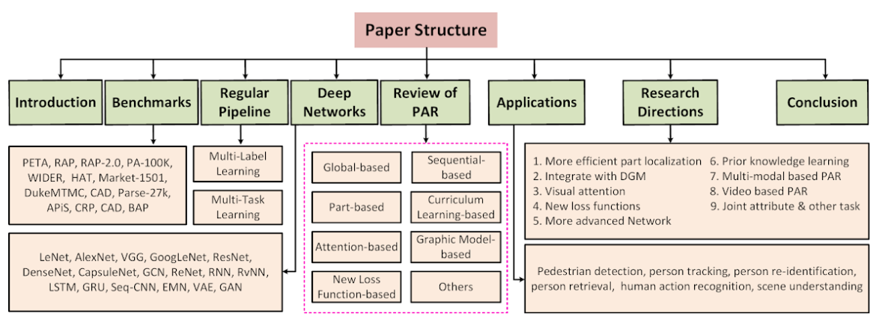
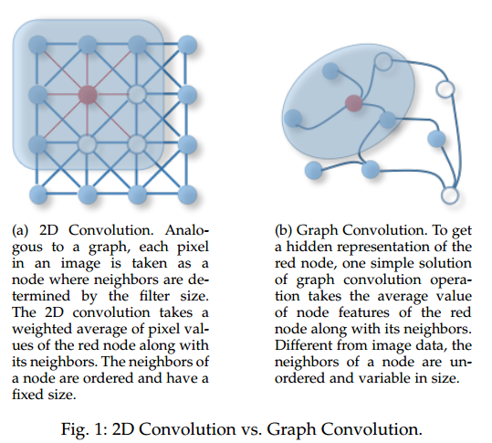

# DailyReadPaper
Some survey paper are delivered as follows,
## Pedestrian Attribute Recognition: A Survey
1. Arxiv 2019
2. Selvaraju, Ramprasaath R and Cogswell, Michael and Das, Abhishek and Vedantam, Ramakrishna and Parikh, Devi and Batra, Dhruv
3. https://github.com/wangxiao5791509/Pedestrian-Attribute-Recognition-Paper-List
4. https://sites.google.com/view/ahu-pedestrianattributes/

- Recognizing pedestrian attributes is an important task in computer vision community 
due to it plays an important role in video surveillance. Many algorithms has been proposed 
to handle this task. The goal of this paper is to review existing works using traditional 
methods or based on deep learning networks. 

    

- **Firstly**, we introduce the background of pedestrian
 attributes recognition (PAR, for short), including the fundamental concepts of pedestrian 
 attributes and corresponding challenges. 
- **Secondly**, we introduce existing benchmarks, including 
 popular datasets and evaluation criterion. 
- **Thirdly**, we analyse the concept of multi-task 
 learning and multi-label learning, and also explain the relations between these two learning
  algorithms and pedestrian attribute recognition. We also review some popular network 
  architectures which have widely applied in the deep learning community. 
- **Fourthly**, we analyse 
  popular solutions for this task, such as attributes group, part-based, etc. 
- **Fifthly**, we shown 
  some applications which takes pedestrian attributes into consideration and achieve better 
  performance. 
- **Finally**, we summarized this paper and give several possible research directions 
  for pedestrian attributes recognition.

    

>@@article{wang2019PARSurvey,
title={Pedestrian Attribute Recognition: A Survey},
author={Xiao Wang, Shaofei Zheng, Rui Yang, Bin Luo, Jin Tang},
journal={arXiv preprint arXiv:1901.07474},
year={2019}
}

## Anomaly Detection in Road Traffic Using Visual Surveillance: A Survey
1. Arxiv 2019
2. Santhosh Kelathodi Kumaran and Debi Prosad Dogra and Partha Pratim Roy

- Abstract—Computer vision has evolved in the last decade as
a key technology for numerous applications replacing human
supervision. 
- In this paper, we present a survey on relevant visual
surveillance related researches for anomaly detection in public
places, focusing primarily on roads. Firstly, we revisit the surveys
done in the last 10 years in this field. Since the underlying
building block of a typical anomaly detection is learning, we
emphasize more on learning methods applied on video scenes.

    

- We then summarize the important contributions made during last
six years on anomaly detection primarily focusing on features,
underlying techniques, applied scenarios and types of anomalies
using single static camera. 

    

- Finally, we discuss the challenges in
the computer vision related anomaly detection techniques and
some of the important future possibilities

>@misc{1901.08292,
Author = {Santhosh Kelathodi Kumaran and Debi Prosad Dogra and Partha Pratim Roy},
Title = {Anomaly Detection in Road Traffic Using Visual Surveillance: A Survey},
Year = {2019},
Eprint = {arXiv:1901.08292},
}

## A Short Survey on Probabilistic Reinforcement Learning
1. Arxiv 2019
2. Reazul Hasan Russel

- A reinforcement learning agent tries to maximize its cumulative payoff by interacting in an unknown environment. It is important for the agent to explore
suboptimal actions as well as to pick actions with highest known rewards. Yet, in
sensitive domains, collecting more data with exploration is not always possible,
but it is important to find a policy with a certain performance guaranty. In this
paper, we present a brief survey of methods available in the literature for balancing exploration-exploitation trade off and computing robust solutions from fixed
samples in reinforcement learning

>@misc{1901.07010,
Author = {Reazul Hasan Russel},
Title = {A Short Survey on Probabilistic Reinforcement Learning},
Year = {2019},
Eprint = {arXiv:1901.07010},
}

## A Survey of the Recent Architectures of Deep Convolutional Neural Networks
1. Arxiv 2019
2. Asifullah Khan and Anabia Sohail and Umme Zahoora and Aqsa Saeed Qureshi

- Deep Convolutional Neural Networks (CNNs) are a special type of Neural Networks, which
have shown state-of-the-art results on various competitive benchmarks. The powerful learning
ability of deep CNN is largely achieved with the use of multiple non-linear feature extraction
stages that can automatically learn hierarchical representation from the data. 

    

- Availability of a
large amount of data and improvements in the hardware processing units have accelerated the
research in CNNs and recently very interesting deep CNN architectures are reported. The recent
race in deep CNN architectures for achieving high performance on the challenging benchmarks
has shown that the innovative architectural ideas, as well as parameter optimization, can improve
the CNN performance on various vision-related tasks. 
- In this regard, different ideas in the CNN
design have been explored such as use of different activation and loss functions, parameter
optimization, regularization, and restructuring of processing units. However, the major
improvement in representational capacity is achieved by the restructuring of the processing units.
Especially, the idea of using a block as a structural unit instead of a layer is gaining substantial
appreciation. 

    

- This survey thus focuses on the intrinsic taxonomy present in the recently reported
CNN architectures and consequently, classifies the recent innovations in CNN architectures into
seven different categories. These seven categories are based on spatial exploitation, depth, multipath, width, feature map exploitation, channel boosting and attention. Additionally, it covers the
elementary understanding of the CNN components and sheds light on the current challenges and
applications of CNNs.

>@misc{1901.06032,
Author = {Asifullah Khan and Anabia Sohail and Umme Zahoora and Aqsa Saeed Qureshi},
Title = {A Survey of the Recent Architectures of Deep Convolutional Neural Networks},
Year = {2019},
Eprint = {arXiv:1901.06032},
}

## Optimization Models for Machine Learning: A Survey
1. Arxiv 2019
2. Claudio Gambella and Bissan Ghaddar and Joe Naoum-Sawaya

- This paper surveys the machine learning literature and presents
machine learning as optimization models. Such models can benefit
from the advancement of numerical optimization techniques which
have already played a distinctive role in several machine learning settings. 

    
    
- Particularly, mathematical optimization models are presented
for commonly used machine learning approaches for regression, classification, clustering, and deep neural networks as well new emerging
applications in machine teaching and empirical model learning. 

    

- The strengths and the shortcomings of these models are discussed and potential 
research directions are highlighted
>@misc{1901.05331,
Author = {Claudio Gambella and Bissan Ghaddar and Joe Naoum-Sawaya},
Title = {Optimization Models for Machine Learning: A Survey},
Year = {2019},
Eprint = {arXiv:1901.05331},
}

## Deep Learning for Anomaly Detection: A Survey
1. Arxiv 2019
2. Raghavendra Chalapathy and Sanjay Chawla

- Anomaly detection is an important problem that has been well-studied within diverse research areas
and application domains. The aim of this survey is two-fold, firstly we present a structured and comprehensive overview of research methods in deep learning-based anomaly detection. Furthermore,
we review the adoption of these methods for anomaly across various application domains and assess
their effectiveness. 

    

- We have grouped state-of-the-art deep anomaly detection research techniques
into different categories based on the underlying assumptions and approach adopted. Within each
category, we outline the basic anomaly detection technique, along with its variants and present key
assumptions, to differentiate between normal and anomalous behavior. 

    
    
- Besides, for each category,
we also present the advantages and limitations and discuss the computational complexity of the techniques in real application domains. Finally, we outline open issues in research and challenges faced
while adopting deep anomaly detection techniques for real-world problems.

>@misc{1901.03407,
Author = {Raghavendra Chalapathy and Sanjay Chawla},
Title = {Deep Learning for Anomaly Detection: A Survey},
Year = {2019},
Eprint = {arXiv:1901.03407},
}

## A Comprehensive Survey on Graph Neural Networks
1. Arxiv 2019
2. Zonghan Wu and Shirui Pan and Fengwen Chen and Guodong Long and Chengqi Zhang and Philip S. Yu

- Abstract—Deep learning has revolutionized many machine learning tasks in recent years, ranging from image classification and video
processing to speech recognition and natural language understanding. The data in these tasks are typically represented in the
Euclidean space. However, there is an increasing number of applications where data are generated from non-Euclidean domains and
are represented as graphs with complex relationships and interdependency between objects. The complexity of graph data has
imposed significant challenges on existing machine learning algorithms. Recently, many studies on extending deep learning
approaches for graph data have emerged. 

    
    
- In this survey, we provide a comprehensive overview of graph neural networks (GNNs) in
data mining and machine learning fields. We propose a new taxonomy to divide the state-of-the-art graph neural networks into different
categories. With a focus on graph convolutional networks, we review alternative architectures that have recently been developed; these
learning paradigms include graph attention networks, graph autoencoders, graph generative networks, and graph spatial-temporal
networks. 

    
    
- We further discuss the applications of graph neural networks across various domains and summarize the open source codes
and benchmarks of the existing algorithms on different learning tasks. Finally, we propose potential research directions in this
fast-growing field.

    
    
>@misc{1901.00596,
Author = {Zonghan Wu and Shirui Pan and Fengwen Chen and Guodong Long and Chengqi Zhang and Philip S. Yu},
Title = {A Comprehensive Survey on Graph Neural Networks},
Year = {2019},
Eprint = {arXiv:1901.00596},
}