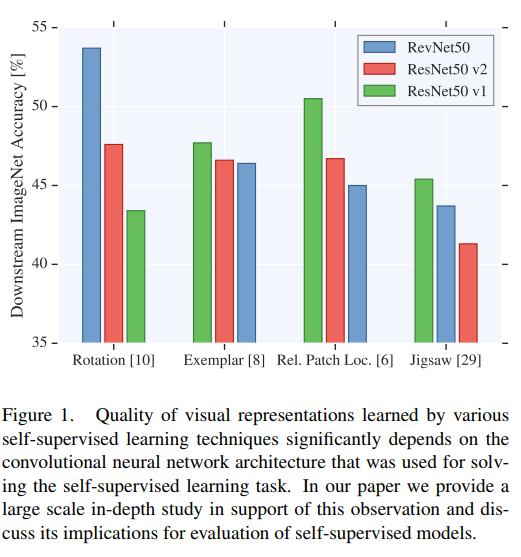
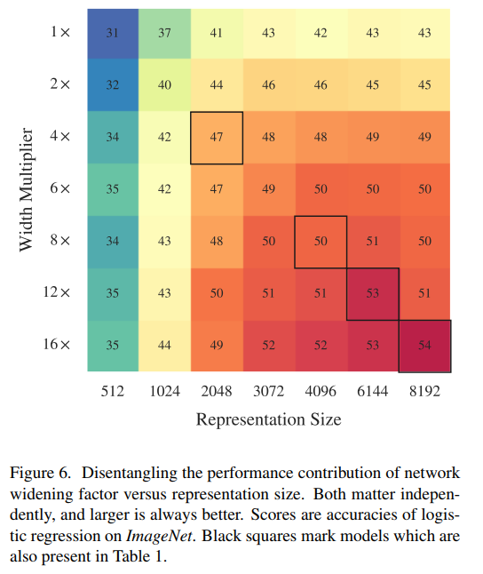
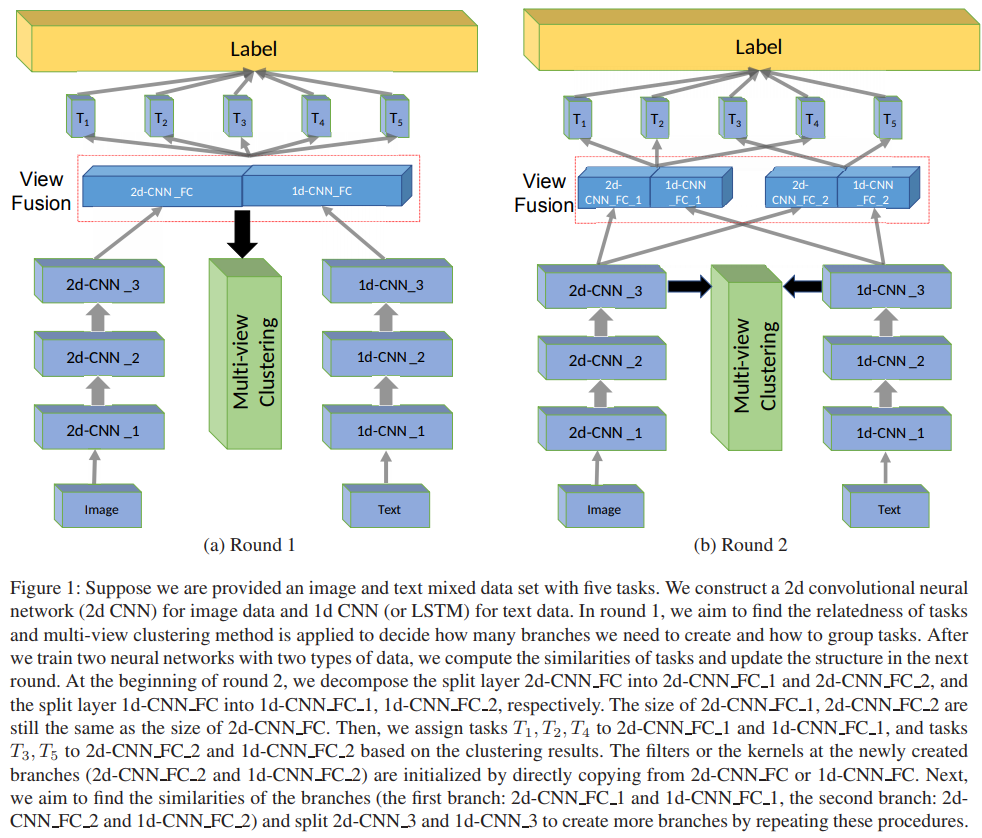
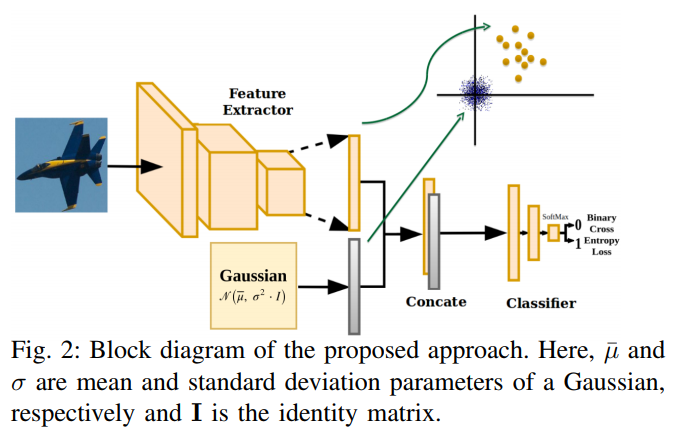
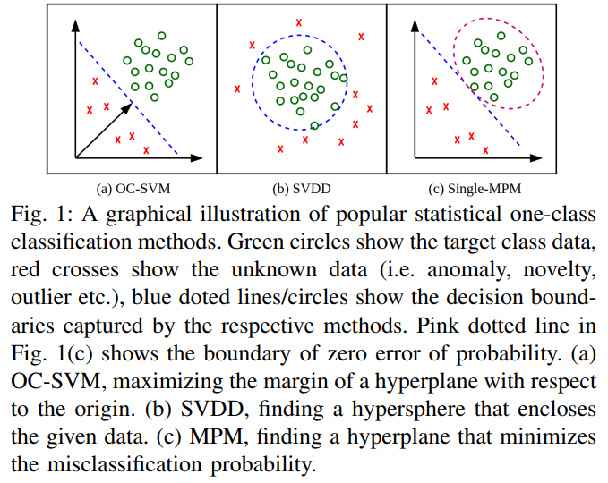
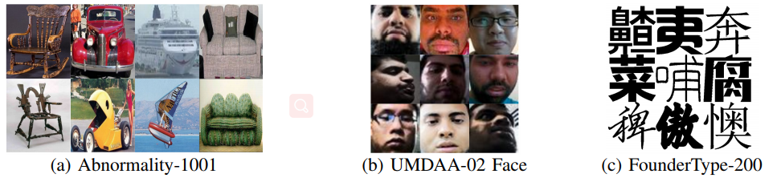
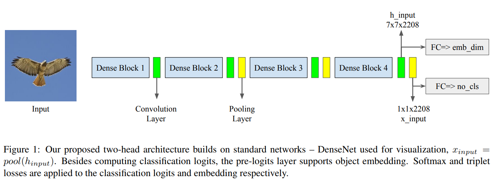
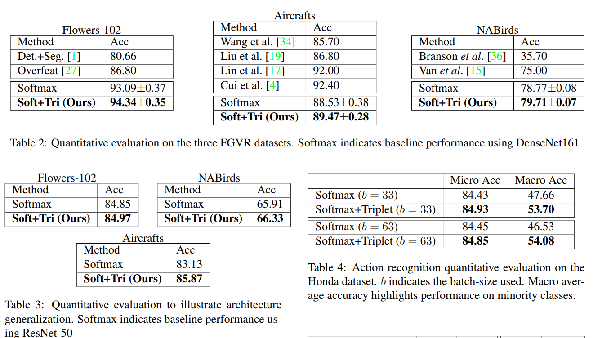

# DailyReadPaper
**Arxiv Daily Update**
Most of them are come from Google Brain, MS and Honda.
## Revisiting Self-Supervised Visual Representation Learning
1. Arxiv 2019
2. **Google Brain**
- Unsupervised visual representation learning remains
a largely unsolved problem in computer vision research.
Among a big body of recently proposed approaches for unsupervised learning of visual representations, a class of
self-supervised techniques achieves superior performance
on many challenging benchmarks. 

    
    
- A large number of the pretext tasks for self-supervised learning have been studied, but other important aspects, such as the choice of convolutional neural networks (CNN), has not received equal
attention. Therefore, we revisit numerous previously proposed self-supervised models, conduct a thorough large
scale study and, as a result, uncover multiple crucial insights. We challenge a number of common practices in selfsupervised visual representation learning and observe that
standard recipes for CNN design do not always translate
to self-supervised representation learning. 

    
    
- As part of our
study, we drastically boost the performance of previously
proposed techniques and outperform previously published
state-of-the-art results by a large margin

>@misc{1901.09005,
Author = {Alexander Kolesnikov and Xiaohua Zhai and Lucas Beyer},
Title = {Revisiting Self-Supervised Visual Representation Learning},
Year = {2019},
Eprint = {arXiv:1901.09005},
}

## Deep Multimodality Model for Multi-task Multi-view Learning
1. Arxiv 2019
2. Microsoft AI & Research
- Many real-world problems exhibit the coexistence of multiple types of heterogeneity, such 
as view heterogeneity (i.e.,
multi-view property) and task heterogeneity (i.e., multi-task
property). For example, in an image classification problem
containing multiple poses of the same object, each pose can
be considered as one view, and the detection of each type
of object can be treated as one task. Furthermore, in some
problems, the data type of multiple views might be 
different. In a web classification problem, for instance, we might
be provided an image and text mixed data set, where the web
pages are characterized by both images and texts. A common
strategy to solve this kind of problem is to leverage 
the consistency of views and the relatedness of tasks to build the prediction model. 

    
    
- In the context of deep neural network, multitask relatedness 
is usually realized by grouping tasks at each
layer, while multi-view consistency is usually enforced by
finding the maximal correlation coefficient between views.
However, there is no existing deep learning algorithm that
jointly models task and view dual heterogeneity, particularly
for a data set with multiple modalities (text and image mixed
data set or text and video mixed data set, etc.). In this paper,
we bridge this gap by proposing a deep multi-task multi-view
learning framework that learns a deep representation for such
dual-heterogeneity problems. Empirical studies on multiple
real-world data sets demonstrate the effectiveness of our proposed Deep-MTMV algorithm.
>@misc{1901.08723,
Author = {Lecheng Zheng and Yu Cheng and Jingrui He},
Title = {Deep Multimodality Model for Multi-task Multi-view Learning},
Year = {2019},
Eprint = {arXiv:1901.08723},
}
## One-Class Convolutional Neural Network
1. Arxiv 2019
2. github.com/otkupjnoz/oc-cnn.
3. Department of Electrical and Computer Engineering, **Johns Hopkins University**, Baltimore, MD, USA. This work was supported by the NSF grant 1801435.

- Abstract—We present a novel Convolutional Neural Network
(CNN) based approach for one class classification.
 
    
-The idea is
to use a zero centered Gaussian noise in the latent space as
the pseudo-negative class and train the network using the crossentropy loss to learn a good representation as well as the decision
boundary for the given class. 

    
    
- A key feature of the proposed
approach is that any pre-trained CNN can be used as the base
network for one class classification. The proposed One Class CNN
(OC-CNN) is evaluated on the UMDAA-02 Face, Abnormality1001, FounderType-200 datasets. 

    
    
- These datasets are related to a
variety of one class application problems such as user authentication, abnormality detection and novelty detection. Extensive
experiments demonstrate that the proposed method achieves
significant improvements over the recent state-of-the-art methods.

>@article{1901.08688,
Author = {Poojan Oza and Vishal M. Patel},
Title = {One-Class Convolutional Neural Network},
Year = {2019},
Eprint = {arXiv:1901.08688},
Doi = {10.1109/LSP.2018.2889273},
}

## In Defense of the Triplet Loss for Visual Recognition

1. Arxiv 2019
2. github.com/otkupjnoz/oc-cnn.
3. University of Maryland, College Park Honda Research Institute, US

- We employ triplet loss as a space embedding regularizer to boost classification performance. Standard architectures, like ResNet and DesneNet, are extended to support both losses with minimal hyper-parameter tuning. This
promotes generality while fine-tuning pretrained networks.

    
    
- Triplet loss is a powerful surrogate for recently proposed
embedding regularizers. Yet, it is avoided for large batchsize requirement and high computational cost. Through our
experiments, we re-assess these assumptions.

    
    
- During inference, our network supports both classification and embedding tasks without any computational overhead. Quantitative evaluation highlights how our approach
compares favorably to the existing state of the art on multiple fine-grained recognition datasets. Further evaluation
on an imbalanced video dataset achieves significant improvement (> 7%). Beyond boosting efficiency, triplet loss
brings retrieval and interpretability to classification models.

>@misc{1901.08616,
Author = {Ahmed Taha and Yi-Ting Chen and Teruhisa Misu and Larry Davis},
Title = {In Defense of the Triplet Loss for Visual Recognition},
Year = {2019},
Eprint = {arXiv:1901.08616},
}