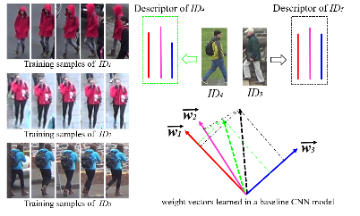
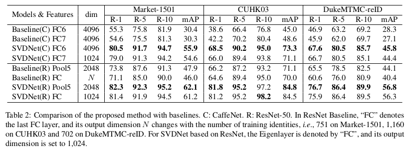
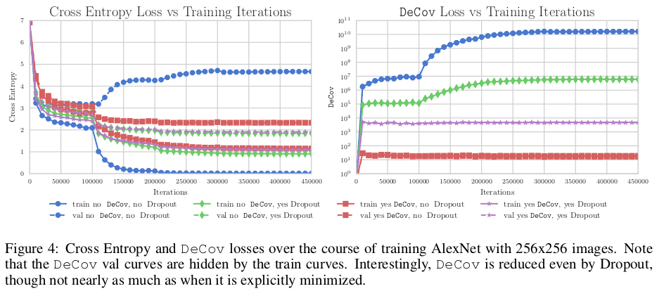
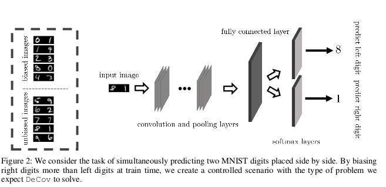
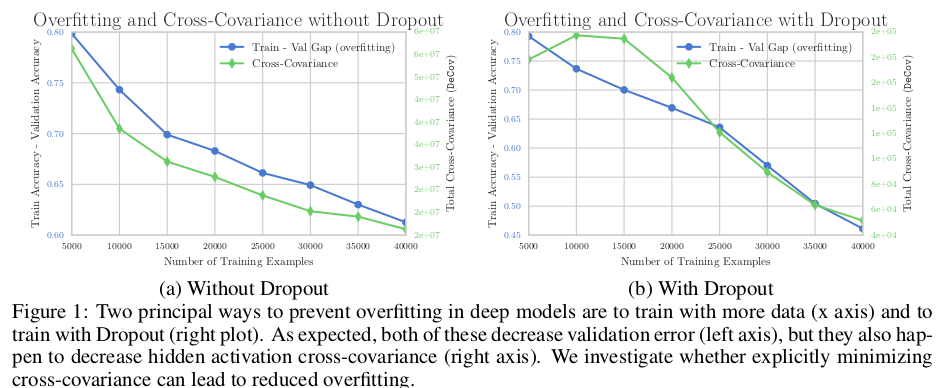
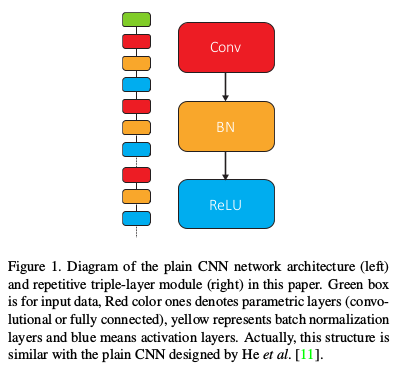
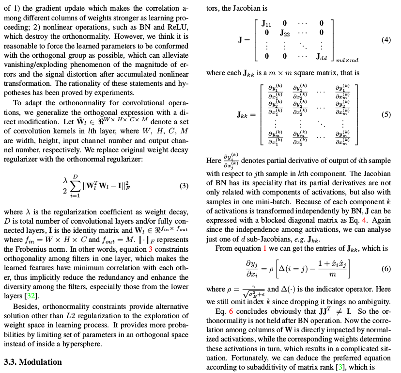
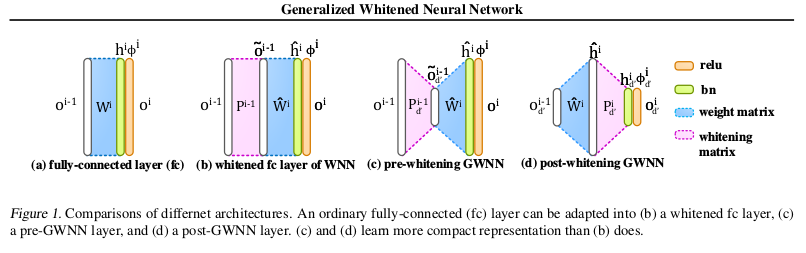
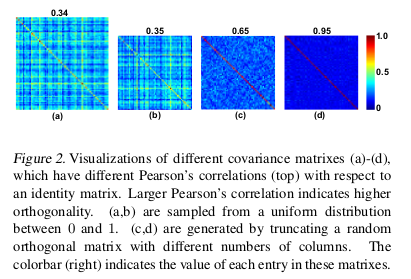

# DailyReadPaper
A decorrelating representations related summarization.
## SVDNet for Pedestrian Retrieval
1. ICCV 2017
2. **Sun, Yifan** and **Zheng, Liang** and Deng, Weijian and Wang, Shengjin

- This paper proposes the SVDNet for retrieval problems,
with focus on the application of person re-identification (re-
ID). We view each weight vector within a fully connected
(FC) layer in a convolutional neuron network (CNN) as a
projection basis. It is observed that the weight vectors are
usually highly correlated. 

  
   
- This problem leads to correlations among entries of the FC descriptor, and compromises
the retrieval performance based on the Euclidean distance.
To address the problem, this paper proposes to optimize the
deep representation learning process with Singular Vector
Decomposition (SVD). Specifically, with the restraint and
relaxation iteration (RRI) training scheme, we are able to
iteratively integrate the orthogonality constraint in CNN
training, yielding the so-called SVDNet. 

    
    
- We conduct experiments on the Market-1501, CUHK03, and DukeMTMC-
reID datasets, and show that RRI effectively reduces the
correlation among the projection vectors, produces more
discriminative FC descriptors, and significantly improves
the re-ID accuracy. On the Market-1501 dataset, for in-
stance, rank-1 accuracy is improved from 55.3% to 80.5%
for CaffeNet, and from 73.8% to 82.3% for ResNet-50.
  
>@article{sun2017svdnet,
  title={Svdnet for pedestrian retrieval},
  author={Sun, Yifan and Zheng, Liang and Deng, Weijian and Wang, Shengjin},
  journal={arXiv preprint},
  volume={1},
  number={6},
  year={2017}
}

## Reducing overfitting in deep networks by decorrelating representations
1. ICLR 2016

- One major challenge in training Deep Neural Networks is preventing overfit-
ting. 

    

- Many techniques such as data augmentation and novel regularizers such
as Dropout have been proposed to prevent overfitting without requiring a massive
amount of training data. 

    

- In this work, we propose a new regularizer called DeCov
which leads to significantly reduced overfitting (as indicated by the difference
between train and val performance), and better generalization. Our regularizer en-
courages diverse or non-redundant representations in Deep Neural Networks by
minimizing the cross-covariance of hidden activations. This simple intuition has
been explored in a number of past works but surprisingly has never been applied
as a regularizer in supervised learning. 

    

- Experiments across a range of datasets and
network architectures show that this loss always reduces overfitting while almost
always maintaining or increasing generalization performance and often improving
performance over Dropout.

>@article{cogswell2015reducing,
  title={Reducing overfitting in deep networks by decorrelating representations},
  author={Cogswell, Michael and Ahmed, Faruk and Girshick, Ross and Zitnick, Larry and Batra, Dhruv},
  journal={arXiv preprint arXiv:1511.06068},
  year={2015}
}
## All you need is beyond a good init: Exploring better solution for training extremely deep convolutional neural networks with orthonormality and modulation
1. CVPR 2017

- Deep neural network is difficult to train and this predica-
ment becomes worse as the depth increases. The essence
of this problem exists in the magnitude of backpropagated
errors that will result in gradient vanishing or exploding
phenomenon. 

    

- We show that a variant of regularizer which
utilizes orthonormality among different filter banks can al-
leviate this problem. Moreover, we design a backward er-
ror modulation mechanism based on the quasi-isometry as-
sumption between two consecutive parametric layers. E-
quipped with these two ingredients, we propose several nov-
el optimization solutions that can be utilized for training a
specific-structured (repetitively triple modules of Conv-BN-
ReLU) extremely deep convolutional neural network (CNN)
WITHOUT any shortcuts/ identity mappings from scratch.

    

- Experiments show that our proposed solutions can achieve
distinct improvements for a 44-layer and a 110-layer plain
networks on both the CIFAR-10 and ImageNet datasets.
Moreover, we can successfully train plain CNNs to match
the performance of the residual counterparts.
Besides, we propose new principles for designing net-
work structure from the insights evoked by orthonormality.
Combined with residual structure, we achieve comparative
performance on the ImageNet dataset.

>@article{xie2017all,
  title={All you need is beyond a good init: Exploring better solution for training extremely deep convolutional neural networks with orthonormality and modulation},
  author={Xie, Di and Xiong, Jiang and Pu, Shiliang},
  journal={arXiv preprint arXiv:1703.01827},
  year={2017}
}

## Learning deep architectures via generalized whitened neural networks
1. ICML 2017

- Whitened Neural Network (WNN) is a recent
advanced deep architecture, which improves con-
vergence and generalization of canonical neural
networks by whitening their internal hidden rep-
resentation. 

    
    
- However, the whitening transforma-
tion increases computation time. Unlike WNN
that reduced runtime by performing whitening
every thousand iterations, which degenerates
convergence due to the ill conditioning, we
present generalized WNN (GWNN), which has
three appealing properties. 

    
   
- First, GWNN is
able to learn compact representation to reduce
computations. Second, it enables whitening
transformation to be performed in a short period,
preserving good conditioning. Third, we propose
a data-independent estimation of the covariance
matrix to further improve computational efficien-
cy. Extensive experiments on various datasets
demonstrate the benefits of GWNN.

>@inproceedings{luo2017learning,
  title={Learning deep architectures via generalized whitened neural networks},
  author={Luo, Ping},
  booktitle={International Conference on Machine Learning},
  pages={2238--2246},
  year={2017}
}