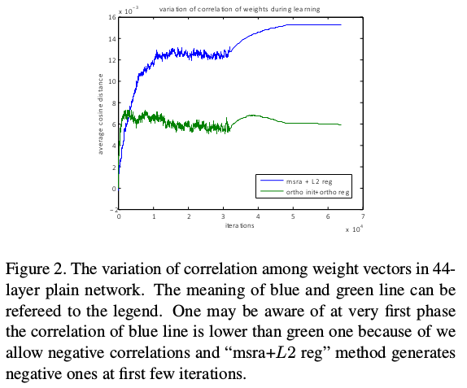
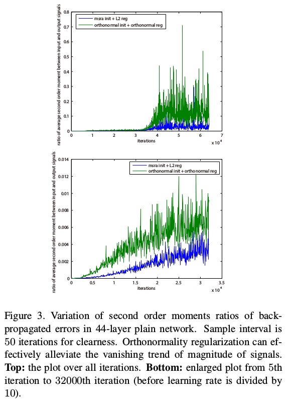
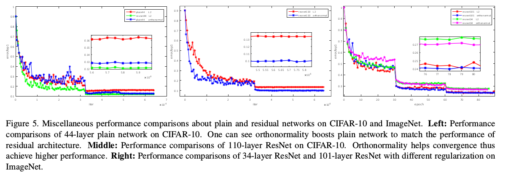
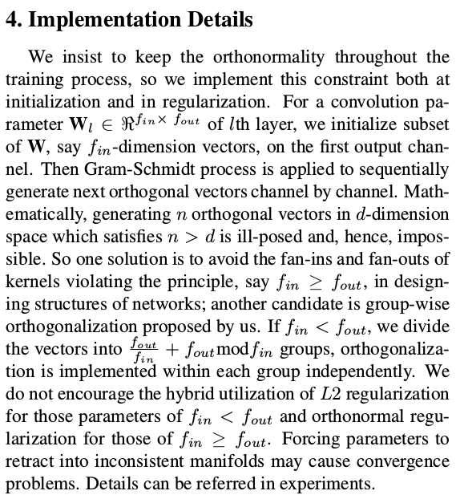
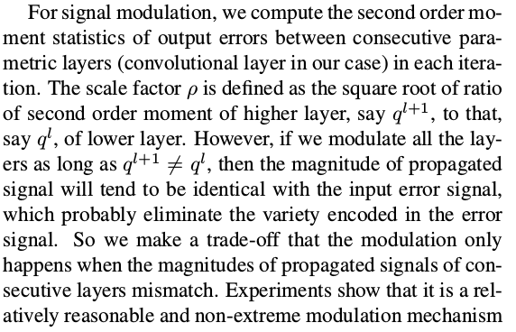
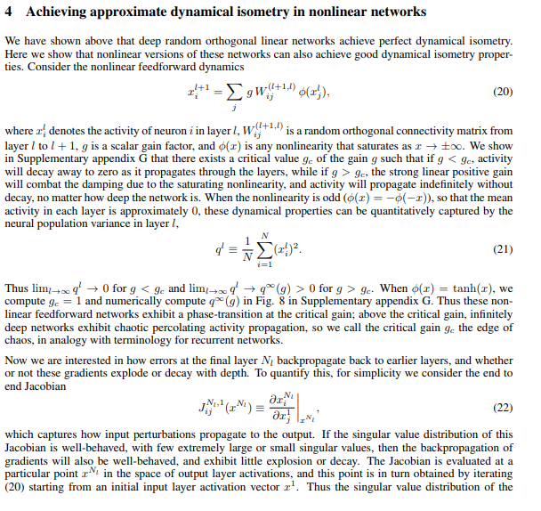
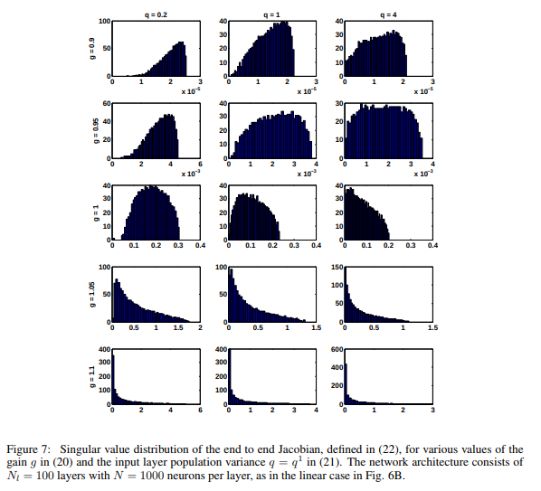
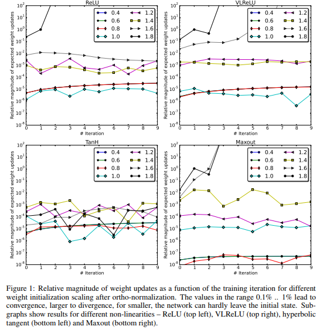

# DailyReadPaper
A rethink about decorrelating representation learning.

## A rethink about All you need is beyond a good init: Exploring better solution for training extremely deep convolutional neural networks with orthonormality and modulation
1. http://www.erogol.com/need-good-init/

- Recently we find that [21] has proposed similar ideas.
They unify three types of kernel normalization methods in-
to a geometric framework called kernel submanifolds, in
which sphere, oblique and compact Stiefel manifolds (or-
thonormal kernels) are considered. 

    
    
- The differences exist-
s in three aspects: 1) The intrinsic explanations about the
performance improvement is different, of which they main-
ly focus on regularization of models with data augmentation
and learning of models endowed with geometric invariants;

    
    
- 2) The orthogonalization is different, of which they orthog-
onalize convolutional kernels within a channel while we do
this among channel; 3) As the second statement tells, we
believe that their proposed method still cannot handle the
extremely deep plain networks. Besides, all the details and
key steps to implement their methods are ambiguous that
prevents from understanding and verifying it further.

    
    
- Intrinsically, one can regard our proposed modulation as
assigning each parametric layer an individual and adaptive
learning rate. 

    
    
- This kind of modulation can be more practi-
cal than local methods, e.g. second-order methods, while be
more flexible than global ones, e.g. SGD. 

    
    
- Besides, if we can
approach some strategies to compensate the evanescent or-
thonomality as learning progresses, we believe that training
a genuinely deep network will be available.

>@article{xie2017all,
  title={All you need is beyond a good init: Exploring better solution for training extremely deep convolutional neural networks with orthonormality and modulation},
  author={Xie, Di and Xiong, Jiang and Pu, Shiliang},
  journal={arXiv preprint arXiv:1703.01827},
  year={2017}
}

### \[30]Exact solutions to the nonlinear dynamics of learning in deep linear neural networks
1. Andrew M. Saxe (asaxe@stanford.edu)
Department of Electrical Engineering
James L. McClelland (mcclelland@stanford.edu)
Department of Psychology
Surya Ganguli (sganguli@stanford.edu)
Department of Applied Physics
**Stanford University**, Stanford, CA 94305 USA

- Despite the widespread practical success of deep learning methods, our theoretical understanding
of the dynamics of learning in deep neural networks remains quite sparse. We
attempt to bridge the gap between the theory and practice of deep learning by systematically
analyzing learning dynamics for the restricted case of deep linear neural networks.
Despite the linearity of their input-output map, such networks have nonlinear gradient descent
dynamics on weights that change with the addition of each new hidden layer. We
show that deep linear networks exhibit nonlinear learning phenomena similar to those seen
in simulations of nonlinear networks, including long plateaus followed by rapid transitions
to lower error solutions, and faster convergence from greedy unsupervised pretraining initial
conditions than from random initial conditions. 

    
    
- We provide an analytical description
of these phenomena by finding new exact solutions to the nonlinear dynamics of deep
learning. Our theoretical analysis also reveals the surprising finding that as the depth of
a network approaches infinity, learning speed can nevertheless remain finite: for a special
class of initial conditions on the weights, very deep networks incur only a finite, depth
independent, delay in learning speed relative to shallow networks. We show that, under
certain conditions on the training data, unsupervised pretraining can find this special class
of initial conditions, while scaled random Gaussian initializations cannot. We further exhibit
a new class of random orthogonal initial conditions on weights that, like unsupervised
pre-training, enjoys depth independent learning times. We further show that these initial
conditions also lead to faithful propagation of gradients even in deep nonlinear networks,
as long as they operate in a special regime known as the edge of chao

    
    
- In summary, despite the simplicity of their input-output map, the dynamics of learning in deep linear networks
reveals a surprising amount of rich mathematical structure, including nonlinear hyperbolic dynamics,
plateaus and sudden performance transitions, a proliferation of saddle points, symmetries and conserved
quantities, invariant submanifolds of independently evolving connectivity modes subserving rapid learning,
and most importantly, a sensitive but computable dependence of learning time scales on input statistics, initial
weight conditions, and network depth. With the right initial conditions, deep linear networks can be only
a finite amount slower than shallow networks, and unsupervised pretraining can find these initial conditions
for tasks with the right structure. Moreover, we introduce a mathematical condition for faithful backpropagation
of error signals, namely dynamical isometry, and show, surprisingly that random scaled Gaussian
initializations cannot achieve this condition despite their norm-preserving nature, while greedy pre-training
and random orthogonal initialization can, thereby achieving depth independent learning times. Finally, we
show that the property of dynamical isometry survives to good approximation even in extremely deep nonlinear
random orthogonal networks operating just beyond the edge of chaos. At the cost of expressivity, deep
linear networks gain theoretical tractability and may prove fertile for addressing other phenomena in deep
learning, such as the impact of carefully-scaled initializations [13, 23], momentum [23], dropout regularization
[1], and sparsity constraints [2]. While a full analytical treatment of learning in deep nonlinear networks
currently remains open, one cannot reasonably hope to move towards such a theory without first completely
understanding the linear case. In this sense, our work fulfills an essential pre-requisite for progress towards
a general, quantitative theory of deep learning.
>@article{saxe2013exact,
  title={Exact solutions to the nonlinear dynamics of learning in deep linear neural networks},
  author={Saxe, Andrew M and McClelland, James L and Ganguli, Surya},
  journal={arXiv preprint arXiv:1312.6120},
  year={2013}
}

### ALL YOU NEED IS A GOOD INIT
1. Center for Machine Perception
Czech Technical University in Prague
Czech Republic {mishkdmy,matas}@cmp.felk.cvut.cz
2. ICLR 2016

- Layer-sequential unit-variance (LSUV) initialization – a simple method for weight
initialization for deep net learning – is proposed. The method consists of the two
steps. First, pre-initialize weights of each convolution or inner-product layer with
orthonormal matrices. Second, proceed from the first to the final layer, normalizing
the variance of the output of each layer to be equal to one.

    
   
- Experiment with different activation functions (maxout, ReLU-family, tanh) show
that the proposed initialization leads to learning of very deep nets that (i) produces
networks with test accuracy better or equal to standard methods and (ii) is at least
as fast as the complex schemes proposed specifically for very deep nets such as
FitNets (Romero et al. (2015)) and Highway (Srivastava et al. (2015)).
Performance is evaluated on GoogLeNet, CaffeNet, FitNets and Residual nets and
the state-of-the-art, or very close to it, is achieved on the MNIST, CIFAR-10/100
and ImageNet datasets.