# DailyReadPaper
Rethinking Normalization Technique.

The typically classical works are shown as follows,

## Group normalization
1. ECCV 2018
2. Wu, Yuxin and **He, Kaiming**
3. Pytorch has already implemented.

- Batch Normalization (BN) is a milestone technique in the
development of deep learning, enabling various networks
to train. However, normalizing along the batch dimension
introduces problems — BN’s error increases rapidly when
the batch size becomes smaller, caused by inaccurate batch
statistics estimation. 

    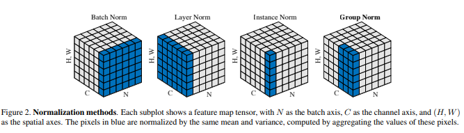

- This limits BN’s usage for training
larger models and transferring features to computer vision
tasks including detection, segmentation, and video, which
require small batches constrained by memory consumption.
In this paper, we present Group Normalization (GN) as
a simple alternative to BN. GN divides the channels into
groups and computes within each group the mean and variance
for normalization. GN’s computation is independent
of batch sizes, and its accuracy is stable in a wide range
of batch sizes. On ResNet-50 trained in ImageNet, GN has
10.6% lower error than its BN counterpart when using a
batch size of 2; when using typical batch sizes, GN is comparably
good with BN and outperforms other normalization
variants. Moreover, GN can be naturally transferred
from pre-training to fine-tuning. GN can outperform its BNbased
counterparts for object detection and segmentation in
COCO,1 and for video classification in Kinetics, showing
that GN can effectively replace the powerful BN in a variety
of tasks. GN can be easily implemented by a few lines of
code in modern libraries.

>@article{wu2018group,
  title={Group normalization},
  author={Wu, Yuxin and He, Kaiming},
  journal={arXiv preprint arXiv:1803.08494},
  year={2018}
}
## Towards Faster Training of Global Covariance Pooling Networks by Iterative Matrix Square Root Normalization
1. CVPR 2018
2. The source code and network models will be available at http://www.peihuali.org/iSQRT-COV.
- Global covariance pooling in convolutional neural networks
has achieved impressive improvement over the classical
first-order pooling. Recent works have shown matrix
square root normalization plays a central role in achieving
state-of-the-art performance. However, existing methods
depend heavily on eigendecomposition (EIG) or singular
value decomposition (SVD), suffering from inefficient
training due to limited support of EIG and SVD on GPU.
Towards addressing this problem, we propose an iterative
matrix square root normalization method for fast end-toend
training of global covariance pooling networks. 

    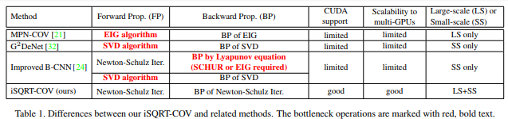

- At the core of our method is a meta-layer designed with loopembedded
directed graph structure. The meta-layer consists
of three consecutive nonlinear structured layers, which
perform pre-normalization, coupled matrix iteration and
post-compensation, respectively. Our method is much faster
than EIG or SVD based ones, since it involves only matrix
multiplications, suitable for parallel implementation on
GPU. 

    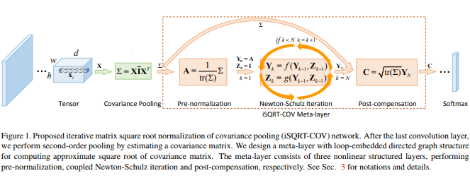

- Moreover, the proposed network with ResNet architecture
can converge in much less epochs, further accelerating
network training. On large-scale ImageNet, we achieve
competitive performance superior to existing counterparts.
By finetuning our models pre-trained on ImageNet, we establish
state-of-the-art results on three challenging finegrained
benchmarks. 
>@inproceedings{li2018towards,
  title={Towards faster training of global covariance pooling networks by iterative matrix square root normalization},
  author={Li, Peihua and Xie, Jiangtao and Wang, Qilong and Gao, Zilin},
  booktitle={Proceedings of the IEEE Conference on Computer Vision and Pattern Recognition},
  pages={947--955},
  year={2018}
}

## RIEMANNIAN ADAPTIVE OPTIMIZATION METHODS
1. ICLR 2019 (open review)
2. unofficial https://github.com/ferrine/geoopt

- Several first order stochastic optimization methods commonly used in the Euclidean
domain such as stochastic gradient descent (SGD), accelerated gradient descent
or variance reduced methods have already been adapted to certain Riemannian
settings. However, some of the most popular of these optimization tools − namely
ADAM, ADAGRAD and the more recent AMSGRAD − remain to be generalized
to Riemannian manifolds. We discuss the difficulty of generalizing such adaptive
schemes to the most agnostic Riemannian setting, and then provide algorithms
and convergence proofs for geodesically convex objectives in the particular case
of a product of Riemannian manifolds, in which adaptivity is implemented across
manifolds in the cartesian product. Our generalization is tight in the sense that
choosing the Euclidean space as Riemannian manifold yields the same algorithms
and regret bounds as those that were already known for the standard algorithms.

    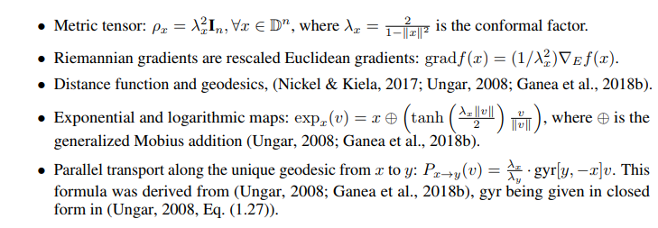

- Experimentally, we show faster convergence and to a lower train loss value for
Riemannian adaptive methods over their corresponding baselines on the realistic
task of embedding the WordNet taxonomy in the Poincare ball.

## Decorrelated Batch Normalization
1. CVPR 2018
2. **Lei Huang**, Xianglong Liu, Bo Lang, Adams Wei Yu, Yongliang Wang, Bo Li
3. https://github.com/princeton-vl/DecorrelatedBN

- Batch Normalization (BN) is capable of accelerating the
training of deep models by centering and scaling activations
within mini-batches. In this work, we propose Decorre-
lated Batch Normalization (DBN), which not just centers
and scales activations but whitens them. 

    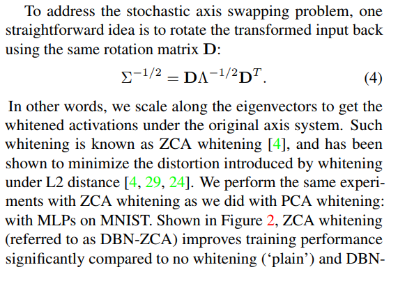

- We explore multiple
whitening techniques, and find that PCA whitening causes a
problem we call stochastic axis swapping, which is detrimen-
tal to learning. We show that ZCA whitening does not suffer
from this problem, permitting successful learning. DBN re-
tains the desirable qualities of BN and further improves BN’s
optimization efficiency and generalization ability. 

    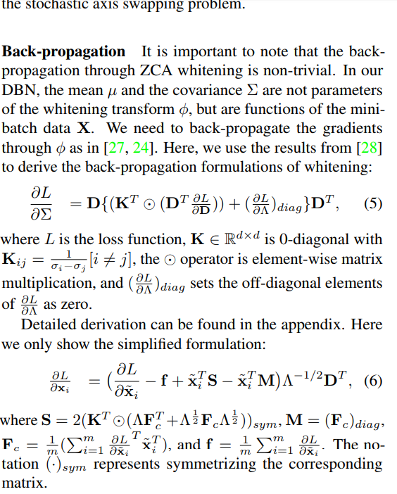
   
- We design
comprehensive experiments to show that DBN can improve
the performance of BN on multilayer perceptrons and con-
volutional neural networks. Furthermore, we consistently
improve the accuracy of residual networks on CIFAR-10,
CIFAR-100, and ImageNet.

>@misc{1804.08450,
Author = {Lei Huang and Dawei Yang and Bo Lang and Jia Deng},
Title = {Decorrelated Batch Normalization},
Year = {2018},
Eprint = {arXiv:1804.08450},
}
## Orthogonal weight normalization: Solution to optimization over multiple dependent stiefel manifolds in deep neural networks
1. AAAI 2018
2. **Huang, Lei** and Liu, Xianglong and Lang, Bo and Yu, Adams Wei and Wang, Yongliang and Li, Bo
3. https://github.com/huangleiBuaa/OthogonalWN

- Orthogonal matrix has shown advantages in training Recurrent Neural Networks (RNNs), but 
such matrix is limited to be square for the hidden-to-hidden transformation in RNNs. 

    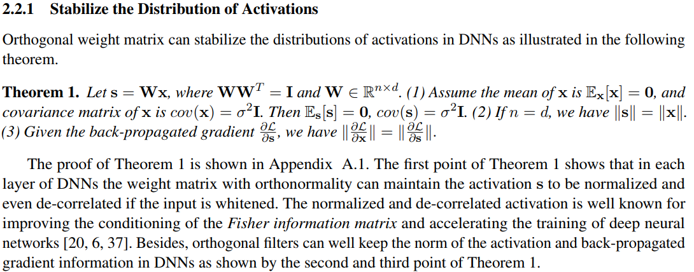
   
- In this 
paper, we generalize such square orthogonal matrix to orthogonal rectangular matrix and formulating 
this problem in feed-forward Neural Networks (FNNs) as Optimization over Multiple Dependent Stiefel 
Manifolds (OMDSM). 

    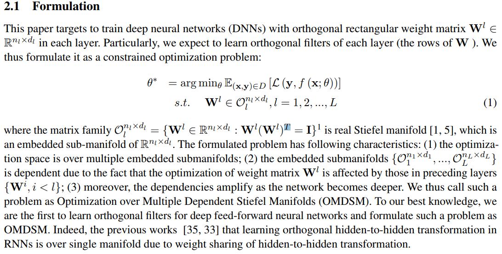
   
- We show that the rectangular orthogonal matrix can stabilize the distribution of 
network activations and regularize FNNs. We also propose a novel orthogonal weight normalization method
to solve OMDSM. 

    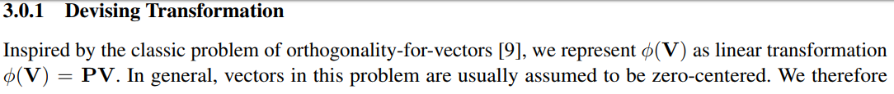
    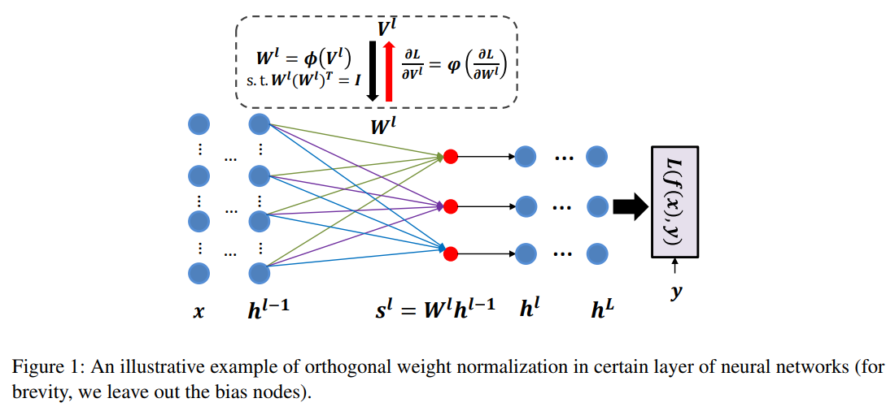
    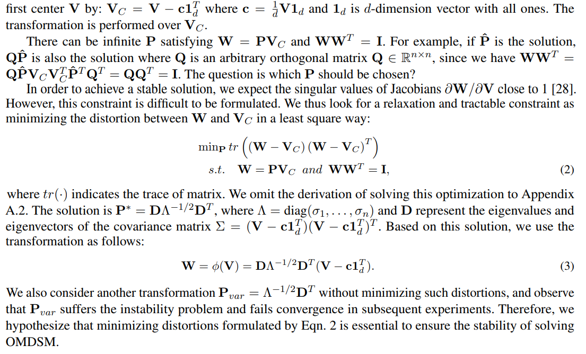
   
- Particularly, it constructs orthogonal transformation over proxy parameters to ensure 
the weight matrix is orthogonal and back-propagates gradient information through the transformation during 
training. 

    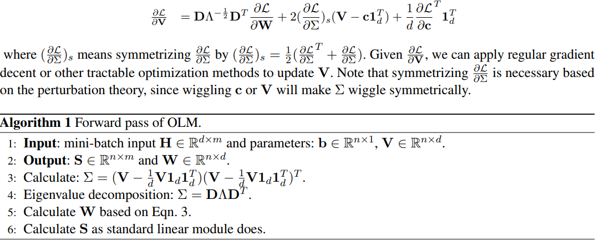
   
- To guarantee stability, we minimize the distortions between proxy parameters and canonical 
weights over all tractable orthogonal transformations. In addition, we design an orthogonal linear 
module (OLM) to learn orthogonal filter banks in practice, which can be used as an alternative to 
standard linear module. Extensive experiments demonstrate that by simply substituting OLM for 
standard linear module without revising any experimental protocols, our method largely improves 
the performance of the state-of-the-art networks, including Inception and residual networks on 
CIFAR and ImageNet datasets.

>@inproceedings{huang2018orthogonal,
  title={Orthogonal weight normalization: Solution to optimization over multiple dependent stiefel manifolds in deep neural networks},
  author={Huang, Lei and Liu, Xianglong and Lang, Bo and Yu, Adams Wei and Wang, Yongliang and Li, Bo},
  booktitle={Thirty-Second AAAI Conference on Artificial Intelligence},
  year={2018}
}

In this page, we provide a list of related work which has been used and cited in the ECCV2018 oral talk.
## List of Related Work: 
### Normalization Techniques: Motivation:
1.      Yann LeCun, Ido Kanter, Sara A.Solla. Second order properties of Error Surfaces: Learning time and Generalization. NIPS, 1990

2.      Yann LeCun, Leon Bottou, Genevieve B. Orr,  Klaus-Robert Muller. Efficient BackProp. Neural Networks: tricks of the trade. 1998

3.      Simon Wiesler, Hermann Ney. A Convergence Analysis of Log-Linear Training, NIPS 2011

4.      James Martens, Roger Grosse. Optimizing Neural Networks with Kronecker-factored Approximate Curvature. ICML 2015

## Methods, Analyses and Applications in Computer Vision and Machine Learning:
### Feature Normalization:
1.      Guillaume Desjardins, Karen Simonyan, Razvan Pascanu, Koray Kavukcuoglu. Natural Neural Networks. NIPS 2015.

2.      Grégoire Montavon and Klaus-Robert Müller. Deep Boltzmann Machines and the Centering Trick.  Neural Networks: Tricks of the Trade, 2012

3.      Simon Wiesler, Alexander Richard, Ralf Schluter, Hermann Ney. Mean-normalized Stochastic Gradient for Large-scale Deep Learning. ICASSP 2014. 

4.      Jan Melchior, Asja Fischer, Laurenz Wiskott. How to Center Binary Deep Boltzmann Machines. JMLR 2016.

5.      Sergey Ioffe and Christian Szegedy. Batch normalization accelerating deep network training by reducing internal covariate shift. ICML 2015

6.      Jimmy Lei Ba, Jamie Ryan Kiros, Geoffrey E. Hinton. Layer Normalization. Arxiv:1607.06450, 2016

7.      Dmitry Ulyanov and Andrea Vedaldi. Instance Normalization: The Missing Ingredient for Fast Stylization. arXiv:1607.08022, 2016

8.      Mengye Ren, Renjie Liao, Raquel Urtasun, Fabian H. Sinz, Richard S. Zemel. Normalizing the normaliziers-comparing and extending network normalization schemes. ICLR 2017

9.      Yuxin Wu and Kaiming He. Group Normalization.  ECCV 2018

10.  Qianli Liao, Kenji Kawaguchi and Tomaso Poggio.  Streaming Normalization: Towards Simpler and More Biologically-plausible Normalizations for Online and Recurrent Learning. arXiv:1610.06160

11.  Sergey Ioffe. Batch Renormalization: Towards Reducing Minibatch Dependence in Batch Normalized Models. NIPS 2017

12.  Guangrun Wang, Jiefeng Peng, Ping Luo, Xinjiang Wang and  Liang Lin. Batch Kalman Normalization: Towards Training Deep Neural Networks with Micro-batches.  arXiv:1802.03133, 2018

13.  Ping Luo, Jiamin Ren and Zhanglin Peng. Differentiable Learning to Normalize via Switchable Normalization. arXiv:1806.10779, 2018 

14.  Elad Hoffer, Ron Banner,  Itay Golan and Daniel Soudry. Norm matters: efficient and accurate normalization schemes in deep networks. arXiv:1803.01814, 2018 

15.  Shuang Wu, Guoqi Li, Lei Deng, Liu Liu, Yuan Xie, and Luping Shi. L1-Norm Batch Normalization for Efficient Training of Deep Neural Networks. arXiv:1802.09769, 2018

16.  Günter Klambauer, Thomas Unterthiner, Andreas Mayr,  Sepp Hochreiter. Self-Normalizing Neural Networks. NIPS 2017.

17.  Natural Neural Networks, Guillaume Desjardins, Karen Simonyan, Razvan Pascanu, Koray Kavukcuoglu.  NIPS 2015

18.  Ping Luo. Learning Deep Architectures via Generalized Whitened Neural Networks. ICML 2017

19.  Lei Huang, Dawei Yang, Bo Lang, Jia Deng, Decorrelated Batch Normalization. CVPR 2018

### Weight/Filter/Kernel Normalization
1.      Devansh Arpit, Yingbo Zhou, Bhargava U. Kota, Venu Govindaraju. Normalization Propagation A Parametric Technique for Removing Internal Covariate Shift in Deep Networks.  ICML 2016.

2.      Alexander Shekhovtsov and Boris Flach. Normalization of Neural Networks using Analytic Variance Propagation. arXiv:1803.10560, 2018

3.      Wenling Shang, Justion Chiu, Kihyuk Sohn. Exploring Normalization in Deep Residual Networks. AAAI 2017.

4.      Tim Salimans, Diederik P. Kingma, Weight Normalization A Simple Reparameterization to Accelerate Training of Deep Neural Networks, NIPS 2016

5.      Xavier Glorot and Yoshua Bengio. Understanding the difficulty of training deep feedforward neural networks.  AISTATS, 2010

6.      Kaiming He, Xiangyu Zhang, Shaoqing Ren, Jian Sun. Delving Deep into Rectifiers: Surpassing Human-Level Performance on ImageNet Classification. ICCV 2015

7.      Lei Huang, Xianglong Liu, Yang Liu, Bo Lang, Dacheng Tao.  Centered Weight Normalization in Accelerating Training of Deep Neural Networks.  ICCV 2017.

8.      Andrew M. Saxe, James L. McClelland, Surya Ganguli.  Exact solutions to the nonlinear dynamics of learning in deep linear neural networks. ICLR 2014

9.      Dmytro Mishkin and Jiri Matas. All You Need Is a Good Init. ICLR 2016.

10.  Lei Huang, Xianglong Liu, Bo Lang, Admas Wei Yu, Bo Li. Orthogonal Weight Normalization: Solution to Optimization over Multiple Dependent Stiefel Manifolds in Deep Neural Networks. AAAI 2018. 

11.  Mete Ozay and Takayuki Okatani. Optimization on Submanifolds of Convolution Kernels in CNNs.  arXiv:1610.07008, 2016

12.  Minhyung Cho and Jaehyung Lee. Riemannian approach to batch normalization. NIPS 2017

13.  Projection Based Weight Normalization for Deep Neural Networks. Lei Huang, Xianglong Liu, Bo Lang, Bo Li. arXiv:1710.02338. 2017

14.  Nathan Srebro and Adi Shraibman. Rank, Trace-Norm and Max-Norm. COLT 2015.

15.  Behnam Neyshabur, Ruslan Salakhutdinov, Nathan Srebro. Path-SGD: Path-Normalized Optimization in Deep Neural Networks. NIPS 2015

16.  Kui Jia, Dacheng Tao, Shenghua Gao, and Xiangmin Xu. Improving training of deep neural networks via singular value bounding CVPR 2017.

17.  Chunjie Luo, Jianfeng Zhan, Lei Wang, Qiang Yang. Cosine Normalization: Using Cosine Similarity Instead of Dot Product in Neural Networks. arXiv:1702.05870, 2017

### Gradient Normalization:
1.      Ping Luo. EigenNet: Towards Fast and Structural Learning of Deep Neural Networks. IJCAI 2017.

2.      Adams Wei Yu, Lei Huang, Qihang Lin, Ruslan Salakhutdinov, and Jaime G Carbonell. Block-normalized gradient method: An empirical study for training deep neural network. CoRR, abs/1707.04822, 2017.

3.      Zhao Chen, Vijay Badrinarayanan, Chen-Yu Lee, Andrew Rabinovich. GradNorm: Gradient Normalization for Adaptive Loss Balancing in Deep Multitask Networks, ICML 2018.

### Normalization for RNNs:
1.      Tim Cooijmans, Nicolas Ballas, César Laurent, Çaglar Gulçehre, Aaron Courville. Recurrent Batch Normalization. ICLR,2017

2.      Cesar Laurent, Gabriel Pereyra, Philemon Brakel, Ying Zhang, Yoshua Bengio.   Batch Normalized Recurrent Neural Networks. ICASSP 2016

3.      Martín Arjovsky, Amar Shah, and Yoshua Bengio. Unitary evolution recurrent neural networks. ICML, 2016

4.      Scott Wisdom, Thomas Powers, John Hershey, Jonathan Le Roux, and Les Atlas. Full-capacity unitary recurrent neural networks. NIPS, 2016

5.      Zakaria Mhammedi, Andrew D. Hellicar, Ashfaqur Rahman, and James Bailey. Efficient orthogonal parametrization of recurrent neural networks using householder reflections. ICML, 2017.

### Normalization for Image Style Transfer:
1.      Dmitry Ulyanov. Instance Normalization: The Missing Ingredient for Fast Stylization.   1607.08022, 2016.

2.      Leon A. Gatys, Alexander S. Ecker, Matthias Bethge. Image Style Transfer Using Convolutional Neural Networks. CVPR 2016.

3.      Justin Johnson, Alexandre Alahi, and Li Fei-Fei. Perceptual Losses for Real-Time Style Transfer and Super-Resolution. ECCV 2016.

4.      Vincent Dumoulin, Jonathon Shlens,  Manjunath Kudlur. A Learned Representation for Artistic Style. ICLR 2017 

5.      Xun Huang and Serge Belongie. Arbitrary Style Transfer in Real-time with Adaptive Instance Normalization. ICCV 2017

6.      Yijun Li, Chen Fang, Jimei Yang Zhaowen Wang, Xin Lu, Ming-Hsuan Yang. Universal Style Transfer via Feature Transforms. NIPS 2017

### Normalization for Training GANs:
1.    Ian J. Goodfellow, Jean Pouget-Abadie, Mehdi Mirza, Bing Xu, David Warde-Farley, Sherjil Ozair, Aaron Courville, Yoshua Bengio. Generative adversarial networks.  NIPS 2014.

2.    Tim Salimans, Ian Goodfellow, Wojciech Zaremba, Vicki Cheung, Alec Radford, Xi Chen. Improved Techniques for Training GANs. NIPS 2016

3.    Sitao Xiang and Hao Li. On the Effects of Batch and Weight Normalization in Generative Adversarial Networks. arXiv:1704.03971. 2017

4.    Takeru Miyato, Toshiki Kataoka, Masanori Koyama, Yuichi Yoshida. Spectral Normalization for Generative Adversarial Networks. ICLR 2018

5.    Aliaksandr Siarohin, Enver Sangineto, Nicu Sebe. Whitening and Coloring transform for GANs. arXiv:1806.00420, 2018. 

### Normalization for Defending Adversarial Networks:
1.    Moustapha Cisse, Piotr Bojanowski, Edouard Grave, Yann Dauphin, Nicolas Usunier. Parseval Networks: Improving Robustness to Adversarial Examples. ICML 2017

### Mathematical Foundations,  Theoretical Results and Challenges :
1.    Adrià Garriga-Alonso, Laurence Aitchison and Carl Edward Rasmussen,  Deep Convolutional Networks as shallow Gaussian Processes, 2018.

2.    Alexander G. de G. Matthews, Mark Rowland, Jiri Hron, Richard E. Turner, Zoubin Ghahramani, Gaussian Process Behaviour in Wide Deep Neural Networks, ICLR, 2018.

3.    Jaehoon Lee, Yasaman Bahri, Roman Novak, Samuel S. Schoenholz, Jeffrey Pennington, Jascha Sohl-Dickstein, Deep Neural Networks as Gaussian Processes, ICLR, 2018.

4.    S. Oymak, ``Learning Compact Neural Networks with Regularization,'' to appear at ICML 2018.

5.    K. Zhong, Z. Song, P. Jain, P. L. Bartlett, I. S. Dhillon, Recovery Guarantees for One-hidden-layer Neural Networks, ICML 2017.

6.    R. Ge, J. D. Lee, T. Ma, Learning One-hidden-layer Neural Networks with Landscape Design, ICLR 2018.

7.    Shibani Santurkar, Dimitris Tsipras, Andrew Ilyas, Aleksander Madry, How Does Batch Normalization Help Optimization? (No, It Is Not About Internal Covariate Shift), CoRR abs/1805.11604, 2018.

8.    Yuxin Wu and Kaiming He, Group Normalization, Arxiv, abs/ 1803.08494, 2018.

9.    B.  Neyshabur, Z. Li, S. Bhojanapalli, Y. LeCun, N. Srebro Towards Understanding the Role of Over-Parametrization in Generalization of Neural Networks, CoRR abs/1805.12076, 2018.

10.   Peter L Bartlett and Shahar Mendelson,  Rademacher and gaussian complexities:  Risk bounds and structural results, Journal of Machine Learning Research, 3(Nov):463–482, 2002.

11.   Peter L Bartlett, Dylan J Foster, and Matus J Telgarsky, Spectrally-normalized margin bounds for neural networks, In Advances in Neural Information Processing Systems, pages 6241–6250, 2017

12.   Noah Golowich, Alexander Rakhlin, and Ohad Shamir, Size-independent sample complexity of neural networks, arXiv preprint arXiv:1712.06541, 2017.

13.   Nick Harvey, Chris Liaw, and Abbas Mehrabian, Nearly-tight vc-dimension bounds for piecewise linear neural networks, arXiv preprint arXiv:1703.02930, 2017.

14.   Behnam Neyshabur, Ryota Tomioka, and Nathan Srebro,  Norm-based capacity control in neural networks.  In Proceeding of the 28th Conference on Learning Theory (COLT), 2015.

15.   Behnam Neyshabur, Srinadh Bhojanapalli, and Nathan Srebro, A PAC-bayesian approach to spectrally-normalized margin bounds for neural networks, In International Conference on Learning Representations, 2018.

16.   Devansh Arpit, Yingbo Zhou, Bhargava U. Kota, Venu Govindaraju, Normalization Propagation: A Parametric Technique for Removing Internal Covariate Shift in Deep Networks, ICML, 2016.

17.   Xavier Glorot, Yoshua Bengio, Understanding the difficulty of training deep feedforward neural networks, AISTATS, 2010.

18.   Mete Ozay and Takayuki Okatani, Training CNNs with Normalized Kernels, AAAI 2018.

19.   Lei Huang, Xianglong Liu, Bo Lang, Admas Wei Yu, Bo Li, Orthogonal Weight Normalization: Solution to Optimization over Multiple Dependent Stiefel Manifolds in Deep Neural Networks, AAAI, 2018.

20.   Lei Huang, Xianglong Liu, Bo Lang, Bo Li, Projection Based Weight Normalization for Deep Neural Networks, ICCV 2017.

21.   Ping Luo and Jiamin Ren and Zhanglin Peng, Differentiable Learning-to-Normalize via Switchable Normalization, arXiv:1806.10779, 2018.

22.   Mete Ozay and Takayuki Okatani, Optimization on Product Submanifolds of Convolution Kernels, Arxiv, 2017.

23.   G. Cybenko, "Approximations by superpositions of sigmoidal functions", Mathematics of Control, Signals, and Systems, 2(4), 303-314, 1989. 

24.   Kurt Hornik, "Approximation Capabilities of Multilayer Feedforward Networks", Neural Networks, 4(2), 251–257, 1991.

25.   S. Liang, R. Srikant, Why Deep Neural Networks for Function Approximation?, ICLR 2017.

26.   H. N. Mhaskar and T. Poggio, Deep vs. shallow networks: An approximation theory perspective, Analysis and Applications, 2016.

27.   Uri Shaham, Alexander Cloninger, Ronald R.Coifman, "Provable approximation properties for deep neural networks2, Applied and Computational Harmonic Analysis, Volume 44, Issue 3, May 2018, Pages 537-557, 2018.

28.   Zhou Lu, Hongming Pu, Feicheng Wang, Zhiqiang Hu, Liwei Wang, "The Expressive Power of Neural Networks: A View from the Width", NIPS 2017.

29.   Maithra Raghu, Ben Poole, Jon Kleinberg, Surya Ganguli, Jascha Sohl Dickstein, "On the Expressive Power of Deep Neural Networks", ICML 2017.

30.   Y. Ollivier, "A visual introduction to Riemannian curvatures and some discrete generalizations", in Analysis and Geometry of Metric Measure Spaces: Lecture Notes of the 50th Séminaire de Mathématiques Supérieures (SMS), Montréal, 2011, Galia Dafni, Robert McCann, Alina Stancu, eds, AMS, 2013.

31.   T. Miyato, T. Kataoka, M. Koyama, Y. Yoshida, Spectral Normalization for Generative Adversarial Networks, ICLR 2018.

32.   K. Jia, D. Tao, S. Gao, and X. Xu, Improving training of deep neural networks via Singular Value Bounding, CVPR 2017.
