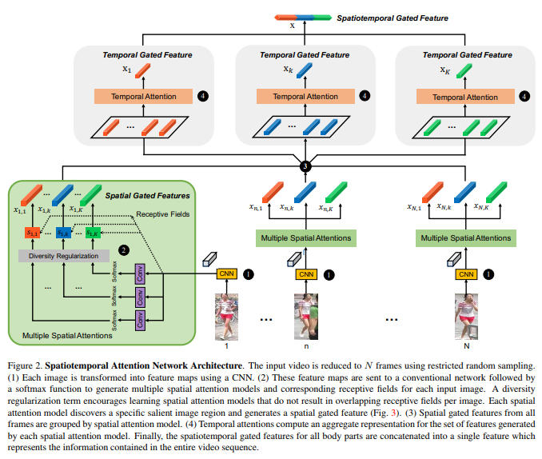
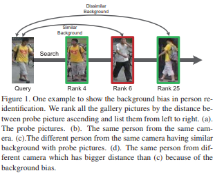

# DailyReadPaper
These Re-ID related papers are collected from CVPR 2018.

## Group Consistent Similarity Learning via Deep CRFs for Person Re-Identification 
1. CVPR 2018 oral
2. Dapeng Chen, CUHK; Dan Xu, ; Hongsheng Li, ; Nicu Sebe, University of Trento, Italy; Xiaogang Wang, Chinese University of Hong Kong
3. 190201(1)Chen_Group_Consistent_Similarity_CVPR_2018_paper.pdf

- Person re-identification benefits greatly from deep neural
networks (DNN) to learn accurate similarity metrics and
robust feature embeddings. However, most of the current
methods impose only local constraints for similarity learning.
In this paper, we incorporate constraints on large image
groups by combining the CRF with deep neural networks.

    
    
- The proposed method aims to learn the “local similarity”
metrics for image pairs while taking into account
the dependencies from all the images in a group, forming
“group similarities”. 

    

- Our method involves multiple images
to model the relationships among the local and global similarities
in a unified CRF during training, while combines
multi-scale local similarities as the predicted similarity in
testing. We adopt an approximate inference scheme for estimating
the group similarity, enabling end-to-end training.

    
    
Extensive experiments demonstrate the effectiveness of our
model that combines DNN and CRF for learning robust
multi-scale local similarities. The overall results outperform
those by state-of-the-arts with considerable margins
on three widely-used benchmarks.

>@inproceedings{chen2018group,
  title={Group Consistent Similarity Learning via Deep CRF for Person Re-Identification},
  author={Chen, Dapeng and Xu, Dan and Li, Hongsheng and Sebe, Nicu and Wang, Xiaogang},
  booktitle={Proceedings of the IEEE Conference on Computer Vision and Pattern Recognition},
  pages={8649--8658},
  year={2018}
}

## Person Transfer GAN to Bridge Domain Gap for Person Re-Identification
1. CVPR 2018 Spotlight
2. Wei, Longhui and Zhang, Shiliang and Gao, Wen and Tian, Qi
3. 190201(2)Wei_Person_Transfer_GAN_CVPR_2018_paper.pdf

- Although the performance of person Re-Identification
(ReID) has been significantly boosted, many challenging issues
in real scenarios have not been fully investigated, e.g.,
the complex scenes and lighting variations, viewpoint and
pose changes, and the large number of identities in a camera
network. 

    
    
- To facilitate the research towards conquering
those issues, this paper contributes a new dataset called
MSMT171 with many important features, e.g., 1) the raw
videos are taken by an 15-camera network deployed in both
indoor and outdoor scenes, 2) the videos cover a long period
of time and present complex lighting variations, and 3)
it contains currently the largest number of annotated identities,
i.e., 4,101 identities and 126,441 bounding boxes.
We also observe that, domain gap commonly exists between
datasets, which essentially causes severe performance drop
when training and testing on different datasets. This results
in that available training data cannot be effectively
leveraged for new testing domains. To relieve the expensive
costs of annotating new training samples, we propose a Person
Transfer Generative Adversarial Network (PTGAN) to
bridge the domain gap. Comprehensive experiments show
that the domain gap could be substantially narrowed-down
by the PTGAN.

>@@inproceedings{wei2018person,
  title={Person transfer gan to bridge domain gap for person re-identification},
  author={Wei, Longhui and Zhang, Shiliang and Gao, Wen and Tian, Qi},
  booktitle={Proceedings of the IEEE Conference on Computer Vision and Pattern Recognition},
  pages={79--88},
  year={2018}
}

## Disentangled person image generation
1. CVPR 2018 Spotlight
2. Ma, Liqian and Sun, Qianru and Georgoulis, Stamatios and Van Gool, Luc and Schiele, Bernt and Fritz, Mario
3. 190201(3)Ma_Disentangled_Person_Image_CVPR_2018_paper.pdf
- Generating novel, yet realistic, images of persons is a
challenging task due to the complex interplay between the
different image factors, such as the foreground, background
and pose information. 

    
    
- In this work, we aim at generating
such images based on a novel, two-stage reconstruction
pipeline that learns a disentangled representation of
the aforementioned image factors and generates novel person
images at the same time. First, a multi-branched reconstruction
network is proposed to disentangle and encode the
three factors into embedding features, which are then combined
to re-compose the input image itself. Second, three
corresponding mapping functions are learned in an adversarial
manner in order to map Gaussian noise to the learned
embedding feature space, for each factor, respectively. 

    
    
- Using the proposed framework, we can manipulate the foreground,
background and pose of the input image, and also
sample new embedding features to generate such targeted
manipulations, that provide more control over the generation
process. Experiments on the Market-1501 and Deepfashion
datasets show that our model does not only generate
realistic person images with new foregrounds, backgrounds
and poses, but also manipulates the generated factors and
interpolates the in-between states. Another set of experiments
on Market-1501 shows that our model can also be
beneficial for the person re-identification task1.

>@inproceedings{ma2018disentangled,
  title={Disentangled person image generation},
  author={Ma, Liqian and Sun, Qianru and Georgoulis, Stamatios and Van Gool, Luc and Schiele, Bernt and Fritz, Mario},
  booktitle={Proceedings of the IEEE Conference on Computer Vision and Pattern Recognition},
  pages={99--108},
  year={2018}
}

## Unsupervised Person Image Synthesis in Arbitrary Poses
1. CVPR 2018 Spotlight
2. Pumarola, Albert and Agudo, Antonio and Sanfeliu, Alberto and Moreno-Noguer, Francesc
3. 190201(4)Pumarola_Unsupervised_Person_Image_CVPR_2018_paperpdf

- We present a novel approach for synthesizing photorealistic
images of people in arbitrary poses using generative
adversarial learning. Given an input image of a person
and a desired pose represented by a 2D skeleton, our
model renders the image of the same person under the new
pose, synthesizing novel views of the parts visible in the input
image and hallucinating those that are not seen. 

    
    
- This problem has recently been addressed in a supervised manner
[16, 35], i.e., during training the ground truth images
under the new poses are given to the network. We go beyond
these approaches by proposing a fully unsupervised
strategy. We tackle this challenging scenario by splitting
the problem into two principal subtasks. 

    
    
- First, we consider
a pose conditioned bidirectional generator that maps back
the initially rendered image to the original pose, hence being
directly comparable to the input image without the need
to resort to any training image. 

    
    
- Second, we devise a novel
loss function that incorporates content and style terms, and
aims at producing images of high perceptual quality. Extensive
experiments conducted on the DeepFashion dataset
demonstrate that the images rendered by our model are very
close in appearance to those obtained by fully supervised
approaches.

>@inproceedings{pumarola2018unsupervised,
  title={Unsupervised Person Image Synthesis in Arbitrary Poses},
  author={Pumarola, Albert and Agudo, Antonio and Sanfeliu, Alberto and Moreno-Noguer, Francesc},
  booktitle={Proceedings of the IEEE Conference on Computer Vision and Pattern Recognition},
  pages={8620--8628},
  year={2018}
}
## Good Appearance Features for Multi-Target Multi-Camera Tracking
1. CVPR 2018 Spotlight
2. Ergys Ristani, Duke University; Carlo Tomasi, Duke University
3. 190201(5)Good Appearance Features for Multi-Target Multi-Camera Tracking.pdf

- Multi-Target Multi-Camera Tracking (MTMCT) tracks
many people through video taken from several cameras.
Person Re-Identification (Re-ID) retrieves from a gallery
images of people similar to a person query image. We
learn good features for both MTMCT and Re-ID with a convolutional
neural network. 

    
    
- Our contributions include an
adaptive weighted triplet loss for training and a new technique
for hard-identity mining. Our method outperforms
the state of the art both on the DukeMTMC benchmarks for
tracking, and on the Market-1501 and DukeMTMC-ReID
benchmarks for Re-ID. We examine the correlation between
good Re-ID and good MTMCT scores, and perform ablation
studies to elucidate the contributions of the main components
of our system. Code is available1
.

>@article{ristani2018features,
  title={Features for Multi-Target Multi-Camera Tracking and Re-Identification},
  author={Ristani, Ergys and Tomasi, Carlo},
  journal={arXiv preprint arXiv:1803.10859},
  year={2018}
}

## Diversity Regularized Spatiotemporal Attention for Video-based Person Re-identification
1. CVPR 2018 Poster
2. Shuang Li, The Chinese University of HK; Slawomir Bak, Disney Research; Peter Carr, Disney Research
3. 190201(6)Li_Diversity_Regularized_Spatiotemporal_CVPR_2018_paper.pdf

- Video-based person re-identification matches video clips
of people across non-overlapping cameras. Most existing
methods tackle this problem by encoding each video frame
in its entirety and computing an aggregate representation
across all frames. 

    
    
- In practice, people are often partially
occluded, which can corrupt the extracted features. Instead,
we propose a new spatiotemporal attention model
that automatically discovers a diverse set of distinctive body
parts. 

    
    
- This allows useful information to be extracted from
all frames without succumbing to occlusions and misalignments.
The network learns multiple spatial attention models
and employs a diversity regularization term to ensure multiple
models do not discover the same body part. 

    
    
- Features extracted from local image regions are organized by spatial
attention model and are combined using temporal attention.
As a result, the network learns latent representations of the
face, torso and other body parts using the best available
image patches from the entire video sequence. Extensive
evaluations on three datasets show that our framework outperforms
the state-of-the-art approaches by large margins
on multiple metrics.

>@inproceedings{li2018diversity,
  title={Diversity Regularized Spatiotemporal Attention for Video-based Person Re-identification},
  author={Li, Shuang and Bak, Slawomir and Carr, Peter and Wang, Xiaogang},
  booktitle={Proceedings of the IEEE Conference on Computer Vision and Pattern Recognition},
  pages={369--378},
  year={2018}
}

## A Pose-Sensitive Embedding for Person Re-Identification with Expanded Cross Neighborhood Re-Ranking
1. CVPR 2018 Poster
2. M. Saquib Sarfraz, KIT; Arne Schumann, KIT; Andreas Eberle, KIT; Rainer Stiefelhagen, Karlsruhe Institute of Technology
3. 190201(7)Sarfraz_A_Pose-Sensitive_Embedding_CVPR_2018_paper.pdf

- Person re-identification is a challenging retrieval task
that requires matching a person’s acquired image across
non-overlapping camera views. In this paper we propose
an effective approach that incorporates both the fine and
coarse pose information of the person to learn a discriminative
embedding. 

    
    
- In contrast to the recent direction of
explicitly modeling body parts or correcting for misalignment
based on these, we show that a rather straightforward
inclusion of acquired camera view and/or the detected joint
locations into a convolutional neural network helps to learn
a very effective representation. 

    
    
- To increase retrieval performance,
re-ranking techniques based on computed distances
have recently gained much attention. We propose a
new unsupervised and automatic re-ranking framework that
achieves state-of-the-art re-ranking performance. We show
that in contrast to the current state-of-the-art re-ranking
methods our approach does not require to compute new
rank lists for each image pair (e.g., based on reciprocal
neighbors) and performs well by using simple direct rank
list based comparison or even by just using the already computed
euclidean distances between the images. We show
that both our learned representation and our re-ranking
method achieve state-of-the-art performance on a number
of challenging surveillance image and video datasets. Code
is available at https://github.com/pse-ecn.

>@inproceedings{saquib2018pose,
  title={A pose-sensitive embedding for person re-identification with expanded cross neighborhood re-ranking},
  author={Saquib Sarfraz, M and Schumann, Arne and Eberle, Andreas and Stiefelhagen, Rainer},
  booktitle={Proceedings of the IEEE Conference on Computer Vision and Pattern Recognition},
  pages={420--429},
  year={2018}
}

## Image-Image Domain Adaptation with Preserved Self-Similarity and Domain-Dissimilarity for Person Re-identification
1. CVPR 2018 Poster
2. Weijian Deng, University of Chinese Academy; Liang Zheng, University of Texas at San Ant; GUOLIANG KANG, UTS; Yi Yang, ; Qixiang Ye, ; Jianbin Jiao
3. 190201(8)Deng_Image-Image_Domain_Adaptation_CVPR_2018_paper.pdf

- Person re-identification (re-ID) models trained on one
domain often fail to generalize well to another. In our attempt,
we present a “learning via translation” framework.
In the baseline, we translate the labeled images from source
to target domain in an unsupervised manner. We then
train re-ID models with the translated images by supervised
methods. 

    
    
- Yet, being an essential part of this framework, unsupervised
image-image translation suffers from the information
loss of source-domain labels during translation.
Our motivation is two-fold. First, for each image, the
discriminative cues contained in its ID label should be
maintained after translation. Second, given the fact that two
domains have entirely different persons, a translated image
should be dissimilar to any of the target IDs. 

    
    
- To this end, we propose to preserve two types of unsupervised similarities,
1) self-similarity of an image before and after translation,
and 2) domain-dissimilarity of a translated source image
and a target image. Both constraints are implemented
in the similarity preserving generative adversarial network
(SPGAN) which consists of an Siamese network and a CycleGAN.
Through domain adaptation experiment, we show
that images generated by SPGAN are more suitable for domain
adaptation and yield consistent and competitive re-ID
accuracy on two large-scale datasets.

>@inproceedings{deng2018image,
  title={Image-image domain adaptation with preserved self-similarity and domain-dissimilarity for person reidentification},
  author={Deng, Weijian and Zheng, Liang and Ye, Qixiang and Kang, Guoliang and Yang, Yi and Jiao, Jianbin},
  booktitle={Proceedings of the IEEE Conference on Computer Vision and Pattern Recognition (CVPR)},
  volume={1},
  number={2},
  pages={6},
  year={2018}
}

## Human Semantic Parsing for Person Re-identification
1. CVPR 2018 Poster
2. Mahdi Kalayeh, UCF; Emrah Basaran, ; Mubarak Shah, UCF
3. 190201(9)Kalayeh_Human_Semantic_Parsing_CVPR_2018_paper.pdf

- Person re-identification is a challenging task mainly due
to factors such as background clutter, pose, illumination
and camera point of view variations. These elements hinder
the process of extracting robust and discriminative representations,
hence preventing different identities from being
successfully distinguished. 

    
    
- To improve the representation
learning, usually local features from human body parts
are extracted. However, the common practice for such a
process has been based on bounding box part detection.
In this paper, we propose to adopt human semantic parsing
which, due to its pixel-level accuracy and capability
of modeling arbitrary contours, is naturally a better alternative.
Our proposed SPReID integrates human semantic
parsing in person re-identification and not only considerably
outperforms its counter baseline, but achieves stateof-the-art
performance. We also show that, by employing
a simple yet effective training strategy, standard popular
deep convolutional architectures such as Inception-V3 and
ResNet-152, with no modification, while operating solely
on full image, can dramatically outperform current stateof-the-art.
Our proposed methods improve state-of-the-art
person re-identification on: Market-1501 [48] by ∼17% in
mAP and ∼6% in rank-1, CUHK03 [24] by ∼4% in rank-1
and DukeMTMC-reID [50] by ∼24% in mAP and ∼10% in
rank-1.
>@inproceedings{kalayeh2018human,
  title={Human Semantic Parsing for Person Re-identification},
  author={Kalayeh, Mahdi M and Basaran, Emrah and G{\"o}kmen, Muhittin and Kamasak, Mustafa E and Shah, Mubarak},
  booktitle={Proceedings of the IEEE Conference on Computer Vision and Pattern Recognition},
  pages={1062--1071},
  year={2018}
}

## Video Person Re-identification with Competitive Snippet-similarity Aggregation and Co-attentive Snippet Embedding
1. CVPR 2018 Poster
2. Dapeng Chen, CUHK; Hongsheng Li, ; Tong Xiao, The Chinese University of HK; Shuai Yi, The Chinese University of Hong Kong; Xiaogang Wang, Chinese University of Hong Kong
3. 190201(10)Chen_Video_Person_Re-Identification_CVPR_2018_paper.pdf

- In this paper, we address video-based person reidentification
with competitive snippet-similarity aggregation
and co-attentive snippet embedding. Our approach
divides long person sequences into multiple short video
snippets and aggregates the top-ranked snippet similarities
for sequence-similarity estimation. 

    
    
- With this strategy,
the intra-person visual variation of each sample could be
minimized for similarity estimation, while the diverse appearance
and temporal information are maintained. The
snippet similarities are estimated by a deep neural network
with a novel temporal co-attention for snippet embedding.
The attention weights are obtained based on a query feature,
which is learned from the whole probe snippet by an
LSTM network, making the resulting embeddings less affected
by noisy frames. 

    
    
- The gallery snippet shares the same
query feature with the probe snippet. Thus the embedding of
gallery snippet can present more relevant features to compare
with the probe snippet, yielding more accurate snippet
similarity. Extensive ablation studies verify the effectiveness
of competitive snippet-similarity aggregation as well
as the temporal co-attentive embedding. Our method significantly
outperforms the current state-of-the-art approaches
on multiple datasets.

>@inproceedings{kalayeh2018human,
  title={Human Semantic Parsing for Person Re-identification},
  author={Kalayeh, Mahdi M and Basaran, Emrah and G{\"o}kmen, Muhittin and Kamasak, Mustafa E and Shah, Mubarak},
  booktitle={Proceedings of the IEEE Conference on Computer Vision and Pattern Recognition},
  pages={1062--1071},
  year={2018}
}

## Mask-guided Contrastive Attention Model for Person Re-Identification
1. CVPR 2018 Poster
2. Chunfeng Song, CASIA; Yan Huang, ; Wanli Ouyang, ; Liang Wang, unknown
3. 190201(11)Song_Mask-Guided_Contrastive_Attention_CVPR_2018_paper.pdf

- Person Re-identification (ReID) is an important yet challenging
task in computer vision. Due to the diverse background
clutters, variations on viewpoints and body poses, it
is far from solved. How to extract discriminative and robust
features invariant to background clutters is the core problem.
In this paper, we first introduce the binary segmentation
masks to construct synthetic RGB-Mask pairs as inputs,
then we design a mask-guided contrastive attention model
(MGCAM) to learn features separately from the body and
background regions. 

    
    
- Moreover, we propose a novel regionlevel
triplet loss to restrain the features learnt from different
regions, i.e., pulling the features from the full image and
body region close, whereas pushing the features from backgrounds
away. 

    
    
- We may be the first one to successfully introduce
the binary mask into person ReID task and the first
one to propose region-level contrastive learning. We evaluate
the proposed method on three public datasets, including
MARS, Market-1501 and CUHK03. Extensive experimental
results show that the proposed method is effective and
achieves the state-of-the-art results. Mask and code will be
released upon request.

>@inproceedings{song2018mask,
  title={Mask-Guided Contrastive Attention Model for Person Re-Identification},
  author={Song, Chunfeng and Huang, Yan and Ouyang, Wanli and Wang, Liang},
  booktitle={Proceedings of the IEEE Conference on Computer Vision and Pattern Recognition},
  pages={1179--1188},
  year={2018}
}

## Person Re-identification with Cascaded Pairwise Convolutions
1. CVPR 2018 Poster
2. Yicheng Wang, ; Zhenzhong Chen, Wuhan University; Feng Wu, ; Gang Wang
3. 190201(12)Person Re-identification with Cascaded Pairwise Convolutions.pdf
- In this paper, a novel deep architecture named BraidNet
is proposed for person re-identification. BraidNet has a
specially designed WConv layer, and the cascaded WConv
structure learns to extract the comparison features of two
images, which are robust to misalignments and color differences
across cameras. 

    
    
- Furthermore, a Channel Scaling
layer is designed to optimize the scaling factor of each input
channel, which helps mitigate the zero gradient problem
in the training phase. 

    
    
- To solve the problem of imbalanced
volume of negative and positive training samples,
a Sample Rate Learning strategy is proposed to adaptively
update the ratio between positive and negative samples
in each batch. Experiments conducted on CUHK03-
Detected, CUHK03-Labeled, CUHK01, Market-1501 and
DukeMTMC-reID datasets demonstrate that our method
achieves competitive performance when compared to stateof-the-art
methods.
>@inproceedings{wang2018person,
  title={Person Re-identification with Cascaded Pairwise Convolutions},
  author={Wang, Yicheng and Chen, Zhenzhong and Wu, Feng and Wang, Gang},
  booktitle={Proceedings of the IEEE Conference on Computer Vision and Pattern Recognition},
  pages={1470--1478},
  year={2018}
}

## Multi-Level Factorisation Net for Person Re-Identification
1. CVPR 2018 Poster
2. Xiaobin Chang, Queen Mary Univ. of London; Timothy Hospedales, University of Edinburgh; Tao Xiang, Queen Mary University of London

- Key to effective person re-identification (Re-ID) is modelling
discriminative and view-invariant factors of person
appearance at both high and low semantic levels. Recently
developed deep Re-ID models either learn a holistic single
semantic level feature representation and/or require laborious
human annotation of these factors as attributes. We
propose Multi-Level Factorisation Net (MLFN), a novel network
architecture that factorises the visual appearance of a
person into latent discriminative factors at multiple semantic
levels without manual annotation. 

    

- MLFN is composed
of multiple stacked blocks. Each block contains multiple
factor modules to model latent factors at a specific level,
and factor selection modules that dynamically select the
factor modules to interpret the content of each input image.
The outputs of the factor selection modules also provide
a compact latent factor descriptor that is complementary
to the conventional deeply learned features. MLFN
achieves state-of-the-art results on three Re-ID datasets, as
well as compelling results on the general object categorisation
CIFAR-100 dataset.

>@inproceedings{chang2018multi,
  title={Multi-level factorisation net for person re-identification},
  author={Chang, Xiaobin and Hospedales, Timothy M and Xiang, Tao},
  booktitle={CVPR},
  volume={1},
  pages={2},
  year={2018}
}

## Attention-Aware Compositional Network for Person Re-identification
1. CVPR 2018 Poster
2. Xu, Jing and Zhao, Rui and Zhu, Feng and Wang, Huaming and Ouyang, Wanli
3. 190201(14)Xu_Attention-Aware_Compositional_Network_CVPR_2018_paper.pdf

- Person re-identification (ReID) is to identify pedestrians
observed from different camera views based on visual appearance.
It is a challenging task due to large pose variations,
complex background clutters and severe occlusions.
Recently, human pose estimation by predicting joint locations
was largely improved in accuracy. It is reasonable to
use pose estimation results for handling pose variations and
background clutters, and such attempts have obtained great
improvement in ReID performance. However, we argue that
the pose information was not well utilized and hasn’t yet
been fully exploited for person ReID.

    

- In this work, we introduce a novel framework called
Attention-Aware Compositional Network (AACN) for person
ReID. AACN consists of two main components: Poseguided
Part Attention (PPA) and Attention-aware Feature
Composition (AFC). PPA is learned and applied to mask
out undesirable background features in pedestrian feature
maps. Furthermore, pose-guided visibility scores are estimated
for body parts to deal with part occlusion in the proposed
AFC module. Extensive experiments with ablation
analysis show the effectiveness of our method, and stateof-the-art
results are achieved on several public datasets,
including Market-1501, CUHK03, CUHK01, SenseReID,
CUHK03-NP and DukeMTMC-reID
  
  
>@article{xu2018attention,
  title={Attention-Aware Compositional Network for Person Re-identification},
  author={Xu, Jing and Zhao, Rui and Zhu, Feng and Wang, Huaming and Ouyang, Wanli},
  journal={arXiv preprint arXiv:1805.03344},
  year={2018}
}

## Deep Group-shuffling Random Walk for Person Re-identification
1. CVPR 2018 Poster
2. Yantao Shen, CUHK; Hongsheng Li, ; Tong Xiao, The Chinese University of HK; Shuai Yi, The Chinese University of Hong Kong; Dapeng Chen, CUHK; Xiaogang Wang, Chinese University of Hong Kong
3. 190201(15)Shen_Deep_Group-Shuffling_Random_CVPR_2018_paper.pdf

- Person re-identification aims at finding a person of interest
in an image gallery by comparing the probe image of this
person with all the gallery images. 

    

- It is generally treated as
a retrieval problem, where the affinities between the probe
image and gallery images (P2G affinities) are used to rank
the retrieved gallery images. However, most existing methods
only consider P2G affinities but ignore the affinities between
all the gallery images (G2G affinity). 

    

- Some frameworks
incorporated G2G affinities into the testing process,
which is not end-to-end trainable for deep neural networks.
In this paper, we propose a novel group-shuffling random
walk network for fully utilizing the affinity information between
gallery images in both the training and testing processes.

    

- The proposed approach aims at end-to-end refining
the P2G affinities based on G2G affinity information
with a simple yet effective matrix operation, which can be
integrated into deep neural networks. Feature grouping
and group shuffle are also proposed to apply rich supervisions
for learning better person features. The proposed approach
outperforms state-of-the-art methods on the Market1501,
CUHK03, and DukeMTMC datasets by large margins,
which demonstrate the effectiveness of our approach.

>@inproceedings{shen2018deep,
  title={Deep Group-Shuffling Random Walk for Person Re-Identification},
  author={Shen, Yantao and Li, Hongsheng and Xiao, Tong and Yi, Shuai and Chen, Dapeng and Wang, Xiaogang},
  booktitle={Proceedings of the IEEE Conference on Computer Vision and Pattern Recognition},
  pages={2265--2274},
  year={2018}
}

## Transferable Joint Attribute-Identity Deep Learning for Unsupervised Person Re-Identification
1. CVPR 2018 Poster
2. Jingya Wang, QMUL; Xiatian Zhu, Vision Semantics Ltd.; Shaogang Gong, Queen Mary University; Wei Li, Queen Mary University of Lond
3. 190201(16)Wang_Transferable_Joint_Attribute-Identity_CVPR_2018_paper.pdf

- Most existing person re-identification (re-id) methods require
supervised model learning from a separate large set
of pairwise labelled training data for every single camera
pair. 

    

- This significantly limits their scalability and usability
in real-world large scale deployments with the need for
performing re-id across many camera views. To address
this scalability problem, we develop a novel deep learning
method for transferring the labelled information of an
existing dataset to a new unseen (unlabelled) target domain
for person re-id without any supervised learning in
the target domain. 

    

- Specifically, we introduce an Transferable
Joint Attribute-Identity Deep Learning (TJ-AIDL) for
simultaneously learning an attribute-semantic and identitydiscriminative
feature representation space transferrable to
any new (unseen) target domain for re-id tasks without the
need for collecting new labelled training data from the target
domain (i.e. unsupervised learning in the target domain).
Extensive comparative evaluations validate the superiority
of this new TJ-AIDL model for unsupervised person
re-id over a wide range of state-of-the-art methods
on four challenging benchmarks including VIPeR, PRID,
Market-1501, and DukeMTMC-ReID

>@article{wang2018transferable,
  title={Transferable Joint Attribute-Identity Deep Learning for Unsupervised Person Re-Identification},
  author={Wang, Jingya and Zhu, Xiatian and Gong, Shaogang and Li, Wei},
  journal={arXiv preprint arXiv:1803.09786},
  year={2018}
}

## Harmonious Attention Network for Person Re-Identification
1. CVPR 2018 Poster
2. Wei Li, Queen Mary University of Lond; Xiatian Zhu, Vision Semantics Ltd.; Shaogang Gong, Queen Mary University
3. 190201(17)Li_Harmonious_Attention_Network_CVPR_2018_paper.pdf

- Existing person re-identification (re-id) methods either
assume the availability of well-aligned person bounding
box images as model input or rely on constrained attention
selection mechanisms to calibrate misaligned images.
They are therefore sub-optimal for re-id matching in arbitrarily
aligned person images potentially with large human
pose variations and unconstrained auto-detection errors. In
this work, we show the advantages of jointly learning attention
selection and feature representation in a Convolutional
Neural Network (CNN) by maximising the complementary
information of different levels of visual attention subject to
re-id discriminative learning constraints. 

    

- Specifically, we
formulate a novel Harmonious Attention CNN (HA-CNN)
model for joint learning of soft pixel attention and hard
regional attention along with simultaneous optimisation of
feature representations, dedicated to optimise person re-id
in uncontrolled (misaligned) images. 

    

- Extensive comparative
evaluations validate the superiority of this new HACNN
model for person re-id over a wide variety of state-ofthe-art
methods on three large-scale benchmarks including
CUHK03, Market-1501, and DukeMTMC-ReID.

>@inproceedings{li2018harmonious,
  title={Harmonious attention network for person re-identification},
  author={Li, Wei and Zhu, Xiatian and Gong, Shaogang},
  booktitle={CVPR},
  volume={1},
  pages={2},
  year={2018}
}

## Efficient and Deep Person Re-Identification using Multi-Level Similarity
1. CVPR 2018 Poster
2. Yiluan Guo, SUTD; Ngai-Man Cheung
3. 190201(18)Efficient and Deep Person Re-Identification using Multi-Level Similarity.pdf

- Person Re-Identification (ReID) requires comparing two
images of person captured under different conditions. Existing
work based on neural networks often computes the similarity
of feature maps from one single convolutional layer.
In this work, we propose an efficient, end-to-end fully convolutional
Siamese network that computes the similarities
at multiple levels. 

    

- We demonstrate that multi-level similarity
can improve the accuracy considerably using lowcomplexity
network structures in ReID problem. Specifically,
first, we use several convolutional layers to extract the
features of two input images. Then, we propose Convolution
Similarity Network to compute the similarity score maps for
the inputs. 

    

- We use spatial transformer networks (STNs) to
determine spatial attention. We propose to apply efficient
depth-wise convolution to compute the similarity. The proposed
Convolution Similarity Networks can be inserted into
different convolutional layers to extract visual similarities
at different levels. Furthermore, we use an improved ranking
loss to further improve the performance. Our work is the
first to propose to compute visual similarities at low, middle
and high levels for ReID. With extensive experiments and
analysis, we demonstrate that our system, compact yet effective,
can achieve competitive results with much smaller
model size and computational complexity.

>@article{guo2018efficient,
  title={Efficient and Deep Person Re-Identification using Multi-Level Similarity},
  author={Guo, Yiluan and Cheung, Ngai-Man},
  journal={arXiv preprint arXiv:1803.11353},
  year={2018}
}
## Pose Transferrable Person Re-Identification
1. CVPR 2018 Poster
2. Jinxian Liu, Shanghai Jiao Tong University; Yichao Yan, Shanghai Jiao Tong University; Bingbing Ni, ; Peng Zhou, Sjtu; Shuo Cheng, SJTU; jianguo Hu, Minivision
3. 190201(19)Pose Transferrable Person Re-Identification.pdf

- Person re-identification (ReID) is an important task in
the field of intelligent security. A key challenge is how
to capture human pose variations, while existing benchmarks
(i.e., Market1501, DukeMTMC-reID, CUHK03, etc.)
do NOT provide sufficient pose coverage to train a robust
ReID system. To address this issue, we propose a posetransferrable
person ReID framework which utilizes posetransferred
sample augmentations (i.e., with ID supervision)
to enhance ReID model training. 

    

- On one hand, novel
training samples with rich pose variations are generated via
transferring pose instances from MARS dataset, and they
are added into the target dataset to facilitate robust training.
On the other hand, in addition to the conventional discriminator
of GAN (i.e., to distinguish between REAL/FAKE
samples), we propose a novel guider sub-network which encourages
the generated sample (i.e., with novel pose) towards
better satisfying the ReID loss (i.e., cross-entropy
ReID loss, triplet ReID loss). 

    

- In the meantime, an alternative
optimization procedure is proposed to train the
proposed Generator-Guider-Discriminator network. Experimental
results on Market-1501, DukeMTMC-reID and
CUHK03 show that our method achieves great performance
improvement, and outperforms most state-of-the-art methods
without elaborate designing the ReID model.

>@inproceedings{liu2018pose,
  title={Pose Transferrable Person Re-Identification},
  author={Liu, Jinxian and Ni, Bingbing and Yan, Yichao and Zhou, Peng and Cheng, Shuo and Hu, Jianguo},
  booktitle={Proceedings of the IEEE Conference on Computer Vision and Pattern Recognition},
  pages={4099--4108},
  year={2018}
}

## Adversarially Occluded Samples for Person Re-identification
1. CVPR 2018 Poster
2. Houjing Huang, CASIA; Dangwei Li, ; Zhang Zhang, ; Xiaotang Chen, ; Kaiqi Huang
3. 190201(20)Huang_Adversarially_Occluded_Samples_CVPR_2018_paper.pdf

- Person re-identification (ReID) is the task of retrieving
particular persons across different cameras. Despite its
great progress in recent years, it is still confronted with
challenges like pose variation, occlusion, and similar appearance
among different persons. 

    

- The large gap between
training and testing performance with existing models implies
the insufficiency of generalization. Considering this
fact, we propose to augment the variation of training data
by introducing Adversarially Occluded Samples. 

    

- These special
samples are both a) meaningful in that they resemble
real-scene occlusions, and b) effective in that they are
tough for the original model and thus provide the momentum
to jump out of local optimum. 

    

- We mine these samples
based on a trained ReID model and with the help of network
visualization techniques. Extensive experiments show
that the proposed samples help the model discover new discriminative
clues on the body and generalize much better at
test time. Our strategy makes significant improvement over
strong baselines on three large-scale ReID datasets, Market1501,
CUHK03 and DukeMTMC-reID.

>@inproceedings{huang2018adversarially,
  title={Adversarially Occluded Samples for Person Re-Identification},
  author={Huang, Houjing and Li, Dangwei and Zhang, Zhang and Chen, Xiaotang and Huang, Kaiqi},
  booktitle={Proceedings of the IEEE Conference on Computer Vision and Pattern Recognition},
  pages={5098--5107},
  year={2018}
}

## Camera Style Adaptation for Person Re-identification
1. CVPR 2018 Poster
2. Zhun Zhong, Xiamen University; Liang Zheng, SUTD; Zhedong Zheng, UTS; Shaozi Li, ; Yi Yang, University of Technology, Sydney
3. 190201(21)Zhong_Camera_Style_Adaptation_CVPR_2018_paper.pdf

- Being a cross-camera retrieval task, person reidentification
suffers from image style variations caused by
different cameras. 

    

- The art implicitly addresses this problem
by learning a camera-invariant descriptor subspace.
In this paper, we explicitly consider this challenge by introducing
camera style (CamStyle) adaptation. CamStyle
can serve as a data augmentation approach that smooths
the camera style disparities. 

    

- Specifically, with CycleGAN,
labeled training images can be style-transferred to each
camera, and, along with the original training samples,
form the augmented training set. This method, while increasing
data diversity against over-fitting, also incurs a
considerable level of noise. 

    

- In the effort to alleviate the
impact of noise, the label smooth regularization (LSR) is
adopted. The vanilla version of our method (without LSR)
performs reasonably well on few-camera systems in which
over-fitting often occurs. With LSR, we demonstrate consistent
improvement in all systems regardless of the extent
of over-fitting. We also report competitive accuracy
compared with the state of the art. Code is available at:
https://github.com/zhunzhong07/CamStyle
>@inproceedings{zhong2018camera,
  title={Camera style adaptation for person re-identification},
  author={Zhong, Zhun and Zheng, Liang and Zheng, Zhedong and Li, Shaozi and Yang, Yi},
  booktitle={Proceedings of the IEEE Conference on Computer Vision and Pattern Recognition},
  pages={5157--5166},
  year={2018}
}

## Exploit the Unknown Gradually:~ One-Shot Video-Based Person Re-Identification by Stepwise Learning
1. CVPR 2018 Poster
2. Yu Wu, University of technology sydne; Yutian Lin, ; Xuanyi Dong, UTS; Yan Yan, UTS; Wanli Ouyang, The University of Sydney; Yi Yang
3. 190201(22)One-Shot Video-Based Person Re-Identification by Stepwise Learning.pdf

- We focus on the one-shot learning for video-based
person re-Identification (re-ID). Unlabeled tracklets for
the person re-ID tasks can be easily obtained by preprocessing,
such as pedestrian detection and tracking. In
this paper, we propose an approach to exploiting unlabeled
tracklets by gradually but steadily improving the discriminative
capability of the Convolutional Neural Network
(CNN) feature representation via stepwise learning. We first
initialize a CNN model using one labeled tracklet for each
identity. 

    

- Then we update the CNN model by the following
two steps iteratively: 1. sample a few candidates with most
reliable pseudo labels from unlabeled tracklets; 2. update
the CNN model according to the selected data. Instead
of the static sampling strategy applied in existing works,
we propose a progressive sampling method to increase the
number of the selected pseudo-labeled candidates step by
step. 

    

- We systematically investigate the way how we should
select pseudo-labeled tracklets into the training set to make
the best use of them. Notably, the rank-1 accuracy of our
method outperforms the state-of-the-art method by 21.46
points (absolute, i.e., 62.67% vs. 41.21%) on the MARS
dataset, and 16.53 points on the DukeMTMC-VideoReID
dataset1.

>@inproceedings{wu2018exploit,
  title={Exploit the unknown gradually: One-shot video-based person re-identification by stepwise learning},
  author={Wu, Yu and Lin, Yutian and Dong, Xuanyi and Yan, Yan and Ouyang, Wanli and Yang, Yi},
  booktitle={Proceedings of the IEEE Conference on Computer Vision and Pattern Recognition},
  pages={5177--5186},
  year={2018}
}

## Dual Attention Matching Network for Context-Aware Feature Sequence based Person Re-Identification
1. CVPR 2018 Poster
2. Jianlou Si, BUPT; Honggang Zhang, ; Chun-Guang Li, Beijing Univ. of Posts&Telecom; Jason Kuen, NTU, Singapore; Xiangfei Kong, Nanyang Technological University; Alex Kot, ; Gang Wang
3. 190201(23)Dual Attention Matching Network for Context-Aware Feature Sequence based ReID.pdf

- Typical person re-identification (ReID) methods usually
describe each pedestrian with a single feature vector and
match them in a task-specific metric space. 

    

- However, the
methods based on a single feature vector are not sufficient
enough to overcome visual ambiguity, which frequently occurs
in real scenario. In this paper, we propose a novel endto-end
trainable framework, called Dual ATtention Matching
network (DuATM), to learn context-aware feature sequences
and perform attentive sequence comparison simultaneously.

    

- The core component of our DuATM framework
is a dual attention mechanism, in which both intrasequence
and inter-sequence attention strategies are used
for feature refinement and feature-pair alignment, respectively.
Thus, detailed visual cues contained in the intermediate
feature sequences can be automatically exploited and
properly compared. 

    

- We train the proposed DuATM network
as a siamese network via a triplet loss assisted with a decorrelation
loss and a cross-entropy loss. We conduct extensive
experiments on both image and video based ReID
benchmark datasets. Experimental results demonstrate the
significant advantages of our approach compared to the
state-of-the-art methods.

>@article{si2018dual,
  title={Dual attention matching network for context-aware feature sequence based person re-identification},
  author={Si, Jianlou and Zhang, Honggang and Li, Chun-Guang and Kuen, Jason and Kong, Xiangfei and Kot, Alex C and Wang, Gang},
  journal={arXiv preprint arXiv:1803.09937},
  year={2018}
}

## Easy Identification from Better Constraints: Multi-Shot Person Re-Identification from Reference Constraints
1. CVPR 2018 Poster
2. Jiahuan Zhou, Northwestern University; Bing Su, Chinese Academy of Sciences; Ying Wu, Northwestern University, USA
3. 190201(24)Easy Identification from Better Constraints- Multi-Shot Person Re-Identification from Reference Constraints.pdf

- Multi-shot person re-identification (MsP-RID) utilizes
multiple images from the same person to facilitate identification.
Considering the fact that motion information may
not be discriminative nor reliable enough for MsP-RID, this
paper is focused on handling the large variations in the
visual appearances through learning discriminative visual
metrics for identification. Existing metric learning-based
methods usually exploit pair-wise or triple-wise similarity
constraints, that generally demands intensive optimization
in metric learning, or leads to degraded performances
by using sub-optimal solutions. In addition, as the training
data are significantly imbalanced, the learning can be
largely dominated by the negative pairs and thus produces
unstable and non-discriminative results. In this paper, we
propose a novel type of similarity constraint. 

    

- It assigns
the sample points to a set of reference points to produce
a linear number of reference constraints. Several optimal
transport-based schemes for reference constraint generation
are proposed and studied. Based on those constraints,
by utilizing a typical regressive metric learning model, the
closed-form solution of the learned metric can be easily
obtained. Extensive experiments and comparative studies
on several public MsP-RID benchmarks have validated the
effectiveness of our method and its significant superiority
over the state-of-the-art MsP-RID methods in terms of both
identification accuracy and running speed.

>@inproceedings{zhou2018easy,
  title={Easy Identification From Better Constraints: Multi-Shot Person Re-Identification From Reference Constraints},
  author={Zhou, Jiahuan and Su, Bing and Wu, Ying},
  booktitle={Proceedings of the IEEE Conference on Computer Vision and Pattern Recognition},
  pages={5373--5381},
  year={2018}
}

## Eliminating Background-bias for Robust Person Re-identification
1. CVPR 2018 Poster
2. Maoqing Tian, Sensetime Limited; Shuai Yi, The Chinese University of Hong Kong; Hongsheng Li, ; Shihua Li, ; Xuesen Zhang, SenseTime; Jianping Shi, SenseTime; Junjie Yan, ; Xiaogang Wang, Chinese University of Hong Kong
3. 190201(25)Tian_Eliminating_Background-Bias_for_CVPR_2018_paper.pdf

- Person re-identification is an important topic in intelligent
surveillance and computer vision. It aims to accurately
measure visual similarities between person images for determining
whether two images correspond to the same person.

    

- State-of-the-art methods mainly utilize deep learning
based approaches for learning visual features for describing
person appearances. 

    
    
- However, we observe that existing
deep learning models are biased to capture too much
relevance between background appearances of person images.
We design a series of experiments with newly created
datasets to validate the influence of background information.

    

- To solve the background bias problem, we propose
a person-region guided pooling deep neural network
based on human parsing maps to learn more discriminative
person-part features, and propose to augment training data
with person images with random background. Extensive experiments
demonstrate the robustness and effectiveness of
our proposed method.

>@inproceedings{tian2018eliminating,
  title={Eliminating Background-Bias for Robust Person Re-Identification},
  author={Tian, Maoqing and Yi, Shuai and Li, Hongsheng and Li, Shihua and Zhang, Xuesen and Shi, Jianping and Yan, Junjie and Wang, Xiaogang},
  booktitle={Proceedings of the IEEE Conference on Computer Vision and Pattern Recognition},
  pages={5794--5803},
  year={2018}
}

## End-to-End Deep Kronecker-Product Matching for Person Re-identification
1. CVPR 2018 Poster
2. Yantao Shen, CUHK; Tong Xiao, The Chinese University of HK; Hongsheng Li, ; Shuai Yi, The Chinese University of Hong Kong; Xiaogang Wang, Chinese University of Hong Kong
3. 190201(26)Shen_End-to-End_Deep_Kronecker-Product_CVPR_2018_paper.pdf

- Person re-identification aims to robustly measure similarities
between person images. 

    

- The significant variation
of person poses and viewing angles challenges for accurate
person re-identification. 

    

- The spatial layout and correspondences
between query person images are vital information
for tackling this problem but are ignored by most
state-of-the-art methods. 

    

- In this paper, we propose a novel
Kronecker Product Matching module to match feature maps
of different persons in an end-to-end trainable deep neural
network. 

    

- A novel feature soft warping scheme is designed
for aligning the feature maps based on matching
results, which is shown to be crucial for achieving superior
accuracy. The multi-scale features based on hourglasslike
networks and self residual attention are also exploited
to further boost the re-identification performance. The
proposed approach outperforms state-of-the-art methods
on the Market-1501, CUHK03, and DukeMTMC datasets,
which demonstrates the effectiveness and generalization
ability of our proposed approach.

>@inproceedings{shen2018end,
  title={End-to-End Deep Kronecker-Product Matching for Person Re-Identification},
  author={Shen, Yantao and Xiao, Tong and Li, Hongsheng and Yi, Shuai and Wang, Xiaogang},
  booktitle={Proceedings of the IEEE Conference on Computer Vision and Pattern Recognition},
  pages={6886--6895},
  year={2018}
}