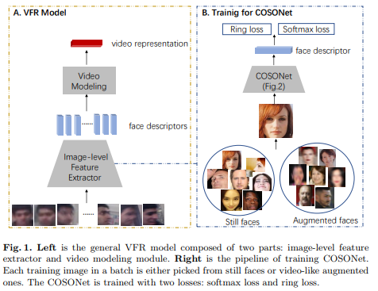
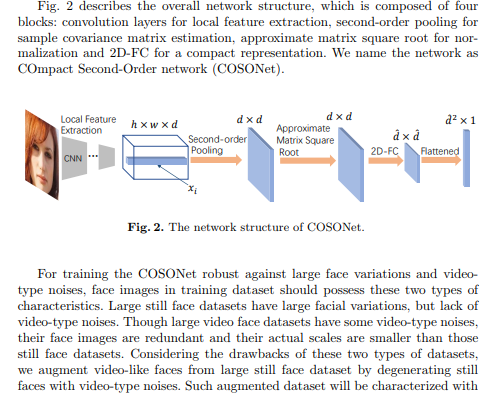
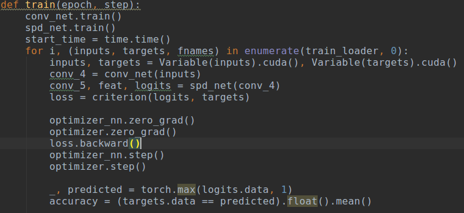
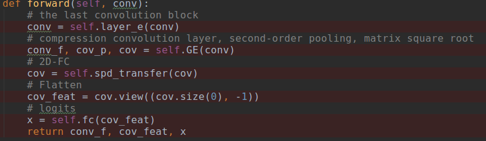

# DailyReadPaper
Code Analysation.

## COSONet: Compact Second-Order Network for Video Face Recognition
1. ACCV 2018 oral
2. Yirong Mao, **Ruiping Wang**,**Shiguang Shan**nd Xilin Chen
3. https://github.com/YirongMao/COSONet
4. http://vipl.ict.ac.cn/view_database.php?id=6

- Abstract. In this paper, we study the task of video face recognition.
The face images in the video typically cover large variations in expression,
lighting, or pose, and also suffer from video-type noises such as
motion blur, out-of-focus blur and low resolution. To tackle these two
types of challenges, we propose an extensive framework which contains
three aspects: neural network design, training data augmentation, and
loss function. 

    

- First, we devise an expressive COmpact Second-Order network
(COSONet) to extract features from faces with large variations. The
network manages to encode the correlation (e.g. sample covariance matrix)
of local features in a spatial invariant way, which is useful to model
the global texture and appearance of face images. To further handle the
curse of high-dimensional problem in the sample covariance matrix, we
apply a layer named 2D fully connected (2D-FC) layer with few parameters
to reduce the dimension. 

    

- Second, due to no video-type noises in still
face datasets and small inter-frame variation in video face datasets, we
augment a large dataset with both large face variations and video-type
noises from existing still face dataset. 

    

- Finally, to get a discriminative
face descriptor while balancing the effect of images with various quality,
a mixture loss function which encourages the discriminability and
simultaneously regularizes the feature is elaborately designed. 

    

- Detailed
experiments show that the proposed fram ework can achieve very competitive
accuracy over state-of-the-art approaches on IJB-A and PaSC
datasets.

>@article{maocosonet,
  title={COSONet: Compact Second-Order Network for Video Face Recognition},
  author={Mao, Yirong and Wang, Ruiping and Shan, Shiguang and Chen, Xilin},
  booktitle={ACCV 2018},
}