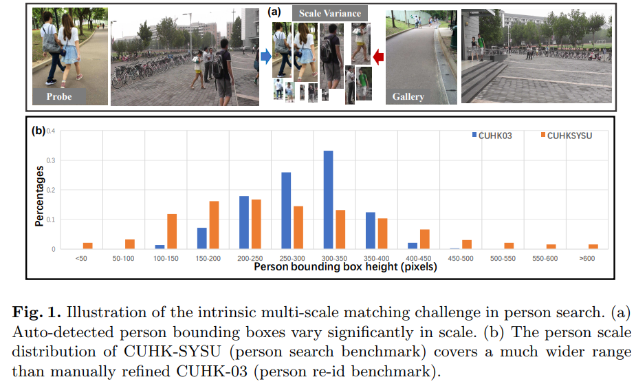

# DailyReadPaper
These Re-ID related papers are collected from ECCV 2018.

## Group Consistent Similarity Learning via Deep CRFs for Person Re-Identification 
1. ECCV 2018
2. M Feroz Ali, T and Chaudhuri, Subhasis
3. 190202(1)T_M_Feroz_Ali_Maximum_Margin_Metric_ECCV_2018_paper.pdf

- In this paper we propose a novel metric learning framework called
Nullspace Kernel Maximum Margin Metric Learning (NK3ML) which efficiently
addresses the small sample size (SSS) problem inherent in person re-identification
and offers a significant performance gain over existing state-of-the-art methods.
Taking advantage of the very high dimensionality of the feature space, the metric
is learned using a maximum margin criterion (MMC) over a discriminative
nullspace where all training sample points of a given class map onto a single
point, minimizing the within class scatter. 

    

- A kernel version of MMC is used to
obtain a better between class separation. Extensive experiments on four challenging
benchmark datasets for person re-identification demonstrate that the proposed
algorithm outperforms all existing methods. We obtain 99.8% rank-1 accuracy on
the most widely accepted and challenging dataset VIPeR, compared to the previous
state of the art being only 63.92%.

>@InProceedings{Ali_2018_ECCV,
author = {M Feroz Ali, T and Chaudhuri, Subhasis},
title = {Maximum Margin Metric Learning Over Discriminative Nullspace for Person Re-identification},
booktitle = {The European Conference on Computer Vision (ECCV)},
month = {September},
year = {2018}
}

## RCAA: Relational Context-Aware Agents for Person Search
1. ECCV 2018
2. Chang, Xiaojun and Huang, Po-Yao and Shen, Yi-Dong and Liang, Xiaodan and Yang, Yi and Hauptmann, Alexander G.
3. 190202(2)Xiaojun_Chang_RCAA_Relational_Context-Aware_ECCV_2018_paper.pdf

- We aim to search for a target person from a gallery of whole
scene images for which the annotations of pedestrian bounding boxes
are unavailable. Previous approaches to this problem have relied on a
pedestrian proposal net, which may generate redundant proposals and
increase the computational burden. In this paper, we address this problem
by training relational context-aware agents which learn the actions
to localize the target person from the gallery of whole scene images. We
incorporate the relational spatial and temporal contexts into the framework.

    

- Specifically, we propose to use the target person as the query in
the query-dependent relational network. The agent determines the best
action to take at each time step by simultaneously considering the local
visual information, the relational and temporal contexts, together
with the target person. To validate the performance of our approach, we
conduct extensive experiments on the large-scale Person Search benchmark
dataset and achieve significant improvements over the compared
approaches. It is also worth noting that the proposed model even performs
better than traditional methods with perfect pedestrian detectors.

>@InProceedings{Chang_2018_ECCV,
author = {Chang, Xiaojun and Huang, Po-Yao and Shen, Yi-Dong and Liang, Xiaodan and Yang, Yi and Hauptmann, Alexander G.},
title = {RCAA: Relational Context-Aware Agents for Person Search},
booktitle = {The European Conference on Computer Vision (ECCV)},
month = {September},
year = {2018}
}

## Generalizing A Person Retrieval Model Hetero- and Homogeneously
1. ECCV 2018
2. Zhong, Zhun and Zheng, Liang and Li, Shaozi and Yang, Yi
3. 190202(3)Zhun_Zhong_Generalizing_A_Person_ECCV_2018_paper.pdf

- Person re-identification (re-ID) poses unique challenges for
unsupervised domain adaptation (UDA) in that classes in the source
and target sets (domains) are entirely different and that image variations
are largely caused by cameras. Given a labeled source training set
and an unlabeled target training set, we aim to improve the generalization
ability of re-ID models on the target testing set. 

    

- To this end, we
introduce a Hetero-Homogeneous Learning (HHL) method. Our method
enforces two properties simultaneously: 1) camera invariance, learned
via positive pairs formed by unlabeled target images and their camera
style transferred counterparts; 2) domain connectedness, by regarding
source / target images as negative matching pairs to the target / source
images. The first property is implemented by homogeneous learning because
training pairs are collected from the same domain. The second
property is achieved by heterogeneous learning because we sample training
pairs from both the source and target domains. On Market-1501,
DukeMTMC-reID and CUHK03, we show that the two properties contribute
indispensably and that very competitive re-ID UDA accuracy is
achieved. Code is available at: https://github.com/zhunzhong07/HHL

>@InProceedings{Zhong_2018_ECCV,
author = {Zhong, Zhun and Zheng, Liang and Li, Shaozi and Yang, Yi},
title = {Generalizing A Person Retrieval Model Hetero- and Homogeneously},
booktitle = {The European Conference on Computer Vision (ECCV)},
month = {September},
year = {2018}
}

## Domain Adaptation through Synthesis for Unsupervised Person Re-identification
1. ECCV 2018
2. Bak, Slawomir and Carr, Peter and Lalonde, Jean-Francois
3. 190202(4)Slawomir_Bak_Domain_Adaptation_through_ECCV_2018_paper.pdf

- Drastic variations in illumination across surveillance cameras
make the person re-identification problem extremely challenging. Current
large scale re-identification datasets have a significant number of training
subjects, but lack diversity in lighting conditions. 

    

- As a result, a trained
model requires fine-tuning to become effective under an unseen illumination
condition. To alleviate this problem, we introduce a new synthetic
dataset that contains hundreds of illumination conditions. Specifically,
we use 100 virtual humans illuminated with multiple HDR environment
maps which accurately model realistic indoor and outdoor lighting. To
achieve better accuracy in unseen illumination conditions we propose
a novel domain adaptation technique that takes advantage of our synthetic
data and performs fine-tuning in a completely unsupervised way.
Our approach yields significantly higher accuracy than semi-supervised
and unsupervised state-of-the-art methods, and is very competitive with
supervised techniques.
>@InProceedings{Bak_2018_ECCV,
author = {Bak, Slawomir and Carr, Peter and Lalonde, Jean-Francois},
title = {Domain Adaptation through Synthesis for Unsupervised Person Re-identification},
booktitle = {The European Conference on Computer Vision (ECCV)},
month = {September},
year = {2018}
}
## Robust Anchor Embedding for Unsupervised Video Person Re-Identification in the Wild},
1. ECCV 2018
2. Ye, Mang and Lan, Xiangyuan and Yuen, Pong C.
3. 190202(5)Mang_YE_Robust_Anchor_Embedding_ECCV_2018_paper.pdf

- This paper addresses the scalability and robustness issues
of estimating labels from imbalanced unlabeled data for unsupervised
video-based person re-identification (re-ID). To achieve it, we propose a
novel Robust AnChor Embedding (RACE) framework via deep feature
representation learning for large-scale unsupervised video re-ID. Within
this framework, anchor sequences representing different persons are firstly
selected to formulate an anchor graph which also initializes the CNN
model to get discriminative feature representations for later label estimation.
To accurately estimate labels from unlabeled sequences with noisy
frames, robust anchor embedding is introduced based on the regularized
affine hull. 

    

- Efficiency is ensured with kNN anchors embedding instead of
the whole anchor set under manifold assumptions. After that, a robust
and efficient top-k counts label prediction strategy is proposed to predict
the labels of unlabeled image sequences. With the newly estimated
labeled sequences, the unified anchor embedding framework enables the
feature learning process to be further facilitated. Extensive experimental
results on the large-scale dataset show that the proposed method
outperforms existing unsupervised video re-ID methods
>@InProceedings{Ye_2018_ECCV,
author = {Ye, Mang and Lan, Xiangyuan and Yuen, Pong C.},
title = {Robust Anchor Embedding for Unsupervised Video Person Re-Identification in the Wild},
booktitle = {The European Conference on Computer Vision (ECCV)},
month = {September},
year = {2018}
}

## Person Search in Videos with One Portrait Through Visual and Temporal Links
1. ECCV 2018
2. Huang, Qingqiu and Liu, Wentao and Lin, Dahua
3. 190202(6)Qingqiu_Huang_Person_Search_in_ECCV_2018_paper.pdf

- In real-world applications, e.g. law enforcement and video retrieval,
one often needs to search a certain person in long videos with just
one portrait. This is much more challenging than the conventional settings
for person re-identification, as the search may need to be carried out
in the environments different from where the portrait was taken. 

    

- In this
paper, we aim to tackle this challenge and propose a novel framework,
which takes into account the identity invariance along a tracklet, thus
allowing person identities to be propagated via both the visual and the
temporal links. 

    

- We also develop a novel scheme called Progressive Propagation
via Competitive Consensus, which significantly improves the reliability
of the propagation process. To promote the study of person search,
we construct a large-scale benchmark, which contains 127K manually annotated
tracklets from 192 movies. Experiments show that our approach
remarkably outperforms mainstream person re-id methods, raising the
mAP from 42.16% to 62.27%. 1

>@InProceedings{Huang_2018_ECCV,
author = {Huang, Qingqiu and Liu, Wentao and Lin, Dahua},
title = {Person Search in Videos with One Portrait Through Visual and Temporal Links},
booktitle = {The European Conference on Computer Vision (ECCV)},
month = {September},
year = {2018}
}

## Person Search by Multi-Scale Matching
1. ECCV 2018
2. Lan, Xu and Zhu, Xiatian and Gong, Shaogang
3. 190202(7)Xu_Lan_Person_Search_by_ECCV_2018_paper.pdf

- We consider the problem of person search in unconstrained
scene images. Existing methods usually focus on improving the person
detection accuracy to mitigate negative effects imposed by misalignment,
mis-detections, and false alarms resulted from noisy people autodetection.
In contrast to previous studies, we show that sufficiently reliable
person instance cropping is achievable by slightly improved stateof-the-art
deep learning object detectors (e.g. Faster-RCNN), and the
under-studied multi-scale matching problem in person search is a more
severe barrier. 

    

- In this work, we address this multi-scale person search
challenge by proposing a Cross-Level Semantic Alignment (CLSA) deep
learning approach capable of learning more discriminative identity feature
representations in a unified end-to-end model. This is realised by
exploiting the in-network feature pyramid structure of a deep neural network
enhanced by a novel cross pyramid-level semantic alignment loss
function. 

    

- This favourably eliminates the need for constructing a computationally
expensive image pyramid and a complex multi-branch network
architecture. 

    

- Extensive experiments show the modelling advantages and
performance superiority of CLSA over the state-of-the-art person search
and multi-scale matching methods on two large person search benchmarking
datasets: CUHK-SYSU and PRW.

>@InProceedings{Lan_2018_ECCV,
author = {Lan, Xu and Zhu, Xiatian and Gong, Shaogang},
title = {Person Search by Multi-Scale Matching},
booktitle = {The European Conference on Computer Vision (ECCV)},
month = {September},
year = {2018}
}

## Person Re-identification with Deep Similarity-Guided Graph Neural Network
1. ECCV 2018
2. Shen, Yantao and Li, Hongsheng and Yi, Shuai and Chen, Dapeng and Wang, Xiaogang
3. 190202(8)Yantao_Shen_Person_Re-identification_with_ECCV_2018_paper.pdf

- The person re-identification task requires to robustly estimate
visual similarities between person images. However, existing person
re-identification models mostly estimate the similarities of different
image pairs of probe and gallery images independently while ignores
the relationship information between different probe-gallery pairs. As a
result, the similarity estimation of some hard samples might not be accurate.
In this paper, we propose a novel deep learning framework, named
Similarity-Guided Graph Neural Network (SGGNN) to overcome such
limitations. 

    

- Given a probe image and several gallery images, SGGNN
creates a graph to represent the pairwise relationships between probegallery
pairs (nodes) and utilizes such relationships to update the probegallery
relation features in an end-to-end manner. Accurate similarity
estimation can be achieved by using such updated probe-gallery relation
features for prediction. 

    

- The input features for nodes on the graph are the
relation features of different probe-gallery image pairs. The probe-gallery
relation feature updating is then performed by the messages passing in
SGGNN, which takes other nodes’ information into account for similarity
estimation. Different from conventional GNN approaches, SGGNN learns
the edge weights with rich labels of gallery instance pairs directly, which
provides relation fusion more precise information. The effectiveness of
our proposed method is validated on three public person re-identification
datasets

>@InProceedings{Shen_2018_ECCV,
author = {Shen, Yantao and Li, Hongsheng and Yi, Shuai and Chen, Dapeng and Wang, Xiaogang},
title = {Person Re-identification with Deep Similarity-Guided Graph Neural Network},
booktitle = {The European Conference on Computer Vision (ECCV)},
month = {September},
year = {2018}
}

## Pose-Normalized Image Generation for Person Re-identification
1. ECCV 2018
2. Qian, Xuelin and Fu, Yanwei and Xiang, Tao and Wang, Wenxuan and Qiu, Jie and Wu, Yang and Jiang, Yu-Gang and Xue, Xiangyang
3. 190202(9)Xuelin_Qian_Pose-Normalized_Image_Generation_ECCV_2018_paper.pdf

- Person Re-identification (re-id) faces two major challenges:
the lack of cross-view paired training data and learning discriminative
identity-sensitive and view-invariant features in the presence of large
pose variations. 

    

- In this work, we address both problems by proposing a
novel deep person image generation model for synthesizing realistic person
images conditional on the pose. The model is based on a generative
adversarial network (GAN) designed specifically for pose normalization
in re-id, thus termed pose-normalization GAN (PN-GAN). 

    

- With the synthesized
images, we can learn a new type of deep re-id features free of
the influence of pose variations. We show that these features are complementary
to features learned with the original images. 

    

- Importantly, a
more realistic unsupervised learning setting is considered in this work,
and our model is shown to have the potential to be generalizable to a
new re-id dataset without any fine-tuning. The codes will be released at
https://github.com/naiq/PN_GAN.

>@InProceedings{Qian_2018_ECCV,
author = {Qian, Xuelin and Fu, Yanwei and Xiang, Tao and Wang, Wenxuan and Qiu, Jie and Wu, Yang and Jiang, Yu-Gang and Xue, Xiangyang},
title = {Pose-Normalized Image Generation for Person Re-identification},
booktitle = {The European Conference on Computer Vision (ECCV)},
month = {September},
year = {2018}
}

## Unsupervised Person Re-identification by Deep Learning Tracklet Association
1. ECCV 2018
2. Li, Minxian and Zhu, Xiatian and Gong, Shaogang
3. 190202(10)Minxian_Li_Unsupervised_Person_Re-identification_ECCV_2018_paper.pdf

- Most existing person re-identification (re-id) methods rely on
supervised model learning on per-camera-pair manually labelled pairwise
training data.

    

- This leads to poor scalability in practical re-id deployment
due to the lack of exhaustive identity labelling of image positive and negative
pairs for every camera pair. 

    

- In this work, we address this problem
by proposing an unsupervised re-id deep learning approach capable of
incrementally discovering and exploiting the underlying re-id discriminative
information from automatically generated person tracklet data from
videos in an end-to-end model optimisation. We formulate a Tracklet
Association Unsupervised Deep Learning (TAUDL) framework characterised
by jointly learning per-camera (within-camera) tracklet association
(labelling) and cross-camera tracklet correlation by maximising the
discovery of most likely tracklet relationships across camera views. Extensive
experiments demonstrate the superiority of the proposed TAUDL
model over the state-of-the-art unsupervised and domain adaptation reid
methods using six person re-id benchmarking datasets.

>@InProceedings{Li_2018_ECCV,
author = {Li, Minxian and Zhu, Xiatian and Gong, Shaogang},
title = {Unsupervised Person Re-identification by Deep Learning Tracklet Association},
booktitle = {The European Conference on Computer Vision (ECCV)},
month = {September},
year = {2018}
}

## Person Search via A Mask-guided Two-stream CNN Model
1. ECCV 2018
2. Chen, Di and Zhang, Shanshan and Ouyang, Wanli and Yang, Jian and Tai, Ying
3. 190202(11)Di_Chen_Person_Search_via_ECCV_2018_paper.pdf

- In this work, we tackle the problem of person search, which is a challenging
task consisted of pedestrian detection and person re-identification (re-ID).
Instead of sharing representations in a single joint model, we find that separating
detector and re-ID feature extraction yields better performance. 

    

- In order to extract
more representative features for each identity, we propose a simple yet effective
re-ID method, which models foreground person and original image patches individually,
and obtains enriched representations from two separate CNN streams.

    

- On the standard person search benchmark datasets, we achieve mAP of 83.0%
and 32.6% respectively for CUHK-SYSU and PRW, surpassing the state of the
art by a large margin (more than 5pp).

>@InProceedings{Chen_2018_ECCV,
author = {Chen, Di and Zhang, Shanshan and Ouyang, Wanli and Yang, Jian and Tai, Ying},
title = {Person Search via A Mask-guided Two-stream CNN Model},
booktitle = {The European Conference on Computer Vision (ECCV)},
month = {September},
year = {2018}
}

## Improving Deep Visual Representation for Person Re-identification by Global and Local Image-language Association},
1. ECCV 2018
2. Chen, Dapeng and Li, Hongsheng and Liu, Xihui and Shen, Yantao and Shao, Jing and Yuan, Zejian and Wang, Xiaogang
3. 190202(12)Dapeng_Chen_Improving_Deep_Visual_ECCV_2018_paper.pdf

- Person re-identification is an important task that requires
learning discriminative visual features for distinguishing different person
identities. Diverse auxiliary information has been utilized to improve the
visual feature learning. 

    
    
- In this paper, we propose to exploit natural language
description as additional training supervisions for effective visual
features. Compared with other auxiliary information, language can describe
a specific person from more compact and semantic visual aspects,
thus is complementary to the pixel-level image data.

    
    
- Our method not
only learns better global visual feature with the supervision of the overall
description but also enforces semantic consistencies between local visual
and linguistic features, which is achieved by building global and local
image-language associations. 

    
    
- The global image-language association is
established according to the identity labels, while the local association is
based upon the implicit correspondences between image regions and noun
phrases. 

    
    
- Extensive experiments demonstrate the effectiveness of employing
language as training supervisions with the two association schemes.
Our method achieves state-of-the-art performance without utilizing any
auxiliary information during testing and shows better performance than
other joint embedding methods for the image-language association.

>@InProceedings{Chen_2018_ECCV,
author = {Chen, Dapeng and Li, Hongsheng and Liu, Xihui and Shen, Yantao and Shao, Jing and Yuan, Zejian and Wang, Xiaogang},
title = {Improving Deep Visual Representation for Person Re-identification by Global and Local Image-language Association},
booktitle = {The European Conference on Computer Vision (ECCV)},
month = {September},
year = {2018}
}
## Hard-Aware Point-to-Set Deep Metric for Person Re-identification
1. ECCV 2018
2. Yu, Rui and Dou, Zhiyong and Bai, Song and Zhang, Zhaoxiang and Xu, Yongchao and Bai, Xiang
3. 190202(13)Rui_Yu_Hard-Aware_Point-to-Set_Deep_ECCV_2018_paper.pdf
 
- Person re-identification (re-ID) is a highly challenging task
due to large variations of pose, viewpoint, illumination, and occlusion.
Deep metric learning provides a satisfactory solution to person re-ID by
training a deep network under supervision of metric loss, e.g., triplet
loss. However, the performance of deep metric learning is greatly limited
by traditional sampling methods. 

    
    
- To solve this problem, we propose a
Hard-Aware Point-to-Set (HAP2S) loss with a soft hard-mining scheme.
Based on the point-to-set triplet loss framework, the HAP2S loss adaptively
assigns greater weights to harder samples. 

    
    
- Several advantageous
properties are observed when compared with other state-of-the-art loss
functions: 1) Accuracy: HAP2S loss consistently achieves higher re-ID accuracies
than other alternatives on three large-scale benchmark datasets;
2) Robustness: HAP2S loss is more robust to outliers than other losses;
3) Flexibility: HAP2S loss does not rely on a specific weight function,
i.e., different instantiations of HAP2S loss are equally effective. 4) Generality:
In addition to person re-ID, we apply the proposed method to
generic deep metric learning benchmarks including CUB-200-2011 and
Cars196, and also achieve state-of-the-art results.

>@InProceedings{Yu_2018_ECCV,
author = {Yu, Rui and Dou, Zhiyong and Bai, Song and Zhang, Zhaoxiang and Xu, Yongchao and Bai, Xiang},
title = {Hard-Aware Point-to-Set Deep Metric for Person Re-identification},
booktitle = {The European Conference on Computer Vision (ECCV)},
month = {September},
year = {2018}
}

## Reinforced Temporal Attention and Split-Rate Transfer for Depth-Based Person Re-Identification
1. ECCV 2018
2. Karianakis, Nikolaos and Liu, Zicheng and Chen, Yinpeng and Soatto, Stefano
3. 190202(14)Nikolaos_Karianakis_Reinforced_Temporal_Attention_ECCV_2018_paper.pdf

- We address the problem of person re-identification from commodity
depth sensors. One challenge for depth-based recognition is data
scarcity. 

    
    
- Our first contribution addresses this problem by introducing
split-rate RGB-to-Depth transfer, which leverages large RGB datasets
more effectively than popular fine-tuning approaches. 

    
    
- Our transfer scheme
is based on the observation that the model parameters at the bottom
layers of a deep convolutional neural network can be directly shared
between RGB and depth data while the remaining layers need to be
fine-tuned rapidly. 

    
    
- Our second contribution enhances re-identification
for video by implementing temporal attention as a Bernoulli-Sigmoid
unit acting upon frame-level features. Since this unit is stochastic, the
temporal attention parameters are trained using reinforcement learning.
Extensive experiments validate the accuracy of our method in person
re-identification from depth sequences. Finally, in a scenario where subjects
wear unseen clothes, we show large performance gains compared to
a state-of-the-art model which relies on RGB data.

>@InProceedings{Karianakis_2018_ECCV,
author = {Karianakis, Nikolaos and Liu, Zicheng and Chen, Yinpeng and Soatto, Stefano},
title = {Reinforced Temporal Attention and Split-Rate Transfer for Depth-Based Person Re-Identification},
booktitle = {The European Conference on Computer Vision (ECCV)},
month = {September},
year = {2018}
}

## Adversarial Open-World Person Re-Identification
1. ECCV 2018
2. Li, Xiang and Wu, Ancong and Zheng, Wei-Shi
3. 190202(15)Xiang_Li_Adversarial_Open-World_Person_ECCV_2018_paper.pdf

- In a typical real-world application of re-id, a watch-list (gallery
set) of a handful of target people (e.g. suspects) to track around a large
volume of non-target people are demanded across camera views, and this
is called the open-world person re-id. 

    
    
- Diferent from conventional (closedworld)
person re-id, a large portion of probe samples are not from target
people in the open-world setting. And, it always happens that a nontarget
person would look similar to a target one and therefore would
seriously challenge a re-id system. 

    
    
- In this work, we introduce a deep
open-world group-based person re-id model based on adversarial learning
to alleviate the attack problem caused by similar non-target people.
The main idea is learning to attack feature extractor on the target people
by using GAN to generate very target-like images (imposters), and in
the meantime the model will make the feature extractor learn to tolerate
the attack by discriminative learning so as to realize group-based veriication.
    
    
    
- The framework we proposed is called the adversarial open-world
person re-identiication, and this is realized by our Adversarial PersonNet
(APN) that jointly learns a generator, a person discriminator, a target
discriminator and a feature extractor, where the feature extractor and
target discriminator share the same weights so as to makes the feature
extractor learn to tolerate the attack by imposters for better group-based
veriication. While open-world person re-id is challenging, we show for
the irst time that the adversarial-based approach helps stabilize person
re-id system under imposter attack more efectively.

>@InProceedings{Li_2018_ECCV,
author = {Li, Xiang and Wu, Ancong and Zheng, Wei-Shi},
title = {Adversarial Open-World Person Re-Identification},
booktitle = {The European Conference on Computer Vision (ECCV)},
month = {September},
year = {2018}
}

## Part-Aligned Bilinear Representations for Person Re-Identification
1. ECCV 2018
2. Suh, Yumin and Wang, Jingdong and Tang, Siyu and Mei, Tao and Mu Lee, Kyoung},
3. 190202(16)Yumin_Suh_Part-Aligned_Bilinear_Representations_ECCV_2018_paper.pdf

- Comparing the appearance of corresponding body parts is essential
for person re-identification. As body parts are frequently misaligned between the
detected human boxes, an image representation that can handle this misalignment
is required. In this paper, we propose a network that learns a part-aligned
representation for person re-identification. Our model consists of a two-stream
network, which generates appearance and body part feature maps respectively,
and a bilinear-pooling layer that fuses two feature maps to an image descriptor.

    
    
- We show that it results in a compact descriptor, where the image matching similarity
is equivalent to an aggregation of the local appearance similarities of the
corresponding body parts. Since the image similarity does not depend on the relative
positions of parts, our approach significantly reduces the part misalignment
problem. Training the network does not require any part annotation on the person
re-identification dataset. Instead, we simply initialize the part sub-stream using
a pre-trained sub-network of an existing pose estimation network and train the
whole network to minimize the re-identification loss. We validate the effectiveness
of our approach by demonstrating its superiority over the state-of-the-art
methods on the standard benchmark datasets including Market-1501, CUHK03,
CUHK01 and DukeMTMC, and standard video dataset MARS.

>@InProceedings{Suh_2018_ECCV,
author = {Suh, Yumin and Wang, Jingdong and Tang, Siyu and Mei, Tao and Mu Lee, Kyoung},
title = {Part-Aligned Bilinear Representations for Person Re-Identification},
booktitle = {The European Conference on Computer Vision (ECCV)},
month = {September},
year = {2018}
}

## Mancs: A Multi-task Attentional Network with Curriculum Sampling for Person Re-identification
1. ECCV 2018 (market rank1 == 93.1)
2. Wang, Cheng and Zhang, Qian and Huang, Chang and Liu, Wenyu and Wang, Xinggang
3. 190202(17)Cheng_Wang_Mancs_A_Multi-task_ECCV_2018_paper.pdf

- We propose a novel deep network called Mancs that solves
the person re-identification problem from the following aspects: fully utilizing
the attention mechanism for the person misalignment problem
and properly sampling for the ranking loss to obtain more stable person
representation. 

    
    
- Technically, we contribute a novel fully attentional block
which is deeply supervised and can be plugged into any CNN, and a novel
curriculum sampling method which is effective for training ranking losses.
The learning tasks are integrated into a unified framework and jointly
optimized. 

    
    
- Experiments have been carried out on Market1501, CUHK03
and DukeMTMC. 

    
    
- All the results show that Mancs can significantly outperform
the previous state-of-the-arts. In addition, the effectiveness of
the newly proposed ideas has been confirmed by extensive ablation studies

>@InProceedings{Wang_2018_ECCV,
author = {Wang, Cheng and Zhang, Qian and Huang, Chang and Liu, Wenyu and Wang, Xinggang},
title = {Mancs: A Multi-task Attentional Network with Curriculum Sampling for Person Re-identification},
booktitle = {The European Conference on Computer Vision (ECCV)},
month = {September},
year = {2018}
}

## Beyond Part Models: Person Retrieval with Refined Part Pooling (and A Strong Convolutional Baseline)
1. ECCV 2018
2. Sun, Yifan and Zheng, Liang and Yang, Yi and Tian, Qi and Wang, Shengjin
3. 190202(18)Yifan_Sun_Beyond_Part_Models_ECCV_2018_paper.pdf

- Employing part-level features offers fine-grained information
for pedestrian image description.

    
    
- A prerequisite of part discovery is that
each part should be well located. Instead of using external resources
like pose estimator, we consider content consistency within each part for
precise part location. 

    
    
- Specifically, we target at learning discriminative
part-informed features for person retrieval and make two contributions.
(i) A network named Part-based Convolutional Baseline (PCB). Given
an image input, it outputs a convolutional descriptor consisting of several
part-level features. With a uniform partition strategy, PCB achieves
competitive results with the state-of-the-art methods, proving itself as
a strong convolutional baseline for person retrieval. (ii) A refined part
pooling (RPP) method. Uniform partition inevitably incurs outliers in
each part, which are in fact more similar to other parts.

    
    
- RPP re-assigns
these outliers to the parts they are closest to, resulting in refined parts
with enhanced within-part consistency. Experiment confirms that RPP
allows PCB to gain another round of performance boost.

    
    
- For instance, on
the Market-1501 dataset, we achieve (77.4+4.2)% mAP and (92.3+1.5)%
rank-1 accuracy, surpassing the state of the art by a large margin. Code
is available at: https://github.com/syfafterzy/PCB_RPP

>@InProceedings{Sun_2018_ECCV,
author = {Sun, Yifan and Zheng, Liang and Yang, Yi and Tian, Qi and Wang, Shengjin},
title = {Beyond Part Models: Person Retrieval with Refined Part Pooling (and A Strong Convolutional Baseline)},
booktitle = {The European Conference on Computer Vision (ECCV)},
month = {September},
year = {2018}
}