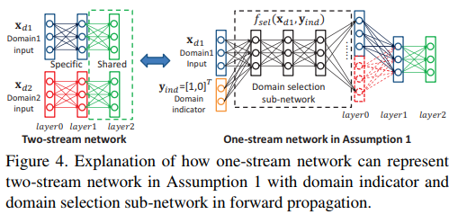

# DailyReadPaper
These Re-ID related papers are collected from ICCV 2017.

## A Two Stream Siamese Convolutional Neural Network for Person Re-Identification
1. ICCV 2017
2. Chung, Dahjung and Tahboub, Khalid and Delp, Edward J.
3. 190203(1)Chung_A_Two_Stream_ICCV_2017_paper.pdf

- Person re-identification is an important task in video
surveillance systems. It can be formally defined as establishing the correspondence between images of a person
taken from different cameras at different times. 

    

- In this paper, we present a two stream convolutional neural network
where each stream is a Siamese network. This architecture can learn spatial and temporal information separately.
We also propose a weighted two stream training objective
function which combines the Siamese cost of the spatial and
temporal streams with the objective of predicting a person’s
identity. 

    

- We evaluate our proposed method on the publicly
available PRID2011 and iLIDS-VID datasets and demonstrate the efficacy of our proposed method. On average, the
top rank matching accuracy is 4% higher than the accuracy
achieved by the cross-view quadratic discriminant analysis used in combination with the hierarchical Gaussian descriptor (GOG+XQDA), and 5% higher than the recurrent
neural network method.

>@InProceedings{Chung_2017_ICCV,
author = {Chung, Dahjung and Tahboub, Khalid and Delp, Edward J.},
title = {A Two Stream Siamese Convolutional Neural Network for Person Re-Identification},
booktitle = {The IEEE International Conference on Computer Vision (ICCV)},
month = {Oct},
year = {2017}
}

## Learning View-Invariant Features for Person Identification in Temporally Synchronized Videos Taken by Wearable Cameras
1. ICCV 2017
2. Zheng, Kang and Fan, Xiaochuan and Lin, Yuewei and Guo, Hao and Yu, Hongkai and Guo, Dazhou and Wang, Song
3. 190203(2)Zheng_Learning_View-Invariant_Features_ICCV_2017_paper.pdf

- In this paper, we study the problem of Cross-View Person
Identification (CVPI), which aims at identifying the same
person from temporally synchronized videos taken by different wearable cameras. Our basic idea is to utilize the
human motion consistency for CVPI, where human motion
can be computed by optical flow. 

    

- However, optical flow
is view-variant – the same person’s optical flow in different videos can be very different due to view angle change.
In this paper, we attempt to utilize 3D human-skeleton sequences to learn a model that can extract view-invariant
motion features from optical flows in different views.

    

- For this purpose, we use 3D Mocap database to build a synthetic optical flow dataset and train a Triplet Network (TN)
consisting of three sub-networks: two for optical flow sequences from different views and one for the underlying 3D
Mocap skeleton sequence. Finally, sub-networks for optical
flows are used to extract view-invariant features for CVPI.
Experimental results show that, using only the motion information, the proposed method can achieve comparable performance with the state-of-the-art methods. Further combination of the proposed method with an appearance-based
method achieves new state-of-the-art performance.

>@InProceedings{Zheng_2017_ICCV,
author = {Zheng, Kang and Fan, Xiaochuan and Lin, Yuewei and Guo, Hao and Yu, Hongkai and Guo, Dazhou and Wang, Song},
title = {Learning View-Invariant Features for Person Identification in Temporally Synchronized Videos Taken by Wearable Cameras},
booktitle = {The IEEE International Conference on Computer Vision (ICCV)},
month = {Oct},
year = {2017}
}

## Deeply-Learned Part-Aligned Representations for Person Re-Identification
1. ICCV 2017
2. Zhao, Liming and Li, Xi and Zhuang, Yueting and Wang, Jingdong
3. 190203(3)Zhao_Deeply-Learned_Part-Aligned_Representations_ICCV_2017_paper.pdf

- In this paper, we address the problem of person reidentification, which refers to associating the persons captured from different cameras. We propose a simple yet effective human part-aligned representation for handling the
body part misalignment problem. 

    

- Our approach decomposes the human body into regions (parts) which are discriminative for person matching, accordingly computes the
representations over the regions, and aggregates the similarities computed between the corresponding regions of
a pair of probe and gallery images as the overall matching score. 

    

- Our formulation, inspired by attention models, is a deep neural network modeling the three steps
together, which is learnt through minimizing the triplet
loss function without requiring body part labeling information. 

    

- Unlike most existing deep learning algorithms
that learn a global or spatial partition-based local representation, our approach performs human body partition, and thus is more robust to pose changes and various human spatial distributions in the person bounding box.
Our approach shows state-of-the-art results over standard
datasets, Market-1501, CUHK03, CUHK01 and VIPeR.
>@InProceedings{Zhao_2017_ICCV,
author = {Zhao, Liming and Li, Xi and Zhuang, Yueting and Wang, Jingdong},
title = {Deeply-Learned Part-Aligned Representations for Person Re-Identification},
booktitle = {The IEEE International Conference on Computer Vision (ICCV)},
month = {Oct},
year = {2017}
}

## Unlabeled Samples Generated by GAN Improve the Person Re-Identification Baseline in Vitro
1. ICCV 2017
2. Zheng, Zhedong and Zheng, Liang and Yang, Yi
3. 190203(4)Zheng_Unlabeled_Samples_Generated_ICCV_2017_paper.pdf

- The main contribution of this paper is a simple semisupervised pipeline that only uses the original training set
without collecting extra data. 

    

- It is challenging in 1) how
to obtain more training data only from the training set and
2) how to use the newly generated data. In this work, the
generative adversarial network (GAN) is used to generate
unlabeled samples. We propose the label smoothing regularization for outliers (LSRO). This method assigns a uniform label distribution to the unlabeled images, which regularizes the supervised model and improves the baseline.
We verify the proposed method on a practical problem: person re-identification (re-ID). This task aims to retrieve a query person from other cameras. We adopt the
deep convolutional generative adversarial network (DCGAN) for sample generation, and a baseline convolutional
neural network (CNN) for representation learning. 

    

- Experiments show that adding the GAN-generated data effectively improves the discriminative ability of learned
CNN embeddings. On three large-scale datasets, Market1501, CUHK03 and DukeMTMC-reID, we obtain +4.37%,
+1.6% and +2.46% improvement in rank-1 precision over
the baseline CNN, respectively. We additionally apply
the proposed method to fine-grained bird recognition and
achieve a +0.6% improvement over a strong baseline. 

>@InProceedings{Zheng_2017_ICCV,
author = {Zheng, Zhedong and Zheng, Liang and Yang, Yi},
title = {Unlabeled Samples Generated by GAN Improve the Person Re-Identification Baseline in Vitro},
booktitle = {The IEEE International Conference on Computer Vision (ICCV)},
month = {Oct},
year = {2017}
}
## Pose-Driven Deep Convolutional Model for Person Re-Identification
1. ICCV 2017
2. Su, Chi and Li, Jianing and Zhang, Shiliang and Xing, Junliang and Gao, Wen and Tian, Qi
3. 190203(5)Su_Pose-Driven_Deep_Convolutional_ICCV_2017_paper.pdf

- Feature extraction and matching are two crucial components in person Re-Identification (ReID). 

    

- The large pose deformations and the complex view variations exhibited by the
captured person images significantly increase the difficulty
of learning and matching of the features from person images. 

    

- To overcome these difficulties, in this work we propose
a Pose-driven Deep Convolutional (PDC) model to learn
improved feature extraction and matching models from end
to end. 

    

- Our deep architecture explicitly leverages the human part cues to alleviate the pose variations and learn
robust feature representations from both the global image
and different local parts. 

    

- To match the features from global human body and local body parts, a pose driven feature
weighting sub-network is further designed to learn adaptive
feature fusions. 

    

- Extensive experimental analyses and results on three popular datasets demonstrate significant performance improvements of our model over all published stateof-the-art methods

    

>@InProceedings{Su_2017_ICCV,
author = {Su, Chi and Li, Jianing and Zhang, Shiliang and Xing, Junliang and Gao, Wen and Tian, Qi},
title = {Pose-Driven Deep Convolutional Model for Person Re-Identification},
booktitle = {The IEEE International Conference on Computer Vision (ICCV)},
month = {Oct},
year = {2017}
}

## Jointly Attentive Spatial-Temporal Pooling Networks for Video-Based Person Re-Identification
1. ICCV 2017
2. Xu, Shuangjie and Cheng, Yu and Gu, Kang and Yang, Yang and Chang, Shiyu and Zhou, Pan
3. 190203(6)Xu_Jointly_Attentive_Spatial-Temporal_ICCV_2017_paper.pdf

- Person Re-Identification (person re-id) is a crucial task
as its applications in visual surveillance and humancomputer interaction. 

    

- In this work, we present a novel joint
Spatial and Temporal Attention Pooling Network (ASTPN)
for video-based person re-identification, which enables the
feature extractor to be aware of the current input video sequences, in a way that interdependency from the matching
items can directly influence the computation of each other’s
representation.

    

- Specifically, the spatial pooling layer is
able to select regions from each frame, while the attention
temporal pooling performed can select informative frames
over the sequence, both pooling guided by the information
from distance matching. 

    

- Experiments are conduced on the
iLIDS-VID, PRID-2011 and MARS datasets and the results
demonstrate that this approach outperforms existing stateof-art methods.

    

- We also analyze how the joint pooling in
both dimensions can boost the person re-id performance
more effectively than using either of them separately 1.

>@InProceedings{Xu_2017_ICCV,
author = {Xu, Shuangjie and Cheng, Yu and Gu, Kang and Yang, Yang and Chang, Shiyu and Zhou, Pan},
title = {Jointly Attentive Spatial-Temporal Pooling Networks for Video-Based Person Re-Identification},
booktitle = {The IEEE International Conference on Computer Vision (ICCV)},
month = {Oct},
year = {2017}
}

## RGB-Infrared Cross-Modality Person Re-Identification
1. ICCV 2017
2. Wu, Ancong and Zheng, Wei-Shi and Yu, Hong-Xing and Gong, Shaogang and Lai, Jianhuang
3. 190203(7)Wu_RGB-Infrared_Cross-Modality_Person_ICCV_2017_paper.pdf

- Person re-identification (Re-ID) is an important problem in video surveillance, aiming to match pedestrian images across camera views. Currently, most works focus
on RGB-based Re-ID.

    

- However, in some applications, RGB
images are not suitable, e.g. in a dark environment or at
night. Infrared (IR) imaging becomes necessary in many
visual systems.

    

- To that end, matching RGB images with
infrared images is required, which are heterogeneous with
very different visual characteristics.

    

- For person Re-ID, this
is a very challenging cross-modality problem that has not
been studied so far.

    

- In this work, we address the RGB-IR
cross-modality Re-ID problem and contribute a new multiple modality Re-ID dataset named SYSU-MM01, including RGB and IR images of 491 identities from 6 cameras,
giving in total 287,628 RGB images and 15,792 IR images. To explore the RGB-IR Re-ID problem, we evaluate existing popular cross-domain models, including three
commonly used neural network structures (one-stream, twostream and asymmetric FC layer) and analyse the relation
between them.

    

- We further propose deep zero-padding for
training one-stream network towards automatically evolving domain-specific nodes in the network for cross-modality
matching.

    

- Our experiments show that RGB-IR crossmodality matching is very challenging but still feasible using the proposed model with deep zero-padding, giving the
best performance. Our dataset is available at http://
isee.sysu.edu.cn/project/RGBIRReID.htm.

>@InProceedings{Wu_2017_ICCV,
author = {Wu, Ancong and Zheng, Wei-Shi and Yu, Hong-Xing and Gong, Shaogang and Lai, Jianhuang},
title = {RGB-Infrared Cross-Modality Person Re-Identification},
booktitle = {The IEEE International Conference on Computer Vision (ICCV)},
month = {Oct},
year = {2017}
}

## Multi-Scale Deep Learning Architectures for Person Re-Identification
1. ICCV 2017
2. Qian, Xuelin and Fu, Yanwei and Jiang, Yu-Gang and Xiang, Tao and Xue, Xiangyang
3. 190203(8)Qian_Multi-Scale_Deep_Learning_ICCV_2017_paper.pdf

- Person Re-identification (re-id) aims to match people
across non-overlapping camera views in a public space. It
is a challenging problem because many people captured in
surveillance videos wear similar clothes.

    

- Consequently, the
differences in their appearance are often subtle and only detectable at the right location and scales. Existing re-id models, particularly the recently proposed deep learning based
ones match people at a single scale. 

    

- In contrast, in this paper, a novel multi-scale deep learning model is proposed.
Our model is able to learn deep discriminative feature representations at different scales and automatically determine
the most suitable scales for matching.

    

- The importance of
different spatial locations for extracting discriminative features is also learned explicitly. Experiments are carried
out to demonstrate that the proposed model outperforms the
state-of-the art on a number of benchmarks.

>@InProceedings{Qian_2017_ICCV,
author = {Qian, Xuelin and Fu, Yanwei and Jiang, Yu-Gang and Xiang, Tao and Xue, Xiangyang},
title = {Multi-Scale Deep Learning Architectures for Person Re-Identification},
booktitle = {The IEEE International Conference on Computer Vision (ICCV)},
month = {Oct},
year = {2017}
}