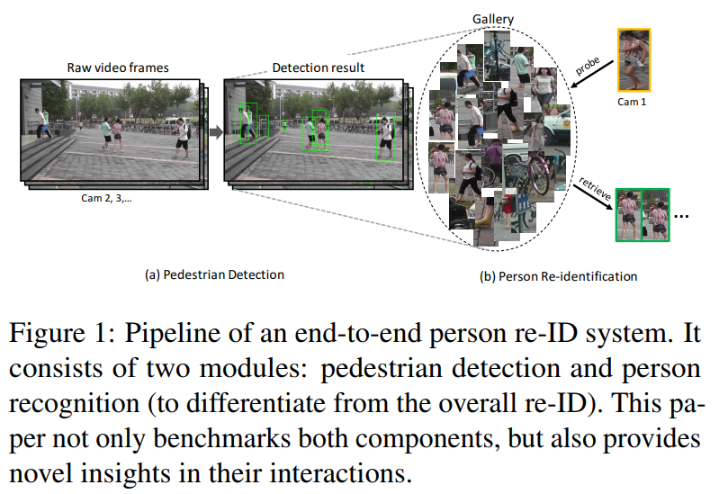
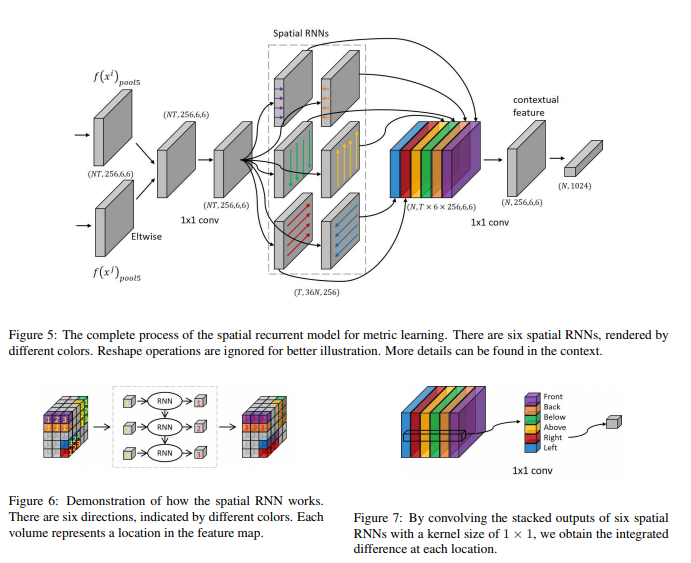

# DailyReadPaper
These Re-ID related papers are collected from CVPR 2017.

## Learning Deep Context-Aware Features Over Body and Latent Parts for Person Re-Identification
1. CVPR 2017
2. Li, Dangwei and Chen, Xiaotang and Zhang, Zhang and Huang, Kaiqi
3. 190204(1)Li_Learning_Deep_Context-Aware_CVPR_2017_paper.pdf

- Person Re-identification (ReID) is to identify the same
person across different cameras. It is a challenging task
due to the large variations in person pose, occlusion, background clutter, etc. How to extract powerful features is a
fundamental problem in ReID and is still an open problem today. In this paper, we design a Multi-Scale ContextAware Network (MSCAN) to learn powerful features over
full body and body parts, which can well capture the local context knowledge by stacking multi-scale convolutions
in each layer.

    

- Moreover, instead of using predefined rigid
parts, we propose to learn and localize deformable pedestrian parts using Spatial Transformer Networks (STN) with
novel spatial constraints.

    

- The learned body parts can release some difficulties, e.g. pose variations and background
clutters, in part-based representation. 

    

- Finally, we integrate the representation learning processes of full body
and body parts into a unified framework for person ReID through multi-class person identification tasks. Extensive
evaluations on current challenging large-scale person ReID
datasets, including the image-based Market1501, CUHK03
and sequence-based MARS datasets, show that the proposed method achieves the state-of-the-art results

>@InProceedings{Li_2017_CVPR,
author = {Li, Dangwei and Chen, Xiaotang and Zhang, Zhang and Huang, Kaiqi},
title = {Learning Deep Context-Aware Features Over Body and Latent Parts for Person Re-Identification},
booktitle = {The IEEE Conference on Computer Vision and Pattern Recognition (CVPR)},
month = {July},
year = {2017}
}

## Beyond Triplet Loss: A Deep Quadruplet Network for Person Re-Identification
1. CVPR 2017
2. Chen, Weihua and Chen, Xiaotang and Zhang, Jianguo and Huang, Kaiqi
3. 190204(2)Chen_Beyond_Triplet_Loss_CVPR_2017_paper.pdf

- Person re-identification (ReID) is an important task in
wide area video surveillance which focuses on identifying
people across different cameras. Recently, deep learning
networks with a triplet loss become a common framework
for person ReID. However, the triplet loss pays main attentions on obtaining correct orders on the training set. It
still suffers from a weaker generalization capability from
the training set to the testing set, thus resulting in inferior
performance.

    

- In this paper, we design a quadruplet loss,
which can lead to the model output with a larger inter-class
variation and a smaller intra-class variation compared to
the triplet loss. As a result, our model has a better generalization ability and can achieve a higher performance on the
testing set. In particular, a quadruplet deep network using
a margin-based online hard negative mining is proposed
based on the quadruplet loss for the person ReID. In
extensive experiments, the proposed network outperforms
most of the state-of-the-art algorithms on representative
datasets which clearly demonstrates the effectiveness of our
proposed method.

>@InProceedings{Chen_2017_CVPR,
author = {Chen, Weihua and Chen, Xiaotang and Zhang, Jianguo and Huang, Kaiqi},
title = {Beyond Triplet Loss: A Deep Quadruplet Network for Person Re-Identification},
booktitle = {The IEEE Conference on Computer Vision and Pattern Recognition (CVPR)},
month = {July},
year = {2017}
}

## Person Re-Identification in the Wild
1. CVPR 2017
2. Zheng, Liang and Zhang, Hengheng and Sun, Shaoyan and Chandraker, Manmohan and Yang, Yi and Tian, Qi
3. 190204(3)Zheng_Person_Re-Identification_in_CVPR_2017_paper.pdf

- This paper1 presents a novel large-scale dataset and comprehensive baselines for end-to-end pedestrian detection and
person recognition in raw video frames. Our baselines address three issues: the performance of various combinations
of detectors and recognizers, mechanisms for pedestrian
detection to help improve overall re-identification (re-ID)
accuracy and assessing the effectiveness of different detectors for re-ID.

    

- We make three distinct contributions. First,
a new dataset, PRW, is introduced to evaluate Person Reidentification in the Wild, using videos acquired through
six near-synchronized cameras. It contains 932 identities
and 11,816 frames in which pedestrians are annotated with
their bounding box positions and identities. Extensive benchmarking results are presented on this dataset. Second, we
show that pedestrian detection aids re-ID through two simple
yet effective improvements: a cascaded fine-tuning strategy
that trains a detection model first and then the classification model, and a Confidence Weighted Similarity (CWS)
metric that incorporates detection scores into similarity measurement. Third, we derive insights in evaluating detector
performance for the particular scenario of accurate person
re-ID.

>@InProceedings{Zheng_2017_CVPR,
author = {Zheng, Liang and Zhang, Hengheng and Sun, Shaoyan and Chandraker, Manmohan and Yang, Yi and Tian, Qi},
title = {Person Re-Identification in the Wild},
booktitle = {The IEEE Conference on Computer Vision and Pattern Recognition (CVPR)},
month = {July},
year = {2017}
}

## One-Shot Metric Learning for Person Re-Identification
1. CVPR 2017
2. Bak, Slawomir and Carr, Peter
3. 190204(4)Bak_One-Shot_Metric_Learning_CVPR_2017_paper.pdf

- Re-identification of people in surveillance footage must
cope with drastic variations in color, background, viewing
angle and a person’s pose. Supervised techniques are often
the most effective, but require extensive annotation which
is infeasible for large camera networks.

    

- Unlike previous
supervised learning approaches that require hundreds of
annotated subjects, we learn a metric using a novel oneshot learning approach. We first learn a deep texture representation from intensity images with Convolutional Neural Networks (CNNs). When training a CNN using only
intensity images, the learned embedding is color-invariant
and shows high performance even on unseen datasets without fine-tuning. To account for differences in camera color
distributions, we learn a color metric using a single pair
of ColorChecker images. The proposed one-shot learning achieves performance that is competitive with supervised methods, but uses only a single example rather than
the hundreds required for the fully supervised case. Compared with semi-supervised and unsupervised state-of-theart methods, our approach yields significantly higher accuracy.

>@InProceedings{Bak_2017_CVPR,
author = {Bak, Slawomir and Carr, Peter},
title = {One-Shot Metric Learning for Person Re-Identification},
booktitle = {The IEEE Conference on Computer Vision and Pattern Recognition (CVPR)},
month = {July},
year = {2017}
}

## Joint Detection and Identification Feature Learning for Person Search
1. CVPR 2017
2. Xiao, Tong and Li, Shuang and Wang, Bochao and Lin, Liang and Wang, Xiaogang
3. 190204(5)Xiao_Joint_Detection_and_CVPR_2017_paper.pdf

- Existing person re-identification benchmarks and methods mainly focus on matching cropped pedestrian images
between queries and candidates. 

    

- However, it is different
from real-world scenarios where the annotations of pedestrian bounding boxes are unavailable and the target person needs to be searched from a gallery of whole scene images. To close the gap, we propose a new deep learning
framework for person search.

    

- Instead of breaking it down
into two separate tasks—pedestrian detection and person
re-identification, we jointly handle both aspects in a single
convolutional neural network. An Online Instance Matching (OIM) loss function is proposed to train the network effectively, which is scalable to datasets with numerous identities. To validate our approach, we collect and annotate
a large-scale benchmark dataset for person search. It contains 18, 184 images, 8, 432 identities, and 96, 143 pedestrian bounding boxes. Experiments show that our framework outperforms other separate approaches, and the proposed OIM loss function converges much faster and better
than the conventional Softmax loss.

>@InProceedings{Xiao_2017_CVPR,
author = {Xiao, Tong and Li, Shuang and Wang, Bochao and Lin, Liang and Wang, Xiaogang},
title = {Joint Detection and Identification Feature Learning for Person Search},
booktitle = {The IEEE Conference on Computer Vision and Pattern Recognition (CVPR)},
month = {July},
year = {2017}
}

## Point to Set Similarity Based Deep Feature Learning for Person Re-Identification
1. CVPR 2017
2. Zhou, Sanping and Wang, Jinjun and Wang, Jiayun and Gong, Yihong and Zheng, Nanning
3. 190204(6)Zhou_Point_to_Set_CVPR_2017_paper.pdf

- Person re-identification (Re-ID) remains a challenging
problem due to significant appearance changes caused by
variations in view angle, background clutter, illumination
condition and mutual occlusion. To address these issues,
conventional methods usually focus on proposing robust
feature representation or learning metric transformation
based on pairwise similarity, using Fisher-type criterion.
The recent development in deep learning based approaches address the two processes in a joint fashion and have
achieved promising progress.

    

- One of the key issues for deep
learning based person Re-ID is the selection of proper similarity comparison criteria, and the performance of learned
features using existing criterion based on pairwise similarity is still limited, because only Point to Point (P2P) distances are mostly considered. In this paper, we present a
novel person Re-ID method based on Point to Set similarity comparison. The Point to Set (P2S) metric can jointly
minimize the intra-class distance and maximize the interclass distance, while back-propagating the gradient to optimize parameters of the deep model. By utilizing our proposed P2S metric, the learned deep model can effectively
distinguish different persons by learning discriminative and
stable feature representations. Comprehensive experimental evaluations on 3DPeS, CUHK01, PRID2011 and Market1501 datasets demonstrate the advantages of our method
over the state-of-the-art approaches.
>@InProceedings{Zhou_2017_CVPR,
author = {Zhou, Sanping and Wang, Jinjun and Wang, Jiayun and Gong, Yihong and Zheng, Nanning},
title = {Point to Set Similarity Based Deep Feature Learning for Person Re-Identification},
booktitle = {The IEEE Conference on Computer Vision and Pattern Recognition (CVPR)},
month = {July},
year = {2017}
}

## See the Forest for the Trees: Joint Spatial and Temporal Recurrent Neural Networks for Video-Based Person Re-Identification},
1. CVPR 2017
2. Zhou, Zhen and Huang, Yan and Wang, Wei and Wang, Liang and Tan, Tieniu
3. 190204(7)Zhou_See_the_Forest_CVPR_2017_paper.pdf
- Surveillance cameras have been widely used in different scenes. Accordingly, a demanding need is to recognize
a person under different cameras, which is called person
re-identification. 

    

- This topic has gained increasing interests in computer vision recently. However, less attention
has been paid to video-based approaches, compared with
image-based ones.

    

- Two steps are usually involved in previous approaches, namely feature learning and metric learning. But most of the existing approaches only focus on either feature learning or metric learning. Meanwhile, many
of them do not take full use of the temporal and spatial information.

    

- In this paper, we concentrate on video-based
person re-identification and build an end-to-end deep neural network architecture to jointly learn features and metrics. The proposed method can automatically pick out the
most discriminative frames in a given video by a temporal attention model. Moreover, it integrates the surrounding
information at each location by a spatial recurrent model when measuring the similarity with another pedestrian
video.

    

- That is, our method handles spatial and temporal
information simultaneously in a unified manner. The carefully designed experiments on three public datasets show
the effectiveness of each component of the proposed deep
network, performing better in comparison with the state-ofthe-art methods

>@InProceedings{Zhou_2017_CVPR,
author = {Zhou, Zhen and Huang, Yan and Wang, Wei and Wang, Liang and Tan, Tieniu},
title = {See the Forest for the Trees: Joint Spatial and Temporal Recurrent Neural Networks for Video-Based Person Re-Identification},
booktitle = {The IEEE Conference on Computer Vision and Pattern Recognition (CVPR)},
month = {July},
year = {2017}
}

## Consistent-Aware Deep Learning for Person Re-Identification in a Camera Network
1. CVPR 2017
2. Lin, Ji and Ren, Liangliang and Lu, Jiwen and Feng, Jianjiang and Zhou, Jie
3. 190204(8)Lin_Consistent-Aware_Deep_Learning_CVPR_2017_paper.pdf

- In this paper, we propose a consistent-aware deep learning (CADL) approach for person re-identification in a camera network. Unlike most existing person re-identification
methods which identify whether two pedestrian images are
from the same person or not, our approach aims to obtain
the maximal correct matches for the whole camera network.

    

- Different from recently proposed camera network based reidentification methods which only consider the consistent
information in the matching stage to obtain a globally optimal association, we exploit such consistent-aware information under a deep learning framework where both feature representation and image matching are automatically
learned. Specifically, we reach the globally optimal solution and balance the performance between different cameras by optimizing the similarity and data association iteratively with certain consistent constraints. Experimental results show that our method obtains significant performance
improvement and outperforms the state-of-the-art methods
by large margins.

>@InProceedings{Lin_2017_CVPR,
author = {Lin, Ji and Ren, Liangliang and Lu, Jiwen and Feng, Jianjiang and Zhou, Jie},
title = {Consistent-Aware Deep Learning for Person Re-Identification in a Camera Network},
booktitle = {The IEEE Conference on Computer Vision and Pattern Recognition (CVPR)},
month = {July},
year = {2017}
}