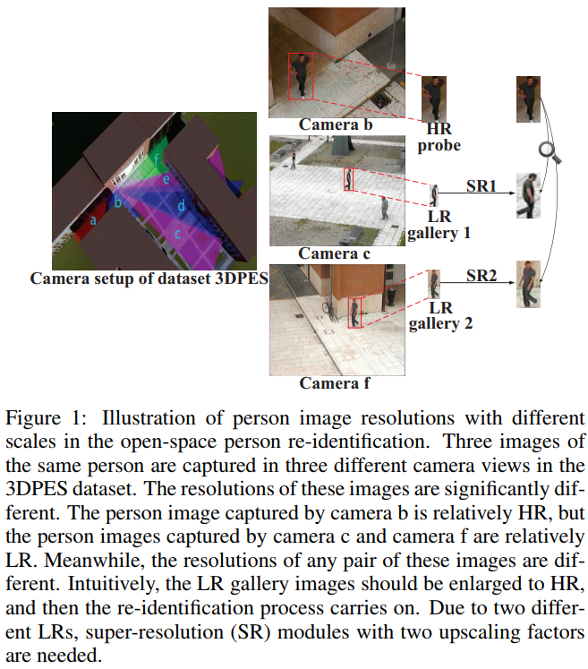
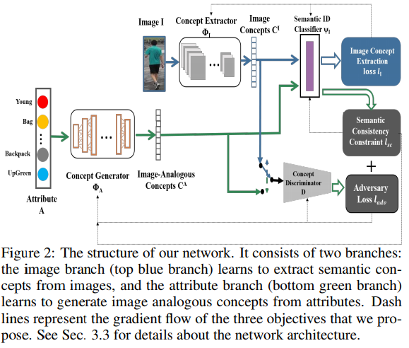
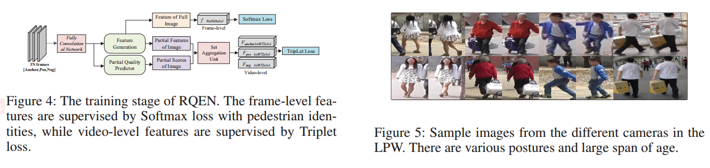

# DailyReadPaper
These Re-ID related papers are collected from AAAI 2018, IJCAI 2018 and NIPS 2018, containing more theoretical meaning.
## FD-GAN: Pose-guided Feature Distilling GAN for Robust Person Re-identification
1. NIPS 2018
2. Ge, Yixiao and Li, Zhuowan and Zhao, Haiyu and Yin, Guojun and Yi, Shuai and Wang, Xiaogang and others
3. https://github.com/yxgeee/FD-GAN

- Person re-identification (reID) is an important task that requires to retrieve a 
person's images from an image dataset, given one image of the person of 
interest. For learning robust person features, the pose variation of person 
images is one of the key challenges. Existing works targeting the problem either 
perform human alignment, or learn human-region-based representations. 

    

- Extra pose information and computational cost is generally required for inference. To 
solve this issue, a Feature Distilling Generative Adversarial Network (FD-GAN) is 
proposed for **learning identity-related and pose-unrelated representations**. 

    
    
- It is a novel framework based on a Siamese structure with multiple novel discriminators on 
human poses and identities. In addition to the discriminators, a novel same-pose loss 
is also integrated, which requires appearance of a same person's generated images 
to be similar.

    
    
- After learning pose-unrelated person features with pose guidance, 
no auxiliary pose information and additional computational cost is required during testing. 
Our proposed FD-GAN achieves state-of-the-art performance on three person reID 
datasets, which demonstrates that the effectiveness and 
robust **feature distilling** capability of the proposed FD-GAN.

>@inproceedings{ge2018fd,
  title={FD-GAN: Pose-guided Feature Distilling GAN for Robust Person Re-identification},
  author={Ge, Yixiao and Li, Zhuowan and Zhao, Haiyu and Yin, Guojun and Yi, Shuai and Wang, Xiaogang and others},
  booktitle={Advances in Neural Information Processing Systems},
  pages={1230--1241},
  year={2018}
}

## Cascaded SR-GAN for Scale-Adaptive Low Resolution Person Re-identification
1. IJCAI 2018
2. Wang, Zheng and Ye, Mang and Yang, Fan and Bai, Xiang and Shin'ichi Satoh

- Person re-identification (REID) is an important task in video surveillance and forensics applications.
Most of previous approaches are based on a key assumption that all person images have uniform
and sufficiently high resolutions. Actually, various low-resolutions and scale mismatching always
exist in open world REID. 

    
    
- We name this kind of problem as Scale-Adaptive Low Resolution Person
Re-identification (SALR-REID). The most intuitive way to address this problem is to increase
various low-resolutions (not only low, but also with different scales) to a uniform high-resolution. SRGAN
is one of the most competitive image super-resolution deep networks, designed with a fixed
upscaling factor. However, it is still not suitable for SALR-REID task, which requires a network
not only synthesizing high-resolution images with different upscaling factors, but also extracting
discriminative image feature for judging person’s identity. 
    - (1) To promote the ability of
scale-adaptive upscaling, we cascade multiple SRGANs
in series. 

    
    
    - (2) To supplement the ability of image feature representation, we plug-in a reidentification
network. With a unified formulation, a Cascaded Super-Resolution GAN (CSRGAN)
framework is proposed. Extensive evaluations on two simulated datasets and one public
dataset demonstrate the advantages of our method over related state-of-the-art methods.

    
    
>@inproceedings{wang2018cascaded,
  title={Cascaded SR-GAN for Scale-Adaptive Low Resolution Person Re-identification.},
  author={Wang, Zheng and Ye, Mang and Yang, Fan and Bai, Xiang and Shin'ichi Satoh},
  booktitle={IJCAI},
  pages={3891--3897},
  year={2018}
}

## Visible Thermal Person Re-Identification via Dual-Constrained Top-Ranking
1. IJCAI 2018
2. Ye, Mang and Wang, Zheng and Lan, Xiangyuan and Yuen, Pong C

- **Cross-modality person re-identification** between the thermal and visible domains 
is extremely important for night-time surveillance applications. 
Existing works in this filed mainly focus on learning sharable feature representations 
to handle the cross-modality discrepancies. 

    
    
- However, besides the cross-modality discrepancy caused by
different camera spectrums, visible thermal person re-identification also suffers from large cross-modality
and intra-modality variations caused by different camera views and human poses. 

    
  
- In this paper, we propose a dual-path network with a novel bi-directional dual-constrained top-ranking loss
to learn discriminative feature representations. It is advantageous in two aspects: 
    - 1) end-to-end feature learning directly from the data without extra metric learning steps, 
  
    
    
    - 2) it simultaneously handles the cross-modality and intra-modality variations to
ensure the discriminability of the learnt representations.

    
    
- Meanwhile, identity loss is further incorporated
to model the identity-specific information
to handle large intra-class variations. 

    
    

>@inproceedings{ye2018visible,
  title={Visible Thermal Person Re-Identification via Dual-Constrained Top-Ranking},
  author={Ye, Mang and Wang, Zheng and Lan, Xiangyuan and Yuen, Pong C},
  booktitle={IJCAI},
  pages={1092--1099},
  year={2018}
}

## Deep View-Aware Metric Learning for Person Re-Identification
1. IJCAI 2018
2. Pu Chen, Xinyi Xu and Cheng Deng∗

- Person re-identification remains a challenging issue due to the dramatic changes in visual appearance
caused by the variations in camera views, human pose, and background clutter.

    
    
- In this paper, we propose a deep view-aware metric learning (DVAML) model, where 
image pairs with similar and dissimilar
views are projected into different feature subspaces, which can discover the intrinsic relevance
between image pairs from different aspects. 
  
    
    
- Additionally, we employ multiple metrics to jointly learn feature subspaces on which the relevance between
image pairs are explicitly captured and thus greatly promoting the retrieval accuracy. 

    

- Extensive experiment results on datasets CUHK01, CUHK03, and PRID2011 demonstrate the superiority of our
method compared with state-of-the-art approaches.

>@inproceedings{chen2018deep,
  title={Deep View-Aware Metric Learning for Person Re-Identification.},
  author={Chen, Pu and Xu, Xinyi and Deng, Cheng},
  booktitle={IJCAI},
  pages={620--626},
  year={2018}
}

## SafeNet: Scale-normalization and Anchor-based Feature Extraction Network for Person Re-identification
1. IJCAI 2018
2. Yuan, Kun and Zhang, Qian and Huang, Chang and Xiang, Shiming and Pan, Chunhong and Robotics, Horizon

- Person Re-identification (ReID) is a challenging retrieval task that requires matching a person’s image
across non-overlapping camera views. The quality of fulfilling this task is largely determined on the
robustness of the features that are used to describe the person. 
  
    

- In this paper, we show the advantage of jointly utilizing multi-scale abstract information
to learn powerful features over full body and parts. A scale normalization module is proposed
to balance different scales through residual-based integration. 

    
    
- To exploit the information hidden in
non-rigid body parts, we propose an anchor-based method to capture the local contents by stacking
convolutions of kernels with various aspect ratios, which focus on different spatial distributions.
Finally, a well-defined framework is constructed for
simultaneously learning the representations of both full body and parts. 
    
    

>@inproceedings{yuan2018safenet,
  title={SafeNet: Scale-normalization and Anchor-based Feature Extraction Network for Person Re-identification.},
  author={Yuan, Kun and Zhang, Qian and Huang, Chang and Xiang, Shiming and Pan, Chunhong and Robotics, Horizon},
  booktitle={IJCAI},
  pages={1121--1127},
  year={2018}
}

## Cross-Modality Person Re-Identification with Generative Adversarial Training
1. IJCAI 2018
2. Dai, Pingyang and Ji, Rongrong and Wang, Haibin and Wu, Qiong and Huang, Yuyu

- Person re-identification (Re-ID) is an important task in video surveillance which automatically
searches and identifies people across different cameras.
Despite the extensive Re-ID progress in RGB cameras, few works have studied the Re-ID between
infrared and RGB images, which is essentially a cross-modality problem and widely encountered
in real-world scenarios.

    

- The key challenge
lies in two folds, i.e., 
    - the lack of discriminative information to re-identify the same person between
RGB and infrared modalities, 
    - and the difficulty to learn a robust metric for such a large-scale crossmodality
retrieval. In this paper, we tackle the above two challenges by proposing a novel crossmodality
generative adversarial network (termed cmGAN). To handle the lack of insufficient discriminative
information, we design a cutting-edge generative adversarial training based discriminator
to learn discriminative feature representation from different modalities. 
- To handle the issue of largescale
cross-modality metric learning, we integrate both identification loss and cross-modality triplet
loss, which minimize inter-class ambiguity while maximizing cross-modality similarity among instances.
The entire cmGAN can be trained in an end-to-end manner by using standard deep neural
network framework. 

    
    
- We have quantized the performance of our work in the newly-released SYSU
RGB-IR Re-ID benchmark, and have reported superior performance, i.e., Cumulative Match Characteristic
curve (CMC) and Mean Average Precision (MAP), over the state-of-the-art works [Wu et
al., 2017], at least 12.17% and 11.85% respectively
  
>@inproceedings{dai2018cross,
  title={Cross-Modality Person Re-Identification with Generative Adversarial Training.},
  author={Dai, Pingyang and Ji, Rongrong and Wang, Haibin and Wu, Qiong and Huang, Yuyu},
  booktitle={IJCAI},
  pages={677--683},
  year={2018}
}

## Adversarial Attribute-Image Person Re-identification
1. IJCAI 2018
2. Yin, Zhou and Zheng, Wei-Shi and Wu, Ancong and Yu, Hong-Xing and Wan, Hai and Guo, Xiaowei and Huang, Feiyue and Lai, Jianhuang

- While attributes have been widely used for person re-identification (Re-ID) which aims at matching
the same person images across disjoint camera views, they are used either as extra features or
for performing multi-task learning to assist the image-image matching task. However, how to
find a set of person images according to a given attribute description, which is very practical in
many surveillance applications, remains a rarely investigated cross-modality matching problem
in person Re-ID. 

    
    
- In this work, we present this challenge and leverage adversarial learning to formulate
the attribute-image cross-modality person Re-ID model. By imposing a semantic consistency
constraint across modalities as a regularization, the adversarial learning enables to generate imageanalogous
concepts of query attributes for matching the corresponding images at both global level
and semantic ID level. 

    
    
    
>@inproceedings{yin2018adversarial,
  title={Adversarial Attribute-Image Person Re-identification.},
  author={Yin, Zhou and Zheng, Wei-Shi and Wu, Ancong and Yu, Hong-Xing and Wan, Hai and Guo, Xiaowei and Huang, Feiyue and Lai, Jianhuang},
  booktitle={IJCAI},
  pages={1100--1106},
  year={2018}
}

## Graph Correspondence Transfer for Person Re-identification
1. AAAI 2018
2. Qin Zhou, Heng Fan, Shibao Zheng, Hang Su, Xinzhe Li, Shuang Wu, Haibin Ling*

- In this paper, we propose a graph correspondence transfer (GCT) approach for person re-identification. Unlike existing
methods, the GCT model formulates person re-identification as an off-line graph matching and on-line correspondence
transferring problem. 

    
    
- In specific, during training, the GCT
model aims to learn off-line a set of correspondence templates from positive training pairs with various pose-pair 
configurations via patch-wise graph matching. 

    
    
- During testing, for each pair of test samples, we select a few 
training pairs with the most similar pose-pair configurations as references,
and transfer the correspondences of these references to test pair for feature distance calculation. The matching score is
derived by aggregating distances from different references.

    
    
- For each probe image, the gallery image with the highest matching score is the re-identifying result. Compared to existing algorithms, our GCT can handle spatial misalignment
caused by large variations in view angles and human poses owing to the benefits of patch-wise graph matching. 

    
    
>@article{zhou2018graph,
  title={Graph Correspondence Transfer for Person Re-identification},
  author={Zhou, Qin and Fan, Heng and Zheng, Shibao and Su, Hang and Li, Xinzhe and Wu, Shuang and Ling, Haibin},
  journal={arXiv preprint arXiv:1804.00242},
  year={2018}
}

## Hierarchical Discriminative Learning for Visible Thermal Person Re-Identification
1. AAAI 2018
2. Mang Ye, Xiangyuan Lan, Jiawei Li, Pong c Yuen*

- Person re-identification is widely studied in visible spectrum,
where all the person images are captured by visible cameras.
- However, visible cameras may not capture valid appearance
information under poor illumination conditions, e.g, at night.

    
    
In this case, thermal camera is superior since it is less dependent on the lighting by using infrared light to capture the human body. To this end, this paper investigates a cross-modal
re-identification problem, namely visible-thermal person reidentification (VT-REID). 
- Existing cross-modal matching methods mainly focus on modeling the cross-modality discrepancy, while VT-REID also suffers from cross-view variations caused by different camera views. Therefore, we propose a hierarchical cross-modality matching model by jointly
optimizing the modality-specific and modality-shared metrics. The modality-specific metrics transform two heterogenous modalities into a consistent space that modality-shared
metric can be subsequently learnt. 

    
    
- Meanwhile, the modalityspecific metric compacts features of the same person within
each modality to handle the large intra-modality intra-person
variations (e.g. viewpoints, pose). 

    
    
- Additionally, an improved
two-stream CNN network is presented to learn the multimodality sharable feature representations. 
Identity loss and contrastive loss are integrated to enhance the discriminability
and modality-invariance with partially shared layer parameters. 

>@article{ye2018hierarchical,
  title={Hierarchical Discriminative Learning for Visible Thermal Person Re-Identification},
  author={Ye, Mang and Lan, Xiangyuan and Li, Jiawei and Yuen, Pong C},
  year={2018}
}

## Learning Coarse-to-fine Structured Feature Embedding for Vehicle Re-identification
1. AAAI 2018
2. Haiyun Guo*, Chaoyang Zhao, zhiwei liu, jinqiao wang, hanqing lu

- **Vehicle re-identification** (re-ID) is to identify the same vehicle across different cameras. It’s a significant but challenging
topic, which has received little attention due to the complex intra-class and inter-class variation of vehicle images and the
lack of large-scale vehicle re-ID dataset. 
- Previous methods focus on pulling images from different vehicles apart but neglect the discrimination between vehicles from different vehicle models, which is actually quite important to obtain a correct ranking order for vehicle re-ID. In this paper, we learn a
structured feature embedding for vehicle re-ID with a novel coarse-to-fine ranking loss to pull images of the same vehicle
as close as possible and achieve discrimination between images from different vehicles as well as vehicles from different
vehicle models. 

    
    
- In the learnt feature space, both intra-class
compactness and inter-class distinction are well guaranteed
and the Euclidean distance between features directly reflects
the semantic similarity of vehicle images. Furthermore, we
build so far the largest vehicle re-ID dataset “Vehicle-1M”1
which involves nearly 1 million images captured in various
surveillance scenarios. Experimental results on “Vehicle-1M”
and “VehicleID” demonstrate the superiority of our proposed
approach.

    
    
>@inproceedings{guo2018learning,
  title={Learning Coarse-to-Fine Structured Feature Embedding for Vehicle Re-Identification},
  author={Guo, Haiyun and Zhao, Chaoyang and Liu, Zhiwei and Wang, Jinqiao and Lu, Hanqing},
  booktitle={Thirty-Second AAAI Conference on Artificial Intelligence},
  year={2018}
}

## Multi-Channel Pyramid Person Matching Network for Person Re-Identification
1. AAAI 2018
2. Chaojie Mao, Yingming Li*, zhongfei Zhang, yaqing Zhang, Xi Li

- In this work, we present a Multi-Channel deep convolutional Pyramid Person Matching Network (MC-PPMN) 

    
    
- which based on the combination of the **semantic-components** 

    
    
- and the **colortexture distributions** to address the problem of person reidentification. 

    
    
- In particular, we learn separate deep representations for semantic-components and color-texture distributions from two person images and then employ pyramid
person matching network (PPMN) to obtain correspondence
representations. 

    
    
- These correspondence representations are fused to perform the re-identification task. 
Further, the proposed framework is optimized via a unified end-to-end deep
learning scheme. 

>@article{mao2018multi,
  title={Multi-Channel Pyramid Person Matching Network for Person Re-Identification},
  author={Mao, Chaojie and Li, Yingming and Zhang, Yaqing and Zhang, Zhongfei and Li, Xi},
  journal={arXiv preprint arXiv:1803.02558},
  year={2018}
}

## Region-based Quality Estimation Network for Large-scale Person Re-identification
1. AAAI 2018
2. Guanglu Song, Biao Leng*, Yu Liu, Congrui Hetang, Shaofan Cai

- One of the major restrictions on the performance of videobased person re-id is partial noise caused by occlusion, blur
and illumination. 

    
    
- Since different spatial regions of a single frame have various quality, and the quality of the 
same region also varies across frames in a tracklet, a good way to
address the problem is to effectively aggregate complementary information from 
all frames in a sequence, using better regions from other frames to compensate the influence of an
image region with poor quality.

    
     
- To achieve this, we propose
a novel Region-based Quality Estimation Network (RQEN),
in which an ingenious training mechanism enables the effective 
learning to extract the complementary region-based
information between different frames. 

    
    
- Compared with other feature extraction methods, we achieved comparable results
of 92.4%, 76.1% and 77.83% on the PRID 2011, iLIDS-VID
and MARS, respectively.

    
    
- In addition, to alleviate the lack of clean large-scale person
re-id datasets for the community, this paper also contributes
a new high-quality dataset, named “Labeled Pedestrian in the Wild (LPW)” which 
contains 7,694 tracklets with over
590,000 images. Despite its relatively large scale, the annotations also possess high cleanliness. Moreover, it’s more challenging in the following aspects: the age of characters varies
from childhood to elderhood; the postures of people are diverse, including running and cycling in addition to the normal
walking state.

>@inproceedings{song2018region,
  title={Region-based quality estimation network for large-scale person re-identification},
  author={Song, Guanglu and Leng, Biao and Liu, Yu and Hetang, Congrui and Cai, Shaofan},
  booktitle={Thirty-Second AAAI Conference on Artificial Intelligence},
  year={2018}
}

## Semi-supervised Bayesian Attribute Learning for Person Re-identification
1. AAAI 2018
2. Wenhe Liu*, Ling Chen, Xiaojun Chang, Yi Yang

- Person re-identification (re-ID) tasks aim to identify the same
person in multiple images captured from non-overlapping
camera views. Most previous re-ID studies have attempted
to solve this problem through either representation learning
or metric learning, or by combining both techniques. Representation learning relies on the latent factors or attributes of
the data. In most of these works, the dimensionality of the
factors/attributes has to be manually determined for each new
dataset. Thus, this approach is not robust. Metric learning optimizes a metric across the dataset to measure similarity according to distance. However, choosing the optimal method
for computing these distances is data dependent, and learning the appropriate metric relies on a sufficient number of
pair-wise labels. 

    

- To overcome these limitations, we propose
a novel algorithm for person re-ID, called semi-supervised
Bayesian attribute learning. We introduce an Indian Buffet
Process to identify the priors of the latent attributes. The dimensionality of attributes factors is then automatically determined by nonparametric Bayesian learning. Meanwhile, unlike traditional distance metric learning, we propose a reidentification probability distribution to describe how likely
it is that a pair of images contains the same person. This technique relies solely on the latent attributes of both images.
Moreover, pair-wise labels that are not known can be estimated from pair-wise labels that are known, making this a
robust approach for semi-supervised learning.

    
    
>@inproceedings{liu2018semi,
  title={Semi-Supervised Bayesian Attribute Learning for Person Re-Identification},
  author={Liu, Wenhe and Chang, Xiaojun and Chen, Ling and Yang, Yi},
  booktitle={Thirty-Second AAAI Conference on Artificial Intelligence},
  year={2018}
}

## STemporal-Enhanced Convolutional Network for Person Re-identification
1. AAAI 2018
2. Yang Wu*, Jie Qiu, Jun Takamatsu, Tsukasa Ogasawara

- We propose a new neural network called Temporal-enhanced
Convolutional Network (T-CN) for video-based person reidentification. 

    
    
- For each video sequence of a person, a spatial
convolutional subnet is first applied to each frame for representing appearance information, 
and then a temporal convolutional subnet links small ranges of continuous frames to
extract local motion information. Such spatial and temporal
convolutions together construct our T-CN based representation. 

    
    
- Finally, a recurrent network is utilized to further explore
global dynamics, followed by temporal pooling to generate
an overall feature vector for the whole sequence. 

    
    
- In the training stage, a Siamese network architecture is adopted to jointly
optimize all the components with losses covering both identification and verification. 

    
    
- In the testing stage, our network
generates an overall discriminative feature representation for
each input video sequence (whose length may vary a lot) in
a feed-forward way, and even a simple Euclidean distance
based matching can generate good re-identification results.

>@inproceedings{wu2018temporal,
  title={Temporal-Enhanced Convolutional Network for Person Re-identification},
  author={Wu, Yang and Qiu, Jie and Takamatsu, Jun and Ogasawara, Tsukasa},
  booktitle={Thirty-Second AAAI Conference on Artificial Intelligence},
  year={2018}
}

## Video-based Person Re-identification via Self Paced Weighting
1. AAAI 2018
2. Wenjun Huang*, Chao Liang, Yi Yu, Zheng Wang, Weijian Ruan, Ruimin Hu

- Person re-identification (re-id) is a fundamental technique
to associate various person images, captured by different surveillance cameras, to the same person. 
- Compared to the single image based person re-id methods, video-based person re-id has 
attracted widespread attentions **because extra
space-time information and more appearance cues that can
be used to greatly improve the matching performance**. 

    
    
- However, most existing video-based person re-id methods equally treat all video frames, ignoring their quality discrepancy
caused by **object occlusion and motions**, which is a common phenomenon in real surveillance scenario. Based on this
finding, we propose a novel video-based person re-id method
via self paced weighting (SPW). 

    
    
- Firstly, we propose a self
paced outlier detection method to evaluate the noise degree
of video sub sequences. 

    
    
- Thereafter, a weighted multi-pair distance metric learning approach is adopted to measure the distance of two person image sequences. Experimental results
on two public datasets demonstrate the superiority of the proposed method over current state-of-the-art work.

>@article{huang2018video,
  title={Video-based Person Re-identification via Self Paced Weighting},
  author={Huang, Wenjun and Liang, Chao and Yu, Yi and Wang, Zheng and Ruan, Weijian and Hu, Ruimin},
  year={2018}
}