# DailyReadPaper
Today I deliver a list of ACM MM Papers.
I will choose and interpret some of them with new idea from the list for the next several days.
___
There are some ACM MM papers, which are related to **Person Re-id**.
## A Unified Generative Adversarial Framework for Image Generation and Person Re-Identification
1. ACM MM 2018
2. Li, Yaoyu and Zhang, Tianzhu and Duan, Lingyu and Xu, Changsheng
3. 190206(1)A Unified Generative Adversarial Framework for Image Generation and Person Reid.pdf
- Person re-identification (re-id) aims to match a certain person
across multiple non-overlapping cameras. It is a challenging
task because the same person’s appearance can be very d-
ifferent across camera views due to the presence of large
pose variations. To overcome this issue, in this paper, we
propose a novel unified person re-id framework by exploiting
person poses and identities jointly for simultaneous person
image synthesis under arbitrary poses and pose-invariant per-
son re-identification.

    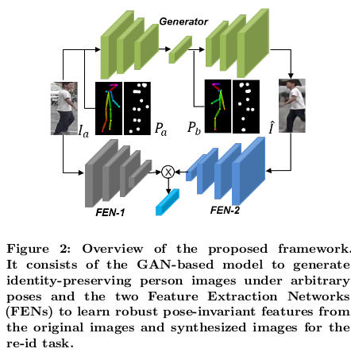

- The framework is composed of a GAN
based network and two Feature Extraction Networks (FEN),
and enjoys following merits. First, it is a unified generative
adversarial model for person image generation and person
re-identification. Second, a pose estimator is utilized into the
generator as a supervisor in the training process, which can
effectively help pose transfer and guide the image generation
with any desired pose.

    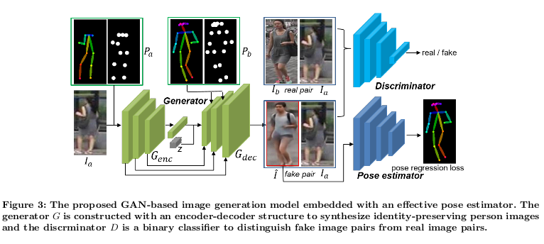

- As a result, the proposed model can
automatically generate a person image under an arbitrary
pose. Third, the identity-sensitive representation is explicitly
disentangled from pose variations through the person identity
and pose embedding. Fourth, the learned re-id model can
have better generalizability on a new person re-id dataset by
using the synthesized images as auxiliary samples. Extensive
experimental results on four standard benchmarks includ-
ing Market-1501 [69], DukeMTMC-reID [40], CUHK03 [23],
and CUHK01 [22] demonstrate that the proposed model can
perform favorably against state-of-the-art methods.

>@inproceedings{li2018unified,
  title={A Unified Generative Adversarial Framework for Image Generation and Person Re-identification},
  author={Li, Yaoyu and Zhang, Tianzhu and Duan, Lingyu and Xu, Changsheng},
  booktitle={2018 ACM Multimedia Conference on Multimedia Conference},
  pages={163--172},
  year={2018},
  organization={ACM}
}
## CA3Net: Contextual-Attentional Attribute-Appearance Network for Re-Identification
1. ACM MM 2018
2. Liu, Jiawei and Zha, Zheng-Jun and Xie, Hongtao and Xiong, Zhiwei and Zhang, Yongdong
3. 190206(2)CA3Net_ Contextual-Attentional Attribute-Appearance Network for ReID.pdf

- Person re-identification aims to identify the same pedestrian across
non-overlapping camera views. Deep learning techniques have been
applied for person re-identification recently, towards learning rep-
resentation of pedestrian appearance.

- This paper presents a novel
Contextual-Attentional Attribute-Appearance Network (CA 3 Net)
for person re-identification. The CA 3 Net simultaneously exploits
the complementarity between semantic attributes and visual ap-
pearance, the semantic context among attributes, visual attention
on attributes as well as spatial dependencies among body parts, lead-
ing to discriminative and robust pedestrian representation.

    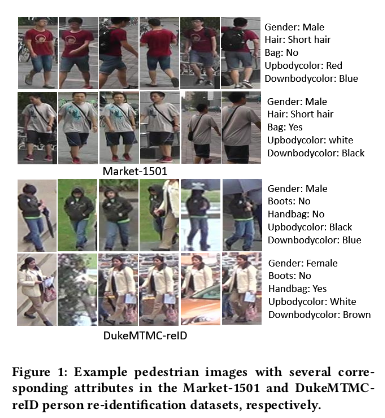

- Specifically, an attribute network within CA 3 Net is designed with an
Attention-LSTM module. It concentrates the network on latent
image regions related to each attribute as well as exploits the se-
mantic context among attributes by a LSTM module. An appearance
network is developed to learn appearance features from the full
body, horizontal and vertical body parts of pedestrians with spatial
dependencies among body parts.

    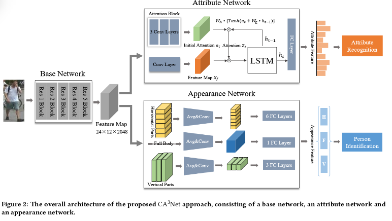

- The CA 3 Net jointly learns the
attribute and appearance features in a multi-task learning manner,
generating comprehensive representation of pedestrians. Extensive
experiments on two challenging benchmarks, i.e., Market-1501 and
DukeMTMC-reID datasets, have demonstrated the effectiveness of
the proposed approach.
>@inproceedings{liu20183,
  title={CA 3 Net: Contextual-Attentional Attribute-Appearance Network for Person Re-Identification},
  author={Liu, Jiawei and Zha, Zheng-Jun and Xie, Hongtao and Xiong, Zhiwei and Zhang, Yongdong},
  booktitle={2018 ACM Multimedia Conference on Multimedia Conference},
  pages={737--745},
  year={2018},
  organization={ACM}
}
## Learning Discriminative Features with Multiple Granularities for Re-Identification
1. ACM MM 2018 Market 95.7
2. Wang, Guanshuo and Yuan, Yufeng and Chen, Xiong and Li, Jiwei and Zhou, Xi
3. 190206(3)Learning Discriminative Features with Multiple Granularities for Reid.pdf

- The combination of global and partial features has been an es-
sential solution to improve discriminative performances in per-
son re-identification (Re-ID) tasks. Previous part-based methods
mainly focus on locating regions with specific pre-defined seman-
tics to learn local representations, which increases learning diffi-
culty but not efficient or robust to scenarios with large variances.
In this paper, we propose an end-to-end feature learning strategy
integrating discriminative information with various granularities.

    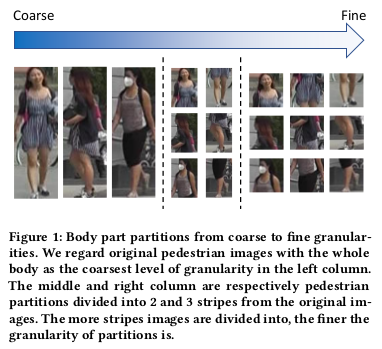

- We carefully design the Multiple Granularity Network (MGN), a
multi-branch deep network architecture consisting of one branch
for global feature representations and two branches for local fea-
ture representations. Instead of learning on semantic regions, we
uniformly partition the images into several stripes, and vary the
number of parts in different local branches to obtain local fea-
ture representations with multiple granularities.

    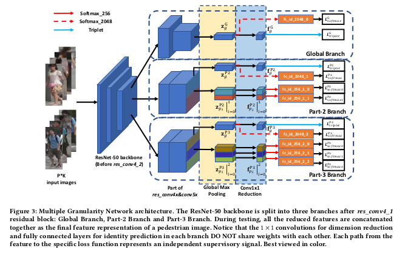

- Comprehensive
experiments implemented on the mainstream evaluation datasets
including Market-1501, DukeMTMC-reid and CUHK03 indicate
that our method robustly achieves state-of-the-art performances
and outperforms any existing approaches by a large margin. For
example, on Market-1501 dataset in single query mode, we obtain
a top result of Rank-1/mAP=96.6%/94.2% with this method after
re-ranking.
>@inproceedings{wang2018learning,
  title={Learning discriminative features with multiple granularities for person re-identification},
  author={Wang, Guanshuo and Yuan, Yufeng and Chen, Xiong and Li, Jiwei and Zhou, Xi},
  booktitle={2018 ACM Multimedia Conference on Multimedia Conference},
  pages={274--282},
  year={2018},
  organization={ACM}
}
## Local Convolutional Neural Networks for Person Re-Identification
1. ACM MM 2018
2. Yang, Jiwei and Shen, Xu and Tian, Xinmei and Li, Houqiang and Huang, Jianqiang and Hua, Xian-Sheng
3. 190206(4)Local Convolutional Neural Networks for Person Re-Identification.pdf

- Recent works have shown that person re-identification can be sub-
stantially improved by introducing attention mechanisms, which
allow learning both global and local representations.

    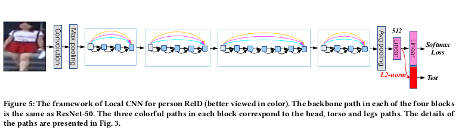

- However, all
these works learn global and local features in separate branches.
As a consequence, the interaction/boosting of global and local in-
formation are not allowed, except in the final feature embedding
layer.

    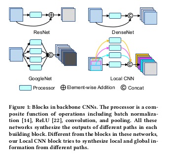

- In this paper, we propose local operations as a generic family
of building blocks for synthesizing global and local information in
any layer.

    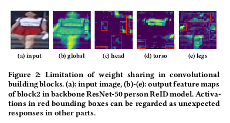

- This building block can be inserted into any convolu-
tional networks with only a small amount of prior knowledge about
the approximate locations of local parts.

    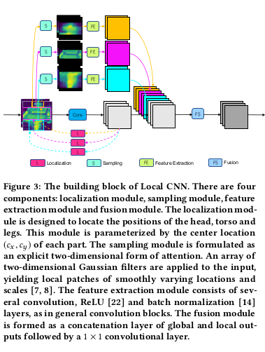

- For the task of person re-
identification, even with only one local block inserted, our local
convolutional neural networks (Local CNN) can outperform state-
of-the-art methods consistently on three large-scale benchmarks,
including Market-1501, CUHK03, and DukeMTMC-ReID.
>@inproceedings{yang2018local,
  title={Local Convolutional Neural Networks for Person Re-Identification},
  author={Yang, Jiwei and Shen, Xu and Tian, Xinmei and Li, Houqiang and Huang, Jianqiang and Hua, Xian-Sheng},
  booktitle={2018 ACM Multimedia Conference on Multimedia Conference},
  pages={1074--1082},
  year={2018},
  organization={ACM}
}

## Online Inter-Camera Trajectory Association Exploiting Person Re-Identification and Camera Topology
1. ACM MM 2018
2. Jiang, Na and Bai, SiChen and Xu, Yue and Xing, Chang and Zhou, Zhong and Wu, Wei
3. 190206(5)Online Inter-Camera Trajectory Association Exploiting Person Re-Identification and Camera Topology.pdf

- Online inter-camera trajectory association is a promising topic in
intelligent video surveillance, which concentrates on associating
trajectories belong to the same individual across different cameras
according to time. It remains challenging due to the inconsistent
appearance of a person in different cameras and the lack of spatio-
temporal constraints between cameras. 

    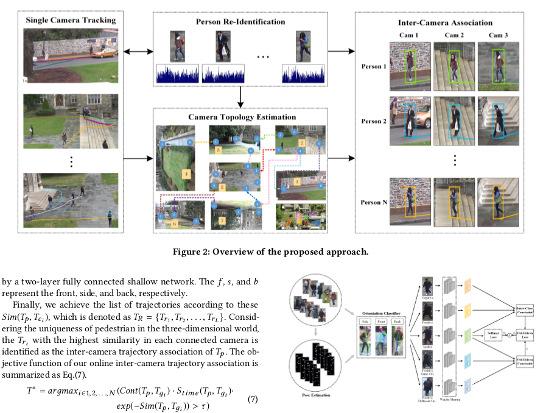

- Besides, the orientation
variations and the partial occlusions significantly increase the dif-
ficulty of inter-camera trajectory association. Targeting to solve
these problems, this work proposes an orientation-driven person re-
identification (ODPR) and an effective camera topology estimation
based on appearance features for online inter-camera trajectory as-
sociation. ODPR explicitly leverages the orientation cues and stable
torso features to learn discriminative feature representations for
identifying trajectories across cameras, which alleviates the pedes-
trian orientation variations by the designed orientation-driven loss
function and orientation aware weights. The effective camera topol-
ogy estimation introduces appearance features to generate the cor-
rect spatio-temporal constraints for narrowing the retrieval range,
which improves the time efficiency and provides the possibility for
intelligent inter-camera trajectory association in large-scale surveil-
lance environments. Extensive experimental results demonstrate
that our proposed approach significantly outperforms most state-
of-the-art methods on the popular person re-identification datasets
and the public multi-target, multi-camera tracking benchmark.

>@inproceedings{jiang2018online,
  title={Online inter-camera trajectory association exploiting person re-identification and camera topology},
  author={Jiang, Na and Bai, SiChen and Xu, Yue and Xing, Chang and Zhou, Zhong and Wu, Wei},
  booktitle={2018 ACM Multimedia Conference on Multimedia Conference},
  pages={1457--1465},
  year={2018},
  organization={ACM}
}

## Person Re-identification with Hierarchical Deep Learning Feature and efficient XQDA Metric
1. ACM MM 2018
2. Zeng, Mingyong and Tian, Chang and Wu, Zemin
3. 190206(6)Person Re-identification with Hierarchical Deep Learning Feature and efficient XQDA Metric.pdf

- Feature learning and metric learning are two important com-
ponents in person re-identification (re-id). In this paper, we
utilize both aspects to refresh the current State-Of-The-Arts
(SOTA). Our solution is based on a classification network
with label smoothing regularization (LSR) and multi-branch
tree structure. The insight is that some middle network lay-
ers are found surprisingly better than the last layers on the
re-id task.

    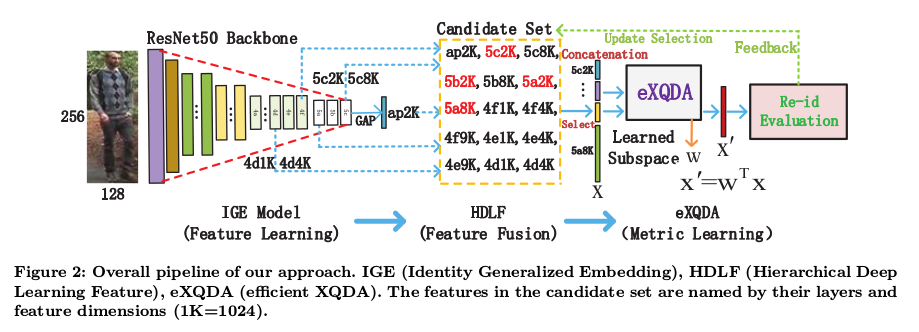

- A Hierarchical Deep Learning Feature (HDLF) is
thus proposed by combining such useful middle layers. To
learn the best metric for the high-dimensional HDLF, an
efficient eXQDA metric is proposed to deal with the large-
scale big-data scenarios.

    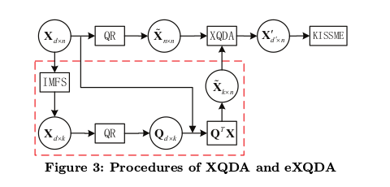

- The proposed HDLF and eXQDA
are evaluated with current SOTA methods on five bench-
mark datasets. Our methods achieve very high re-id results,
which are far beyond state-of-the-art solutions. For exam-
ple, our approach reaches 81.6%, 96.1% and 95.6% Rank-1
accuracies on the ILIDS-VID, PRID2011 and Market-1501
datasets. Besides, the code and related materials (lists of
over 1800 re-id papers and 170 top conference re-id papers)
are released for research purposes 1 .
>@inproceedings{zeng2018person,
  title={Person Re-identification with Hierarchical Deep Learning Feature and efficient XQDA Metric},
  author={Zeng, Mingyong and Tian, Chang and Wu, Zemin},
  booktitle={2018 ACM Multimedia Conference on Multimedia Conference},
  pages={1838--1846},
  year={2018},
  organization={ACM}
}
## Support Neighbor Loss for Person Re-Identification
1. ACM MM 2018
2. Li, Kai and Ding, Zhengming and Li, Kunpeng and Zhang, Yulun and Fu, Yun
3. 190206(7)Support Neighbor Loss for Person Re-Identification.pdf

- Person re-identification (re-ID) has recently been tremendously
boosted due to the advancement of deep convolutional neural net-
works (CNN). The majority of deep re-ID methods focus on de-
signing new CNN architectures, while less attention is paid on
investigating the loss functions. Verification loss and identification
loss are two types of losses widely used to train various deep re-ID
models, both of which however have limitations. Verification loss
guides the networks to generate feature embeddings of which the
intra-class variance is decreased while the inter-class ones is en-
larged.

    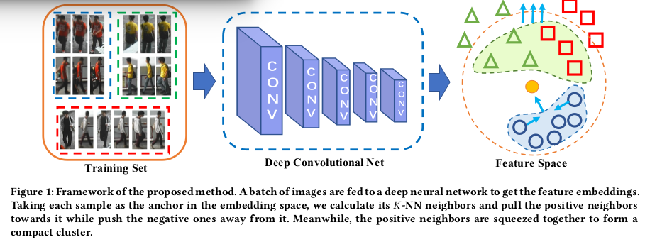

- However, training networks with verification loss tends to
be of slow convergence and unstable performance when the num-
ber of training samples is large. On the other hand, identification
loss has good separating and scalable property. But its neglect to
explicitly reduce the intra-class variance limits its performance on
re-ID, because the same person may have significant appearance
disparity across different camera views. To avoid the limitations of
the two types of losses, we propose a new loss, called support neigh-
bor (SN) loss.

    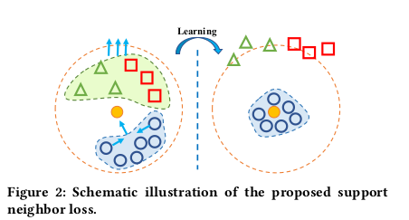

- Rather than being derived from data sample pairs or
triplets, SN loss is calculated based on the positive and negative
support neighbor sets of each anchor sample, which contain more
valuable contextual information and neighborhood structure that
are beneficial for more stable performance. To ensure scalability and
separability, a softmax-like function is formulated to push apart the
positive and negative support sets. To reduce intra-class variance,
the distance between the anchor’s nearest positive neighbor and
furthest positive sample is penalized. Integrating SN loss on top
of Resnet50, superior re-ID results to the state-of-the-art ones are
obtained on several widely used datasets
>@inproceedings{li2018support,
  title={Support Neighbor Loss for Person Re-Identification},
  author={Li, Kai and Ding, Zhengming and Li, Kunpeng and Zhang, Yulun and Fu, Yun},
  booktitle={2018 ACM Multimedia Conference on Multimedia Conference},
  pages={1492--1500},
  year={2018},
  organization={ACM}
}
## Video-based Person Re-identification via Self-Paced Learning and Deep Reinforcement Learning Framework
1. ACM MM 2018
2. Ouyang, Deqiang and Shao, Jie and Zhang, Yonghui and Yang, Yang and Shen, Heng Tao
3. 190206(8)Video-based Person Re-identification via Self-Paced Learning and Deep Reinforcement Learning Framework.pdf

- Person re-identification is an important task in video surveillance,
focusing on finding the same person across different cameras. How-
ever, most existing methods of video-based person re-identification
still have some limitations (e.g., the lack of effective deep learning
framework, the robustness of the model, and the same treatment for
all video frames) which make them unable to achieve better recog-
nition performance.

    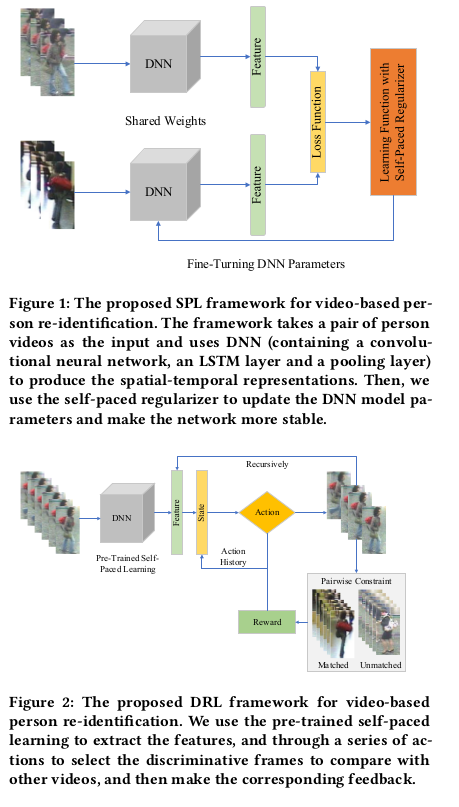

- In this paper, we propose a novel self-paced
learning algorithm for video-based person re-identification, which
could gradually learn from simple to complex samples for a mature
and stable model. Self-paced learning is employed to enhance video-
based person re-identification based on deep neural network, so that
deep neural network and self-paced learning are unified into one
frame. Then, based on the trained self-paced learning, we propose
to employ deep reinforcement learning to discard misleading and
confounding frames and find the most representative frames from
video pairs. With the advantage of deep reinforcement learning,
our method can learn strategies to select the optimal frame groups.
Experiments show that the proposed framework outperforms the
existing methods on the iLIDS-VID, PRID-2011 and MARS datasets.

>@inproceedings{ouyang2018video,
  title={Video-based Person Re-identification via Self-Paced Learning and Deep Reinforcement Learning Framework},
  author={Ouyang, Deqiang and Shao, Jie and Zhang, Yonghui and Yang, Yang and Shen, Heng Tao},
  booktitle={2018 ACM Multimedia Conference on Multimedia Conference},
  pages={1562--1570},
  year={2018},
  organization={ACM}
}
