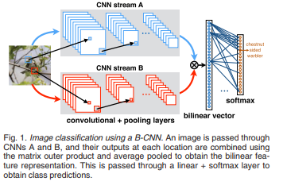
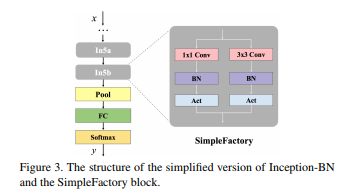

# DailyReadPaper
Today I will summarize Second-order related works as follow,

## Bilinear convolutional neural networks for fine-grained visual recognition
1. TPAMI 2018
2. Lin, Tsung-Yu and RoyChowdhury, Aruni and Maji, Subhransu
3. 190207(1)Bilinear Convolutional Neural Networks.pdf

- We present a simple and effective architecture for fine-grained recognition called Bilinear Convolutional Neural Networks
(B-CNNs). These networks represent an image as a pooled outer product of features derived from two CNNs and capture localized
feature interactions in a translationally invariant manner. B-CNNs are related to orderless texture representations built on deep features
but can be trained in an end-to-end manner.

    

- Our most accurate model obtains 84.1, 79.4, 84.5 and 91.3 percent per-image accuracy
on the Caltech-UCSD birds [1], NABirds [2], FGVC aircraft [3], and Stanford cars [4] dataset respectively and runs at 30 frames-persecond
on a NVIDIA Titan X GPU. We then present a systematic analysis of these networks and show that (1) the bilinear features are
highly redundant and can be reduced by an order of magnitude in size without significant loss in accuracy, (2) are also effective for
other image classification tasks such as texture and scene recognition, and (3) can be trained from scratch on the ImageNet dataset
offering consistent improvements over the baseline architecture. Finally, we present visualizations of these models on various datasets
using top activations of neural units and gradient-based inversion techniques. The source code for the complete system is available at
http://vis-www.cs.umass.edu/bcnn.

>@article{lin2018bilinear,
  title={Bilinear convolutional neural networks for fine-grained visual recognition},
  author={Lin, Tsung-Yu and RoyChowdhury, Aruni and Maji, Subhransu},
  journal={IEEE transactions on pattern analysis and machine intelligence},
  volume={40},
  number={6},
  pages={1309--1322},
  year={2018},
  publisher={IEEE}
}
## Improved bilinear pooling with cnns
1. ACM MM 2018
2. Lin, Tsung-Yu and Maji, Subhransu
3. 190207(2)BMVC2017_Improved Bilinear Pooling with CNNs.pdf

- Bilinear pooling of Convolutional Neural Network (CNN) features [22, 23], and their
compact variants [10], have been shown to be effective at fine-grained recognition, scene
categorization, texture recognition, and visual question-answering tasks among others.
The resulting representation captures second-order statistics of convolutional features in
a translationally invariant manner. In this paper we investigate various ways of normalizing
these statistics to improve their representation power. In particular we find that
the matrix square-root normalization offers significant improvements and outperforms
alternative schemes such as the matrix logarithm normalization when combined with elementwise
square-root and `2 normalization.

    

- This improves the accuracy by 2-3% on a
range of fine-grained recognition datasets leading to a new state of the art.
We also investigate how the accuracy of matrix function computations effect network
training and evaluation. In particular we compare against a technique for estimating
matrix square-root gradients via solving a Lyapunov equation that is more numerically
accurate than computing gradients via a Singular Value Decomposition (SVD). We find
that while SVD gradients are numerically inaccurate the overall effect on the final accuracy
is negligible once boundary cases are handled carefully. We present an alternative
scheme for computing gradients that is faster and yet it offers improvements over the
baseline model. Finally we show that the matrix square-root computed approximately
using a few Newton iterations is just as accurate for the classification task but allows an
order-of-magnitude faster GPU implementation compared to SVD decomposition
>@article{lin2017improved,
  title={Improved bilinear pooling with cnns},
  author={Lin, Tsung-Yu and Maji, Subhransu},
  journal={arXiv preprint arXiv:1707.06772},
  year={2017}
}
## Learning Discriminative Features with Multiple Granularities for Re-Identification
1. ECCV 2018 
2. Tsung-Yu Lin and Subhransu Maji and Piotr Koniusz
3. 190207(3)Second-order Democratic Aggregation.pdf

- Abstract. Aggregated second-order features extracted from deep convolutional
networks have been shown to be effective for texture generation,
fine-grained recognition, material classification, and scene understanding.
In this paper, we study a class of orderless aggregation functions
designed to minimize interference or equalize contributions in the
context of second-order features and we show that they can be computed
just as efficiently as their first-order counterparts and they have favorable
properties over aggregation by summation. Another line of work
has shown that matrix power normalization after aggregation can significantly
improve the generalization of second-order representations.

    

- We
show that matrix power normalization implicitly equalizes contributions
during aggregation thus establishing a connection between matrix normalization
techniques and prior work on minimizing interference. Based
on the analysis we present
γ-democratic aggregators that interpolate between
sum (γ=1) and democratic pooling (γ=0) outperforming both on
several classification tasks. Moreover, unlike power normalization, the
γ-democratic aggregations can be computed in a low dimensional space by
sketching that allows the use of very high-dimensional second-order features.
This results in a state-of-the-art performance on several datasets.
Keywords: Second-order features, democratic pooling, matrix power
normalization, tensor sketching
>@misc{1808.07503,
Author = {Tsung-Yu Lin and Subhransu Maji and Piotr Koniusz},
Title = {Second-order Democratic Aggregation},
Year = {2018},
Eprint = {arXiv:1808.07503},
}

## Towards faster training of global covariance pooling networks by iterative matrix square root normalization
1. CVPR 2018
2. Li, Peihua and Xie, Jiangtao and Wang, Qilong and Gao, Zilin
3. 190207(4)Li_Towards_Faster_Training_CVPR_2018_paper.pdf

- Global covariance pooling in convolutional neural networks
has achieved impressive improvement over the classical
first-order pooling. Recent works have shown matrix
square root normalization plays a central role in achieving
state-of-the-art performance. However, existing methods
depend heavily on eigendecomposition (EIG) or singular
value decomposition (SVD), suffering from inefficient
training due to limited support of EIG and SVD on GPU.
Towards addressing this problem, we propose an iterative
matrix square root normalization method for fast end-toend
training of global covariance pooling networks. At
the core of our method is a meta-layer designed with loopembedded
directed graph structure.

    

- The meta-layer consists
of three consecutive nonlinear structured layers, which
perform pre-normalization, coupled matrix iteration and
post-compensation, respectively. Our method is much faster
than EIG or SVD based ones, since it involves only matrix
multiplications, suitable for parallel implementation on
GPU. Moreover, the proposed network with ResNet architecture
can converge in much less epochs, further accelerating
network training. On large-scale ImageNet, we achieve
competitive performance superior to existing counterparts.
By finetuning our models pre-trained on ImageNet, we establish
state-of-the-art results on three challenging finegrained
benchmarks. The source code and network models
will be available at http://www.peihuali.org/iSQRT-COV.

>@inproceedings{li2018towards,
  title={Towards faster training of global covariance pooling networks by iterative matrix square root normalization},
  author={Li, Peihua and Xie, Jiangtao and Wang, Qilong and Gao, Zilin},
  booktitle={Proceedings of the IEEE Conference on Computer Vision and Pattern Recognition},
  pages={947--955},
  year={2018}
}

## Is second-order information helpful for large-scale visual recognition?
1. ICCV 2017
2. Li, Peihua and Xie, Jiangtao and Wang, Qilong and Zuo, Wangmeng
3. 190207(5)Li_Is_Second-Order_Information_ICCV_2017_paper.pdf

- By stacking layers of convolution and nonlinearity, convolutional
networks (ConvNets) effectively learn from lowlevel
to high-level features and discriminative representations.
Since the end goal of large-scale recognition is to
delineate complex boundaries of thousands of classes, adequate
exploration of feature distributions is important for
realizing full potentials of ConvNets. However, state-of-theart
works concentrate only on deeper or wider architecture
design, while rarely exploring feature statistics higher than
first-order.

    

- We take a step towards addressing this problem.
Our method consists in covariance pooling, instead
of the most commonly used first-order pooling, of highlevel
convolutional features. The main challenges involved
are robust covariance estimation given a small sample of
large-dimensional features and usage of the manifold structure
of covariance matrices. To address these challenges,
we present a Matrix Power Normalized Covariance (MPNCOV)
method. We develop forward and backward propagation
formulas regarding the nonlinear matrix functions
such that MPN-COV can be trained end-to-end. In addition,
we analyze both qualitatively and quantitatively its advantage
over the well-known Log-Euclidean metric. On the
ImageNet 2012 validation set, by combining MPN-COV we
achieve over 4%, 3% and 2.5% gains for AlexNet, VGG-M
and VGG-16, respectively; integration of MPN-COV into
50-layer ResNet outperforms ResNet-101 and is comparable
to ResNet-152. The source code will be available on the
project page: http://www.peihuali.org/MPN-COV.

>@inproceedings{li2017second,
  title={Is second-order information helpful for large-scale visual recognition?},
  author={Li, Peihua and Xie, Jiangtao and Wang, Qilong and Zuo, Wangmeng},
  booktitle={Proceedings of the IEEE International Conference on Computer Vision},
  pages={2070--2078},
  year={2017}
}

## Grassmann pooling as compact homogeneous bilinear pooling for fine-grained visual classification
1. ECCV 2018
2. Wei, Xing and Zhang, Yue and Gong, Yihong and Zhang, Jiawei and Zheng, Nanning
3. 190207(6)Xing_Wei_Grassmann_Pooling_for_ECCV_2018_paper.pdf
- Designing discriminative and invariant features is the key to
visual recognition. Recently, the bilinear pooled feature matrix of Convolutional
Neural Network (CNN) has shown to achieve state-of-the-art
performance on a range of fine-grained visual recognition tasks. The bilinear
feature matrix collects second-order statistics and is closely related
to the covariance matrix descriptor.

    

- However, the bilinear feature could
suffer from the visual burstiness phenomenon similar to other visual representations
such as VLAD and Fisher Vector. The reason is that the
bilinear feature matrix is sensitive to the magnitudes and correlations of
local CNN feature elements which can be measured by its singular values.
On the other hand, the singular vectors are more invariant and reasonable
to be adopted as the feature representation. Motivated by this point,
we advocate an alternative pooling method which transforms the CNN
feature matrix to an orthonormal matrix consists of its principal singular
vectors.

    

- Geometrically, such orthonormal matrix lies on the Grassmann
manifold, a Riemannian manifold whose points represent subspaces of
the Euclidean space. Similarity measurement of images reduces to comparing
the principal angles between these “homogeneous” subspaces and
thus is independent of the magnitudes and correlations of local CNN
activations. In particular, we demonstrate that the projection distance
on the Grassmann manifold deduces a bilinear feature mapping without
explicitly computing the bilinear feature matrix, which enables a very
compact feature and classifier representation. Experimental results show
that our method achieves an excellent balance of model complexity and
accuracy on a variety of fine-grained image classification datasets.

>@inproceedings{wei2018grassmann,
  title={Grassmann pooling as compact homogeneous bilinear pooling for fine-grained visual classification},
  author={Wei, Xing and Zhang, Yue and Gong, Yihong and Zhang, Jiawei and Zheng, Nanning},
  booktitle={Proceedings of the European Conference on Computer Vision (ECCV)},
  pages={355--370},
  year={2018}
}

## G2DeNet: Global Gaussian distribution embedding network and its application to visual recognition},
1. CVPR 2017
2. Wang, Qilong and Li, Peihua and Zhang, Lei},**
3. 190207(7)Wang_G2DeNet_Global_Gaussian_CVPR_2017_paper.pdf

- Recently, plugging trainable structural layers into deep
convolutional neural networks (CNNs) as image representations
has made promising progress. However, there has
been little work on inserting parametric probability distributions,
which can effectively model feature statistics,
into deep CNNs in an end-to-end manner. This paper proposes
a Global Gaussian Distribution embedding Network
(G2DeNet) to take a step towards addressing this problem.

    

- The core of G2DeNet is a novel trainable layer of a
global Gaussian as an image representation plugged into
deep CNNs for end-to-end learning. The challenge is that
the proposed layer involves Gaussian distributions whose
space is not a linear space, which makes its forward and
backward propagations be non-intuitive and non-trivial. To
tackle this issue, we employ a Gaussian embedding strategy
which respects the structures of both Riemannian manifold
and smooth group of Gaussians. Based on this strategy,
we construct the proposed global Gaussian embedding
layer and decompose it into two sub-layers: the matrix partition
sub-layer decoupling the mean vector and covariance
matrix entangled in the embedding matrix, and the squarerooted,
symmetric positive definite matrix sub-layer. In this
way, we can derive the partial derivatives associated with
the proposed structural layer and thus allow backpropagation
of gradients. Experimental results on large scale region
classification and fine-grained recognition tasks show that
G2DeNet is superior to its counterparts, capable of achieving
state-of-the-art performance.
>@inproceedings{wang2017g2denet,
  title={G2DeNet: Global Gaussian distribution embedding network and its application to visual recognition},
  author={Wang, Qilong and Li, Peihua and Zhang, Lei},
  booktitle={Proceedings of the IEEE Conference on Computer Vision and Pattern Recognition},
  pages={2730--2739},
  year={2017}
}

## Monet: Moments embedding network
1. CVPR 2018
2. Gou, Mengran and Xiong, Fei and Camps, Octavia and Sznaier, Mario
3. 190207(8)Gou_MoNet_Moments_Embedding_CVPR_2018_paper.pdf

- Bilinear pooling has been recently proposed as a feature
encoding layer, which can be used after the convolutional
layers of a deep network, to improve performance in multiple
vision tasks. Different from conventional global average
pooling or fully connected layer, bilinear pooling gathers
2nd order information in a translation invariant fashion.
However, a serious drawback of this family of pooling
layers is their dimensionality explosion.

    

- Approximate pooling
methods with compact properties have been explored
towards resolving this weakness. Additionally, recent results
have shown that significant performance gains can be
achieved by adding 1st order information and applying matrix
normalization to regularize unstable higher order information.
However, combining compact pooling with matrix
normalization and other order information has not been
explored until now.

    

- In this paper, we unify bilinear pooling
and the global Gaussian embedding layers through the
empirical moment matrix. In addition, we propose a novel
sub-matrix square-root layer, which can be used to normalize
the output of the convolution layer directly and mitigate
the dimensionality problem with off-the-shelf compact pooling
methods.

    

- Our experiments on three widely used finegrained
classification datasets illustrate that our proposed
architecture, MoNet, can achieve similar or better performance
than with the state-of-art G2DeNet. Furthermore,
when combined with compact pooling technique, MoNet obtains
comparable performance with encoded features with
96% less dimensions.

>@inproceedings{gou2018monet,
  title={Monet: Moments embedding network},
  author={Gou, Mengran and Xiong, Fei and Camps, Octavia and Sznaier, Mario},
  booktitle={Proceedings of the IEEE Conference on Computer Vision and Pattern Recognition},
  pages={3175--3183},
  year={2018}
}
## Attentional pooling for action recognition
1. NIPS 2017
2. Girdhar, Rohit and Ramanan, Deva
3. 190207(9)6609-attentional-pooling-for-action-recognition.pdf
4. https://rohitgirdhar.github.io/AttentionalPoolingAction/

- We introduce a simple yet surprisingly powerful model to incorporate attention
in action recognition and human object interaction tasks. Our proposed attention
module can be trained with or without extra supervision, and gives a sizable boost
in accuracy while keeping the network size and computational cost nearly the
same.

    

- It leads to significant improvements over state of the art base architecture on
three standard action recognition benchmarks across still images and videos, and
establishes new state of the art on MPII dataset with 12.5% relative improvement.
We also perform an extensive analysis of our attention module both empirically and
analytically.

    

- In terms of the latter, we introduce a novel derivation of bottom-up
and top-down attention as low-rank approximations of bilinear pooling methods
(typically used for fine-grained classification). From this perspective, our attention
formulation suggests a novel characterization of action recognition as a fine-grained
recognition problem
>@inproceedings{girdhar2017attentional,
  title={Attentional pooling for action recognition},
  author={Girdhar, Rohit and Ramanan, Deva},
  booktitle={Advances in Neural Information Processing Systems},
  pages={34--45},
  year={2017}
}

## Kernel pooling for convolutional neural networks
1. CVPR 2017
2. Cui, Yin and Zhou, Feng and Wang, Jiang and Liu, Xiao and Lin, Yuanqing and Belongie, Serge
3. 190207(10)Cui_Kernel_Pooling_for_CVPR_2017_paper.pdf
  
- Convolutional Neural Networks (CNNs) with Bilinear
Pooling, initially in their full form and later using compact
representations, have yielded impressive performance gains
on a wide range of visual tasks, including fine-grained visual
categorization, visual question answering, face recognition,
and description of texture and style.

    

- The key to their
success lies in the spatially invariant modeling of pairwise
(2nd order) feature interactions.

    

- In this work, we propose
a general pooling framework that captures higher order interactions
of features in the form of kernels. We demonstrate
how to approximate kernels such as Gaussian RBF
up to a given order using compact explicit feature maps in
a parameter-free manner.

    

- Combined with CNNs, the composition
of the kernel can be learned from data in an endto-end
fashion via error back-propagation.

    

- The proposed
kernel pooling scheme is evaluated in terms of both kernel
approximation error and visual recognition accuracy. Experimental
evaluations demonstrate state-of-the-art performance
on commonly used fine-grained recognition datasets

>@inproceedings{cui2017kernel,
  title={Kernel pooling for convolutional neural networks},
  author={Cui, Yin and Zhou, Feng and Wang, Jiang and Liu, Xiao and Lin, Yuanqing and Belongie, Serge},
  booktitle={Proceedings of the IEEE conference on computer vision and pattern recognition},
  pages={2921--2930},
  year={2017}
}
## Compact generalized non-local network
1. NIPS 2018
2. Yue, Kaiyu and Sun, Ming and Yuan, Yuchen and Zhou, Feng and Ding, Errui and Xu, Fuxin
3. 190207(11)7886-compact-generalized-non-local-network.pdf

- The non-local module [27] is designed for capturing long-range spatio-temporal
dependencies in images and videos.

    

- Although having shown excellent performance,
it lacks the mechanism to model the interactions between positions across channels,
which are of vital importance in recognizing fine-grained objects and actions.

    

- To
address this limitation, we generalize the non-local module and take the correlations
between the positions of any two channels into account. This extension utilizes the
compact representation for multiple kernel functions with Taylor expansion that
makes the generalized non-local module in a fast and low-complexity computation
flow.

    

- Moreover, we implement our generalized non-local method within channel
groups to ease the optimization. Experimental results illustrate the clear-cut
improvements and practical applicability of the generalized non-local module on
both fine-grained object recognition and video classification. Code is available at:
https://github.com/KaiyuYue/cgnl-network.pytorch.
  
>@inproceedings{yue2018compact,
  title={Compact generalized non-local network},
  author={Yue, Kaiyu and Sun, Ming and Yuan, Yuchen and Zhou, Feng and Ding, Errui and Xu, Fuxin},
  booktitle={Advances in Neural Information Processing Systems},
  pages={6511--6520},
  year={2018}
}

## Low-rank bilinear pooling for fine-grained classification
1. CVPR 2017
2. Kong, Shu and Fowlkes, Charless
3. 190207(12)Kong_Low-Rank_Bilinear_Pooling_CVPR_2017_paper.pdf

- Pooling second-order local feature statistics to form
a high-dimensional bilinear feature has been shown to
achieve state-of-the-art performance on a variety of finegrained
classification tasks.

    

- To address the computational
demands of high feature dimensionality, we propose to represent
the covariance features as a matrix and apply a lowrank
bilinear classifier. The resulting classifier can be evaluated
without explicitly computing the bilinear feature map
which allows for a large reduction in the compute time as
well as decreasing the effective number of parameters to be
learned.

    

- To further compress the model, we propose a classifier
co-decomposition that factorizes the collection of bilinear
classifiers into a common factor and compact perclass
terms. The co-decomposition idea can be deployed
through two convolutional layers and trained in an endto-end
architecture.

    

- We suggest a simple yet effective initialization
that avoids explicitly first training and factorizing
the larger bilinear classifiers. Through extensive experiments,
we show that our model achieves state-of-theart
performance on several public datasets for fine-grained
classification trained with only category labels. Importantly,
our final model is an order of magnitude smaller than
the recently proposed compact bilinear model [8], and three
orders smaller than the standard bilinear CNN model [19].

>@inproceedings{kong2017low,
  title={Low-rank bilinear pooling for fine-grained classification},
  author={Kong, Shu and Fowlkes, Charless},
  booktitle={Proceedings of the IEEE conference on computer vision and pattern recognition},
  pages={365--374},
  year={2017}
}

## Factorized bilinear models for image recognition
1. ICCV 2017
2. Li, Yanghao and Wang, Naiyan and Liu, Jiaying and Hou, Xiaodi},
3. 190207(13)Li_Factorized_Bilinear_Models_ICCV_2017_paper.pdf

- Although Deep Convolutional Neural Networks (CNNs)
have liberated their power in various computer vision tasks,
the most important components of CNN, convolutional layers
and fully connected layers, are still limited to linear
transformations.

    

- In this paper, we propose a novel Factorized
Bilinear (FB) layer to model the pairwise feature interactions
by considering the quadratic terms in the transformations.

    

- Compared with existing methods that tried to incorporate
complex non-linearity structures into CNNs, the
factorized parameterization makes our FB layer only require
a linear increase of parameters and affordable computational
cost.

    

- To further reduce the risk of overfitting of
the FB layer, a specific remedy called DropFactor is devised
during the training process. We also analyze the connection
between FB layer and some existing models, and
show FB layer is a generalization to them. Finally, we validate
the effectiveness of FB layer on several widely adopted
datasets including CIFAR-10, CIFAR-100 and ImageNet,
and demonstrate superior results compared with various
state-of-the-art deep models.

>@inproceedings{li2017factorized,
  title={Factorized bilinear models for image recognition},
  author={Li, Yanghao and Wang, Naiyan and Liu, Jiaying and Hou, Xiaodi},
  booktitle={Proceedings of the IEEE International Conference on Computer Vision},
  pages={2079--2087},
  year={2017}
}

## Higher-order integration of hierarchical convolutional activations for fine-grained visual categorization},
1. ICCV 2017
2. Cai, Sijia and Zuo, Wangmeng and Zhang, Lei
3. 190207(14)Cai_Higher-Order_Integration_of_ICCV_2017_paper.pdf

- The success of fine-grained visual categorization
(FGVC) extremely relies on the modeling of appearance
and interactions of various semantic parts. This makes
FGVC very challenging because: (i) part annotation and
detection require expert guidance and are very expensive;
(ii) parts are of different sizes; and (iii) the part interactions
are complex and of higher-order. To address these issues,
we propose an end-to-end framework based on higherorder
integration of hierarchical convolutional activations
for FGVC.

    

- By treating the convolutional activations as local
descriptors, hierarchical convolutional activations can
serve as a representation of local parts from different scales.
A polynomial kernel based predictor is proposed to capture
higher-order statistics of convolutional activations for
modeling part interaction.

    

- To model inter-layer part interactions,
we extend polynomial predictor to integrate hierarchical
activations via kernel fusion. Our work also provides
a new perspective for combining convolutional activations
from multiple layers. While hypercolumns simply concatenate
maps from different layers, and holistically-nested network
uses weighted fusion to combine side-outputs, our approach
exploits higher-order intra-layer and inter-layer relations
for better integration of hierarchical convolutional
features. The proposed framework yields more discriminative
representation and achieves competitive results on the
widely used FGVC datasets.

>@inproceedings{cai2017higher,
  title={Higher-order integration of hierarchical convolutional activations for fine-grained visual categorization},
  author={Cai, Sijia and Zuo, Wangmeng and Zhang, Lei},
  booktitle={Proceedings of the IEEE International Conference on Computer Vision},
  pages={511--520},
  year={2017}
}

## Statistically-motivated second-order pooling},
1. ECCV 2018
2. Yu, Kaicheng and Salzmann, Mathieu},
3. 190207(15)Kaicheng_Yu_Statistically-motivated_Second-order_Pooling_ECCV_2018_paper.pdf

- Second-order pooling, a.k.a. bilinear pooling, has proven effective
for deep learning based visual recognition. However, the resulting
second-order networks yield a inal representation that is orders of
magnitude larger than that of standard, irst-order ones, making them
memory-intensive and cumbersome to deploy.

    

- Here, we introduce a general,
parametric compression strategy that can produce more compact
representations than existing compression techniques, yet outperform
both compressed and uncompressed second-order models. Our approach
is motivated by a statistical analysis of the network’s activations, relying
on operations that lead to a Gaussian-distributed inal representation,
as inherently used by irst-order deep networks.

    

- As evidenced by our
experiments, this lets us outperform the state-of-the-art irst-order and
second-order models on several benchmark recognition datasets.

>@inproceedings{yu2018statistically,
  title={Statistically-motivated second-order pooling},
  author={Yu, Kaicheng and Salzmann, Mathieu},
  booktitle={Proceedings of the European Conference on Computer Vision (ECCV)},
  pages={600--616},
  year={2018}
}

## Hierarchical bilinear pooling for fine-grained visual recognition
1. ECCV 2018
2. Yu, Chaojian and Zhao, Xinyi and Zheng, Qi and Zhang, Peng and You, Xinge
3. 190207(16)Chaojian_Yu_Hierarchical_Bilinear_Pooling_ECCV_2018_paper.pdf

- Fine-grained visual recognition is challenging because it highly
relies on the modeling of various semantic parts and fine-grained feature
learning.

    

- Bilinear pooling based models have been shown to be effective
at fine-grained recognition, while most previous approaches neglect
the fact that inter-layer part feature interaction and fine-grained feature
learning are mutually correlated and can reinforce each other. In this
paper, we present a novel model to address these issues.

    

- First, a crosslayer
bilinear pooling approach is proposed to capture the inter-layer
part feature relations, which results in superior performance compared
with other bilinear pooling based approaches. Second, we propose a novel
hierarchical bilinear pooling framework to integrate multiple cross-layer
bilinear features to enhance their representation capability. Our formulation
is intuitive, efficient and achieves state-of-the-art results on the
widely used fine-grained recognition datasets.

>@inproceedings{yu2018hierarchical,
  title={Hierarchical bilinear pooling for fine-grained visual recognition},
  author={Yu, Chaojian and Zhao, Xinyi and Zheng, Qi and Zhang, Peng and You, Xinge},
  booktitle={Proceedings of the European Conference on Computer Vision (ECCV)},
  pages={574--589},
  year={2018}
}

## Second-order Convolutional Neural Networks
1. Arxiv 2017
2. Kaicheng Yu and Mathieu Salzmann
3. 190207(17)Second-order Convolutional Neural Networks.pdf

- Convolutional Neural Networks (CNNs) have been successfully
applied to many computer vision tasks, such as
image classification.

    

- By performing linear combinations
and element-wise nonlinear operations, these networks can
be thought of as extracting solely first-order information
from an input image. In the past, however, second-order
statistics computed from handcrafted features, e.g., covariances,
have proven highly effective in diverse recognition
tasks.

    

- In this paper, we introduce a novel class of CNNs
that exploit second-order statistics. To this end, we design
a series of new layers that (i) extract a covariance
matrix from convolutional activations, (ii) compute a parametric,
second-order transformation of a matrix, and (iii)
perform a parametric vectorization of a matrix. These operations
can be assembled to form a Covariance Descriptor
Unit (CDU), which replaces the fully-connected layers
of standard CNNs.

    

- Our experiments demonstrate the benefits
of our new architecture, which outperform the first-order
CNNs, while relying on up to 90% fewer parameters.
>@misc{1703.06817,
Author = {Kaicheng Yu and Mathieu Salzmann},
Title = {Second-order Convolutional Neural Networks},
Year = {2017},
Eprint = {arXiv:1703.06817},
}