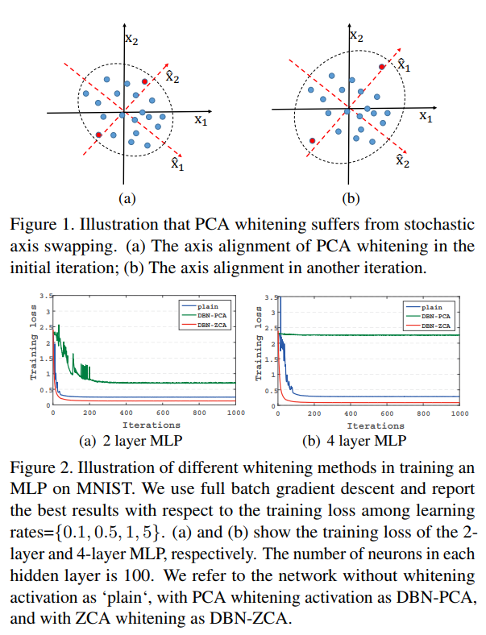
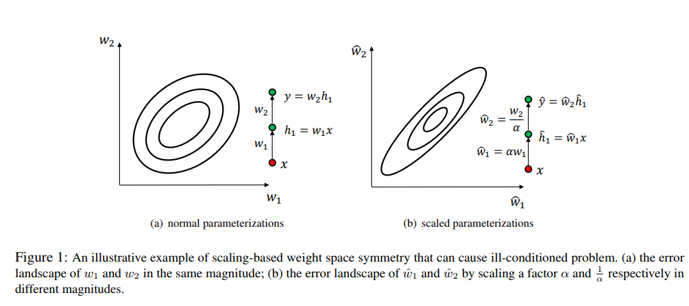
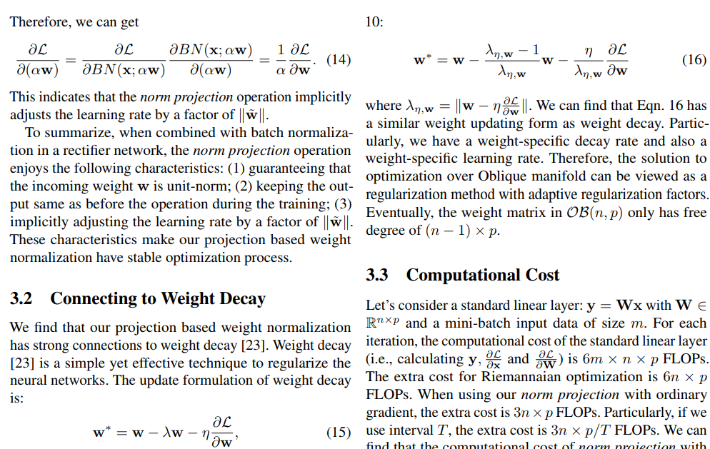
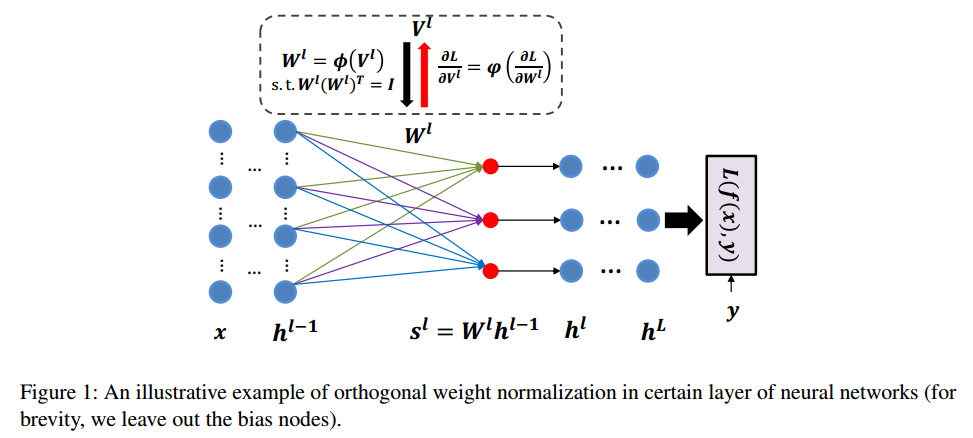
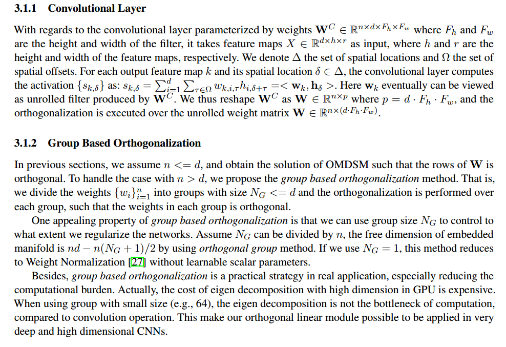
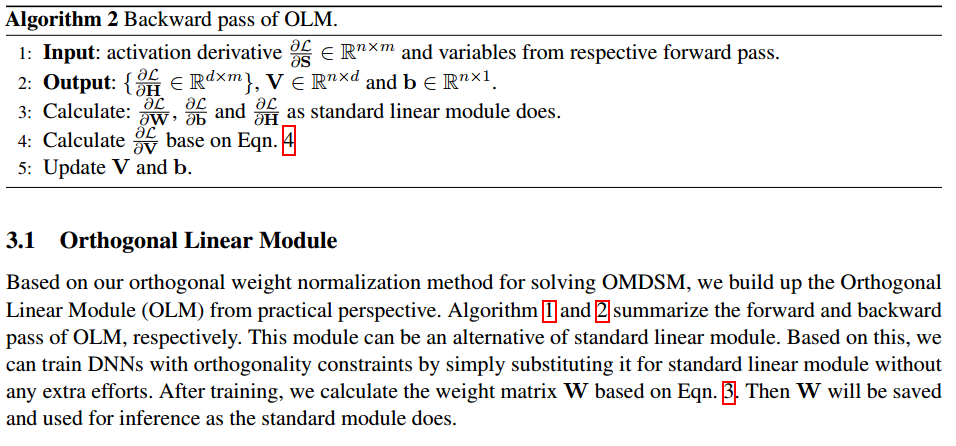
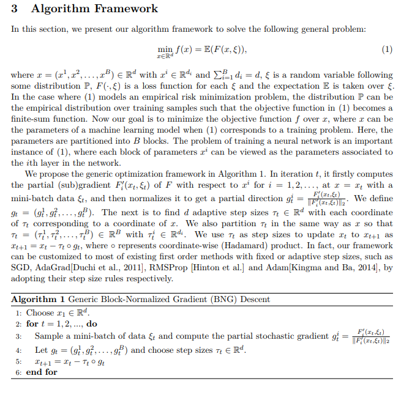
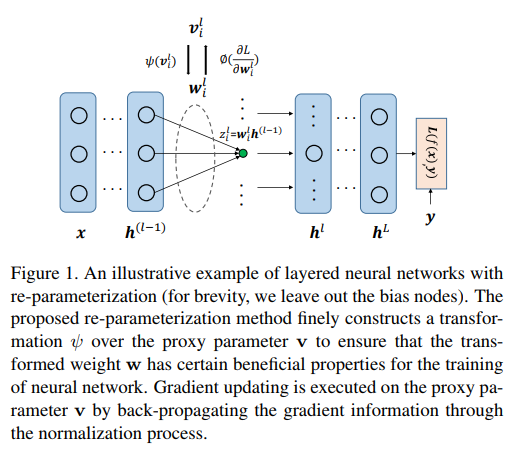

# DailyReadPaper
Today I will summarize the recent Normalization Methods for Training Deep Neural Networks: Theory and Practice

## Decorrelated batch normalization
1. CVPR 2018
2. Huang, Lei and Yang, Dawei and Lang, Bo and Deng, Jia
3. 190208(1)Huang_Decorrelated_Batch_Normalization_CVPR_2018_paper.pdf

- Batch Normalization (BN) is capable of accelerating the
training of deep models by centering and scaling activations
within mini-batches. In this work, we propose Decorrelated Batch Normalization (DBN), which not just centers
and scales activations but whitens them.

    
    
- We explore multiple
whitening techniques, and find that PCA whitening causes a
problem we call stochastic axis swapping, which is detrimental to learning. We show that ZCA whitening does not suffer
from this problem, permitting successful learning. DBN retains the desirable qualities of BN and further improves BN’s
optimization efficiency and generalization ability. We design
comprehensive experiments to show that DBN can improve
the performance of BN on multilayer perceptrons and convolutional neural networks. Furthermore, we consistently
improve the accuracy of residual networks on CIFAR-10,
CIFAR-100, and ImageNet.

>@inproceedings{huang2018decorrelated,
  title={Decorrelated batch normalization},
  author={Huang, Lei and Yang, Dawei and Lang, Bo and Deng, Jia},
  booktitle={Proceedings of the IEEE Conference on Computer Vision and Pattern Recognition},
  pages={791--800},
  year={2018}
}
## Projection based weight normalization for deep neural networks
1. arXiv preprint arXiv:1710.02338
2. Huang, Lei and Liu, Xianglong and Lang, Bo and Li, Bo
3. 190208(2)Projection Based Weight Normalization for Deep Neural Networks.pdf

- Optimizing deep neural networks (DNNs) often suffers
from the ill-conditioned problem. We observe that the
scaling-based weight space symmetry property in rectified
nonlinear network will cause this negative effect. Therefore, we propose to constrain the incoming weights of each
neuron to be unit-norm, which is formulated as an optimization problem over Oblique manifold. A simple yet
efficient method referred to as projection based weight
normalization (PBWN) is also developed to solve this
problem.

    
    
- PBWN executes standard gradient updates, followed by projecting the updated weight back to Oblique
manifold. This proposed method has the property of regularization and collaborates well with the commonly used
batch normalization technique.

    
    
- We conduct comprehensive experiments on several widely-used image datasets
including CIFAR-10, CIFAR-100, SVHN and ImageNet
for supervised learning over the state-of-the-art convolutional neural networks, such as Inception, VGG and residual networks. The results show that our method is able to
improve the performance of DNNs with different architectures consistently. We also apply our method to Ladder
network for semi-supervised learning on permutation invariant MNIST dataset, and our method outperforms the
state-of-the-art methods: we obtain test errors as 2.52%,
1.06%, and 0.91% with only 20, 50, and 100 labeled samples, respectively

>@article{huang2017projection,
  title={Projection based weight normalization for deep neural networks},
  author={Huang, Lei and Liu, Xianglong and Lang, Bo and Li, Bo},
  journal={arXiv preprint arXiv:1710.02338},
  year={2017}
}

## Orthogonal weight normalization: Solution to optimization over multiple dependent stiefel manifolds in deep neural networks
1. AAAI 2018
2. Huang, Lei and Liu, Xianglong and Lang, Bo and Yu, Adams Wei and Wang, Yongliang and Li, Bo
3. 190208(3)Orthogonal Weight Normalization- Solution to Optimization over Multiple Dependent Stiefel Manifolds in DNN.pdf

- Orthogonal matrix has shown advantages in training Recurrent Neural Networks (RNNs), but such
matrix is limited to be square for the hidden-to-hidden transformation in RNNs. In this paper, we generalize
such square orthogonal matrix to orthogonal rectangular matrix and formulating this problem in feedforward Neural Networks (FNNs) as Optimization over Multiple Dependent Stiefel Manifolds (OMDSM).
We show that the rectangular orthogonal matrix can stabilize the distribution of network activations and
regularize FNNs.

    
    
- We also propose a novel orthogonal weight normalization method to solve OMDSM.
Particularly, it constructs orthogonal transformation over proxy parameters to ensure the weight matrix
is orthogonal and back-propagates gradient information through the transformation during training. To
guarantee stability, we minimize the distortions between proxy parameters and canonical weights over
all tractable orthogonal transformations.

    
    
- In addition, we design an orthogonal linear module (OLM) to
learn orthogonal filter banks in practice, which can be used as an alternative to standard linear module.
Extensive experiments demonstrate that by simply substituting OLM for standard linear module without
revising any experimental protocols, our method largely improves the performance of the state-of-the-art
networks, including Inception and residual networks on CIFAR and ImageNet datasets.

    
    
- In particular, we have reduced the test error of wide residual network on CIFAR-100 from 20.04% to 18.61% with such
simple substitution. Our code is available online for result reproduction.
>@inproceedings{huang2018orthogonal,
  title={Orthogonal weight normalization: Solution to optimization over multiple dependent stiefel manifolds in deep neural networks},
  author={Huang, Lei and Liu, Xianglong and Lang, Bo and Yu, Adams Wei and Wang, Yongliang and Li, Bo},
  booktitle={Thirty-Second AAAI Conference on Artificial Intelligence},
  year={2018}
}
## Block-normalized gradient method: An empirical study for training deep neural network
1. Arxiv 2017
2. Yu, Adams Wei and Huang, Lei and Lin, Qihang and Salakhutdinov, Ruslan and Carbonell, Jaime
3. 190208(4)Block-Normalized Gradient Method An Empirical Study for.pdf
- In this paper, we propose a generic and simple strategy for utilizing stochastic gradient
information in optimization. The technique essentially contains two consecutive steps in each
iteration: 1) computing and normalizing each block (layer) of the mini-batch stochastic gradient;
2) selecting appropriate step size to update the decision variable (parameter) towards the negative
of the block-normalized gradient.

    

- We conduct extensive empirical studies on various non-convex
neural network optimization problems, including multi layer perceptron, convolution neural
networks and recurrent neural networks. The results indicate the block-normalized gradient can
help accelerate the training of neural networks. In particular, we observe that the normalized
gradient methods having constant step size with occasionally decay, such as SGD with momentum,
have better performance in the deep convolution neural networks, while those with adaptive step
sizes, such as Adam, perform better in recurrent neural networks. Besides, we also observe this
line of methods can lead to solutions with better generalization properties, which is confirmed
by the performance improvement over strong baselines.

>@article{yu2017block,
  title={Block-normalized gradient method: An empirical study for training deep neural network},
  author={Yu, Adams Wei and Huang, Lei and Lin, Qihang and Salakhutdinov, Ruslan and Carbonell, Jaime},
  journal={arXiv preprint arXiv:1707.04822},
  year={2017}
}

## Centered Weight Normalization in Accelerating Training of Deep Neural Networks
1. ICCV 2017
2. Lei Huang, Xianglong Liu*, Yang Liu, Bo Lang, Dacheng Tao
3. 190208(5)ICCV2017_camera.pdf
- Training deep neural networks is difficult for the pathological curvature problem. Re-parameterization is an effective way to relieve the problem by learning the curvature
approximately or constraining the solutions of weights with
good properties for optimization. 

    

- This paper proposes to reparameterize the input weight of each neuron in deep neural
networks by normalizing it with zero-mean and unit-norm,
followed by a learnable scalar parameter to adjust the norm
of the weight. This technique effectively stabilizes the distribution implicitly. Besides, it improves the conditioning
of the optimization problem and thus accelerates the training of deep neural networks. It can be wrapped as a linear
module in practice and plugged in any architecture to replace the standard linear module. We highlight the benefits
of our method on both multi-layer perceptrons and convolutional neural networks, and demonstrate its scalability and
efficiency on SVHN, CIFAR-10, CIFAR-100 and ImageNet
datasets.

>@inproceedings{Huang:2017:iccv,
  author    = {Lei Huang, Xianglong Liu*, Yang Liu, Bo Lang, Dacheng Tao},
  title     = {Centered Weight Normalization in Accelerating Training of Deep Neural Networks},
  booktitle = {IEEE ICCV},
  year      = {2017},
}

## Weight Normalization: A Simple Reparameterization to Accelerate Training of Deep Neural Networks
1. NIPS 2016
2. Salimans, Tim and Kingma, Durk P
3. 190208(6)6114-weight-normalization-a-simple-reparameterization-to-accelerate-training-of-deep-neural-networks.pdf
- We present weight normalization: a reparameterization of the weight vectors
in a neural network that decouples the length of those weight vectors from their
direction. By reparameterizing the weights in this way we improve the conditioning
of the optimization problem and we speed up convergence of stochastic gradient
descent. Our reparameterization is inspired by batch normalization but does not
introduce any dependencies between the examples in a minibatch. This means
that our method can also be applied successfully to recurrent models such as
LSTMs and to noise-sensitive applications such as deep reinforcement learning
or generative models, for which batch normalization is less well suited. Although
our method is much simpler, it still provides much of the speed-up of full batch
normalization. In addition, the computational overhead of our method is lower,
permitting more optimization steps to be taken in the same amount of time. We
demonstrate the usefulness of our method on applications in supervised image
recognition, generative modelling, and deep reinforcement learning.
>@inproceedings{salimans2016weight,
  title={Weight normalization: A simple reparameterization to accelerate training of deep neural networks},
  author={Salimans, Tim and Kingma, Durk P},
  booktitle={Advances in Neural Information Processing Systems},
  pages={901--909},
  year={2016}
}

## Learning a smooth kernel regularizer for convolutional neural networks
1. Arxiv 5th March 2019
2. Reuben Feinman (reuben.feinman@nyu.edu) Center for Neural Science New York University
3. 190208(7)Learning a smooth kernel regularizer for convolutional neural networks.pdf

- Modern deep neural networks require a tremendous amount
of data to train, often needing hundreds or thousands of labeled
examples to learn an effective representation. For these
networks to work with less data, more structure must be built
into their architectures or learned from previous experience.
The learned weights of convolutional neural networks (CNNs)
trained on large datasets for object recognition contain a substantial
amount of structure. These representations have parallels
to simple cells in the primary visual cortex, where receptive
fields are smooth and contain many regularities. Incorporating
smoothness constraints over the kernel weights
of modern CNN architectures is a promising way to improve
their sample complexity. We propose a smooth kernel regularizer
that encourages spatial correlations in convolution kernel
weights. The correlation parameters of this regularizer are
learned from previous experience, yielding a method with a
hierarchical Bayesian interpretation. We show that our correlated
regularizer can help constrain models for visual recognition,
improving over an L2 regularization baseline.

>@misc{1903.01882,
Author = {Reuben Feinman and Brenden M. Lake},
Title = {Learning a smooth kernel regularizer for convolutional neural networks},
Year = {2019},
Eprint = {arXiv:1903.01882},
}
