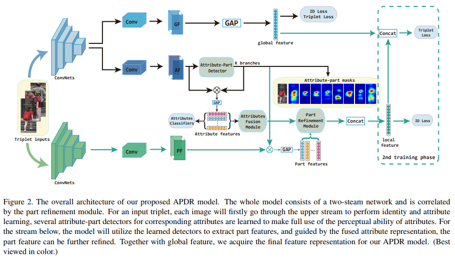

# DailyReadPaper
Today I will summarize the recent Attribute Re-ID Methods:

## Improving person re-identification by attribute and identity learning
1. ICCV 2017
2. Lin, Yutian and Zheng, Liang and Zheng, Zhedong and Wu, Yu and Yang, Yi
3. 190209(1)Improving Person Re-identification by Attribute and Identity Learning.pdf

- Person re-identification (re-ID) and attribute recognition
share a common target at the pedestrian description. Their
difference consists in the granularity. Attribute recognition
focuses on local aspects of a person while person re-ID
usually extracts global representations.

    

- Considering their
similarity and difference, this paper proposes a very simple
convolutional neural network (CNN) that learns a re-ID
embedding and predicts the pedestrian attributes simultaneously.

    

- This multi-task method integrates an ID classification
loss and a number of attribute classification losses, and
back-propagates the weighted sum of the individual losses.
Albeit simple, we demonstrate on two pedestrian benchmarks
that by learning a more discriminative representation,
our method significantly improves the re-ID baseline
and is scalable on large galleries. We report competitive reID
performance compared with the state-of-the-art methods
on the two datasets.

>@article{lin2017improving,
  title={Improving person re-identification by attribute and identity learning},
  author={Lin, Yutian and Zheng, Liang and Zheng, Zhedong and Wu, Yu and Yang, Yi},
  journal={arXiv preprint arXiv:1703.07220},
  year={2017}
}

## Multi-Task Learning with Low Rank Attribute Embedding for Multi-Camera Person Re-Identification
1. TPAMI 2018
2. Su, Chi and Yang, Fan and Zhang, Shiliang and Tian, Qi and Davis, Larry Steven and Gao, Wen
3. 190209(2)Multi-Task Learning with Low Rank Attribute Embedding for Multi-Camera Person Re-Identification.pdf
- We propose Multi-Task Learning with Low Rank Attribute Embedding (MTL-LORAE) to address the problem of person reidentification
on multi-cameras. Re-identifications on different cameras are considered as related tasks, which allows the shared
information among different tasks to be explored to improve the re-identification accuracy. 

    

- The MTL-LORAE framework integrates lowlevel
features with mid-level attributes as the descriptions for persons. To improve the accuracy of such description, we introduce the
low-rank attribute embedding, which maps original binary attributes into a continuous space utilizing the correlative relationship
between each pair of attributes.

    

- In this way, inaccurate attributes are rectified and missing attributes are recovered. The resulting
objective function is constructed with an attribute embedding error and a quadratic loss concerning class labels. It is solved by an
alternating optimization strategy. The proposed MTL-LORAE is tested on four datasets and is validated to outperform the existing
methods with significant margins.

>@article{su2018multi,
  title={Multi-task learning with low rank attribute embedding for multi-camera person re-identification},
  author={Su, Chi and Yang, Fan and Zhang, Shiliang and Tian, Qi and Davis, Larry Steven and Gao, Wen},
  journal={IEEE transactions on pattern analysis and machine intelligence},
  volume={40},
  number={5},
  pages={1167--1181},
  year={2018},
  publisher={IEEE}
}

## Transferable Joint Attribute-Identity Deep Learning for Unsupervised Person Re-Identification
1. CVPR 2018
2. Wang, Jingya and Zhu, Xiatian and Gong, Shaogang and Li, Wei
3. 190209(3)Wang_Transferable_Joint_Attribute-Identity_CVPR_2018_paper.pdf

- Most existing person re-identification (re-id) methods require 
supervised model learning from a separate large set of pairwise 
labelled training data for every single camera pair.

    

- This significantly
limits their scalability and usability in real-world large scale deployments with 
the need for performing re-id across many camera views. To address this scalability 
problem, we develop a novel deep learning method for transferring the labelled information of 
an existing dataset to a new unseen (unlabelled) target domain for person re-id without any 
supervised learning in the target domain.

    

- Specifically, we introduce an Transferable Joint 
Attribute-Identity Deep Learning (TJ-AIDL) for simultaneously learning an attribute-semantic 
and identitydiscriminative feature representation space transferrable to any new (unseen) target
domain for re-id tasks without the need for collecting new labelled training data from the 
target domain (i.e. unsupervised learning in the target domain). Extensive comparative evaluations 
validate the superiority of this new TJ-AIDL model for unsupervised person re-id over a wide range 
of state-of- the-art methods on four challenging benchmarks including VIPeR, PRID, Market-1501, and 
DukeMTMC-ReID.
  
>@InProceedings{Wang_2018_CVPR,
author = {Wang, Jingya and Zhu, Xiatian and Gong, Shaogang and Li, Wei},
title = {Transferable Joint Attribute-Identity Deep Learning for Unsupervised Person Re-Identification},
booktitle = {The IEEE Conference on Computer Vision and Pattern Recognition (CVPR)},
month = {June},
year = {2018}
}

## Multi-type attributes driven multi-camera person re-identification
1. Pattern Recognition 2018
2. Su, Chi and Zhang, Shiliang and Xing, Junliang and Gao, Wen and Tian, Qi
3. 190209(4)Multi-typeattributesdrivenmulti-camerapersonre-identification.pdf

- One of the major challenges in person Re-Identification (ReID) is the inconsistent visual appearance of a
person. Current works on visual feature and distance metric learning have achieved significant achieve-
ments, but still suffer from the limited robustness to pose variations, viewpoint changes, etc ., and the
high computational complexity.

    

- This makes person ReID among multiple cameras still challenging. This
work is motivated to learn mid-level human attributes which are robust to visual appearance variations
and could be used as efficient features for person matching.

    

- We propose a weakly supervised multi-type
attribute learning framework which considers the contextual cues among attributes and progressively
boosts the accuracy of attributes only using a limited number of labeled data. Specifically, this frame-
work involves a three-stage training. A deep Convolutional Neural Network (dCNN) is first trained on an
independent dataset labeled with attributes. Then it is fine-tuned on another dataset only labeled with
person IDs using our defined triplet loss.

    

- Finally, the updated dCNN predicts attribute labels for the target
dataset, which is combined with the independent dataset for the final round of fine-tuning. The predicted
attributes, namely deep attributes exhibit promising generalization ability across different datasets. By di-
rectly using the deep attributes with simple Cosine distance, we have obtained competitive accuracy on
four person ReID datasets. Experiments also show that a simple distance metric learning modular further
boosts our method, making it outperform many recent works.
>@article{su2018multi,
  title={Multi-type attributes driven multi-camera person re-identification},
  author={Su, Chi and Zhang, Shiliang and Xing, Junliang and Gao, Wen and Tian, Qi},
  journal={Pattern Recognition},
  volume={75},
  pages={77--89},
  year={2018},
  publisher={Elsevier}
}

@inproceedings{chang2018multi,
  title={Multi-level factorisation net for person re-identification},
  author={Chang, Xiaobin and Hospedales, Timothy M and Xiang, Tao},
  booktitle={Proceedings of the IEEE Conference on Computer Vision and Pattern Recognition},
  pages={2109--2118},
  year={2018}
}

# Multi-Level Factorisation Net for Person Re-Identification
1. CVPR 2018
2. Chang, Xiaobin and Hospedales, Timothy M. and Xiang, Tao
3. 190209(5)Chang_Multi-Level_Factorisation_Net_CVPR_2018_paper.pdf

- Key to effective person re-identification (Re-ID) is modelling
discriminative and view-invariant factors of person
appearance at both high and low semantic levels. Recently
developed deep Re-ID models either learn a holistic single
semantic level feature representation and/or require laborious
human annotation of these factors as attributes.

    

- We
propose Multi-Level Factorisation Net (MLFN), a novel network
architecture that factorises the visual appearance of a
person into latent discriminative factors at multiple semantic
levels without manual annotation. MLFN is composed
of multiple stacked blocks.

    

- Each block contains multiple
factor modules to model latent factors at a specific level,
and factor selection modules that dynamically select the
factor modules to interpret the content of each input image.

- The outputs of the factor selection modules also provide
a compact latent factor descriptor that is complementary
to the conventional deeply learned features. MLFN
achieves state-of-the-art results on three Re-ID datasets, as
well as compelling results on the general object categorisation
CIFAR-100 dataset.

>@InProceedings{Chang_2018_CVPR,
author = {Chang, Xiaobin and Hospedales, Timothy M. and Xiang, Tao},
title = {Multi-Level Factorisation Net for Person Re-Identification},
booktitle = {The IEEE Conference on Computer Vision and Pattern Recognition (CVPR)},
month = {June},
year = {2018}
}

## Attributes-aided Part Detection and Refinement for Person Re-identification
1. arXiv 2019 02
2. Li, Shuzhao and Yu, Huimin and Huang, Wei and Zhang, Jing
3. 190209(6)Attributes-aided Part Detection and Refinement for Person Re-identification.pdf

- Person attributes are often exploited as mid-level human
semantic information to help promote the performance of
person re-identification task.

    

- In this paper, unlike most existing
methods simply taking attribute learning as a classification
problem, we perform it in a different way with
the motivation that attributes are related to specific local
regions, which refers to the perceptual ability of attributes.
We utilize the process of attribute detection to
generate corresponding attribute-part detectors, whose invariance
to many influences like poses and camera views
can be guaranteed.

    

- With detected local part regions, our
model extracts local features to handle the body part misalignment
problem, which is another major challenge for
person re-identification. The local descriptors are further
refined by fused attribute information to eliminate interferences
caused by detection deviation. Extensive experiments
on two popular benchmarks with attribute annotations
demonstrate the effectiveness of our model and competitive
performance compared with state-of-the-art algorithms

>@article{li2019attributes,
  title={Attributes-aided Part Detection and Refinement for Person Re-identification},
  author={Li, Shuzhao and Yu, Huimin and Huang, Wei and Zhang, Jing},
  journal={arXiv preprint arXiv:1902.10528},
  year={2019}
}

## Attention driven person re-identification
1. Pattern Recognition 2018
2. Fan Yang and Ke Yan and Shijian Lu and Huizhu Jia and Xiaodong Xie and Wen Gao
3. 190209(7)Attention driven person re-identification.pdf

- Person re-identification (ReID) is a challenging task due to arbitrary human pose variations, background
clutters, etc.

    

- It has been studied extensively in recent years, but the multifarious local and global fea-
tures are still not fully exploited by either ignoring the interplay between whole-body images and body-
part images or missing in-depth examination of specific body-part images.

    

- In this paper, we propose a
novel attention-driven multi-branch network that learns robust and discriminative human representation
from global whole-body images and local body-part images simultaneously. Within each branch, an intra-
attention network is designed to search for informative and discriminative regions within the whole-body
or body-part images, where attention is elegantly decomposed into spatial-wise attention and channel-
wise attention for effective and efficient learning.

    

- In addition, a novel inter-attention module is designed
which fuses the output of intra-attention networks adaptively for optimal person ReID. The proposed
technique has been evaluated over three widely used datasets CUHK03, Market-1501 and DukeMTMC-
ReID, and experiments demonstrate its superior robustness and effectiveness as compared with the state
of the arts.

>@article{YANG2019143,
title = "Attention driven person re-identification",
journal = "Pattern Recognition",
volume = "86",
pages = "143 - 155",
year = "2019",
issn = "0031-3203",
doi = "https://doi.org/10.1016/j.patcog.2018.08.015",
url = "http://www.sciencedirect.com/science/article/pii/S0031320318303133",
author = "Fan Yang and Ke Yan and Shijian Lu and Huizhu Jia and Xiaodong Xie and Wen Gao",
keywords = "Person re-identification, Visual attention, Pose estimation, Deep neural networks",
abstract = "Person re-identification (ReID) is a challenging task due to arbitrary human pose variations, background clutters, etc. It has been studied extensively in recent years, but the multifarious local and global features are still not fully exploited by either ignoring the interplay between whole-body images and body-part images or missing in-depth examination of specific body-part images. In this paper, we propose a novel attention-driven multi-branch network that learns robust and discriminative human representation from global whole-body images and local body-part images simultaneously. Within each branch, an intra-attention network is designed to search for informative and discriminative regions within the whole-body or body-part images, where attention is elegantly decomposed into spatial-wise attention and channel-wise attention for effective and efficient learning. In addition, a novel inter-attention module is designed which fuses the output of intra-attention networks adaptively for optimal person ReID. The proposed technique has been evaluated over three widely used datasets CUHK03, Market-1501 and DukeMTMC-ReID, and experiments demonstrate its superior robustness and effectiveness as compared with the state of the arts."
}

## Enhancing Person Retrieval with Joint Person Detection, Attribute Learning, and Identification
1. PCM 2018
2. Wu, Jianwen and Zhao, Ye and Liu, Xueliang
3. 190209(8)PCM_Wu2018_Chapter_EnhancingPersonRetrievalWithJo.pdf
- Person re-identification receives increasing attention in
recent years. 

    

- However, most works assume the persons have been well
cropped from the whole scene images, and only focus on learning features
and metrics. This paper considers the person re-identification problem in
a real-world scenario, which should consider detection and identification
simultaneously. 

    

- This paper proposes a multi-task learning framework for
person retrieval in the wild. Person attribute learning is exploited in our
framework to enhance person retrieval.

    

- Our work consists of two main
contributions: (1) we present a 11 image-level attribute annotations for
each image in the large-scale PRW [27] dataset, and (2) we develop an
end-to-end person retrieval framework which jointly learns person detec-
tor, attribute detectors, and visual embeddings in a multi-task learn-
ing manner. We evaluate the effectiveness of the proposed approach on
two tasks, i.e. person attribute recognition and person re-identification.
Experimental results have demonstrated the effectiveness of the proposed
approach.

>@inproceedings{wu2018enhancing,
  title={Enhancing Person Retrieval with Joint Person Detection, Attribute Learning, and Identification},
  author={Wu, Jianwen and Zhao, Ye and Liu, Xueliang},
  booktitle={Pacific Rim Conference on Multimedia},
  pages={113--124},
  year={2018},
  organization={Springer}
}