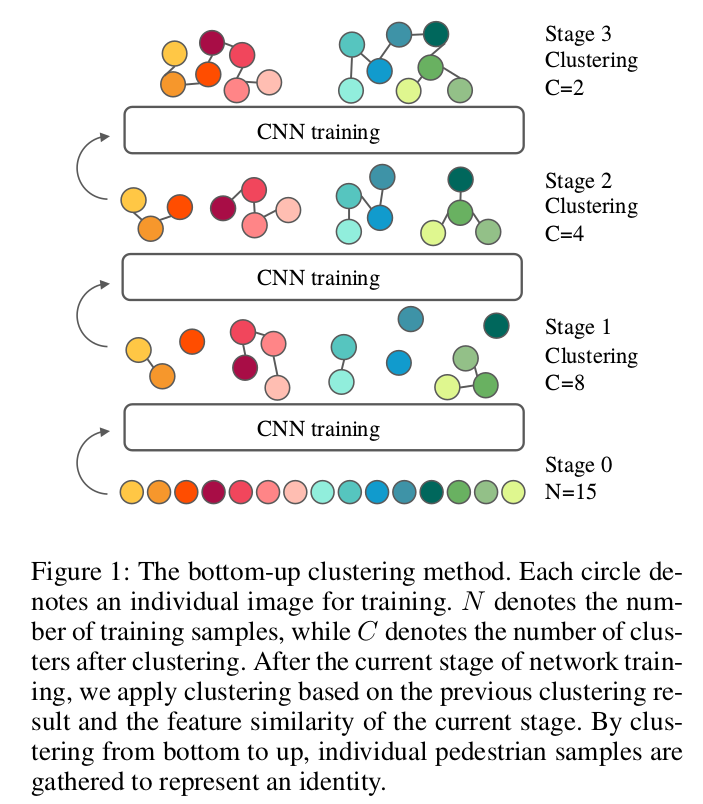
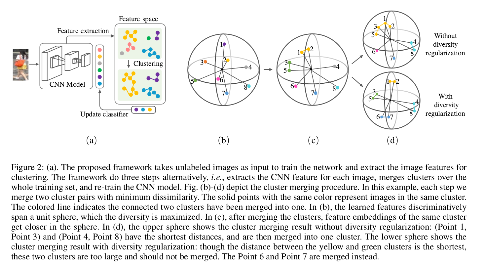
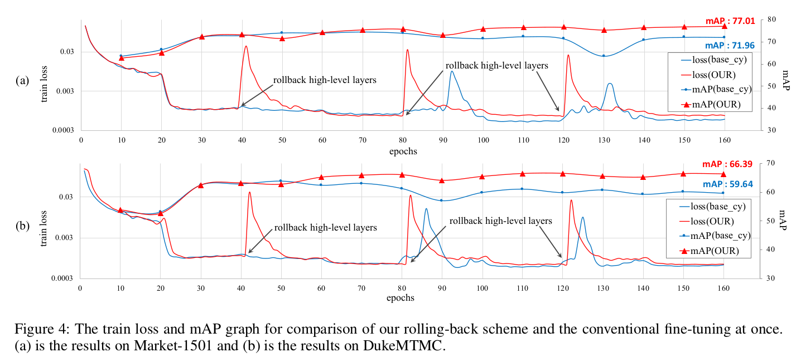
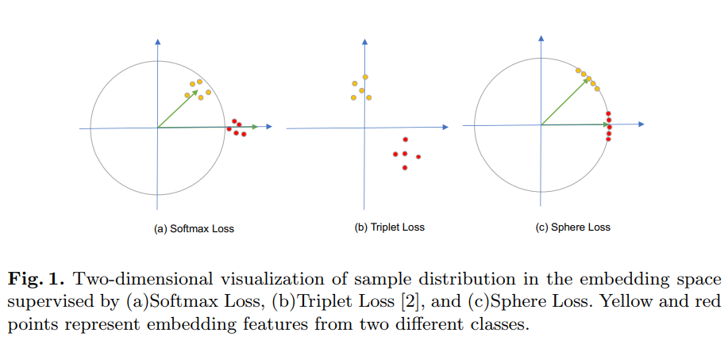
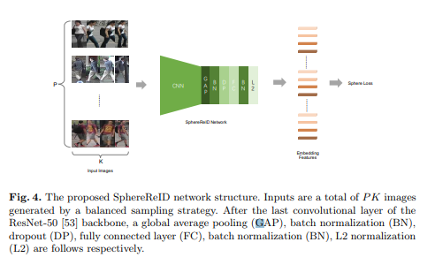
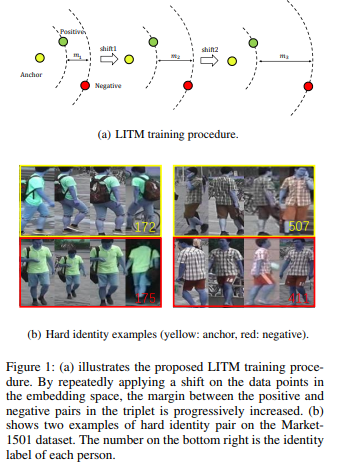
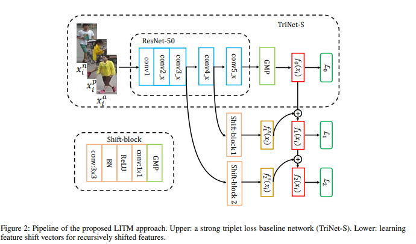

# DailyReadPaper
Today I will summarize the ReID-related works from AAAI 2019:

## A Bottom-Up Clustering Approach to Unsupervised Person Re-identification
1. AAAI 2019
2. Lin, Yutian and Dong, Xuanyi and Zheng, Liang and Yan, Yan and Yang, Yi
3. 190210(1)AAAI19_A Bottom-up Clustering Approach to Unsupervised Person Re-identification.pdf

- Most person re-identification (re-ID) approaches are based
on supervised learning, which requires intensive manual an-
notation for training data. However, it is not only resource-
intensive to acquire identity annotation but also impractical
to label the large-scale real-world data. To relieve this prob-
lem, we propose a bottom-up clustering (BUC) approach to
jointly optimize a convolutional neural network (CNN) and
the relationship among the individual samples.

    

- Our algorithm
considers two fundamental facts in the re-ID task, i.e., diver-
sity across different identities and similarity within the same
identity. Specifically, our algorithm starts with regarding in-
dividual sample as a different identity, which maximizes the
diversity over each identity. Then it gradually groups sim-
ilar samples into one identity, which increases the similar-
ity within each identity.

    

- We utilizes a diversity regulariza-
tion term in the bottom-up clustering procedure to balance
the data volume of each cluster. Finally, the model achieves
an effective trade-off between the diversity and similarity. We
conduct extensive experiments on the large-scale image and
video re-ID datasets, including Market-1501, DukeMTMC-
reID, MARS and DukeMTMC-VideoReID. The experimen-
tal results demonstrate that our algorithm is not only supe-
rior to state-of-the-art unsupervised re-ID approaches, but
also performs favorably than competing transfer learning and
semi-supervised learning methods.

>@inproceedings{lin2019aBottom,
  title     = {A Bottom-Up Clustering Approach to Unsupervised Person Re-identification},
  author    = {Lin, Yutian and Dong, Xuanyi and Zheng, Liang and Yan, Yan and Yang, Yi},
  booktitle = {AAAI Conference on Artificial Intelligence (AAAI)},
  year      = {2019}
}

## Backbone Can Not be Trained at Once: Rolling Back to Pre-trained Network for Person Re-Identification
1. AAAI 2019
2. Youngmin Ro, Jongwon Choi, Dae Ung Jo, Byeongho Heo, Jongin Lim, Jin Young Choi
3. 190210(2)TrainStritegy.pdf

- In person re-identification (ReID) task, because of its short-
age of trainable dataset, it is common to utilize fine-tuning
method using a classification network pre-trained on a large
dataset. However, it is relatively difficult to sufficiently fine-
tune the low-level layers of the network due to the gradi-
ent vanishing problem.

    

- In this work, we propose a novel
fine-tuning strategy that allows low-level layers to be suf-
ficiently trained by rolling back the weights of high-level
layers to their initial pre-trained weights. Our strategy alle-
viates the problem of gradient vanishing in low-level lay-
ers and robustly trains the low-level layers to fit the ReID
dataset, thereby increasing the performance of ReID tasks.
The improved performance of the proposed strategy is vali-
dated via several experiments. Furthermore, without any add-
ons such as pose estimation or segmentation, our strategy
exhibits state-of-the-art performance using only vanilla deep
convolutional neural network architecture. Code is available
at https://github.com/youngminPIL/rollback
>@inproceedings{rollback_v1,
	title = {Backbone Can Not be Trained at Once: Rolling Back to Pre-trained Network for Person Re-Identification},
	author = {Youngmin Ro, Jongwon Choi, Dae Ung Jo, Byeongho Heo, Jongin Lim, Jin Young Choi},
	booktitle = {AAAI},
	year = {2019}
}

## SphereReID: Deep Hypersphere Manifold Embedding for Person Re-Identification
1. AAAI 2019
2. Xing Fan, Wei Jiang, Hao Luo, Mengjuan Fei
3. 190210(3)SphereReID: Deep Hypersphere Manifold.pdf

- Many current successful Person Re-Identification(ReID) methods
train a model with the softmax loss function to classify images of
different persons and obtain the feature vectors at the same time. However,
the underlying feature embedding space is ignored.

    

- In this paper,
we use a modified softmax function, termed Sphere Softmax, to solve the
classification problem and learn a hypersphere manifold embedding simultaneously.
A balanced sampling strategy is also introduced.

    

- Finally,
we propose a convolutional neural network called SphereReID adopting
Sphere Softmax and training a single model end-to-end with a new
warming-up learning rate schedule on four challenging datasets including
Market-1501, DukeMTMC-reID, CHHK-03, and CUHK-SYSU. Experimental
results demonstrate that this single model outperforms the
state-of-the-art methods on all four datasets without fine-tuning or reranking.
For example, it achieves 94.4% rank-1 accuracy on Market-1501
and 83.9% rank-1 accuracy on DukeMTMC-reID. The code and trained
weights of our model will be released.

>@misc{1807.00537,
Author = {Xing Fan and Wei Jiang and Hao Luo and Mengjuan Fei},
Title = {SphereReID: Deep Hypersphere Manifold Embedding for Person Re-Identification},
Year = {2018},
Eprint = {arXiv:1807.00537},
}

## Learning Incremental Triplet Margin for Person Re-identification
1. AAAI 2019
2. Yingying Zhang and Qiaoyong Zhong and Liang Ma and Di Xie and Shiliang Pu
3. 190210(4)Learning Incremental Triplet Margin for Person Re-identification.pdf

- Person re-identification (ReID) aims to match people across
multiple non-overlapping video cameras deployed at different
locations. To address this challenging problem, many metric
learning approaches have been proposed, among which
triplet loss is one of the state-of-the-arts. In this work, we
explore the margin between positive and negative pairs of
triplets and prove that large margin is beneficial.

    

- In particular,
we propose a novel multi-stage training strategy which
learns incremental triplet margin and improves triplet loss
effectively. Multiple levels of feature maps are exploited to
make the learned features more discriminative.

    

- Besides, we
introduce global hard identity searching method to sample
hard identities when generating a training batch. Extensive
experiments on Market-1501, CUHK03, and DukeMTMCreID
show that our approach yields a performance boost and
outperforms most existing state-of-the-art methods

>@misc{1812.06576,
Author = {Yingying Zhang and Qiaoyong Zhong and Liang Ma and Di Xie and Shiliang Pu},
Title = {Learning Incremental Triplet Margin for Person Re-identification},
Year = {2018},
Eprint = {arXiv:1812.06576},
}