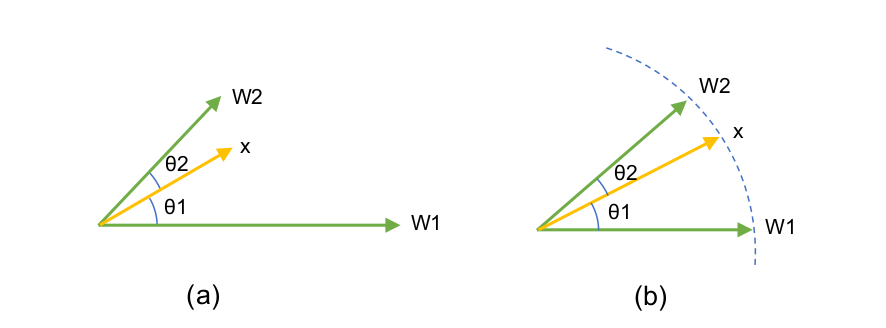
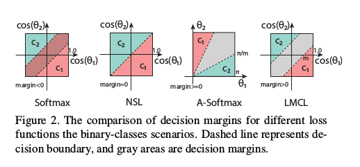
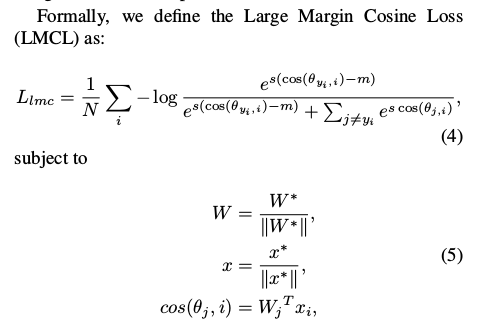
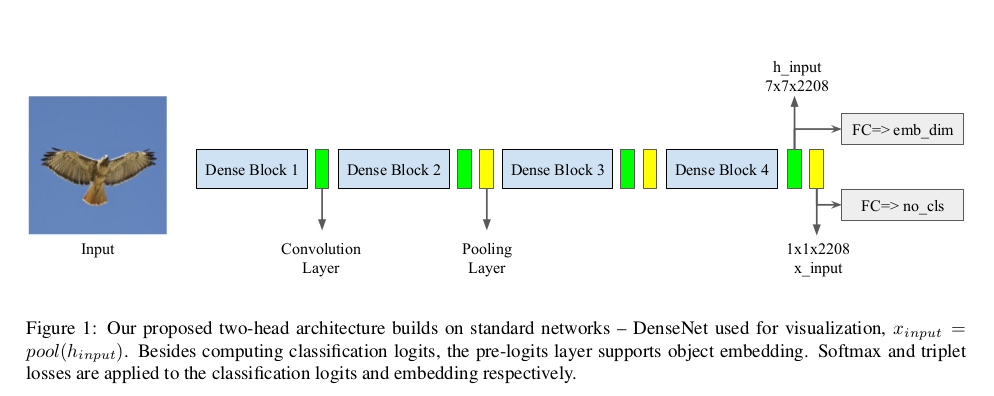
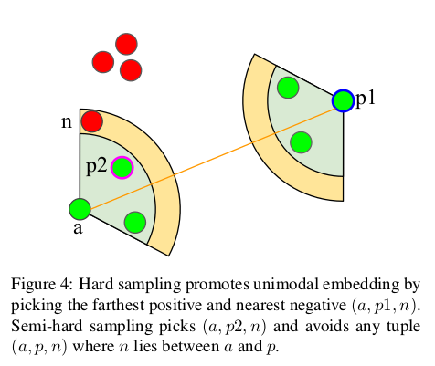
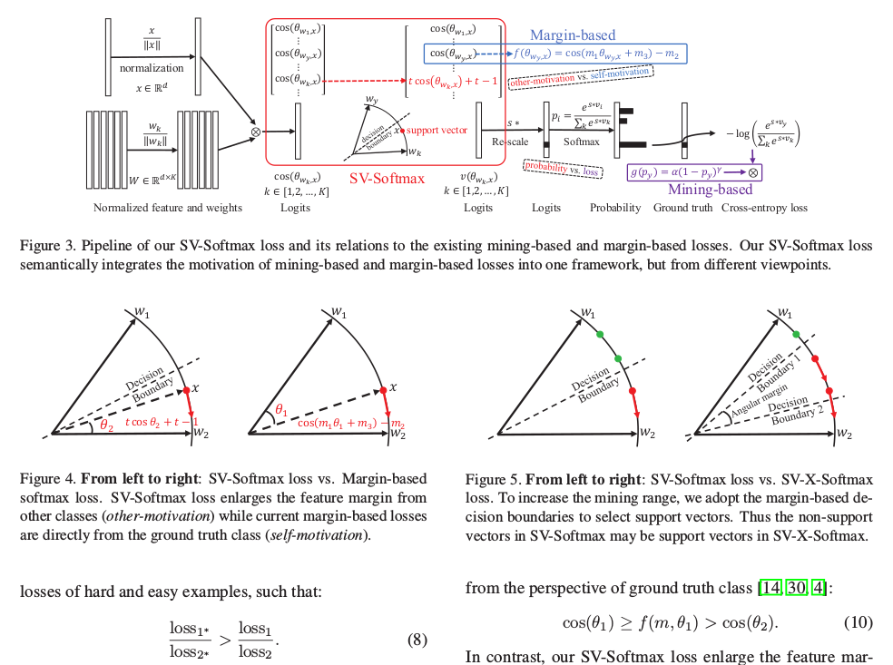

# DailyReadPaper
Today I will summarize some recent loss function.

## SphereReID: Deep Hypersphere Manifold Embedding for Person Re-Identification
1. AAAI 2019
2. Xing Fan, Wei Jiang, Hao Luo, Mengjuan Fei
3. 190211(1)SphereReID: Deep Hypersphere Manifold.pdf

- Many current successful Person Re-Identification(ReID) methods
train a model with the softmax loss function to classify images of
different persons and obtain the feature vectors at the same time. However,
the underlying feature embedding space is ignored.

    

- In this paper,
we use a modified softmax function, termed Sphere Softmax, to solve the
classification problem and learn a hypersphere manifold embedding simultaneously.
A balanced sampling strategy is also introduced.
- Finally,
we propose a convolutional neural network called SphereReID adopting
Sphere Softmax and training a single model end-to-end with a new
warming-up learning rate schedule on four challenging datasets including
Market-1501, DukeMTMC-reID, CHHK-03, and CUHK-SYSU. Experimental
results demonstrate that this single model outperforms the
state-of-the-art methods on all four datasets without fine-tuning or reranking.
For example, it achieves 94.4% rank-1 accuracy on Market-1501
and 83.9% rank-1 accuracy on DukeMTMC-reID. The code and trained
weights of our model will be released.

>@misc{1807.00537,
Author = {Xing Fan and Wei Jiang and Hao Luo and Mengjuan Fei},
Title = {SphereReID: Deep Hypersphere Manifold Embedding for Person Re-Identification},
Year = {2018},
Eprint = {arXiv:1807.00537},
}

## Cosface: Large margin cosine loss for deep face recognition
1. CVPR 2018
2. Wang, Hao and Wang, Yitong and Zhou, Zheng and Ji, Xing and Gong, Dihong and Zhou, Jingchao and Li, Zhifeng and Liu, Wei
3. 190211(2)Wang_CosFace_Large_Margin_CVPR_2018_paper.pdf

- Face recognition has made extraordinary progress ow-
ing to the advancement of deep convolutional neural net-
works (CNNs). The central task of face recognition, in-
cluding face verification and identification, involves face
feature discrimination. However, the traditional softmax
loss of deep CNNs usually lacks the power of discrimina-
tion. To address this problem, recently several loss func-
tions such as center loss, large margin softmax loss, and
angular softmax loss have been proposed.

    

- All these improved losses share the same idea: maximizing inter-class
variance and minimizing intra-class variance. In this pa-
per, we propose a novel loss function, namely large mar-
gin cosine loss (LMCL), to realize this idea from a different
perspective. More specifically, we reformulate the softmax
loss as a cosine loss by L 2 normalizing both features and
weight vectors to remove radial variations, based on which
a cosine margin term is introduced to further maximize the
decision margin in the angular space.

    

- As a result, minimum intra-class variance and maximum inter-class variance are
achieved by virtue of normalization and cosine decision
margin maximization. We refer to our model trained with
LMCL as CosFace. Extensive experimental evaluations are
conducted on the most popular public-domain face recogni-
tion datasets such as MegaFace Challenge, Youtube Faces
(YTF) and Labeled Face in the Wild (LFW). We achieve the
state-of-the-art performance on these benchmarks, which
confirms the effectiveness of our proposed approach.

>@inproceedings{wang2018cosface,
  title={Cosface: Large margin cosine loss for deep face recognition},
  author={Wang, Hao and Wang, Yitong and Zhou, Zheng and Ji, Xing and Gong, Dihong and Zhou, Jingchao and Li, Zhifeng and Liu, Wei},
  booktitle={Proceedings of the IEEE Conference on Computer Vision and Pattern Recognition},
  pages={5265--5274},
  year={2018}
}

## In Defense of the Triplet Loss for Visual Recognition
1. Arxiv 2019
2. Taha, Ahmed and Chen, Yi-Ting and Misu, Teruhisa and Davis, Larry
3. 1902011(3)In Defense of the Triplet Loss for Visual Recognition.pdf
- We employ triplet loss as a space embedding regular-
izer to boost classification performance. Standard archi-
tectures, like ResNet and DesneNet, are extended to sup-
port both losses with minimal hyper-parameter tuning. This
promotes generality while fine-tuning pretrained networks.
Triplet loss is a powerful surrogate for recently proposed
embedding regularizers.

    

- Yet, it is avoided for large batch-
size requirement and high computational cost. Through our
experiments, we re-assess these assumptions.
During inference, our network supports both classifica-
tion and embedding tasks without any computational over-
head.

    

- Quantitative evaluation highlights how our approach
compares favorably to the existing state of the art on multi-
ple fine-grained recognition datasets. Further evaluation
on an imbalanced video dataset achieves significant im-
provement (> 7%). Beyond boosting efficiency, triplet loss
brings retrieval and interpretability to classification mod-
els.
>@article{taha2019defense,
  title={In Defense of the Triplet Loss for Visual Recognition},
  author={Taha, Ahmed and Chen, Yi-Ting and Misu, Teruhisa and Davis, Larry},
  journal={arXiv preprint arXiv:1901.08616},
  year={2019}
}

## Support Vector Guided Softmax Loss for Face Recognition
1. Arxiv 2019
2. Wang, Xiaobo and Wang, Shuo and Zhang, Shifeng and Fu, Tianyu and Shi, Hailin and Mei, Tao
3. 190211(4)Support Vector Guided Softmax Loss for Face Recognition.pdf

- Face recognition has witnessed significant progresses
due to the advances of deep convolutional neural networks
(CNNs), the central challenge of which, is feature discrim-
ination. To address it, one group tries to exploit mining-
based strategies (e.g., hard example mining and focal loss)
to focus on the informative examples. The other group de-
votes to designing margin-based loss functions (e.g., angu-
lar, additive and additive angular margins) to increase the
feature margin from the perspective of ground truth class.
Both of them have been well-verified to learn discrimina-
tive features.

    

- However, they suffer from either the ambigu-
ity of hard examples or the lack of discriminative power of
other classes. In this paper, we design a novel loss function,
namely support vector guided softmax loss (SV-Softmax),
which adaptively emphasizes the mis-classified points (sup-
port vectors) to guide the discriminative features learning.
So the developed SV-Softmax loss is able to eliminate the
ambiguity of hard examples as well as absorb the discrimi-
native power of other classes, and thus results in more dis-
crimiantive features. To the best of our knowledge, this is
the first attempt to inherit the advantages of mining-based
and margin-based losses into one framework. Experimental
results on several benchmarks have demonstrated the effec-
tiveness of our approach over state-of-the-arts.

>@article{wang2018support,
  title={Support Vector Guided Softmax Loss for Face Recognition},
  author={Wang, Xiaobo and Wang, Shuo and Zhang, Shifeng and Fu, Tianyu and Shi, Hailin and Mei, Tao},
  journal={arXiv preprint arXiv:1812.11317},
  year={2018}
}
