# DailyReadPaper
Today I will summarize some current re-id methods from CVPR 2019.

## Joint Discriminative and Generative Learning for Person Re-identification
1. CVPR 2019 Oral
2. Zhedong Zheng, Xiaodong Yang, Zhiding Yu, Liang Zheng, Yi Yang, Jan Kautz
3. 190425(1)Joint Discriminative and Generative Learning for Person Re-identification.pdf

- Person re-identification (re-id) remains challenging due
to significant intra-class variations across different cam-
eras. Recently, there has been a growing interest in using
generative models to augment training data and enhance
the invariance to input changes. The generative pipelines
in existing methods, however, stay relatively separate from
the discriminative re-id learning stages. Accordingly, re-id
models are often trained in a straightforward manner on the
generated data.

    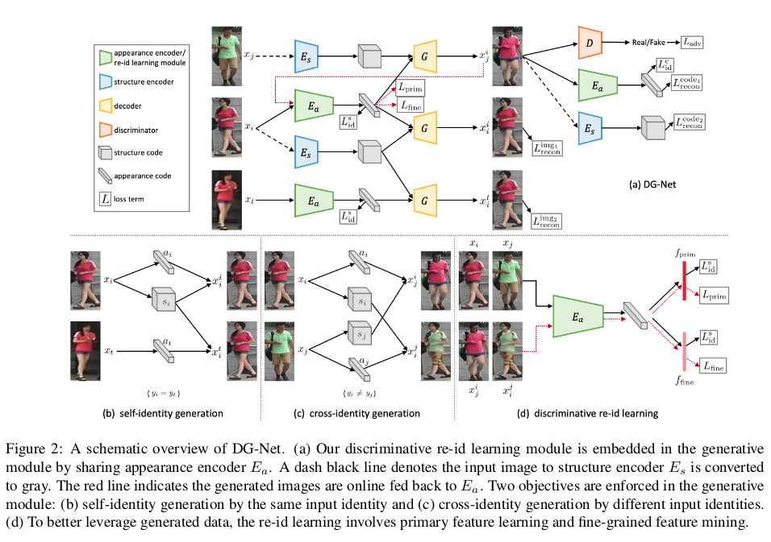

- In this paper, we seek to improve learned
re-id embeddings by better leveraging the generated data.
To this end, we propose a joint learning framework that
couples re-id learning and data generation end-to-end. Our
model involves a generative module that separately encodes
each person into an appearance code and a structure code,
and a discriminative module that shares the appearance en-
coder with the generative module. By switching the appear-
ance or structure codes, the generative module is able to
generate high-quality cross-id composed images, which are
online fed back to the appearance encoder and used to im-
prove the discriminative module. The proposed joint learn-
ing framework renders significant improvement over the
baseline without using generated data, leading to the state-
of-the-art performance on several benchmark datasets.

>@article{zhong2019invariance,
  title={Invariance Matters: Exemplar Memory for Domain Adaptive Person Re-identification},
  author={Zhong, Zhun and Zheng, Liang and Luo, Zhiming and Li, Shaozi and Yang, Yi},
  journal={arXiv preprint arXiv:1904.01990},
  year={2019}
}

## Unsupervised Person Re-identification by Soft Multilabel Learning
1. CVPR 2019 Oral
2. Hong-Xing Yu, Wei-Shi Zheng, Ancong Wu, Xiaowei Guo, Shaogang Gong, Jian-Huang Lai
3. 190425(2)Unsupervised Person Re-identification by Soft Multilabel.pdf

- Although unsupervised person re-identification (RE-ID)
has drawn increasing research attentions due to its poten-
tial to address the scalability problem of supervised RE-ID
models, it is very challenging to learn discriminative in-
formation in the absence of pairwise labels across disjoint
camera views. To overcome this problem, we propose a
deep model for the soft multilabel learning for unsupervised
RE-ID. The idea is to learn a soft multilabel (real-valued
label likelihood vector) for each unlabeled person by com-
paring (and representing) the unlabeled person with a set
of known reference persons from an auxiliary domain. We
propose the soft multilabel-guided hard negative mining to
learn a discriminative embedding for the unlabeled target
domain by exploring the similarity consistency of the vi-
sual features and the soft multilabels of unlabeled target
pairs.

    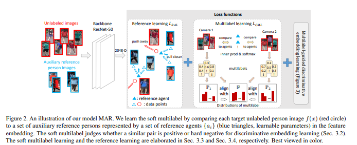

- Since most target pairs are cross-view pairs, we de-
velop the cross-view consistent soft multilabel learning to
achieve the learning goal that the soft multilabels are con-
sistently good across different camera views. To enable
effecient soft multilabel learning, we introduce the refer-
ence agent learning to represent each reference person by
a reference agent in a joint embedding. We evaluate our
unified deep model on Market-1501 and DukeMTMC-reID.
Our model outperforms the state-of-the-art unsupervised
RE-ID methods by clear margins. Code is available at
https://github.com/KovenYu/MAR.

>@inproceedings{yu2019unsupervised,
title={Unsupervised Person Re-identification by Soft Multilabel Learning},
author={Yu, Hong-Xing and Zheng, Wei-Shi and Wu, Ancong and Guo, Xiaowei and Gong, Shaogang and Lai, Jian-Huang},
booktitle={Proceedings of the IEEE International Conference on Computer Vision and Pattern Recognition (CVPR)},
year={2019}
}

## Learning Context Graph for Person Search
1. CVPR 2019 Oral
2. Yichao Yan, Qiang Zhang, Bingbing Ni, Wendong Zhang, Minghao Xu, Xiaokang Yang
3. 190425(3)Learning Context Graph for Person Search.pdf

- Person re-identification has achieved great progress with
deep convolutional neural networks. However, most previous
methods focus on learning individual appearance feature
embedding, and it is hard for the models to handle difficult
situations with different illumination, large pose variance
and occlusion. In this work, we take a step further and
consider employing context information for person search.

    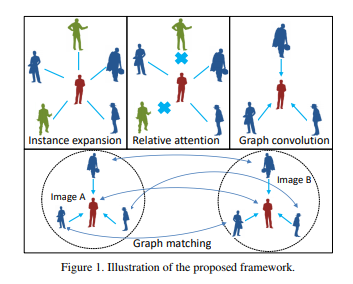

- For a probe-gallery pair, we first propose a contextual instance
expansion module, which employs a relative attention
module to search and filter useful context information
in the scene.

    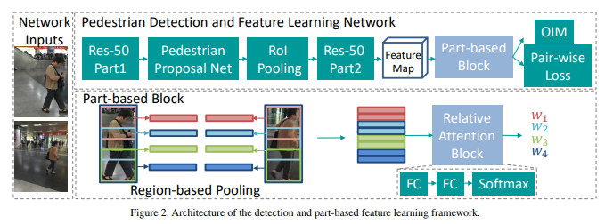

- We also build a graph learning framework
to effectively employ context pairs to update target similarity.
These two modules are built on top of a joint detection
and instance feature learning framework, which improves
the discriminativeness of the learned features. 

    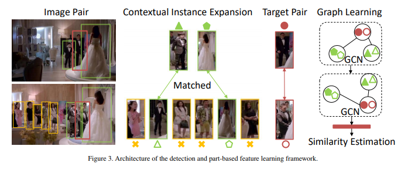

- The proposed
framework achieves state-of-the-art performance on
two widely used person search datasets.

>@inproceedings{yan2019graph,
title={Learning Context Graph for Person Search},
author={Yichao Yan, Qiang Zhang, Bingbing Ni, Wendong Zhang, Minghao Xu, Xiaokang Yang},
booktitle={Proceedings of the IEEE International Conference on Computer Vision and Pattern Recognition (CVPR)},
year={2019}
}

## Progressive Pose Attention Transfer for Person Image Generation
1. CVPR 2019 Oral
2. Zhen Zhu, Tengteng Huang, Baoguang Shi, Miao Yu, Bofei Wang, Xiang Bai
3. 190425(4)Progressive Pose Attention Transfer for Person Image Generation.pdf

- This paper proposes a new generative adversarial network
for pose transfer, i.e., transferring the pose of a
given person to a target pose. The generator of the network
comprises a sequence of Pose-Attentional Transfer
Blocks that each transfers certain regions it attends to, generating
the person image progressively.

    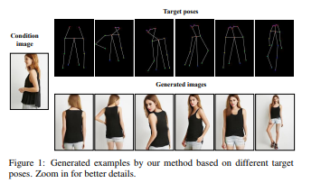

- Compared with
those in previous works, our generated person images possess
better appearance consistency and shape consistency
with the input images, thus significantly more realisticlooking.
The efficacy and efficiency of the proposed network
are validated both qualitatively and quantitatively
on Market-1501 and DeepFashion.

    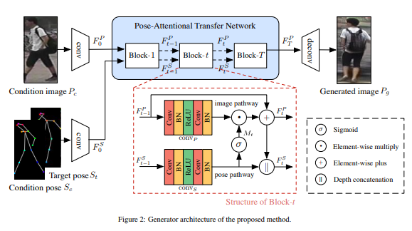

- Furthermore, the proposed
architecture can generate training images for person
re-identification, alleviating data insufficiency. Codes
and models are available at: https://github.com/
tengteng95/Pose-Transfer.git.

>@inproceedings{zhu2019pose,
title={Progressive Pose Attention Transfer for Person Image Generation},
author={Zhen Zhu, Tengteng Huang, Baoguang Shi, Miao Yu, Bofei Wang, Xiang Bai},
booktitle={Proceedings of the IEEE International Conference on Computer Vision and Pattern Recognition (CVPR)},
year={2019}
}

## Patch-based Discriminative Feature Learning for Unsupervised Person Re-identification
1. CVPR 2019 Spotlint
2. Qize Yang1,3, Hong-Xing Yu1, Ancong Wu2, and Wei-Shi Zheng∗1,4
3. 190425(5)2019_CVPR_PEDAL.pdf

- While discriminative local features have been shown effective
in solving the person re-identification problem, they
are limited to be trained on fully pairwise labelled data
which is expensive to obtain. In this work, we overcome this
problem by proposing a patch-based unsupervised learning
framework in order to learn discriminative feature from
patches instead of the whole images. The patch-based
learning leverages similarity between patches to learn a
discriminative model.

    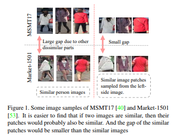

- Specifically, we develop a PatchNet
to select patches from the feature map and learn discriminative
features for these patches. To provide effective guidance
for the PatchNet to learn discriminative patch feature
on unlabeled datasets, we propose an unsupervised
patch-based discriminative feature learning loss.

    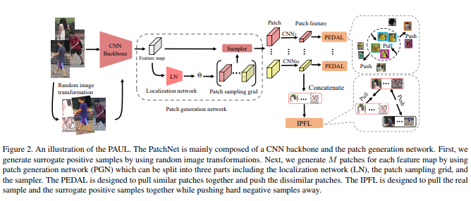

- In addition,
we design an image-level feature learning loss to
leverage all the patch features of the same image to serve
as an image-level guidance for the PatchNet.

    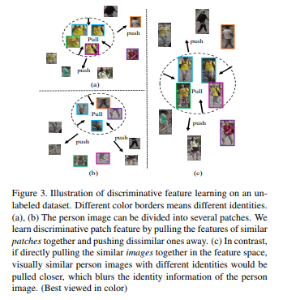

- Extensive experiments
validate the superiority of our method for unsupervised
person re-id. 

    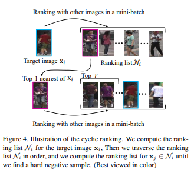

- Our code is available at https:
//github.com/QizeYang/PAUL

>@inproceedings{yang2019patch,
title={Patch-based Discriminative Feature Learning for Unsupervised Person Re-identification},
author={Qize Yang, Hong-Xing Yu, Ancong Wu, and Wei-Shi Zheng},
booktitle={Proceedings of the IEEE International Conference on Computer Vision and Pattern Recognition (CVPR)},
year={2019}
}
## Generalizable Person Re-identification by Domain-Invariant Mapping Network
1. CVPR 2019 
2. Jifei Song1 Yongxin Yang2 Yi-Zhe Song2 Tao Xiang2,3 Timothy M. Hospedales4
3. 190425(6)cvpr2019_dimn_Generalizable Person Re-identification by Domain-Invariant Mapping Network.pdf

- We aim to learn a domain generalizable person re-
identification (ReID) model. When such a model is trained
on a set of source domains (ReID datasets collected from
different camera networks), it can be directly applied to any
new unseen dataset for effective ReID without any model
updating. Despite its practical value in real-world deploy-
ments, generalizable ReID has seldom been studied. In this
work, a novel deep ReID model termed Domain-Invariant
Mapping Network (DIMN) is proposed.

    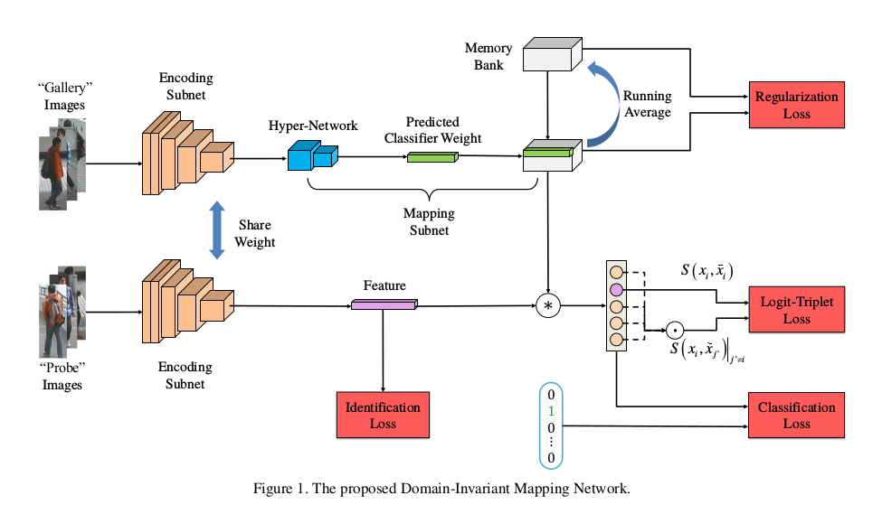

- DIMN is designed
to learn a mapping between a person image and its iden-
tity classifier, i.e., it produces a classifier using a single
shot. To make the model domain-invariant, we follow a
meta-learning pipeline and sample a subset of source do-
main training tasks during each training episode.

    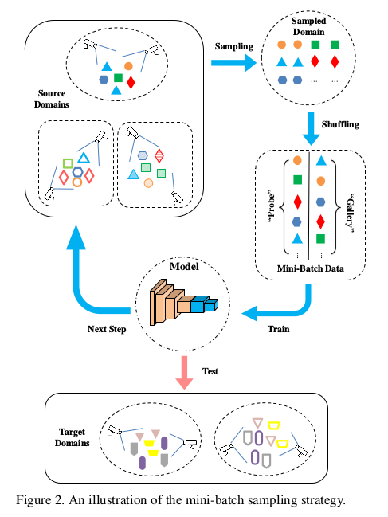

- However, the model is significantly different from conventional
meta-learning methods in that: (1) no model updating is
required for the target domain, (2) different training tasks
share a memory bank for maintaining both scalability and
discrimination ability, and (3) it can be used to match an
arbitrary number of identities in a target domain. Exten-
sive experiments on a newly proposed large-scale ReID do-
main generalization benchmark show that our DIMN sig-
nificantly outperforms alternative domain generalization or
meta-learning methods.

>@inproceedings{Song2019GPRID,
title={Generalizable Person Re-identification by Domain-Invariant Mapping Network},
author={Jifei Song,Yongxin Yang,Yi-Zhe Song,Tao Xiang,Timothy M. Hospedales},
booktitle={Proceedings of the IEEE International Conference on Computer Vision and Pattern Recognition (CVPR)},
year={2019}
}

## Weakly Supervised Person Re-Identification
1. CVPR 2019
2. Jingke Meng, Sheng Wu, Wei-Shi Zheng
3. 190425(7)Weakly_Supervised_person_reid.pdf

- In the conventional person re-id setting, it is assumed
that the labeled images are the person images within the
bounding box for each individual; this labeling across mul-
tiple nonoverlapping camera views from raw video surveil-
lance is costly and time-consuming. To overcome this diffi-
culty, we consider weakly supervised person re-id modeling.
The weak setting refers to matching a target person with an
untrimmed gallery video where we only know that the iden-
tity appears in the video without the requirement of anno-
tating the identity in any frame of the video during the train-
ing procedure.

    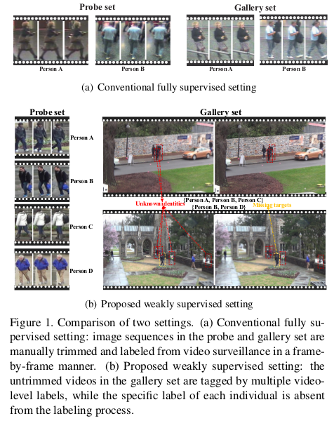

- Hence, for a video, there could be multiple
video-level labels. We cast this weakly supervised person
re-id challenge into a multi-instance multi-label learning
(MIML) problem. In particular, we develop a Cross-View
MIML (CV-MIML) method that is able to explore potential
intraclass person images from all the camera views by in-
corporating the intra-bag alignment and the cross-view bag
alignment.

    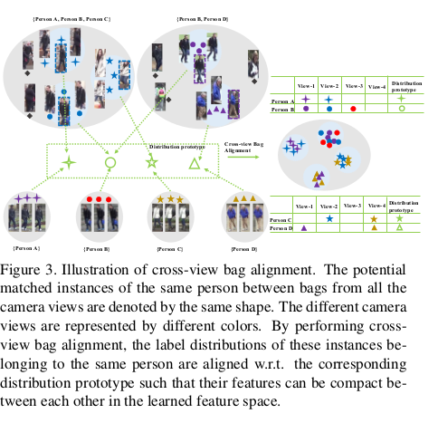

- Finally, the CV-MIML method is embedded into
an existing deep neural network for developing the Deep
Cross-View MIML (Deep CV-MIML) model. We have per-
formed extensive experiments to show the feasibility of the
proposed weakly supervised setting and verify the effective-
ness of our method compared to related methods on four
weakly labeled datasets.

>@inproceedings{meng2019weakly,
title={Weakly Supervised Person Re-Identification},
author={Jingke Meng, Sheng Wu, Wei-Shi Zheng.},
booktitle={Proceedings of the IEEE International Conference on Computer Vision and Pattern Recognition},
year={2019}
}

## Invariance Matters: Exemplar Memory for Domain Adaptive Person Re-identification
1. CVPR 2019
2. Zhun Zhong1,2, Liang Zheng3, Zhiming Luo5, Shaozi Li1∗, Yi Yang2,4
3. 190425(8)Invariance Matters: Exemplar Memory for Domain Adaptive.pdf

- This paper considers the domain adaptive person reidentification
(re-ID) problem: learning a re-ID model from
a labeled source domain and an unlabeled target domain.
Conventional methods are mainly to reduce feature distribution
gap between the source and target domains. However,
these studies largely neglect the intra-domain variations
in the target domain, which contain critical factors
influencing the testing performance on the target domain.
In this work, we comprehensively investigate into
the intra-domain variations of the target domain and propose
to generalize the re-ID model w.r.t three types of the
underlying invariance, i.e., exemplar-invariance, camerainvariance
and neighborhood-invariance.

    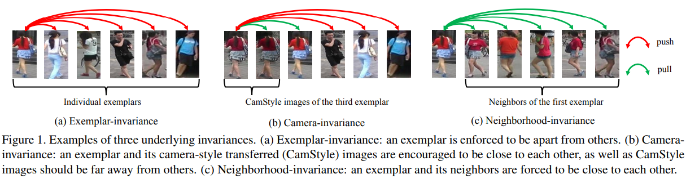

- To achieve this
goal, an exemplar memory is introduced to store features
of the target domain and accommodate the three invariance
properties. The memory allows us to enforce the invariance
constraints over global training batch without significantly
increasing computation cost.

    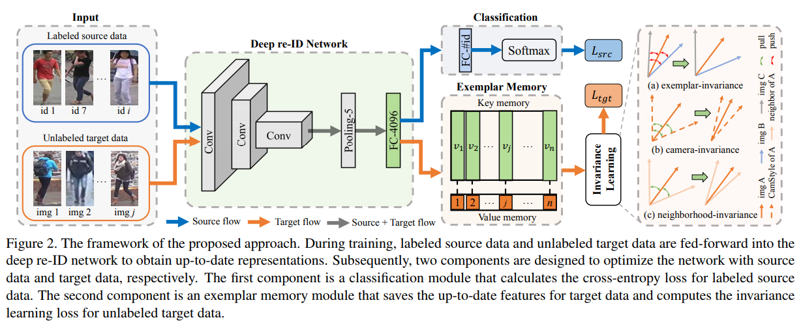

- Experiment demonstrates
that the three invariance properties and the proposed
memory are indispensable towards an effective domain
adaptation system. Results on three re-ID domains
show that our domain adaptation accuracy outperforms the
state of the art by a large margin. Code is available at:
https://github.com/zhunzhong07/ECN

>@inproceedings{zhong2019invariance,
  title={Invariance Matters: Exemplar Memory for Domain Adaptive Person Re-identification},
  author={Zhong, Zhun and Zheng, Liang and Luo, Zhiming and Li, Shaozi and Yang, Yi},
  booktitle={Proceedings of IEEE Conference on Computer Vision and Pattern Recognition (CVPR)},
  year={2019},
}

## Densely Semantically Aligned Person Re-Identification
1. CVPR 2019
2. Zhizheng Zhang1∗ Cuiling Lan2† Wenjun Zeng2 Zhibo Chen1†
3. 190425(9)Densely Semantically Aligned Person Re-Identification.pdf

- We propose a densely semantically aligned person reidentification
framework. It fundamentally addresses the
body misalignment problem caused by pose/viewpoint variations,
imperfect person detection, occlusion, etc. By leveraging
the estimation of the dense semantics of a person image,
we construct a set of densely semantically aligned part
images (DSAP-images), where the same spatial positions
have the same semantics across different images. We design
a two-stream network that consists of a main full image
stream (MF-Stream) and a densely semantically-aligned
guiding stream (DSAG-Stream).

    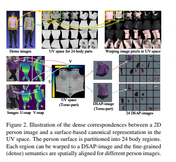

- The DSAG-Stream, with
the DSAP-images as input, acts as a regulator to guide
the MF-Stream to learn densely semantically aligned features
from the original image. In the inference, the DSAGStream
is discarded and only the MF-Stream is needed,
which makes the inference system computationally efficient
and robust.

    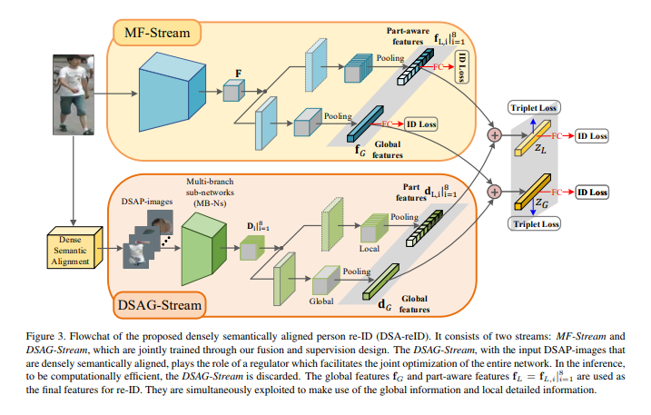

- To the best of our knowledge, we are the first
to make use of fine grained semantics to address the misalignment
problems for re-ID. Our method achieves rank-1
accuracy of 78.9% (new protocol) on the CUHK03 dataset,
90.4% on the CUHK01 dataset, and 95.7% on the Market1501
dataset, outperforming state-of-the-art methods.

>@article{zhang2019densely,
  title={Densely Semantically Aligned Person Re-Identification},
  author={Zhang, Zhizheng and Lan, Cuiling and Zeng, Wenjun and Chen, Zhibo},
  journal={arXiv preprint arXiv:1812.08967},
  year={2019}
}

## CapProNet: Deep Feature Learning via Orthogonal Projections onto Capsule Subspaces
1. NIPS 2018
2. Zhang, Liheng and Edraki, Marzieh and Qi, Guo-Jun
3. 190425(10)CapProNet.pdf
- In this paper, we formalize the idea behind capsule nets of using a capsule vector
rather than a neuron activation to predict the label of samples. To this end, we
propose to learn a group of capsule subspaces onto which an input feature vector is
projected. Then the lengths of resultant capsules are used to score the probability
of belonging to different classes. We train such a Capsule Projection Network
(CapProNet) by learning an orthogonal projection matrix for each capsule subspace,
and show that each capsule subspace is updated until it contains input feature
vectors corresponding to the associated class.

    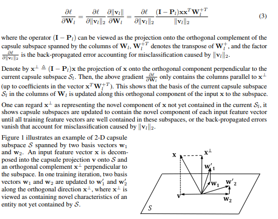

- We will also show that the capsule
projection can be viewed as normalizing the multiple columns of the weight matrix
simultaneously to form an orthogonal basis, which makes it more effective in
incorporating novel components of input features to update capsule representations.
In other words, the capsule projection can be viewed as a multi-dimensional weight
normalization in capsule subspaces, where the conventional weight normalization
is simply a special case of the capsule projection onto 1D lines. Only a small
negligible computing overhead is incurred to train the network in low-dimensional
capsule subspaces or through an alternative hyper-power iteration to estimate the
normalization matrix. Experiment results on image datasets show the presented
model can greatly improve the performance of the state-of-the-art ResNet backbones
by 10 − 20% and that of the Densenet by 5 − 7% respectively at the same
level of computing and memory expenses. The CapProNet establishes the competitive
state-of-the-art performance for the family of capsule nets by significantly
reducing test errors on the benchmark datasets.

>@inproceedings{zhang2018cappronet,
  title={CapProNet: Deep feature learning via orthogonal projections onto capsule subspaces},
  author={Zhang, Liheng and Edraki, Marzieh and Qi, Guo-Jun},
  booktitle={Advances in Neural Information Processing Systems},
  pages={5814--5823},
  year={2018}
}