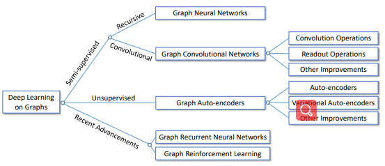
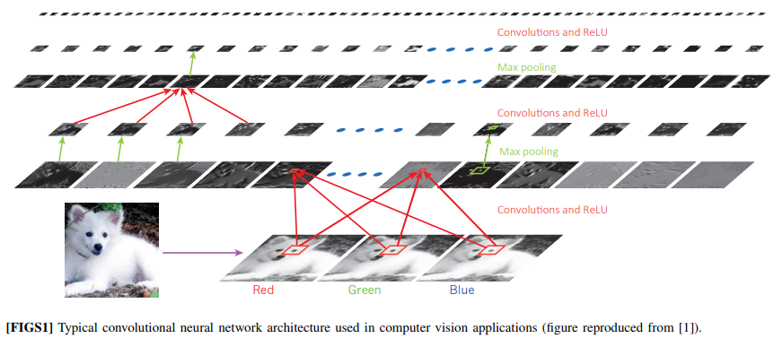
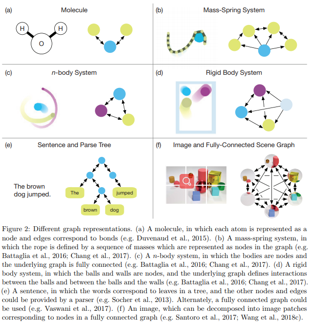
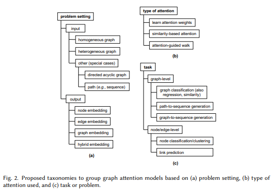
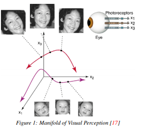

# DailyReadPaper
From this day, I will move on to the aspect of GCN.

## Deep Learning on Graphs: A Survey
1. Arxiv 2019
2. Ziwei Zhang, Peng Cui and Wenwu Zhu
3. 190528(1)Deep_Learning_on_Graphs_ A_Survey.pdf
- Deep learning has been shown successful in a number of domains, 
ranging from acoustics, images to natural language processing. 
However, applying deep learning to the ubiquitous graph data is 
non-trivial because of the unique characteristics of graphs. 
Recently, a significant amount of research efforts have been devoted 
to this area, greatly advancing graph analyzing techniques. 

    
    
In this survey, we comprehensively review different kinds of 
deep learning methods applied to graphs. We divide existing methods 
into three main categories: semi-supervised methods including 
Graph Neural Networks and Graph Convolutional Networks, unsupervised 
methods including Graph Autoencoders, and recent advancements 
including Graph Recurrent Neural Networks and Graph Reinforcement 
Learning. We then provide a comprehensive overview of these methods 
in a systematic manner following their history of developments. We 
also analyze the differences of these methods and how to composite 
different architectures. Finally, we briefly outline their 
applications and discuss potential future directions.
>@article{DBLP:journals/corr/abs-1812-04202,
  author    = {Ziwei Zhang and
               Peng Cui and
               Wenwu Zhu},
  title     = {Deep Learning on Graphs: {A} Survey},
  journal   = {CoRR},
  volume    = {abs/1812.04202},
  year      = {2018},
  url       = {http://arxiv.org/abs/1812.04202},
  archivePrefix = {arXiv},
  eprint    = {1812.04202},
  timestamp = {Tue, 01 Jan 2019 15:01:25 +0100},
  biburl    = {https://dblp.org/rec/bib/journals/corr/abs-1812-04202},
  bibsource = {dblp computer science bibliography, https://dblp.org}
}

The ref. of "Deep Learning on Graphs: A Survey" has been attached as follows,

## Geometric deep learning: going beyond euclidean data},
1. IEEE Signal Processing Magazine 2017
2. Bronstein, Michael M and Bruna, Joan and LeCun, Yann and Szlam, Arthur and Vandergheynst, Pierre
3. 190528(2)Geometric_deep_learning.pdf

- Many scientific fields study data with an underlying structure that is a non-Euclidean space. Some examples include
social networks in computational social sciences, sensor networks in communications, functional networks in brain imaging, regulatory networks in genetics, and meshed surfaces
in computer graphics. In many applications, such geometric
data are large and complex (in the case of social networks,
on the scale of billions), and are natural targets for machine
learning techniques. In particular, we would like to use deep
neural networks, which have recently proven to be powerful
tools for a broad range of problems from computer vision,
natural language processing, and audio analysis. However,
these tools have been most successful on data with an underlying Euclidean or grid-like structure, and in cases where
the invariances of these structures are built into networks used
to model them.

    
    
- Geometric deep learning is an umbrella term for emerging
techniques attempting to generalize (structured) deep neural
models to non-Euclidean domains such as graphs and manifolds. The purpose of this paper is to overview different
examples of geometric deep learning problems and present
available solutions, key difficulties, applications, and future
research directions in this nascent field.

>@article{bronstein2017geometric,
  title={Geometric deep learning: going beyond euclidean data},
  author={Bronstein, Michael M and Bruna, Joan and LeCun, Yann and Szlam, Arthur and Vandergheynst, Pierre},
  journal={IEEE Signal Processing Magazine},
  volume={34},
  number={4},
  pages={18--42},
  year={2017},
  publisher={IEEE}
}

## Relational inductive biases, deep learning, and graph networks
1. Arxiv 2019
2. Battaglia, Peter W and Hamrick, Jessica B and Bapst, Victor and Sanchez-Gonzalez, Alvaro and Zambaldi, Vinicius and Malinowski, Mateusz and Tacchetti, Andrea and Raposo, David and Santoro, Adam and Faulkner, Ryan and others
3. 190528(3)GraphNetwork.pdf

- Artificial intelligence (AI) has undergone a renaissance recently, making major progress in
key domains such as vision, language, control, and decision-making. This has been due, in
part, to cheap data and cheap compute resources, which have fit the natural strengths of deep
learning. However, many defining characteristics of human intelligence, which developed under
much different pressures, remain out of reach for current approaches. In particular, generalizing
beyond one’s experiences—a hallmark of human intelligence from infancy—remains a formidable
challenge for modern AI.

    
    
- The following is part position paper, part review, and part unification. We argue that
combinatorial generalization must be a top priority for AI to achieve human-like abilities, and that
structured representations and computations are key to realizing this objective. Just as biology
uses nature and nurture cooperatively, we reject the false choice between “hand-engineering”
and “end-to-end” learning, and instead advocate for an approach which benefits from their
complementary strengths. We explore how using relational inductive biases within deep learning
architectures can facilitate learning about entities, relations, and rules for composing them. We
present a new building block for the AI toolkit with a strong relational inductive bias—the graph
network—which generalizes and extends various approaches for neural networks that operate
on graphs, and provides a straightforward interface for manipulating structured knowledge and
producing structured behaviors. We discuss how graph networks can support relational reasoning
and combinatorial generalization, laying the foundation for more sophisticated, interpretable,
and flexible patterns of reasoning. As a companion to this paper, we have also released an
open-source software library for building graph networks, with demonstrations of how to use
them in practice.

>@article{battaglia2018relational,
  title={Relational inductive biases, deep learning, and graph networks},
  author={Battaglia, Peter W and Hamrick, Jessica B and Bapst, Victor and Sanchez-Gonzalez, Alvaro and Zambaldi, Vinicius and Malinowski, Mateusz and Tacchetti, Andrea and Raposo, David and Santoro, Adam and Faulkner, Ryan and others},
  journal={arXiv preprint arXiv:1806.01261},
  year={2018}
}

## Attention models in graphs: A survey
1. Arxiv 2019
2. Lee, John Boaz and Rossi, Ryan A and Kim, Sungchul and Ahmed, Nesreen K and Koh, Eunyee
3. 190528(4)Attention_Models_in_Graphs_A_Survey.pdf

- Graph-structured data arise naturally in many different application domains. By representing data as graphs,
we can capture entities (i.e., nodes) as well as their relationships (i.e., edges) with each other. Many useful
insights can be derived from graph-structured data as demonstrated by an ever-growing body of work focused
on graph mining. However, in the real-world, graphs can be both large – with many complex patterns – and
noisy which can pose a problem for effective graph mining. An effective way to deal with this issue is to
incorporate “attention” into graph mining solutions. An attention mechanism allows a method to focus on
task-relevant parts of the graph, helping it to make better decisions. In this work, we conduct a comprehensive
and focused survey of the literature on the emerging field of graph attention models. We introduce three
intuitive taxonomies to group existing work. These are based on problem setting (type of input and output),
the type of attention mechanism used, and the task (e.g., graph classification, link prediction, etc.). We motivate
our taxonomies through detailed examples and use each to survey competing approaches from a unique
standpoint. Finally, we highlight several challenges in the area and discuss promising directions for future
work.

    
    
- CCS Concepts: • Computing methodologies → Artificial intelligence; Machine learning; Logical and
relational learning; • Mathematics of computing → Graph algorithms; Combinatorics; Graph theory;
• Information systems → Data mining; • Theory of computation → Graph algorithms analysis;
Streaming, sublinear and near linear time algorithms;

>@article{lee2018attention,
  title={Attention models in graphs: A survey},
  author={Lee, John Boaz and Rossi, Ryan A and Kim, Sungchul and Ahmed, Nesreen K and Koh, Eunyee},
  journal={arXiv preprint arXiv:1807.07984},
  year={2018}
}

## Graph embedding and extensions: A general framework for dimensionality reduction
1. TPAMI 2007
2. Yan, Shuicheng and Xu, Dong and Zhang, Benyu and Zhang, Hong-Jiang and Yang, Qiang and Lin, Stephen
3. 190528(5)dim_reduction.pdf
- Dimensionality reduction forms a cornerstone of data analysis. A variety of techniques have been
proposed to solve this problem. This report first presents a review of these techniques based on their respective motivations, assumptions, strengths and weaknesses. The general framework for dimensionality
reduction through graph embedding and its extensions is also assessed by examing assumptions behind
the constructions of various similarity measures of different algorithms.

    
    
- Based on the insight of this
framework, we first present some heuristics on how to design similarity matrix corresponding to certain
data distribution. Then a new algorithm is proposed to overcome the sensitivity to noisy dimensions of
nonlinear dimensionality reduction algorithms

>@article{yan2007graph,
  title={Graph embedding and extensions: A general framework for dimensionality reduction},
  author={Yan, Shuicheng and Xu, Dong and Zhang, Benyu and Zhang, Hong-Jiang and Yang, Qiang and Lin, Stephen},
  journal={IEEE Transactions on Pattern Analysis \& Machine Intelligence},
  number={1},
  pages={40--51},
  year={2007},
  publisher={IEEE}
}
## Representation learning on graphs: Methods and applications
1. CVPR 2019 
2. Hamilton, William L and Ying, Rex and Leskovec, Jure
3. 190528(6)Representation_Learning_on_Graphs_Methods_and_Applications.pdf

- Machine learning on graphs is an important and ubiquitous task with applications ranging from drug
design to friendship recommendation in social networks. The primary challenge in this domain is finding
a way to represent, or encode, graph structure so that it can be easily exploited by machine learning
models. Traditionally, machine learning approaches relied on user-defined heuristics to extract features
encoding structural information about a graph (e.g., degree statistics or kernel functions). However,
recent years have seen a surge in approaches that automatically learn to encode graph structure into
low-dimensional embeddings, using techniques based on deep learning and nonlinear dimensionality
reduction.

    
   

- Here we provide a conceptual review of key advancements in this area of representation
learning on graphs, including matrix factorization-based methods, random-walk based algorithms, and
graph neural networks. We review methods to embed individual nodes as well as approaches to embed
entire (sub)graphs. In doing so, we develop a unified framework to describe these recent approaches,
and we highlight a number of important applications and directions for future work.

>@article{hamilton2017representation,
  title={Representation learning on graphs: Methods and applications},
  author={Hamilton, William L and Ying, Rex and Leskovec, Jure},
  journal={arXiv preprint arXiv:1709.05584},
  year={2017}
}

## Weakly Supervised Person Re-Identification
1. CVPR 2019
2. Jingke Meng, Sheng Wu, Wei-Shi Zheng
3. 190425(7)Weakly_Supervised_person_reid.pdf

- In the conventional person re-id setting, it is assumed
that the labeled images are the person images within the
bounding box for each individual; this labeling across mul-
tiple nonoverlapping camera views from raw video surveil-
lance is costly and time-consuming. To overcome this diffi-
culty, we consider weakly supervised person re-id modeling.
The weak setting refers to matching a target person with an
untrimmed gallery video where we only know that the iden-
tity appears in the video without the requirement of anno-
tating the identity in any frame of the video during the train-
ing procedure.

    

- Hence, for a video, there could be multiple
video-level labels. We cast this weakly supervised person
re-id challenge into a multi-instance multi-label learning
(MIML) problem. In particular, we develop a Cross-View
MIML (CV-MIML) method that is able to explore potential
intraclass person images from all the camera views by in-
corporating the intra-bag alignment and the cross-view bag
alignment.

    

- Finally, the CV-MIML method is embedded into
an existing deep neural network for developing the Deep
Cross-View MIML (Deep CV-MIML) model. We have per-
formed extensive experiments to show the feasibility of the
proposed weakly supervised setting and verify the effective-
ness of our method compared to related methods on four
weakly labeled datasets.

>@inproceedings{meng2019weakly,
title={Weakly Supervised Person Re-Identification},
author={Jingke Meng, Sheng Wu, Wei-Shi Zheng.},
booktitle={Proceedings of the IEEE International Conference on Computer Vision and Pattern Recognition},
year={2019}
}

## Invariance Matters: Exemplar Memory for Domain Adaptive Person Re-identification
1. CVPR 2019
2. Zhun Zhong1,2, Liang Zheng3, Zhiming Luo5, Shaozi Li1∗, Yi Yang2,4
3. 190425(8)Invariance Matters: Exemplar Memory for Domain Adaptive.pdf

- This paper considers the domain adaptive person reidentification
(re-ID) problem: learning a re-ID model from
a labeled source domain and an unlabeled target domain.
Conventional methods are mainly to reduce feature distribution
gap between the source and target domains. However,
these studies largely neglect the intra-domain variations
in the target domain, which contain critical factors
influencing the testing performance on the target domain.
In this work, we comprehensively investigate into
the intra-domain variations of the target domain and propose
to generalize the re-ID model w.r.t three types of the
underlying invariance, i.e., exemplar-invariance, camerainvariance
and neighborhood-invariance.

    

- To achieve this
goal, an exemplar memory is introduced to store features
of the target domain and accommodate the three invariance
properties. The memory allows us to enforce the invariance
constraints over global training batch without significantly
increasing computation cost.

    

- Experiment demonstrates
that the three invariance properties and the proposed
memory are indispensable towards an effective domain
adaptation system. Results on three re-ID domains
show that our domain adaptation accuracy outperforms the
state of the art by a large margin. Code is available at:
https://github.com/zhunzhong07/ECN

>@inproceedings{zhong2019invariance,
  title={Invariance Matters: Exemplar Memory for Domain Adaptive Person Re-identification},
  author={Zhong, Zhun and Zheng, Liang and Luo, Zhiming and Li, Shaozi and Yang, Yi},
  booktitle={Proceedings of IEEE Conference on Computer Vision and Pattern Recognition (CVPR)},
  year={2019},
}

## Densely Semantically Aligned Person Re-Identification
1. CVPR 2019
2. Zhizheng Zhang1∗ Cuiling Lan2† Wenjun Zeng2 Zhibo Chen1†
3. 190425(9)Densely Semantically Aligned Person Re-Identification.pdf

- We propose a densely semantically aligned person reidentification
framework. It fundamentally addresses the
body misalignment problem caused by pose/viewpoint variations,
imperfect person detection, occlusion, etc. By leveraging
the estimation of the dense semantics of a person image,
we construct a set of densely semantically aligned part
images (DSAP-images), where the same spatial positions
have the same semantics across different images. We design
a two-stream network that consists of a main full image
stream (MF-Stream) and a densely semantically-aligned
guiding stream (DSAG-Stream).

    

- The DSAG-Stream, with
the DSAP-images as input, acts as a regulator to guide
the MF-Stream to learn densely semantically aligned features
from the original image. In the inference, the DSAGStream
is discarded and only the MF-Stream is needed,
which makes the inference system computationally efficient
and robust.

    

- To the best of our knowledge, we are the first
to make use of fine grained semantics to address the misalignment
problems for re-ID. Our method achieves rank-1
accuracy of 78.9% (new protocol) on the CUHK03 dataset,
90.4% on the CUHK01 dataset, and 95.7% on the Market1501
dataset, outperforming state-of-the-art methods.

>@article{zhang2019densely,
  title={Densely Semantically Aligned Person Re-Identification},
  author={Zhang, Zhizheng and Lan, Cuiling and Zeng, Wenjun and Chen, Zhibo},
  journal={arXiv preprint arXiv:1812.08967},
  year={2019}
}

## CapProNet: Deep Feature Learning via Orthogonal Projections onto Capsule Subspaces
1. NIPS 2018
2. Zhang, Liheng and Edraki, Marzieh and Qi, Guo-Jun
3. 190425(10)CapProNet.pdf
- In this paper, we formalize the idea behind capsule nets of using a capsule vector
rather than a neuron activation to predict the label of samples. To this end, we
propose to learn a group of capsule subspaces onto which an input feature vector is
projected. Then the lengths of resultant capsules are used to score the probability
of belonging to different classes. We train such a Capsule Projection Network
(CapProNet) by learning an orthogonal projection matrix for each capsule subspace,
and show that each capsule subspace is updated until it contains input feature
vectors corresponding to the associated class.

    

- We will also show that the capsule
projection can be viewed as normalizing the multiple columns of the weight matrix
simultaneously to form an orthogonal basis, which makes it more effective in
incorporating novel components of input features to update capsule representations.
In other words, the capsule projection can be viewed as a multi-dimensional weight
normalization in capsule subspaces, where the conventional weight normalization
is simply a special case of the capsule projection onto 1D lines. Only a small
negligible computing overhead is incurred to train the network in low-dimensional
capsule subspaces or through an alternative hyper-power iteration to estimate the
normalization matrix. Experiment results on image datasets show the presented
model can greatly improve the performance of the state-of-the-art ResNet backbones
by 10 − 20% and that of the Densenet by 5 − 7% respectively at the same
level of computing and memory expenses. The CapProNet establishes the competitive
state-of-the-art performance for the family of capsule nets by significantly
reducing test errors on the benchmark datasets.

>@inproceedings{zhang2018cappronet,
  title={CapProNet: Deep feature learning via orthogonal projections onto capsule subspaces},
  author={Zhang, Liheng and Edraki, Marzieh and Qi, Guo-Jun},
  booktitle={Advances in Neural Information Processing Systems},
  pages={5814--5823},
  year={2018}
}