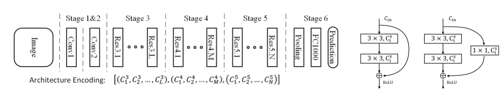
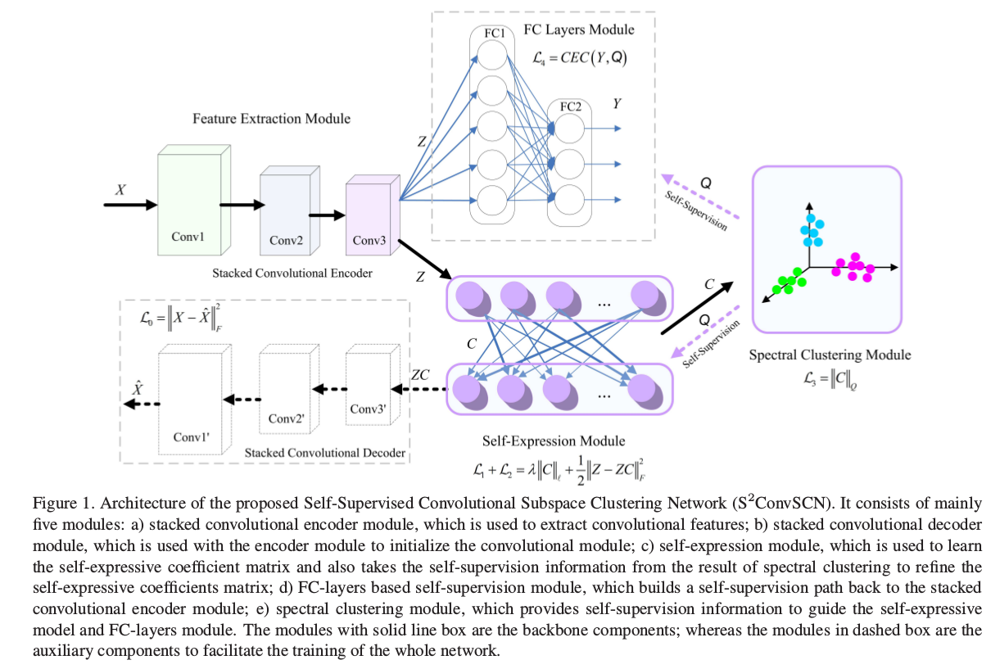
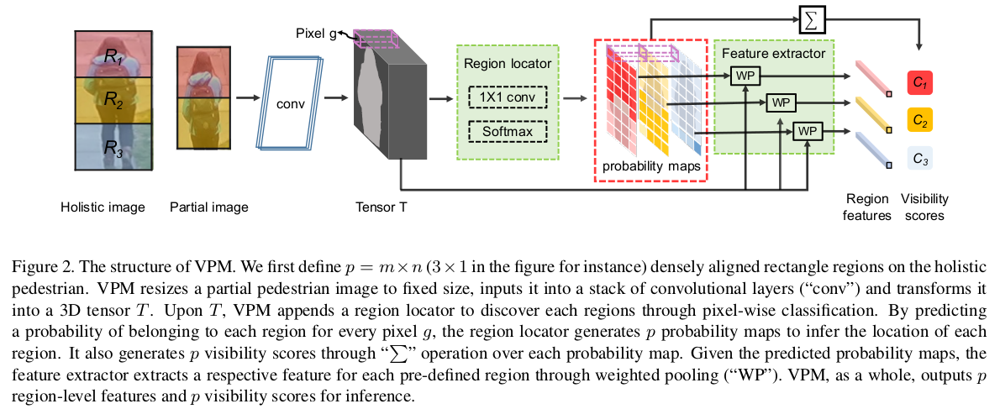
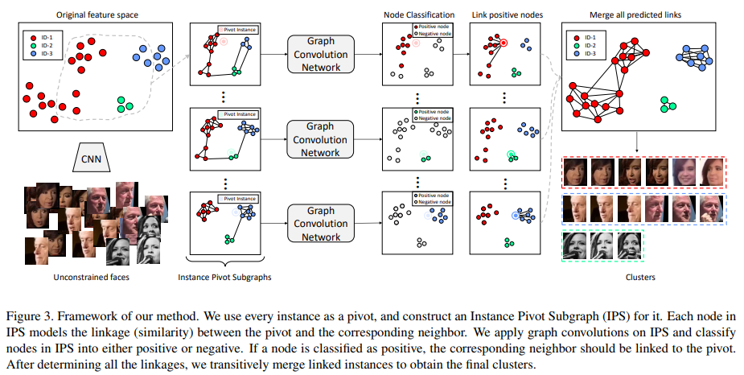

# DailyReadPaper
The spotlights in CVPR 2019.

## Partial Order Pruning: for Best Speed/Accuracy Trade-off in Neural Architecture Search
1. CVPR 2019
2. Li, Xin and Zhou, Yiming and Pan, Zheng and Feng, Jiashi
3. 190529(1)DongFengNN.pdf
- Achieving good speed and accuracy trade-off on a target
platform is very important in deploying deep neural net-
works in real world scenarios. However, most existing au-
tomatic architecture search approaches only concentrate on
high performance. In this work, we propose an algorithm
that can offer better speed/accuracy trade-off of searched
networks, which is termed “Partial Order Pruning”.

    
   
- It prunes the architecture search space with a partial order as-
sumption to automatically search for the architectures with
the best speed and accuracy trade-off. Our algorithm ex-
plicitly takes profile information about the inference speed
on the target platform into consideration. With the proposed
algorithm, we present several Dongfeng (DF) networks that
provide high accuracy and fast inference speed on various
application GPU platforms. By further searching decoder
architectures, our DF-Seg real-time segmentation networks
yield state-of-the-art speed/accuracy trade-off on both the
target embedded device and the high-end GPU.

>@article{li2019partial,
  title={Partial Order Pruning: for Best Speed/Accuracy Trade-off in Neural Architecture Search},
  author={Li, Xin and Zhou, Yiming and Pan, Zheng and Feng, Jiashi},
  journal={arXiv preprint arXiv:1903.03777},
  year={2019}
}

## Self-Supervised Convolutional Subspace Clustering Network
1. CVPR 2019
2. Zhang, Junjian and Li, Chun-Guang and You, Chong and Qi, Xianbiao and Zhang, Honggang and Guo, Jun and Lin, Zhouchen
3. 190529(2)Self-Supervised Convolutional Subspace Clustering Network.pdf

- Subspace clustering methods based on data self-
expression have become very popular for learning from
data that lie in a union of low-dimensional linear sub-
spaces. However, the applicability of subspace clustering
has been limited because practical visual data in raw form
do not necessarily lie in such linear subspaces. On the
other hand, while Convolutional Neural Network (ConvNet)
has been demonstrated to be a powerful tool for extract-
ing discriminative features from visual data, training such
a ConvNet usually requires a large amount of labeled data,
which are unavailable in subspace clustering applications.

    
   
- To achieve simultaneous feature learning and subspace
clustering, we propose an end-to-end trainable framework,
called Self-Supervised Convolutional Subspace Clustering
Network (S 2 ConvSCN), that combines a ConvNet module
(for feature learning), a self-expression module (for sub-
space clustering) and a spectral clustering module (for self-
supervision) into a joint optimization framework. Particu-
larly, we introduce a dual self-supervision that exploits the
output of spectral clustering to supervise the training of the
feature learning module (via a classification loss) and the
self-expression module (via a spectral clustering loss). Our
experiments on four benchmark datasets show the effective-
ness of the dual self-supervision and demonstrate superior
performance of our proposed approach

>@article{zhang2019self,
  title={Self-Supervised Convolutional Subspace Clustering Network},
  author={Zhang, Junjian and Li, Chun-Guang and You, Chong and Qi, Xianbiao and Zhang, Honggang and Guo, Jun and Lin, Zhouchen},
  journal={arXiv preprint arXiv:1905.00149},
  year={2019}
}

## Perceive Where to Focus: Learning Visibility-aware Part-level Features for Partial Person Re-identification
1. CVPR 2019
2. Sun, Yifan and Xu, Qin and Li, Yali and Zhang, Chi and Li, Yikang and Wang, Shengjin and Sun, Jian
3. 190529(3)Partial Person Re-identification.pdf

- This paper considers a realistic problem in person re-
identification (re-ID) task, i.e., partial re-ID. Under par-
tial re-ID scenario, the images may contain a partial ob-
servation of a pedestrian. If we directly compare a par-
tial pedestrian image with a holistic one, the extreme spa-
tial misalignment significantly compromises the discrimi-
native ability of the learned representation.

    
   
- We propose
a Visibility-aware Part Model (VPM), which learns to per-
ceive the visibility of regions through self-supervision. The
visibility awareness allows VPM to extract region-level fea-
tures and compare two images with focus on their shared
regions (which are visible on both images). VPM gains
two-fold benefit toward higher accuracy for partial re-ID.
On the one hand, compared with learning a global fea-
ture, VPM learns region-level features and benefits from
fine-grained information. On the other hand, with visibility
awareness, VPM is capable to estimate the shared regions
between two images and thus suppresses the spatial mis-
alignment. Experimental results confirm that our method
significantly improves the learned representation and the
achieved accuracy is on par with the state of the art.

>@article{sun2019perceive,
  title={Perceive Where to Focus: Learning Visibility-aware Part-level Features for Partial Person Re-identification},
  author={Sun, Yifan and Xu, Qin and Li, Yali and Zhang, Chi and Li, Yikang and Wang, Shengjin and Sun, Jian},
  journal={arXiv preprint arXiv:1904.00537},
  year={2019}
}

## Linkage Based Face Clustering via Graph Convolution Network
1. CVPR 2019
2. Wang, Zhongdao and Zheng, Liang and Li, Yali and Wang, Shengjin
3. 190529(4)FaceClusteringViaGCN.pdf
4. https://github.com/Zhongdao/gcn_clustering

- In this paper, we present an accurate and scalable approach
to the face clustering task. We aim at grouping a
set of faces by their potential identities. We formulate this
task as a link prediction problem: a link exists between two
faces if they are of the same identity.

    
   
- The key idea is that
we find the local context in the feature space around an instance
(face) contains rich information about the linkage relationship
between this instance and its neighbors. By constructing
sub-graphs around each instance as input data,
which depict the local context, we utilize the graph convolution
network (GCN) to perform reasoning and infer the
likelihood of linkage between pairs in the sub-graphs. Experiments
show that our method is more robust to the complex
distribution of faces than conventional methods, yielding
favorably comparable results to state-of-the-art methods
on standard face clustering benchmarks, and is scalable
to large datasets. Furthermore, we show that the proposed
method does not need the number of clusters as prior,
is aware of noises and outliers, and can be extended to a
multi-view version for more accurate clustering accuracy. 

>@article{wang2019linkage,
  title={Linkage Based Face Clustering via Graph Convolution Network},
  author={Wang, Zhongdao and Zheng, Liang and Li, Yali and Wang, Shengjin},
  journal={arXiv preprint arXiv:1903.11306},
  year={2019}
}