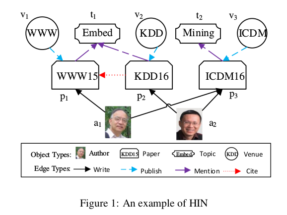
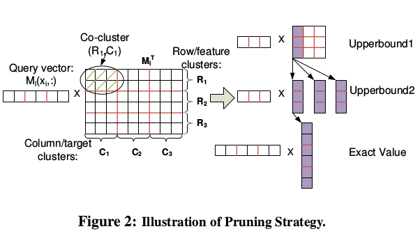
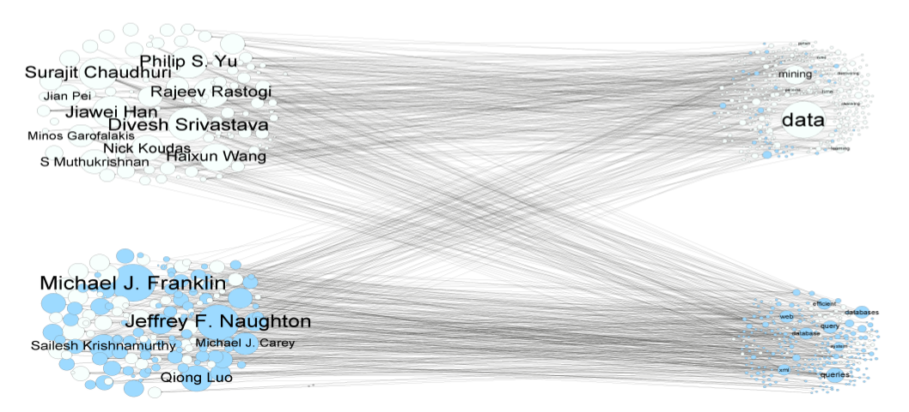
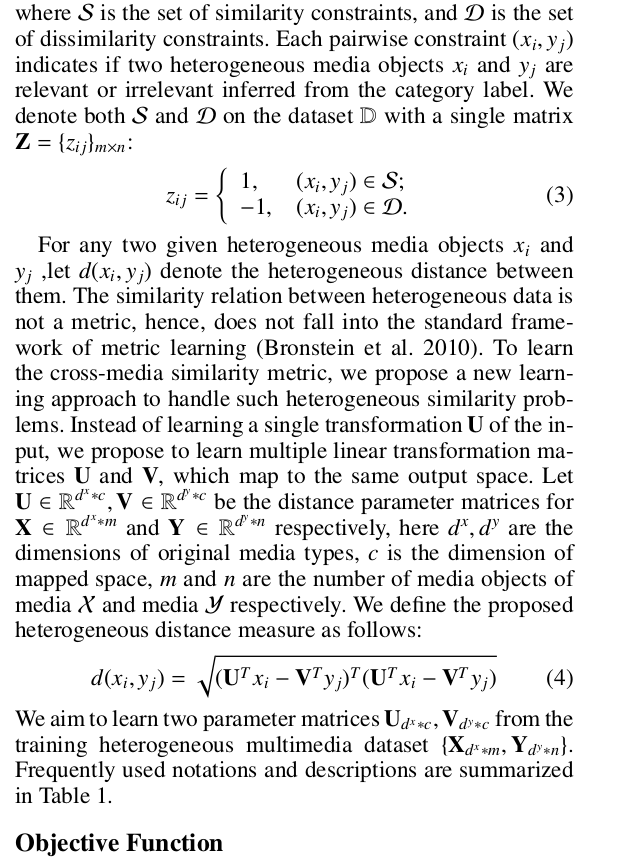
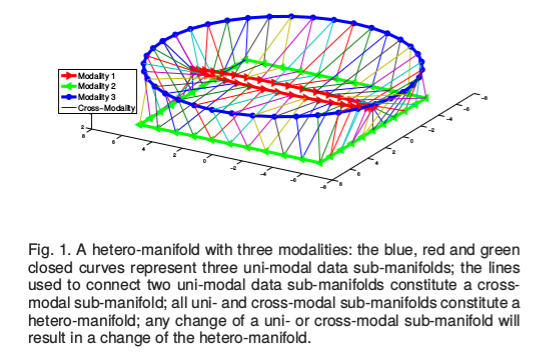

# DailyReadPaper
Some literature regarding Cross-modal Graph Embedding.

## Heterogeneous information network embedding for meta path based proximity
1. Arxiv 2017
2. Huang, Zhipeng and Mamoulis, Nikos
3. 190612(1)HeterogeneousInformationNetwork.pdf

- A network embedding is a representation of a large graph in a low-
dimensional space, where vertices are modeled as vectors. The
objective of a good embedding is to preserve the proximity (i.e.,
similarity) between vertices in the original graph. This way, typ-
ical search and mining methods (e.g., similarity search, kNN re-
trieval, classification, clustering) can be applied in the embedded
space with the help of off-the-shelf multidimensional indexing ap-
proaches.

    
   
- Existing network embedding techniques focus on homo-
geneous networks, where all vertices are considered to belong to
a single class. Therefore, they are weak in supporting similarity
measures for heterogeneous networks. In this paper, we present
an effective heterogeneous network embedding approach for meta
path based proximity measures. We define an objective function,
which aims at minimizing the distance between two distributions,
one modeling the meta path based proximities, the other modeling
the proximities in the embedded vector space. We also investigate
the use of negative sampling to accelerate the optimization process.
As shown in our extensive experimental evaluation, our method
creates embeddings of high quality and has superior performance
in several data mining tasks compared to state-of-the-art network
embedding methods.

>@article{huang2017heterogeneous,
  title={Heterogeneous information network embedding for meta path based proximity},
  author={Huang, Zhipeng and Mamoulis, Nikos},
  journal={arXiv preprint arXiv:1701.05291},
  year={2017}
}

## Pathsim: Meta path-based top-k similarity search in heterogeneous information networks
1. VLDB Endowment 2011
2. Sun, Yizhou and Han, Jiawei and Yan, Xifeng and Yu, Philip S and Wu, Tianyi
3. 190612(2)Pathsim_Meta path-based top-k similarity search in heterogeneous information networks.pdf

- Similarity search is a primitive operation in database and Web
search engines. With the advent of large-scale heterogeneous information
networks that consist of multi-typed, interconnected objects,
such as the bibliographic networks and social media networks,
it is important to study similarity search in such networks.
Intuitively, two objects are similar if they are linked by many paths
in the network. However, most existing similarity measures are
defined for homogeneous networks. Different semantic meanings
behind paths are not taken into consideration. Thus they cannot be
directly applied to heterogeneous networks.

    
   
- In this paper, we study similarity search that is defined among
the same type of objects in heterogeneous networks. Moreover, by
considering different linkage paths in a network, one could derive
various similarity semantics. Therefore, we introduce the concept
of meta path-based similarity, where a meta path is a path consisting
of a sequence of relations defined between different object types
(i.e., structural paths at the meta level). No matter whether a user
would like to explicitly specify a path combination given sufficient
domain knowledge, or choose the best path by experimental trials,
or simply provide training examples to learn it, meta path forms
a common base for a network-based similarity search engine. In
particular, under the meta path framework we define a novel similarity
measure called PathSim that is able to find peer objects in the
network (e.g., find authors in the similar field and with similar reputation),
which turns out to be more meaningful in many scenarios
compared with random-walk based similarity measures. In order
to support fast online query processing for PathSim queries, we
develop an efficient solution that partially materializes short meta
paths and then concatenates them online to compute top-k results.
Experiments on real data sets demonstrate the effectiveness and efficiency
of our proposed paradigm.

>@article{sun2011pathsim,
  title={Pathsim: Meta path-based top-k similarity search in heterogeneous information networks},
  author={Sun, Yizhou and Han, Jiawei and Yan, Xifeng and Yu, Philip S and Wu, Tianyi},
  journal={Proceedings of the VLDB Endowment},
  volume={4},
  number={11},
  pages={992--1003},
  year={2011},
  publisher={Citeseer}
}

## Embedding of embedding (eoe): Joint embedding for coupled heterogeneous networks
1. WSDM 2017
2. Xu, Linchuan and Wei, Xiaokai and Cao, Jiannong and Yu, Philip S
3. 190612(3)2017. WSDM Embedding of Embedding EOE Joint Embedding for Coupled Heterogeneous Networks.pdf
- Network embedding is increasingly employed to assist net-
work analysis as it is effective to learn latent features that en-
code linkage information. Various network embedding meth-
ods have been proposed, but they are only designed for a sin-
gle network scenario. In the era of big data, different types
of related information can be fused together to form a cou-
pled heterogeneous network, which consists of two different
but related sub-networks connected by inter-network edges.
In this scenario, the inter-network edges can act as comple-
mentary information in the presence of intra-network ones.

    
   
- This complementary information is important because it can
make latent features more comprehensive and accurate. And
it is more important when the intra-network edges are ab-
sent, which can be referred to as the cold-start problem. In
this paper, we thus propose a method named embedding
of embedding (EOE) for coupled heterogeneous networks.
In the EOE, latent features encode not only intra-network
edges, but also inter-network ones. To tackle the challenge
of heterogeneities of two networks, the EOE incorporates
a harmonious embedding matrix to further embed the em-
beddings that only encode intra-network edges. Empirical
experiments on a variety of real-world datasets demonstrate
the EOE outperforms consistently single network embedding
methods in applications including visualization, link predic-
tion multi-class classification, and multi-label classification.
>@inproceedings{xu2017embedding,
  title={Embedding of embedding (eoe): Joint embedding for coupled heterogeneous networks},
  author={Xu, Linchuan and Wei, Xiaokai and Cao, Jiannong and Yu, Philip S},
  booktitle={Proceedings of the Tenth ACM International Conference on Web Search and Data Mining},
  pages={741--749},
  year={2017},
  organization={ACM}
}
## Heterogeneous metric learning with joint graph regularization for cross-media retrieval
1. AAAI 2013
2. Zhai, Xiaohua and Peng, Yuxin and Xiao, Jianguo
3. 190612(4)zhai2013heterogeneous.pdf
- As the major component of big data, unstructured heterogeneous
multimedia content such as text, image, audio,
video and 3D increasing rapidly on the Internet.
User demand a new type of cross-media retrieval where
user can search results across various media by submitting
query of any media. Since the query and the retrieved
results can be of different media, how to learn
a heterogeneous metric is the key challenge.

    
   
- Most existing
metric learning algorithms only focus on a single
media where all of the media objects share the
same data representation. In this paper, we propose a
joint graph regularized heterogeneous metric learning
(JGRHML) algorithm, which integrates the structure
of different media into a joint graph regularization. In
JGRHML, different media are complementary to each
other and optimizing them simultaneously can make the
solution smoother for both media and further improve
the accuracy of the final metric. Based on the heterogeneous
metric, we further learn a high-level semantic
metric through label propagation. JGRHML is effective
to explore the semantic relationship hidden across
different modalities. The experimental results on two
datasets with up to five media types show the effectiveness
of our proposed approach.

>@inproceedings{zhai2013heterogeneous,
  title={Heterogeneous metric learning with joint graph regularization for cross-media retrieval},
  author={Zhai, Xiaohua and Peng, Yuxin and Xiao, Jianguo},
  booktitle={Twenty-seventh AAAI conference on artificial intelligence},
  year={2013}
}
## Hetero-manifold regularisation for cross-modal hashing
1. TPAMI 2016
2. Zheng, Feng and Tang, Yi and Shao, Ling
3. 190612(5)TPAMI2017_Hetero-Manifold-Cross-Modal_zheng2017.pdf

- Abstract—Recently, cross-modal search has attracted considerable attention but remains a very challenging task because of the
integration complexity and heterogeneity of the multi-modal data. To address both challenges, in this paper, we propose a novel
method termed hetero-manifold regularisation (HMR) to supervise the learning of hash functions for efficient cross-modal search. A
hetero-manifold integrates multiple sub-manifolds defined by homogeneous data with the help of cross-modal supervision information.
Taking advantages of the hetero-manifold, the similarity between each pair of heterogeneous data could be naturally measured by
three order random walks on this hetero-manifold.

    
   
- Furthermore, a novel cumulative distance inequality defined on the hetero-manifold
is introduced to avoid the computational difficulty induced by the discreteness of hash codes. By using the inequality, cross-modal
hashing is transformed into a problem of hetero-manifold regularised support vector learning. Therefore, the performance of
cross-modal search can be significantly improved by seamlessly combining the integrated information of the hetero-manifold and the
strong generalisation of the support vector machine. Comprehensive experiments show that the proposed HMR achieve advantageous
results over the state-of-the-art methods in several challenging cross-modal tasks.

>@article{zheng2016hetero,
  title={Hetero-manifold regularisation for cross-modal hashing},
  author={Zheng, Feng and Tang, Yi and Shao, Ling},
  journal={IEEE transactions on pattern analysis and machine intelligence},
  volume={40},
  number={5},
  pages={1059--1071},
  year={2016},
  publisher={IEEE}
}