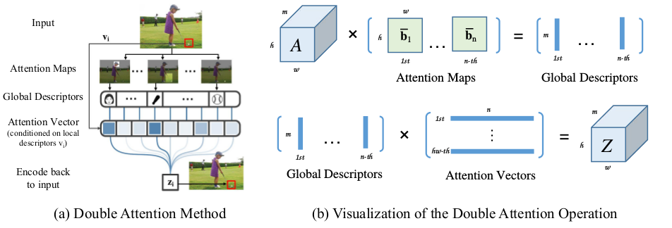

# DailyReadPaper
Cross-modal Graph Embedding Related.

## Structure-Aware Convolutional Neural Networks
1. NIPS 2018
2. Chang, Jianlong and Gu, Jie and Wang, Lingfeng and Meng, Gaofeng and Xiang, Shiming and Pan, Chunhong
3. 190613(1)7287-structure-aware-convolutional-neural-networks.pdf
   
- Convolutional neural networks (CNNs) are inherently subject to invariable filters
that can only aggregate local inputs with the same topological structures. It causes
that CNNs are allowed to manage data with Euclidean or grid-like structures (e.g.,
images), not ones with non-Euclidean or graph structures (e.g., traffic networks). To
broaden the reach of CNNs, we develop structure-aware convolution to eliminate
the invariance, yielding a unified mechanism of dealing with both Euclidean and
non-Euclidean structured data.

    
   
- Technically, filters in the structure-aware convolution
are generalized to univariate functions, which are capable of aggregating local
inputs with diverse topological structures. Since infinite parameters are required
to determine a univariate function, we parameterize these filters with numbered
learnable parameters in the context of the function approximation theory. By replacing
the classical convolution in CNNs with the structure-aware convolution,
Structure-Aware Convolutional Neural Networks (SACNNs) are readily established.
Extensive experiments on eleven datasets strongly evidence that SACNNs
outperform current models on various machine learning tasks, including image
classification and clustering, text categorization, skeleton-based action recognition,
molecular activity detection, and taxi flow prediction
>@inproceedings{chang2018structure,
  title={Structure-Aware Convolutional Neural Networks},
  author={Chang, Jianlong and Gu, Jie and Wang, Lingfeng and Meng, Gaofeng and Xiang, Shiming and Pan, Chunhong},
  booktitle={Advances in Neural Information Processing Systems},
  pages={11--20},
  year={2018}
}

## Unsupervised Image-to-Image Translation Networks
1. NIPS 2017
2. Liu, Ming-Yu and Breuel, Thomas and Kautz, Jan
3. 190613(2)UnsupervisedI2ITrans.pdf

- Unsupervised image-to-image translation aims at learning a joint distribution of
images in different domains by using images from the marginal distributions in
individual domains. Since there exists an infinite set of joint distributions that
can arrive the given marginal distributions, one could infer nothing about the joint
distribution from the marginal distributions without additional assumptions.

    
   
- To address the problem, we make a shared-latent space assumption and propose an
unsupervised image-to-image translation framework based on Coupled GANs.
We compare the proposed framework with competing approaches and present
high quality image translation results on various challenging unsupervised image
translation tasks, including street scene image translation, animal image translation,
and face image translation. We also apply the proposed framework to domain
adaptation and achieve state-of-the-art performance on benchmark datasets. Code
and additional results are available in https://github.com/mingyuliutw/unit
>@inproceedings{liu2017unsupervised,
  title={Unsupervised image-to-image translation networks},
  author={Liu, Ming-Yu and Breuel, Thomas and Kautz, Jan},
  booktitle={Advances in Neural Information Processing Systems},
  pages={700--708},
  year={2017}
}

## Multimodal Unsupervised Image-to-Image Translation
1. ECCV 2018
2. Huang, Xun and Liu, Ming-Yu and Belongie, Serge and Kautz, Jan
3. 190613(3)CrossModalTrans.pdf
- Unsupervised image-to-image translation is an important and
challenging problem in computer vision. Given an image in the source
domain, the goal is to learn the conditional distribution of corresponding
images in the target domain, without seeing any examples of corresponding
image pairs. While this conditional distribution is inherently
multimodal, existing approaches make an overly simplified assumption,
modeling it as a deterministic one-to-one mapping. As a result, they fail
to generate diverse outputs from a given source domain image. To address
this limitation, we propose a Multimodal Unsupervised Image-to-image
Translation (MUNIT) framework.

    

- We assume that the image representation
can be decomposed into a content code that is domain-invariant,
and a style code that captures domain-specific properties. To translate
an image to another domain, we recombine its content code with a random
style code sampled from the style space of the target domain. We
analyze the proposed framework and establish several theoretical results.
Extensive experiments with comparisons to state-of-the-art approaches
further demonstrate the advantage of the proposed framework. Moreover,
our framework allows users to control the style of translation outputs by
providing an example style image. Code and pretrained models are available
at https://github.com/nvlabs/MUNIT.

   
>@inproceedings{huang2018multimodal,
  title={Multimodal unsupervised image-to-image translation},
  author={Huang, Xun and Liu, Ming-Yu and Belongie, Serge and Kautz, Jan},
  booktitle={Proceedings of the European Conference on Computer Vision (ECCV)},
  pages={172--189},
  year={2018}
}
## Multi-Label Image Recognition with Graph Convolutional Networks
1. arXiv 2019
2. Chen, Zhao-Min and Wei, Xiu-Shen and Wang, Peng and Guo, Yanwen
3. 190613(4)Multi-Label Image Recognition with Graph Convolutional Networks.pdf

- The task of multi-label image recognition is to predict
a set of object labels that present in an image. As objects
normally co-occur in an image, it is desirable to model the
label dependencies to improve the recognition performance.
To capture and explore such important dependencies, we
propose a multi-label classification model based on Graph
Convolutional Network (GCN). The model builds a directed
graph over the object labels, where each node (label) is
represented by word embeddings of a label, and GCN is
learned to map this label graph into a set of inter-dependent
object classifiers.

    

- These classifiers are applied to the image
descriptors extracted by another sub-net, enabling the whole
network to be end-to-end trainable. Furthermore, we pro-
pose a novel re-weighted scheme to create an effective label
correlation matrix to guide information propagation among
the nodes in GCN. Experiments on two multi-label image
recognition datasets show that our approach obviously out-
performs other existing state-of-the-art methods. In addition,
visualization analyses reveal that the classifiers learned by
our model maintain meaningful semantic topology.
>@article{chen2019multi,
  title={Multi-Label Image Recognition with Graph Convolutional Networks},
  author={Chen, Zhao-Min and Wei, Xiu-Shen and Wang, Peng and Guo, Yanwen},
  journal={arXiv preprint arXiv:1904.03582},
  year={2019}
}

## Learning to Reduce Dual-level Discrepancy for Infrared-Visible Person Re-identification
1. CVPR 2019
2. Wang, Zhixiang and Wang, Zheng and Zheng, Yinqiang and Chuang, Yung-Yu and Satoh, Shin’ichi
3. 190613(5)Wang_Learning_to_Reduce_Dual-level_Discrepancy_for_Infrared-Visible_Person_Re-Identification_CVPR19.pdf

- Infrared-Visible person RE-IDentification (IV-REID) is
a rising task. Compared to conventional person re-
identification (re-ID), IV-REID concerns the additional
modality discrepancy originated from the different imaging
processes of spectrum cameras, in addition to the person’s
appearance discrepancy caused by viewpoint changes, pose
variations and deformations presented in the conventional
re-ID task.

    

- The co-existed discrepancies make IV-REID
more difficult to solve. Previous methods attempt to reduce
the appearance and modality discrepancies simultaneously
using feature-level constraints. It is however difficult to
eliminate the mixed discrepancies using only feature-level
constraints. To address the problem, this paper introduces a
novel Dual-level Discrepancy Reduction Learning (D 2 RL)
scheme which handles the two discrepancies separately.
For reducing the modality discrepancy, an image-level sub-
network is trained to translate an infrared image into its
visible counterpart and a visible image to its infrared ver-
sion. With the image-level sub-network, we can unify the
representations for images with different modalities. With
the help of the unified multi-spectral images, a feature-level
sub-network is trained to reduce the remaining appearance
discrepancy through feature embedding. By cascading the
two sub-networks and training them jointly, the dual-level
reductions take their responsibilities cooperatively and at-
tentively. Extensive experiments demonstrate the proposed
approach outperforms the state-of-the-art methods.

>@inproceedings{wang2019learning,
  title={Learning to Reduce Dual-level Discrepancy for Infrared-Visible Person Re-identification},
  author={Wang, Zhixiang and Wang, Zheng and Zheng, Yinqiang and Chuang, Yung-Yu and Satoh, Shin’ichi},
  booktitle={Proceedings of the IEEE Conference on Computer Vision and Pattern Recognition},
  volume={2},
  number={3},
  pages={4},
  year={2019}
}
## A^2-Nets: Double Attention Networks
1. NIPS 2018
2. Yunpeng Chen
3. 190613(6)A2-Nets-Double-Attention-Networks.pdf

- Learning to capture long-range relations is fundamental to image/video recognition.
Existing CNN models generally rely on increasing depth to model such relations
which is highly inefficient.

    

- In this work, we propose the “double attention block”, a
novel component that aggregates and propagates informative global features from
the entire spatio-temporal space of input images/videos, enabling subsequent con-
volution layers to access features from the entire space efficiently. The component
is designed with a double attention mechanism in two steps, where the first step
gathers features from the entire space into a compact set through second-order
attention pooling and the second step adaptively selects and distributes features
to each location via another attention.

    

- The proposed double attention block is
easy to adopt and can be plugged into existing deep neural networks conveniently.
We conduct extensive ablation studies and experiments on both image and video
recognition tasks for evaluating its performance. On the image recognition task, a
ResNet-50 equipped with our double attention blocks outperforms a much larger
ResNet-152 architecture on ImageNet-1k dataset with over 40% less the number
of parameters and less FLOPs. On the action recognition task, our proposed model
achieves the state-of-the-art results on the Kinetics and UCF-101 datasets with
significantly higher efficiency than recent works.

## Understanding Batch Normalization
1. NIPS 2018
2. Bjorck, Nils and Gomes, Carla P and Selman, Bart and Weinberger, Kilian Q
3. 190613(7)7996-understanding-batch-normalization.pdf
- Batch normalization (BN) is a technique to normalize activations in intermediate
layers of deep neural networks. Its tendency to improve accuracy and speed
up training have established BN as a favorite technique in deep learning. Yet,
despite its enormous success, there remains little consensus on the exact reason
and mechanism behind these improvements. In this paper we take a step towards a
better understanding of BN, following an empirical approach. We conduct several
experiments, and show that BN primarily enables training with larger learning rates,
which is the cause for faster convergence and better generalization. For networks
without BN we demonstrate how large gradient updates can result in diverging loss
and activations growing uncontrollably with network depth, which limits possible
learning rates. BN avoids this problem by constantly correcting activations to
be zero-mean and of unit standard deviation, which enables larger gradient steps,
yields faster convergence and may help bypass sharp local minima. We further show
various ways in which gradients and activations of deep unnormalized networks are
ill-behaved. We contrast our results against recent findings in random matrix theory,
shedding new light on classical initialization schemes and their consequences.

>@inproceedings{bjorck2018understanding,
  title={Understanding batch normalization},
  author={Bjorck, Nils and Gomes, Carla P and Selman, Bart and Weinberger, Kilian Q},
  booktitle={Advances in Neural Information Processing Systems},
  pages={7694--7705},
  year={2018}
}

# FD-GAN: Pose-guided Feature Distilling GAN for Robust Person Re-identification
1. NIPS 2018
2. Ge, Yixiao and Li, Zhuowan and Zhao, Haiyu and Yin, Guojun and Yi, Shuai and Wang, Xiaogang and others
3. 190613(8)7398-fd-gan-pose-guided-feature-distilling-gan-for-robust-person-re-identification.pdf
4. The code is now available. https://github.com/yxgeee/FD-GAN

- Person re-identification (reID) is an important task that requires to retrieve a
person’s images from an image dataset, given one image of the person of interest.
For learning robust person features, the pose variation of person images is one of
the key challenges. Existing works targeting the problem either perform human
alignment, or learn human-region-based representations. Extra pose information
and computational cost is generally required for inference. To solve this issue,
a Feature Distilling Generative Adversarial Network (FD-GAN) is proposed for
learning identity-related and pose-unrelated representations.

    

- It is a novel framework
based on a Siamese structure with multiple novel discriminators on human poses
and identities. In addition to the discriminators, a novel same-pose loss is also
integrated, which requires appearance of a same person’s generated images to
be similar. After learning pose-unrelated person features with pose guidance, no
auxiliary pose information and additional computational cost is required during
testing. Our proposed FD-GAN achieves state-of-the-art performance on three
person reID datasets, which demonstrates that the effectiveness and robust feature
distilling capability of the proposed FD-GAN.

>@inproceedings{ge2018fd,
  title={FD-GAN: Pose-guided Feature Distilling GAN for Robust Person Re-identification},
  author={Ge, Yixiao and Li, Zhuowan and Zhao, Haiyu and Yin, Guojun and Yi, Shuai and Wang, Xiaogang and others},
  booktitle={Advances in Neural Information Processing Systems},
  pages={1222--1233},
  year={2018}
}
## Graph convolutional neural networks for web-scale recommender systems
1. KDD 2018 (oral)
2. Ying, Rex and He, Ruining and Chen, Kaifeng and Eksombatchai, Pong and Hamilton, William L and Leskovec, Jure
3. 190613(9)KDD2018oral_GCN4Recommendation.pdf
- Recent advancements in deep neural networks for graph-structured
data have led to state-of-the-art performance on recommender
system benchmarks. However, making these methods practical and
scalable to web-scale recommendation tasks with billions of items
and hundreds of millions of users remains a challenge.
Here we describe a large-scale deep recommendation engine
that we developed and deployed at Pinterest.

    

- We develop a dataefficient
Graph Convolutional Network (GCN) algorithm PinSage,
which combines efficient random walks and graph convolutions
to generate embeddings of nodes (i.e., items) that incorporate both
graph structure as well as node feature information. Compared to
prior GCN approaches, we develop a novel method based on highly
efficient random walks to structure the convolutions and design a
novel training strategy that relies on harder-and-harder training
examples to improve robustness and convergence of the model.
We deploy PinSage at Pinterest and train it on 7.5 billion examples
on a graph with 3 billion nodes representing pins and boards,
and 18 billion edges. According to offline metrics, user studies and
A/B tests, PinSage generates higher-quality recommendations than
comparable deep learning and graph-based alternatives. To our
knowledge, this is the largest application of deep graph embeddings
to date and paves the way for a new generation of web-scale
recommender systems based on graph convolutional architectures
>@inproceedings{ying2018graph,
  title={Graph convolutional neural networks for web-scale recommender systems},
  author={Ying, Rex and He, Ruining and Chen, Kaifeng and Eksombatchai, Pong and Hamilton, William L and Leskovec, Jure},
  booktitle={Proceedings of the 24th ACM SIGKDD International Conference on Knowledge Discovery \& Data Mining},
  pages={974--983},
  year={2018},
  organization={ACM}
}

## Beyond Intra-modality Discrepancy: A Comprehensive Survey of Heterogeneous Person Re-identification},
1. Arxiv 2019
2. Wang, Zheng and Wang, Zhixiang and Wu, Yang and Wang, Jingdong and Satoh, Shin'ichi
3. 190613(10)Survey4Cross-modalReid.pdf

- An effective and efficient person re-identification (ReID)
algorithm will alleviate painful video watching, and ac-
celerate the investigation progress. Recently, with the ex-
plosive requirements of practical applications, a lot of re-
search efforts have been dedicated to heterogeneous per-
son re-identification (He-ReID). In this paper, we review
the state-of-the-art methods comprehensively with respect
to four main application scenarios – low-resolution, in-
frared, sketch and text.

    

- We begin with a comparison between He-ReID and the
general Homogeneous ReID (Ho-ReID) task. Then, we sur-
vey the models that have been widely employed in He-ReID.
Available existing datasets for performing evaluation are
briefly described. We then summarize and compare the rep-
resentative approaches. Finally, we discuss some future re-
search directions.
>@article{wang2019beyond,
  title={Beyond Intra-modality Discrepancy: A Comprehensive Survey of Heterogeneous Person Re-identification},
  author={Wang, Zheng and Wang, Zhixiang and Wu, Yang and Wang, Jingdong and Satoh, Shin'ichi},
  journal={arXiv preprint arXiv:1905.10048},
  year={2019}
}
## Joint discriminative and generative learning for person re-identification
1. CVPR 2019
2. Zheng, Zhedong and Yang, Xiaodong and Yu, Zhiding and Zheng, Liang and Yang, Yi and Kautz, Jan
3. 190613(11)Joint Discriminative and Generative Learning for Person Re-identification.pdf

- Person re-identification (re-id) remains challenging due
to significant intra-class variations across different cam-
eras. Recently, there has been a growing interest in using
generative models to augment training data and enhance
the invariance to input changes. The generative pipelines
in existing methods, however, stay relatively separate from
the discriminative re-id learning stages. Accordingly, re-id
models are often trained in a straightforward manner on the
generated data.

    

- In this paper, we seek to improve learned
re-id embeddings by better leveraging the generated data.
To this end, we propose a joint learning framework that
couples re-id learning and data generation end-to-end. Our
model involves a generative module that separately encodes
each person into an appearance code and a structure code,
and a discriminative module that shares the appearance en-
coder with the generative module. By switching the appear-
ance or structure codes, the generative module is able to
generate high-quality cross-id composed images, which are
online fed back to the appearance encoder and used to im-
prove the discriminative module. The proposed joint learn-
ing framework renders significant improvement over the
baseline without using generated data, leading to the state-
of-the-art performance on several benchmark datasets.
>@article{zheng2019joint,
  title={Joint discriminative and generative learning for person re-identification},
  author={Zheng, Zhedong and Yang, Xiaodong and Yu, Zhiding and Zheng, Liang and Yang, Yi and Kautz, Jan},
  journal={arXiv preprint arXiv:1904.07223},
  year={2019}
}