# DailyReadPaper
Catch up with the state of the art! These are latest paper about Re-ID, which are collected from Arxiv and ICCV 2019.

## Weakly Supervised Person Re-Identification
- In the conventional person re-id setting, it is assumed
that the labeled images are the person images within the
bounding box for each individual; this labeling across multiple nonoverlapping camera views from raw video surveillance is costly and time-consuming. To overcome this difficulty, we consider weakly supervised person re-id modeling.
The weak setting refers to matching a target person with an
untrimmed gallery video where we only know that the identity appears in the video without the requirement of annotating the identity in any frame of the video during the training procedure. Hence, for a video, there could be multiple
video-level labels. We cast this weakly supervised person
re-id challenge into a multi-instance multi-label learning
(MIML) problem. In particular, we develop a Cross-View
MIML (CV-MIML) method that is able to explore potential
intraclass person images from all the camera views by incorporating the intra-bag alignment and the cross-view bag
alignment. Finally, the CV-MIML method is embedded into
an existing deep neural network for developing the Deep
Cross-View MIML (Deep CV-MIML) model. We have performed extensive experiments to show the feasibility of the
proposed weakly supervised setting and verify the effectiveness of our method compared to related methods on four
weakly labeled datasets.

    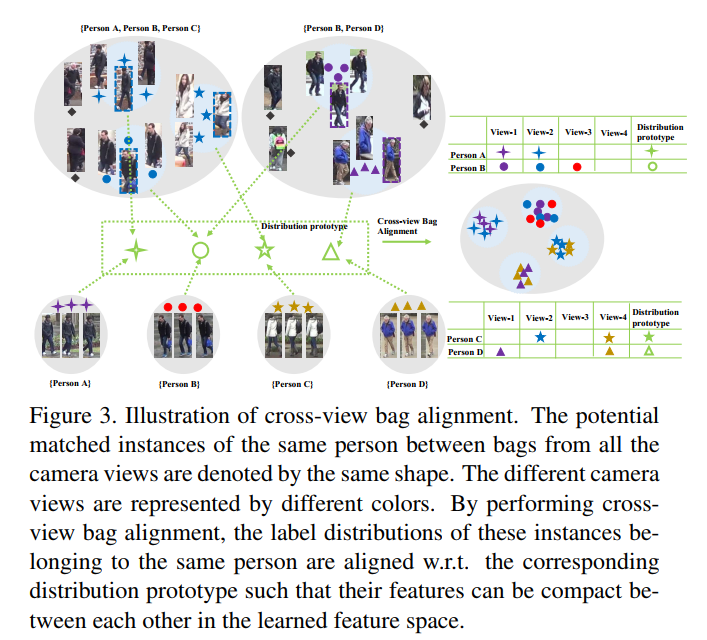
    
    

>inproceedings{fmeng2019weakly,
title=fWeakly Supervised Person Re-Identificationg,
author=fMeng, Jingke and Wu, Sheng and Zheng, Wei-Shig,
booktitle=fProceedings of the IEEE International Conference on Computer Vision and Pattern Recognitiong,
year=f2019
}
## Visual Person Understanding through Multi-Task and Multi-Dataset Learning
1. Arxiv 2019
2. Kilian Pfeiffer, Alexander Hermans, Istv´an S´ar´andi, Mark Weber, and Bastian Leibe

- We address the problem of learning a single model for person
re-identification, attribute classification, body part segmentation, and
pose estimation. With predictions for these tasks we gain a more holistic
understanding of persons, which is valuable for many applications. This
is a classical multi-task learning problem. However, no dataset exists that
these tasks could be jointly learned from. Hence several datasets need
to be combined during training, which in other contexts has often led to
reduced performance in the past. We extensively evaluate how the different task and datasets influence each other and how different degrees
of parameter sharing between the tasks affect performance. Our final
model matches or outperforms its single-task counterparts without creating significant computational overhead, rendering it highly interesting
for resource-constrained scenarios such as mobile robotics.. 

    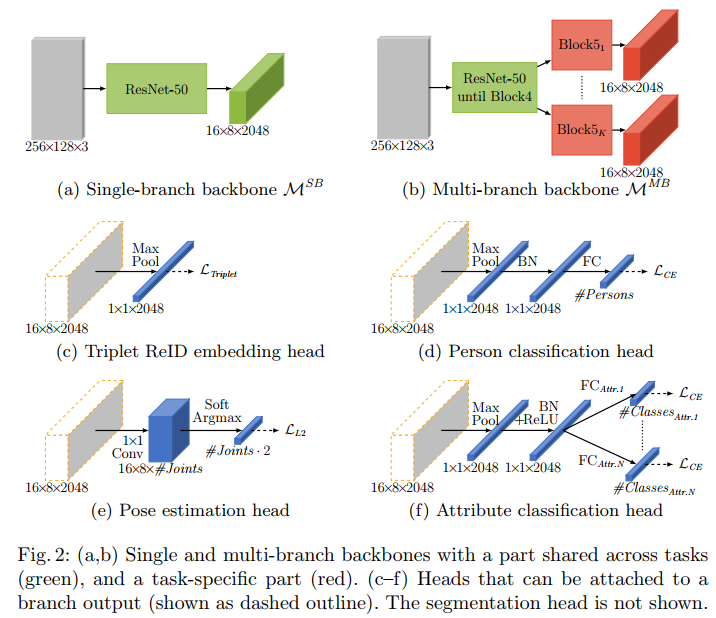
    
## Universal Person Re-Identification
1. Arxiv 2019
2. Xu Lan Queen Mary University of London，Xiatian Zhu Vision Semantics Ltd.，Shaogang Gong Queen Mary University of London
- Most state-of-the-art person re-identification (re-id) methods
depend on supervised model learning with a large set of crossview identity labelled training data. Even worse, such trained
models are limited to only the same-domain deployment with
significantly degraded cross-domain generalisation capability, i.e. “domain specific”. To solve this limitation, there are
a number of recent unsupervised domain adaptation and unsupervised learning methods that leverage unlabelled target
domain training data.

    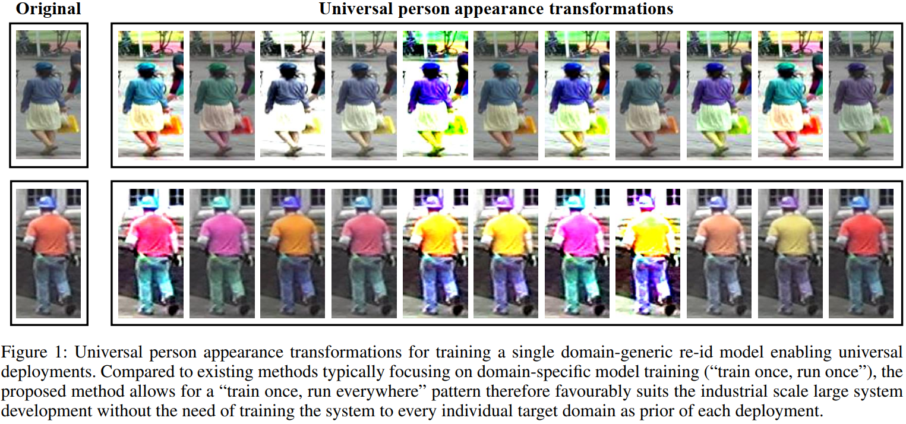
    
- However, these methods need to train
a separate model for each target domain as supervised learning methods. This conventional “train once, run once” pattern is unscalable to a large number of target domains typically encountered in real-world deployments. We address this
problem by presenting a “train once, run everywhere” pattern
industry-scale systems are desperate for. We formulate a “universal model learning” approach enabling domain-generic
person re-id using only limited training data of a “single” seed
domain. Specifically, we train a universal re-id deep model
to discriminate between a set of transformed person identity
classes. Each of such classes is formed by applying a variety
of random appearance transformations to the images of that
class, where the transformations simulate the camera viewing conditions of any domains for making the model training domain generic. Extensive evaluations show the superiority of our method for universal person re-id over a wide variety of state-of-the-art unsupervised domain adaptation and
unsupervised learning re-id methods on five standard benchmarks: Market-1501, DukeMTMC, CUHK03, MSMT17, and
VIPeR.

## Temporal Knowledge Propagation for Image-to-Video Person Re-identification
1. Arxiv 2019
2. Xinqian Gu1;2, Bingpeng Ma2, Hong Chang1;2, Shiguang Shan1;2;3, Xilin Chen1;2

- In many scenarios of Person Re-identification (Re-ID),
the gallery set consists of lots of surveillance videos and the
query is just an image, thus Re-ID has to be conducted between image and videos. Compared with videos, still person
images lack temporal information. Besides, the information
asymmetry between image and video features increases the
difficulty in matching images and videos. To solve this problem, we propose a novel Temporal Knowledge Propagation
(TKP) method which propagates the temporal knowledge
learned by the video representation network to the image
representation network.

    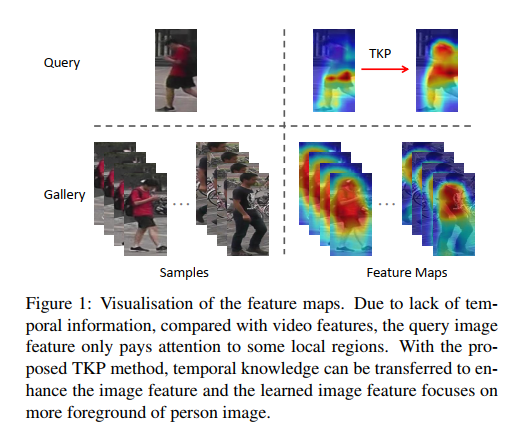
    
- Specifically, given the input videos,
we enforce the image representation network to fit the outputs of video representation network in a shared feature
space. With back propagation, temporal knowledge can
be transferred to enhance the image features and the information asymmetry problem can be alleviated. With additional classification and integrated triplet losses, our model
can learn expressive and discriminative image and video
features for image-to-video re-identification.

    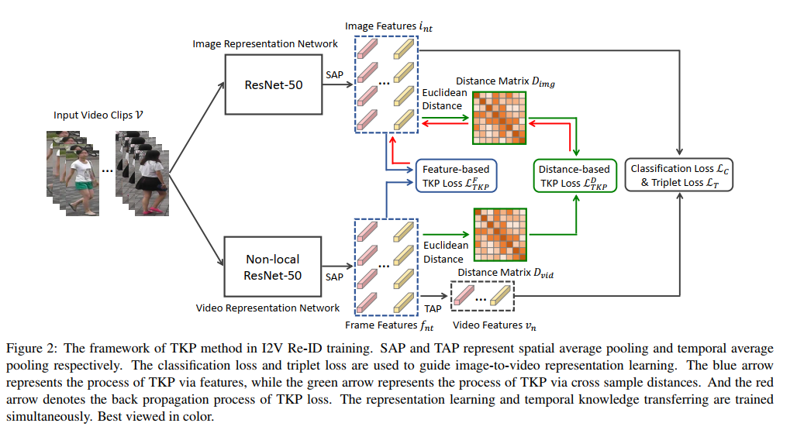
    
- Extensive experiments demonstrate the effectiveness of our method and
the overall results on two widely used datasets surpass the
state-of-the-art methods by a large margin.

## Non-local Neural Networks
1. CVPR 2018
2. Xiaolong Wang1,2∗ Ross Girshick2 Abhinav Gupta1 Kaiming He2

- Both convolutional and recurrent operations are building
blocks that process one local neighborhood at a time. In
this paper, we present non-local operations as a generic
family of building blocks for capturing long-range dependencies. Inspired by the classical non-local means method
[4] in computer vision, our non-local operation computes
the response at a position as a weighted sum of the features
at all positions.

    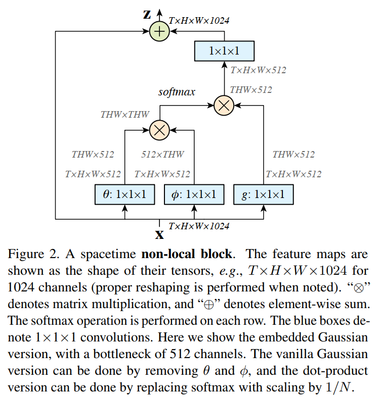
    
- This building block can be plugged into
many computer vision architectures. On the task of video
classification, even without any bells and whistles, our nonlocal models can compete or outperform current competition
winners on both Kinetics and Charades datasets. In static
image recognition, our non-local models improve object detection/segmentation and pose estimation on the COCO suite
of tasks. Code will be made available.

## Spatially and Temporally Efficient Non-local Attention Network for Video-based Person Re-Identification
1. BMVC 2019
2. National Taiwan University, Taiwan
- Video-based person re-identification (Re-ID) aims at matching video sequences of
pedestrians across non-overlapping cameras.

    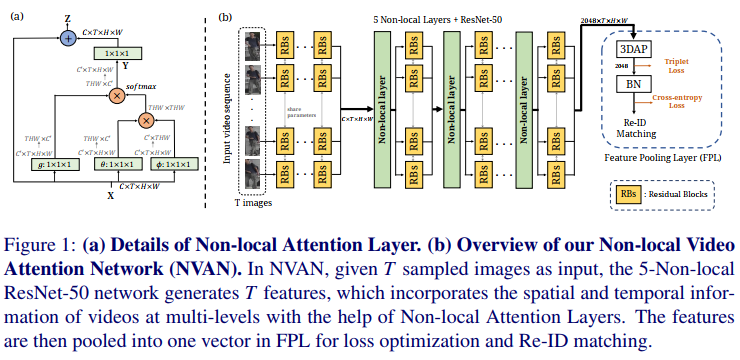
    
- It is a practical yet challenging task of
how to embed spatial and temporal information of a video into its feature representation. While most existing methods learn the video characteristics by aggregating imagewise features and designing attention mechanisms in Neural Networks, they only explore the correlation between frames at high-level features. In this work, we target
at refining the intermediate features as well as high-level features with non-local attention operations and make two contributions. (i) We propose a Non-local Video Attention Network (NVAN) to incorporate video characteristics into the representation at
multiple feature levels. (ii) We further introduce a Spatially and Temporally Efficient
Non-local Video Attention Network (STE-NVAN) to reduce the computation complexity by exploring spatial and temporal redundancy presented in pedestrian videos. Extensive experiments show that our NVAN outperforms state-of-the-arts by 3:8% in rank-
1 accuracy on MARS dataset and confirms our STE-NVAN displays a much superior
computation footprint compared to existing methods. Codes are available at https:
//github.com/jackie840129/STE-NVAN.

## Self-similarity Grouping: A Simple Unsupervised Cross Domain Adaptation Approach for Person Re-identification
1. ICCV 2019 oral 
2. Yang Fu1, Yunchao Wei1;2, Guanshuo Wang3, Yuqian Zhou1 Honghui Shi4;1;5, Thomas S. Huang1

- Domain adaptation in person re-identification (re-ID) has always been a challenging task. In this work, we
explore how to harness the similar natural characteristics existing in the samples from the target domain for
learning to conduct person re-ID in an unsupervised manner.

    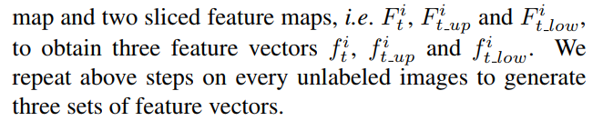
    
- Concretely, we propose a Self-similarity Grouping (SSG) approach, which exploits the potential similarity (from the global body to local parts) of unlabeled
samples to build multiple clusters from different views automatically. These independent clusters are then assigned with labels, which serve as the pseudo identities to supervise the training process. We repeatedly
and alternatively conduct such a grouping and training process until the model is stable. Despite the apparent simplify, our SSG outperforms the state-of-the-arts by
more than 4.6% (DukeMTMC!Market1501) and 4.4% (Market1501!DukeMTMC) in mAP, respectively. Upon
our SSG, we further introduce a clustering-guided semisupervised approach named SSG++ to conduct the oneshot domain adaption in an open set setting (i.e. the number of independent identities from the target domain is
unknown).

    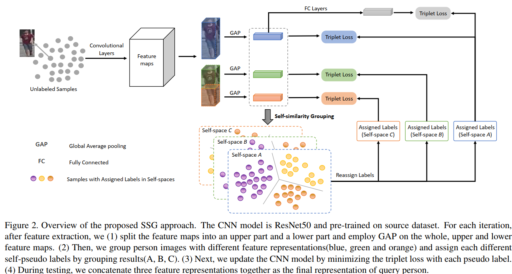
    
- Without spending much effort on labeling, our SSG++ can further promote the mAP upon SSG by
10.7% and 6.9%, respectively. Our Code is available at: https://github.com/OasisYang/SSG .

## Second-order Non-local Attention Networks for Person Re-identification
1. Arxiv 2019
2. Bryan (Ning) Xia, Yuan Gong, Yizhe Zhang, Christian Poellabauer University of Notre Dame Notre Dame, IN 46556 USA

- Recent efforts have shown promising results for person re-identification by designing part-based architectures to
allow a neural network to learn discriminative representations from semantically coherent parts. Some efforts use
soft attention to reallocate distant outliers to their most similar parts, while others adjust part granularity to incorporate more distant positions for learning the relationships.
Others seek to generalize part-based methods by introducing a dropout mechanism on consecutive regions of the feature map to enhance distant region relationships. However, only few prior efforts model the distant or non-local
positions of the feature map directly for the person re-ID
task.

    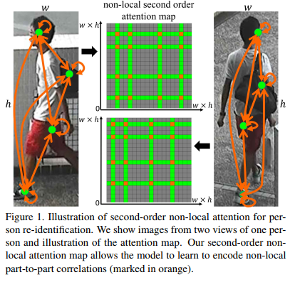
    
- In this paper, we propose a novel attention mechanism to directly model long-range relationships via secondorder feature statistics. When combined with a generalized DropBlock module, our method performs equally to or
better than state-of-the-art results for mainstream person
re-identification datasets, including Market1501, CUHK03,
and DukeMTMC-reID.

    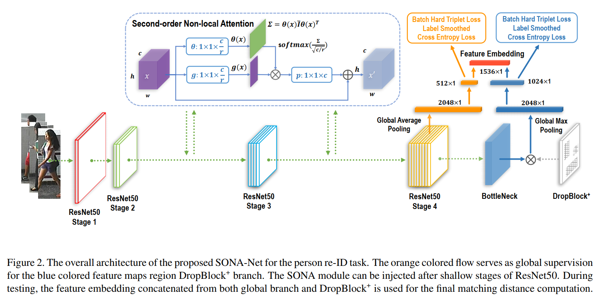

## Local Convolutional Neural Networks for Person Re-Identification

- Recent works have shown that person re-identification can be substantially improved by introducing attention mechanisms, which
allow learning both global and local representations. However, all
these works learn global and local features in separate branches.
As a consequence, the interaction/boosting of global and local information are not allowed, except in the final feature embedding
layer.

    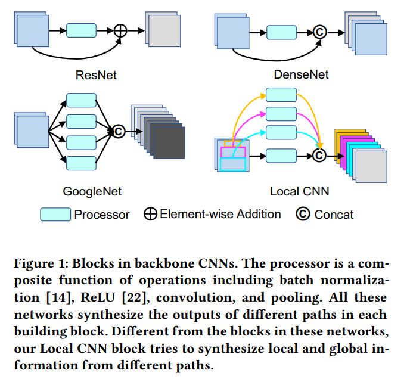

- In this paper, we propose local operations as a generic family
of building blocks for synthesizing global and local information in
any layer. This building block can be inserted into any convolutional networks with only a small amount of prior knowledge about
the approximate locations of local parts. For the task of person reidentification, even with only one local block inserted, our local
convolutional neural networks (Local CNN) can outperform stateof-the-art methods consistently on three large-scale benchmarks,
including Market-1501, CUHK03, and DukeMTMC-ReID.

## SBSGAN: Suppression of Inter-Domain Background Shift for Person Re-Identification
1. ICCV 2019
2. Yan Huangy Qiang Wuy JingSong Xuy Yi Zhongx School of Electrical and Data Engineering, University of Technology Sydney, Australia
- Cross-domain person re-identification (re-ID) is challenging due to the bias between training and testing domains. We observe that if backgrounds in the training and
testing datasets are very different, it dramatically introduces difficulties to extract robust pedestrian features, and
thus compromises the cross-domain person re-ID performance. In this paper, we formulate such problems as a background shift problem. A Suppression of Background Shift
Generative Adversarial Network (SBSGAN) is proposed to
generate images with suppressed backgrounds.

    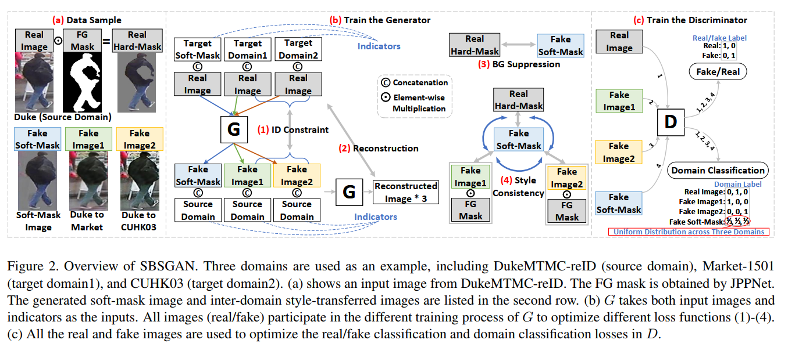

- Unlike simply removing backgrounds using binary masks, SBSGAN allows the generator to decide whether pixels should be preserved or suppressed to reduce segmentation errors caused
by noisy foreground masks. Additionally, we take ID-related
cues, such as vehicles and companions into consideration.

    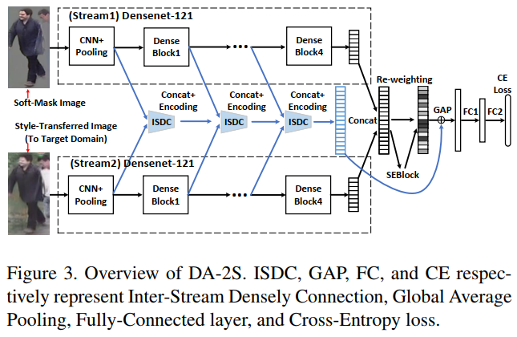

- With high-quality generated images, a Densely Associated
2-Stream (DA-2S) network is introduced with Inter Stream
Densely Connection (ISDC) modules to strengthen the complementarity of the generated data and ID-related cues. The
experiments show that the proposed method achieves competitive performance on three re-ID datasets, i.e., Market-
1501, DukeMTMC-reID, and CUHK03, under the crossdomain person re-ID scenario.

## Rethinking Person Re-Identification with Confidence
1. Arxiv 2019 low quality

- A common challenge in person re-identification systems
is to differentiate people with very similar appearances. The
current learning frameworks based on cross-entropy minimization are not suited for this challenge. To tackle this issue, we propose to modify the cross-entropy loss and model
confidence in the representation learning framework using
three methods: label smoothing, confidence penalty, and
deep variational information bottleneck.
    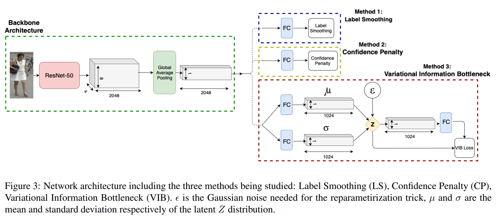
- A key property of
our approach is the fact that we do not make use of any
hand-crafted human characteristics but rather focus our
attention on the learning supervision. Although methods
modeling confidence did not show significant improvements
on other computer vision tasks such as object classification,
we are able to show their notable effect on the task of reidentifying people outperforming state-of-the-art methods
on 3 publicly available datasets. Our analysis and experiments not only offer insights into the problems that person
re-id suffers from, but also provide a simple and straightforward recipe to tackle this issue.

## Pyramidal Person Re-IDentification via Multi-Loss Dynamic Training
1. Arxiv 2019
2. Feng Zheng Cheng Deng Rongrong Jiz School of Information Science and Engineering, Xiamen University, Xiamen, China

- Most existing Re-IDentification (Re-ID) methods are
highly dependent on precise bounding boxes that enable images to be aligned with each other. However, due to the
challenging practical scenarios, current detection models
often produce inaccurate bounding boxes, which inevitably
degenerate the performance of existing Re-ID algorithms.
   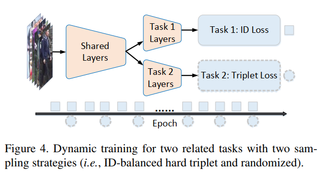
- In this paper, we propose a novel coarse-to-fine pyramid
model to relax the need of bounding boxes, which not only
incorporates local and global information, but also integrates the gradual cues between them. The pyramid model
is able to match at different scales and then search for the
correct image of the same identity, even when the image
pairs are not aligned. In addition, in order to learn discriminative identity representation, we explore a dynamic
training scheme to seamlessly unify two losses and extract
appropriate shared information between them. Experimental results clearly demonstrate that the proposed method
achieves the state-of-the-art results on three datasets. Especially, our approach exceeds the current best method by
9:5% on the most challenging CUHK03 dataset

## PH-GCN: Person Re-identification with Part-based Hierarchical Graph Convolutional Network
1. Arxiv 2019
2. Bo Jiang, Xixi Wang, and Bin Luo

- Abstract—The person re-identification (Re-ID) task requires
to robustly extract feature representations for person images.
Recently, part-based representation models have been widely
studied for extracting the more compact and robust feature
representations for person images to improve person Re-ID results. However, existing part-based representation models mostly
extract the features of different parts independently which ignore
the relationship information between different parts.
   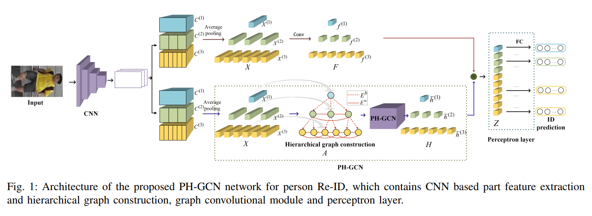
- To overcome
this limitation, in this paper we propose a novel deep learning
framework, named Part-based Hierarchical Graph Convolutional
Network (PH-GCN) for person Re-ID problem. Given a person
image, PH-GCN first constructs a hierarchical graph to represent
the pairwise relationships among different parts. Then, both
local and global feature learning are performed by the messages
passing in PH-GCN, which takes other nodes information into
account for part feature representation. Finally, a perceptron
layer is adopted for the final person part label prediction and
re-identification. The proposed framework provides a general
solution that integrates local, global and structural feature learning simultaneously in a unified end-to-end network. Extensive
experiments on several benchmark datasets demonstrate the
effectiveness of the proposed PH-GCN based Re-ID approach.

## Orthogonal Center Learning with Subspace Masking for Person Re-Identification
1. Arxiv 2019
2. Youtu X-lab, Tencent

- Abstract Person re-identification aims to identify whether pairs of images belong to the same
person or not. This problem is challenging due
to large differences in camera views, lighting and
background.
   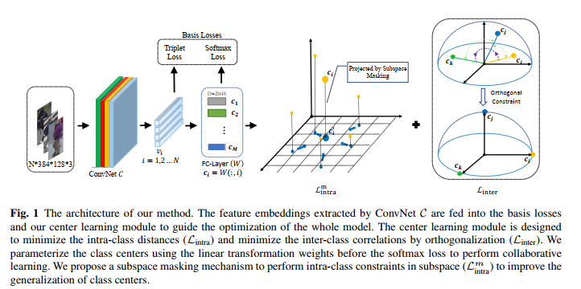
- One of the mainstream in learning
CNN features is to design loss functions which
reinforce both the class separation and intra-class
compactness. In this paper, we propose a novel
Orthogonal Center Learning method with Subspace Masking for person re-identification.
   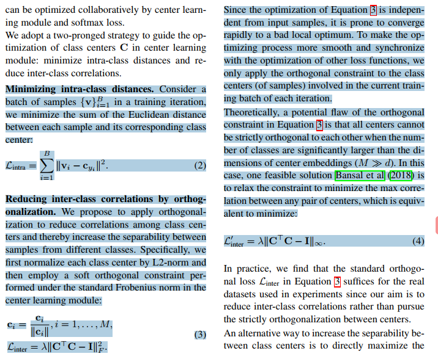
- We make the following contributions: (i) we develop a center learning module to learn the class
centers by simultaneously reducing the intra-class
differences and inter-class correlations by orthogonalization; (ii) we introduce a subspace masking mechanism to enhance the generalization of
the learned class centers; and (iii) we devise to
integrate the average pooling and max pooling
in a regularizing manner that fully exploits their powers. Extensive experiments show that our
proposed method consistently outperforms the
state-of-the-art methods on the large-scale ReID
datasets including Market-1501, DukeMTMCReID, CUHK03 and MSMT17.

## Omni-Scale Feature Learning for Person Re-Identification
1. ICCV 2019
2. Kaiyang Zhou1∗ Yongxin Yang1 Andrea Cavallaro2 Tao Xiang1;3

- As an instance-level recognition problem, person reidentification (ReID) relies on discriminative features,
which not only capture different spatial scales but also
encapsulate an arbitrary combination of multiple scales.
We callse features of both homogeneous and heterogeneous scales omni-scale features. In this paper, a novel
deep ReID CNN is designed, termed Omni-Scale Network (OSNet), for omni-scale feature learning. This is
achieved by designing a residual block composed of multiple convolutional feature streams, each detecting features at a certain scale. Importantly, a novel unified aggregation gate is introduced to dynamically fuse multiscale features with input-dependent channel-wise weights.
   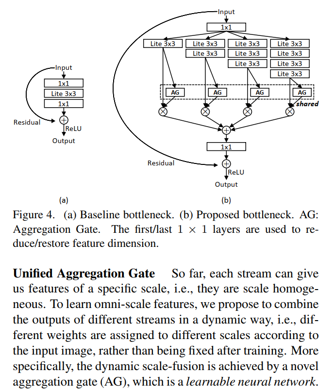
- To efficiently learn spatial-channel correlations and avoid
overfitting, the building block uses both pointwise and
depthwise convolutions. By stacking such blocks layerby-layer, our OSNet is extremely lightweight and can be
trained from scratch on existing ReID benchmarks. Despite its small model size, our OSNet achieves state-ofthe-art performance on six person-ReID datasets. Code
and models are available at: https://github.com/KaiyangZhou/deep-person-reid

## Mixed High-Order Attention Network for Person Re-Identification
1. ICCV 2019
2. Binghui Chen, Weihong Deng∗ , Jiani Hu Beijing University of Posts and Telecommunications

- Attention has become more attractive in person reidentification (ReID) as it is capable of biasing the allocation of available resources towards the most informative
parts of an input signal. However, state-of-the-art works
concentrate only on coarse or first-order attention design,
e.g. spatial and channels attention, while rarely exploring higher-order attention mechanism. We take a step towards addressing this problem. In this paper, we first propose the High-Order Attention (HOA) module to model and
utilize the complex and high-order statistics information in
attention mechanism, so as to capture the subtle differences
among pedestrians and to produce the discriminative attention proposals. Then, rethinking person ReID as a zero-shot
learning problem, we propose the Mixed High-Order Attention Network (MHN) to further enhance the discrimination
and richness of attention knowledge in an explicit manner.
   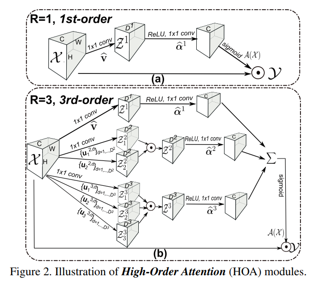
- Extensive experiments have been conducted to validate the
superiority of our MHN for person ReID over a wide variety
of state-of-the-art methods on three large-scale datasets, including Market-1501, DukeMTMC-ReID and CUHK03-NP.
Code is available at http://www.bhchen.cn/